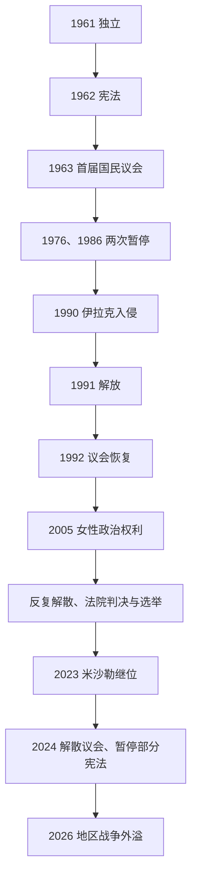

# 议会政治、海湾战争与现代科威特

## 时间

1961年至今（核验截至2026年7月13日）

## 概括

独立后的科威特把港城协商传统制度化为1962年宪法：萨巴赫埃米尔任命政府，50席国民议会由公民选举并可立法、审预算和质询部长。议会曾在1976、1986年被暂停，1992年复会后又经历频繁解散、选举和内阁辞职。1990年伊拉克占领是国家最深危机，多国部队1991年解放后，科威特以美国安全关系和议会复原重建合法性。米沙勒2023年继位后于2024年解散议会、暂停若干宪法条文至多四年，埃米尔和内阁代行立法权。2026年伊朗对机场、港口和油气设施的攻击进一步加强战时行政与防空权重。

## 独立宪政与议会反复

- 1962年制宪会议起草宪法，规定主权属于人民、政体为世袭埃米尔制。国民议会有50名民选议员，部长可作为当然议员参与，但总数受限。
- 议会不能自行产生首相，埃米尔任命政府；不过议员可质询部长、拒绝法案和预算，并对部长或首相提出不合作程序。这种“有问责、无政党轮替”的结构内含冲突。
- 1963年首届议会开会。政治集团以非正式议会集团运行，民族主义、商人、部落、逊尼与什叶伊斯兰派及自由派不断重组。
- 1976年萨巴赫·萨利姆解散议会并暂停部分宪法，1981年恢复。1982年非正式股票市场“马纳赫市场”崩盘，国家以救助和债务清算介入，显示油收、投机与社会保障相连。
- 两伊战争期间科威特支持伊拉克并遭亲伊朗组织袭击；1985年贾比尔埃米尔遇刺未遂，1986年议会再被暂停。1987—1988年美国为科威特油轮换旗护航，安全联系加深。
- 1990年政府设缺乏反对派认可的国民委员会。其争议尚未解决，伊拉克入侵即使国家政治中断。

## 伊拉克入侵、占领与解放

### 入侵背景

- 两伊战争后，伊拉克背负债务，要求科威特减免贷款并指控其超产压低油价、从鲁迈拉油田斜井采油。边界和布比延岛出海口争议提供历史话语。
- 更深层原因是萨达姆政权财政危机、地区霸权诉求和误判外部反应；“科威特偷油”是战争借口之一，不能单独解释吞并决策。
- 1990年7月吉达谈判失败后，伊拉克把大军部署边境。8月2日突袭科威特城，王储兼首相萨阿德组织政府撤往沙特，埃米尔贾比尔流亡。

### 占领过程

- 伊拉克先扶植短命的“自由科威特临时政府”，继而宣布科威特为第19省。军队和安全机关拘捕、处决抵抗者，掠夺机构并控制人口。
- 科威特国内形成传递情报、维持食品、地下医疗和武装袭击等抵抗网络；留守公民、无国籍者和外籍居民经历不同风险。
- 联合国要求无条件撤军并实施制裁。流亡政府以石油资产和外交争取联盟，1990年10月吉达人民会议承诺解放后恢复宪政。
- 1991年1月多国部队发动空战，2月地面战迅速击溃伊军；2月26日科威特解放。撤退部队纵火约数百口油井，环境与经济修复持续数年。

### 长期影响

- 战争确立美国为主要外部安全伙伴，科威特同美英等签防务安排并预置部队；保护也使本国基地在后续地区战争中成为潜在目标。
- 1992年国民议会恢复，王室履行吉达承诺，但安全、通敌审判和战时功绩影响政治分配。
- 大量巴勒斯坦人因巴解组织支持萨达姆而离开或被迫离境，人口与劳动力结构剧变；“比敦”无国籍居民的军役、抵抗和公民权问题仍未解决。
- 伊拉克2003年政权更替后承认边界，但战争赔偿、失踪者和记忆政治长期延续。

## 复会、社会改革与2024年中止

- 1992年后，议会质询、内阁改组和解散成为常态。政府常由王室成员领导，议员通过部长问责和预算交换影响住房、就业与福利。
- 2005年女性取得选举和被选举权，2009年首批女性议员当选。选民范围扩大，却未解决政党无正式法律地位和政府不由多数组成的问题。
- 2006年萨阿德因重病即位仅九日。议会依继承法准备确认其无履职能力，萨阿德先行退位，萨巴赫·艾哈迈德继任，显示议会在王位危机中拥有罕见法定角色。
- 2011年后反腐抗议、首相辞职、法院判决和选制争议交织。2012年“一票制”法令改变每名选民票数，反对派一度抵制；议会常因程序问题被宪法法院判无效后重选。
- 纳瓦夫2020年继位后尝试赦免和对话，僵局仍持续。米沙勒2023年继位，2024年2月、5月先后解散议会。
- 2024年5月10日，埃米尔解散国民议会并暂停宪法第51、56部分条款、71部分条款、79、107、174、181条，期限不超过四年；其间由埃米尔与部长会议行使议会权限，以法令制定法律。
- 截至2026年7月13日，暂停仍在实施，尚无复会日期。政府同时整顿国籍档案和财政行政，支持者强调效率和纠弊，批评者担忧公民权保障、司法救济及长期取消议会制衡。

## 2026年地区战争外溢

- 2026年2月28日起，伊朗导弹和无人机攻击科威特。此后住宅、科威特国际机场及其雷达和储油设施、科威特石油公司炼油厂、舒韦赫港和穆巴拉克大港等目标遭袭。
- 科威特称并非参战方并行使自卫权，伊朗则指称美国利用科威特领土发动行动；双方叙述的争议本身显示驻军与联盟如何削弱小国置身事外的能力。
- 防空拦截降低部分损害，机场、能源和港口同时受威胁暴露国家高度集中基础设施的风险。战时由无议会的内阁体制应对，也使2024年制度中止的问责问题更突出。

## 埃米尔、首相与实际权力

17位统治者、2006年九日王位危机、11位政府首脑及现任职务，见[萨巴赫统治者与首相表](/%E4%BA%BA%E6%96%87%E7%A7%91%E5%AD%A6/%E5%8E%86%E5%8F%B2/%E8%A5%BF%E4%BA%9A/%E9%98%BF%E6%8B%89%E4%BC%AF%E5%8D%8A%E5%B2%9B/%E7%A7%91%E5%A8%81%E7%89%B9/%E8%90%A8%E5%B7%B4%E8%B5%AB%E7%BB%9F%E6%B2%BB%E8%80%85%E4%B8%8E%E9%A6%96%E7%9B%B8%E8%A1%A8.md)。

| 机构 | 正常宪法结构 | 2024—2026年实际状态 |
|---|---|---|
| 埃米尔 | 国家元首，任命首相、批准法律，可依宪法解散议会。 | 米沙勒掌握最高战略和任命权，并同内阁代行立法。 |
| 首相与内阁 | 由埃米尔任命，至少一名部长通常来自议员；对议会受质询。 | 艾哈迈德·阿卜杜拉任首相，因议会暂停而缺少常规质询。 |
| 国民议会 | 50席民选，另有部长参与；立法、预算、质询。 | 2024年5月起解散，权限暂由埃米尔和内阁行使。 |
| 宪法法院和司法 | 审查选举与法律争议。 | 法院继续运作，但被暂停条款改变议会和修宪制衡。 |
| 石油与主权基金机构 | 科威特石油公司体系经营资源，投资局管理储备与未来世代基金。 | 维持福利与战时财政，是王室—公民契约的物质基础。 |

## 政治僵局与制度中止原因

- **议会活力来源**：商人协商传统、1962年契约、资源财政使公民有组织地要求分配和问责，议员无需组阁也能以质询影响政府。
- **反复僵局**：政府由王室任命且议员无法稳定组成多数政党；质询常针对个别部长，内阁以辞职或解散回应，政策连续性受损。
- **2024年直接触发**：新埃米尔同议员在组阁条件、措辞和权力边界上冲突；官方称需纠正民主实践。结构上则是六十余年未解决的“王室行政—民选问责”矛盾。
- **石油福利的双面性**：高油收支持就业、补贴和代际基金，也减弱税收问责并使削减福利、发展私营部门的改革更难形成联盟。
- **长期风险**：议会中止若无可信恢复和修订路径，效率收益可能以政治合法性和制度学习为代价；地区战争又可能使临时安全集中常态化。

## 演变关系

- 前一节点：[英国保护、石油发现与独立](/%E4%BA%BA%E6%96%87%E7%A7%91%E5%AD%A6/%E5%8E%86%E5%8F%B2/%E8%A5%BF%E4%BA%9A/%E9%98%BF%E6%8B%89%E4%BC%AF%E5%8D%8A%E5%B2%9B/%E7%A7%91%E5%A8%81%E7%89%B9/%E8%8B%B1%E5%9B%BD%E4%BF%9D%E6%8A%A4%E3%80%81%E7%9F%B3%E6%B2%B9%E5%8F%91%E7%8E%B0%E4%B8%8E%E7%8B%AC%E7%AB%8B.md)。
- 两河与伊拉克：[两河流域文明](/%E4%BA%BA%E6%96%87%E7%A7%91%E5%AD%A6/%E5%8E%86%E5%8F%B2/%E8%A5%BF%E4%BA%9A/%E4%B8%A4%E6%B2%B3%E6%B5%81%E5%9F%9F/README.md)。
- 地区对照：[独立、社会改革与现代巴林](/%E4%BA%BA%E6%96%87%E7%A7%91%E5%AD%A6/%E5%8E%86%E5%8F%B2/%E8%A5%BF%E4%BA%9A/%E9%98%BF%E6%8B%89%E4%BC%AF%E5%8D%8A%E5%B2%9B/%E5%B7%B4%E6%9E%97/%E7%8B%AC%E7%AB%8B%E3%80%81%E7%A4%BE%E4%BC%9A%E6%94%B9%E9%9D%A9%E4%B8%8E%E7%8E%B0%E4%BB%A3%E5%B7%B4%E6%9E%97.md)。
- 上级：[科威特历史](/%E4%BA%BA%E6%96%87%E7%A7%91%E5%AD%A6/%E5%8E%86%E5%8F%B2/%E8%A5%BF%E4%BA%9A/%E9%98%BF%E6%8B%89%E4%BC%AF%E5%8D%8A%E5%B2%9B/%E7%A7%91%E5%A8%81%E7%89%B9/README.md)。