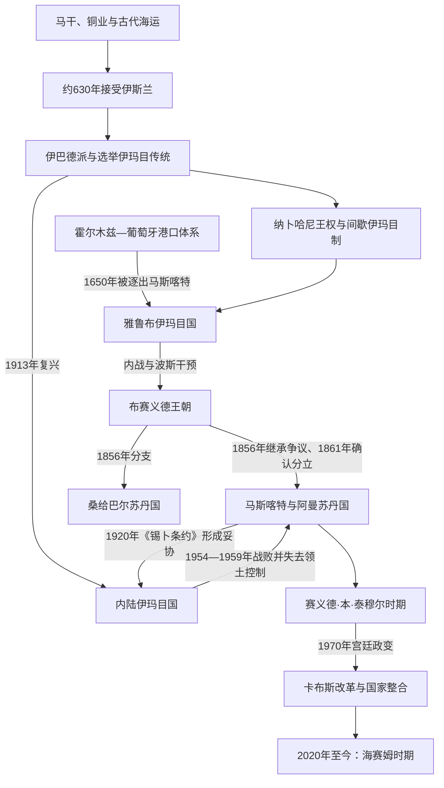

# 阿曼历史

## 概括

阿曼位于阿拉伯半岛东南端。哈杰尔山地把马斯喀特—巴提奈沿海与尼兹瓦等内陆绿洲分开，佐法尔又具有独立的季风、乳香贸易和区域传统；这种地理格局长期造成“沿海港口政权—内陆伊巴德派伊玛目制—南部佐法尔”三条相互牵动的历史线。阿曼既是古代铜产区和印度洋航路节点，也曾在17—19世纪成为连接波斯湾、印度西岸与东非的海洋强国。

## 历史主线

- **古代网络**：两河文献中的“马干”通常指今阿曼及阿联酋部分地区构成的铜业与海运区域，不能与现代阿曼国界完全等同。
- **伊斯兰化与伊玛目制**：约630年朱兰达家族接受伊斯兰。8世纪起，伊巴德派学者、部落领袖与商人多次推举伊玛目，但这种制度时有中断，也会被家族化王权取代。
- **港口与内陆并立**：霍尔木兹和葡萄牙先后控制马斯喀特等港口，却没有稳定征服整个内陆。1624年雅鲁布领袖纳西尔·本·穆尔希德借伊玛目合法性重组部落联盟。
- **海洋扩张**：1650年葡萄牙被逐出马斯喀特后，阿曼舰队向东非推进。1740年代内战与波斯干预催生布赛义德王朝，赛义德·本·苏尔坦时期以马斯喀特和桑给巴尔为双重中心。
- **分立与再整合**：1856年后马斯喀特和桑给巴尔分立，沿海苏丹对英国的军事、财政依赖增加。1913—1959年内陆伊玛目政权与沿海苏丹国并立；杰贝勒阿赫达尔战争和佐法尔战争之后，中央政府才完成现代领土整合。
- **现代苏丹国**：1970年卡布斯以石油收入扩展行政、教育、医疗和交通体系。2020年海赛姆继位，2021年确立王储制度，并在财政约束下继续推进“2040愿景”。

## 阶段导航

| 顺序 | 阶段 | 时间 | 简要概括 |
|---:|---|---|---|
| 1 | [古代阿曼、伊巴德派与海上贸易](/%E4%BA%BA%E6%96%87%E7%A7%91%E5%AD%A6/%E5%8E%86%E5%8F%B2/%E8%A5%BF%E4%BA%9A/%E9%98%BF%E6%8B%89%E4%BC%AF%E5%8D%8A%E5%B2%9B/%E9%98%BF%E6%9B%BC/%E5%8F%A4%E4%BB%A3%E9%98%BF%E6%9B%BC%E3%80%81%E4%BC%8A%E5%B7%B4%E5%BE%B7%E6%B4%BE%E4%B8%8E%E6%B5%B7%E4%B8%8A%E8%B4%B8%E6%98%93.md) | 约前3000年—1624年 | 马干铜业、伊斯兰化、伊巴德派、纳卜哈尼王权和葡萄牙港口控制。 |
| 2 | [雅鲁布、布赛义德王朝与海洋帝国](/%E4%BA%BA%E6%96%87%E7%A7%91%E5%AD%A6/%E5%8E%86%E5%8F%B2/%E8%A5%BF%E4%BA%9A/%E9%98%BF%E6%8B%89%E4%BC%AF%E5%8D%8A%E5%B2%9B/%E9%98%BF%E6%9B%BC/%E9%9B%85%E9%B2%81%E5%B8%83%E3%80%81%E5%B8%83%E8%B5%9B%E4%B9%89%E5%BE%B7%E7%8E%8B%E6%9C%9D%E4%B8%8E%E6%B5%B7%E6%B4%8B%E5%B8%9D%E5%9B%BD.md) | 1624—1913年 | 统一、驱逐葡萄牙、东非扩张、王朝内战、海洋帝国及马斯喀特—桑给巴尔分立。 |
| 3 | [英国影响、国家整合与现代阿曼](/%E4%BA%BA%E6%96%87%E7%A7%91%E5%AD%A6/%E5%8E%86%E5%8F%B2/%E8%A5%BF%E4%BA%9A/%E9%98%BF%E6%8B%89%E4%BC%AF%E5%8D%8A%E5%B2%9B/%E9%98%BF%E6%9B%BC/%E8%8B%B1%E5%9B%BD%E5%BD%B1%E5%93%8D%E3%80%81%E5%9B%BD%E5%AE%B6%E6%95%B4%E5%90%88%E4%B8%8E%E7%8E%B0%E4%BB%A3%E9%98%BF%E6%9B%BC.md) | 1913年至今 | 内陆伊玛目国、杰贝勒阿赫达尔战争、佐法尔战争、1970年政变及现代国家建设。 |
| 4 | [阿曼近世伊玛目与布赛义德苏丹世系表](/%E4%BA%BA%E6%96%87%E7%A7%91%E5%AD%A6/%E5%8E%86%E5%8F%B2/%E8%A5%BF%E4%BA%9A/%E9%98%BF%E6%8B%89%E4%BC%AF%E5%8D%8A%E5%B2%9B/%E9%98%BF%E6%9B%BC/%E9%98%BF%E6%9B%BC%E8%BF%91%E4%B8%96%E4%BC%8A%E7%8E%9B%E7%9B%AE%E4%B8%8E%E5%B8%83%E8%B5%9B%E4%B9%89%E5%BE%B7%E8%8B%8F%E4%B8%B9%E4%B8%96%E7%B3%BB%E8%A1%A8.md) | 1624年至今 | 雅鲁布伊玛目、布赛义德阿曼统治者、桑给巴尔支系和20世纪内陆伊玛目完整表。 |

## 重要转折与时间节点

| 时间 | 事件 | 历史意义 |
|---|---|---|
| 约前3—前2千纪 | 马干进入两河文献 | 铜矿、港口和远程交换成为阿曼早期文明基础。 |
| 约630年 | 朱兰达兄弟接受伊斯兰 | 阿曼在先知穆罕默德在世时进入伊斯兰共同体。 |
| 约749—751年 | 朱兰达·本·马苏德获推举为伊玛目 | 独立伊巴德派伊玛目传统首次清楚出现。 |
| 1154—1624年 | 纳卜哈尼两阶段统治 | 世袭王权、间歇伊玛目和地方部落权力并存。 |
| 1507年 | 葡萄牙夺取马斯喀特 | 阿曼沿海被纳入葡萄牙—霍尔木兹据点体系。 |
| 1624、1650年 | 雅鲁布伊玛目国建立、收复马斯喀特 | 部落统一转化为海军扩张。 |
| 1698年 | 阿曼攻克蒙巴萨耶稣堡 | 东非海岸成为阿曼—葡萄牙竞争重心。 |
| 1744、1749年 | 艾哈迈德·本·赛义德获推举并最终控制全国 | 布赛义德王朝建立并延续至今。 |
| 1856、1861年 | 继承争议与英方仲裁 | 马斯喀特和桑给巴尔成为两个王朝国家。 |
| 1920年 | 《锡卜条约》 | 沿海苏丹国与内陆伊玛目政权形成含糊但可维持的自治安排。 |
| 1954—1959年 | 杰贝勒阿赫达尔战争 | 内陆伊玛目政权失去领土控制。 |
| 1962—1976年 | 佐法尔叛乱 | 中央以改革、地方整合和外援结合的方式控制南部。 |
| 1970年 | 卡布斯废黜赛义德·本·泰穆尔 | 阿曼进入制度建设和石油驱动现代化时期。 |
| 2020—2021年 | 海赛姆继位、确立王储制 | 继承机制从秘密遗书安排转为明确的父系长子继承框架。 |

## 相关主线

- 区域背景：[阿拉伯半岛历史](/%E4%BA%BA%E6%96%87%E7%A7%91%E5%AD%A6/%E5%8E%86%E5%8F%B2/%E8%A5%BF%E4%BA%9A/%E9%98%BF%E6%8B%89%E4%BC%AF%E5%8D%8A%E5%B2%9B/README.md)。
- 东非侧面：[斯瓦希里海岸与印度洋世界](/%E4%BA%BA%E6%96%87%E7%A7%91%E5%AD%A6/%E5%8E%86%E5%8F%B2/%E9%9D%9E%E6%B4%B2/%E4%B8%9C%E9%9D%9E/%E6%96%AF%E7%93%A6%E5%B8%8C%E9%87%8C%E6%B5%B7%E5%B2%B8%E4%B8%8E%E5%8D%B0%E5%BA%A6%E6%B4%8B%E4%B8%96%E7%95%8C.md)。
- 上级：[西亚](/%E4%BA%BA%E6%96%87%E7%A7%91%E5%AD%A6/%E5%8E%86%E5%8F%B2/%E8%A5%BF%E4%BA%9A/README.md)；[历史总览](/%E4%BA%BA%E6%96%87%E7%A7%91%E5%AD%A6/%E5%8E%86%E5%8F%B2/README.md)。
