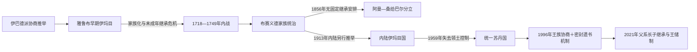

# 阿曼近世伊玛目与布赛义德苏丹世系表

## 时间

1624年至今

## 范围与口径

本页把四条容易混淆的统治线分开列出：

1. 1624—1749年的雅鲁布伊玛目及内战时期并立者；
2. 1744/1749年至今的布赛义德阿曼统治者；
3. 1856年分立后的桑给巴尔布赛义德支系；
4. 1913—1959年拥有内陆领土权力的伊巴德派伊玛目。

“伊玛目”原则上来自推举和效忠，不等于世袭君主；“赛义德”最初是王族尊号，“苏丹”后来成为沿海和现代国家的正式统治者称号。表中复位、摄政、名义在位、共治、并立和流亡主张均单独说明，不以笼统合并项代替具体人名。

1154—1624年的纳卜哈尼记录不足以形成一份获现代研究一致接受的连续五世纪君主表，因此不以推测姓名填补缺年；其两阶段结构和可确认节点见[古代阿曼、伊巴德派与海上贸易](/%E4%BA%BA%E6%96%87%E7%A7%91%E5%AD%A6/%E5%8E%86%E5%8F%B2/%E8%A5%BF%E4%BA%9A/%E9%98%BF%E6%8B%89%E4%BC%AF%E5%8D%8A%E5%B2%9B/%E9%98%BF%E6%9B%BC/%E5%8F%A4%E4%BB%A3%E9%98%BF%E6%9B%BC%E3%80%81%E4%BC%8A%E5%B7%B4%E5%BE%B7%E6%B4%BE%E4%B8%8E%E6%B5%B7%E4%B8%8A%E8%B4%B8%E6%98%93.md)。

## 雅鲁布伊玛目及内战并立者

| 顺序 | 伊玛目 | 在位或主张时间 | 与前任关系 / 支持区域 | 关键事件与备注 |
|---:|---|---|---|---|
| 1 | **纳西尔·本·穆尔希德** | 1624—1649年 | 雅鲁布家族；在鲁斯塔克获推举 | 统一大部分内陆，建设堡垒和军队，夺取苏哈尔，为收复马斯喀特奠基。 |
| 2 | **苏尔坦·本·赛义夫一世** | 1649—1679年 | 纳西尔的亲族和继承者 | 1650年收复马斯喀特，扩建舰队，开启西印度洋反攻。 |
| 3 | 比拉拉布·本·苏尔坦 | 1679—1692年 | 苏尔坦一世之子 | 修建贾布林堡；后期与弟弟赛义夫争权，退守贾布林并让位。 |
| 4 | **赛义夫·本·苏尔坦一世** | 1692—1711年 | 比拉拉布之弟 | 发展法拉吉、农业和舰队；1698年攻克蒙巴萨耶稣堡，海权达到高峰。 |
| 5 | 苏尔坦·本·赛义夫二世 | 1711—1718年 | 赛义夫一世之子 | 维持海上体系；去世后留下未成年继承人，引发合法性危机。 |
| 6 | 赛义夫·本·苏尔坦二世 | 1718—1719年，第一次 | 苏尔坦二世之子；年幼 | 因年龄和能力问题被部分学者、部落否定。 |
| 7 | 穆罕纳·本·苏尔坦 | 1719—1720年 | 雅鲁布家族成员；由反对未成年继承者推举 | 缺乏广泛部落支持，被废并被杀。 |
| 8 | 赛义夫·本·苏尔坦二世 | 1720—1722年，第二次 | 复位 | 实权受摄政与部落首领限制。 |
| 9 | 雅鲁布·本·比拉拉布 | 1722—1723年 | 比拉拉布之子；先任监护或摄政后称伊玛目 | 控制时间短，败于反对联盟。 |
| 10 | 赛义夫·本·苏尔坦二世 | 1723—1724年，第三次 | 再次复位 | 部落冲突扩大，仍未形成稳定统治。 |
| 11 | 穆罕默德·本·纳西尔 | 1724—1728年 | 非雅鲁布家族；获加菲里阵营支持 | 被推举为伊玛目；1728年在苏哈尔附近与对手作战时身亡。 |
| 12A | 赛义夫·本·苏尔坦二世 | 1728—1742年，第四次 | 主要控制沿海 | 与内陆伊玛目并立；1737年引入波斯军，最终使外援变成占领。 |
| 12B | 比拉拉布·本·希姆亚尔 | 1728—1737年，第一次 | 雅鲁布旁支；主要控制内陆 | 与赛义夫二世并立，1737年受波斯介入冲击而暂失势。 |
| 13 | 苏尔坦·本·穆尔希德 | 1742—1743年 | 雅鲁布旁支；反赛义夫联盟推举 | 在波斯再次入侵时受伤身亡，未能恢复统一。 |
| 14 | 比拉拉布·本·希姆亚尔 | 1743—1749年，第二次 | 再获内陆支持 | 与艾哈迈德·本·赛义德并立；1749年战败身亡，雅鲁布时代结束。 |

> 1742—1744年间，赛义夫二世、苏尔坦·本·穆尔希德、比拉拉布·本·希姆亚尔及波斯占领军的权力范围不断变化，不能用一条无重叠的继承线表示。

## 布赛义德阿曼统治者

| 顺序 | 统治者 | 正式或实际统治时间 | 称号与继承关系 | 关键事件 / 备注 |
|---:|---|---|---|---|
| 1 | **艾哈迈德·本·赛义德** | 1744年获推举；1749—1783年无争议统治 | 伊玛目；王朝建立者 | 以苏哈尔抗波斯声望崛起，驱逐残余波斯力量，统一部落、重建舰队和贸易。1744是建国传统起点，1749是排除最后对手的节点。 |
| 2 | 赛义德·本·艾哈迈德 | 1783—1786年实际统治；1786—1811年名义伊玛目 | 艾哈迈德之子 | 退居鲁斯塔克后保留伊玛目称号，实际权力转到马斯喀特，不应把1786—1811写成持续直接统治全国。 |
| 3 | 哈马德·本·赛义德 | 1786—1792年实际统治 | 赛义德之子、艾哈迈德之孙 | 以马斯喀特为政治中心；在父亲仍有名义伊玛目称号时掌握政府。 |
| 4 | 苏尔坦·本·艾哈迈德 | 1792—1804年 | 艾哈迈德之子、哈马德之叔 | 发展海上贸易，应对卡瓦西姆和瓦哈比—沙特压力；1798年与英国缔结友好安排。 |
| 5A | 萨利姆·本·苏尔坦 | 1804—1806年共治名义 | 苏尔坦之子 | 与弟弟赛义德处于未成年过渡期，权力受摄政者控制。 |
| 5B | 赛义德·本·苏尔坦 | 1804—1806年共治；1806—1856年独掌权力 | 苏尔坦之子、萨利姆之弟 | 1806年除掉摄政者；建立以马斯喀特和桑给巴尔为双中心的海洋帝国。 |
| 摄政 | 巴德尔·本·赛义夫 | 1804—1806年实际摄政 | 布赛义德旁支；非正式主权君主 | 借助瓦哈比—沙特势力掌权，1806年被赛义德杀死。 |
| 6 | 苏韦尼·本·赛义德 | 1856—1866年 | 赛义德之子；马斯喀特支系 | 与兄弟马吉德争夺遗产；1861年分立获确认。1866年被儿子萨利姆杀害。 |
| 7 | 萨利姆·本·苏韦尼 | 1866—1868年 | 苏韦尼之子，弑父夺位 | 缺乏广泛合法性，被阿赞·本·盖斯领导的联盟赶走。 |
| 8 | 阿赞·本·盖斯 | 1868—1871年 | 布赛义德旁支；获推举为伊玛目 | 短暂统一沿海和内陆，反对对英依赖；1871年战败身亡。 |
| 9 | 图尔基·本·赛义德 | 1871—1888年 | 赛义德·本·苏尔坦之子 | 在王族、部落及英国支持下恢复苏丹权力，依靠补贴维系统治。 |
| 10 | 费萨尔·本·图尔基 | 1888—1913年 | 图尔基之子 | 1891年排他性条约加深英国约束；晚期内陆反对力量复兴。 |
| 11 | 泰穆尔·本·费萨尔 | 1913—1932年 | 费萨尔之子 | 面对内陆伊玛目国；1920年《锡卜条约》形成双重权力妥协，后退位。 |
| 12 | 赛义德·本·泰穆尔 | 1932—1970年 | 泰穆尔之子 | 财政紧缩和封闭统治；在英国支持下击败内陆伊玛目力量，佐法尔叛乱爆发；1970年被儿子废黜。 |
| 13 | **卡布斯·本·赛义德** | 1970—2020年 | 赛义德之子 | 结束佐法尔战争，建设现代国家，实行平衡外交；无子嗣。 |
| 14 | **海赛姆·本·塔里克** | 2020年至今 | 卡布斯堂弟 | 2021年确立王储制度，推进政府重组、财政改革和“2040愿景”。 |

### 称号与首都的变化

- 艾哈迈德和赛义德·本·艾哈迈德主要使用伊玛目称号；其后王族统治者常称“赛义德”，19世纪“苏丹”称号逐渐固定。
- 1780年代实际政治中心由鲁斯塔克移向马斯喀特。称号和实际控制地的变化，比单纯父子继承更能解释王朝结构。
- 1856年以后，阿曼和桑给巴尔均由布赛义德成员统治，但已是两个政治实体。
- 1913—1959年，马斯喀特的布赛义德苏丹与内陆另选伊玛目并立；不能把内陆伊玛目列为苏丹的地方官。

## 桑给巴尔布赛义德支系

1856年赛义德·本·苏尔坦去世后，马吉德控制桑给巴尔；1861年英方仲裁确认分立。下表是桑给巴尔苏丹世系，不代表这些人1856年后仍统治阿曼。

| 顺序 | 桑给巴尔苏丹 | 在位 | 继承关系 | 关键事件 / 备注 |
|---:|---|---|---|---|
| 1 | **马吉德·本·赛义德** | 1856—1870年 | 赛义德·本·苏尔坦之子 | 建立独立桑给巴尔支系；1861年分立获确认。 |
| 2 | **巴尔加什·本·赛义德** | 1870—1888年 | 马吉德之弟 | 扩展城市建设，在英方压力下限制奴隶贸易；欧洲列强加速瓜分东非。 |
| 3 | 哈利法·本·赛义德 | 1888—1890年 | 巴尔加什之弟 | 英德划界和沿海租让削弱苏丹实际领土。 |
| 4 | 阿里·本·赛义德 | 1890—1893年 | 哈利法之弟 | 桑给巴尔成为英国保护国，主权进一步受限。 |
| 5 | 哈马德·本·苏韦尼 | 1893—1896年 | 苏韦尼之子，前任侄辈 | 在英国影响下继位。 |
| 6 | 哈立德·本·巴尔加什 | 1896年8月25—27日 | 巴尔加什之子 | 未经英国认可即位；英桑战争后被废，在位约两日。 |
| 7 | 哈穆德·本·穆罕默德 | 1896—1902年 | 布赛义德旁支，获英国支持 | 1897年正式废除桑给巴尔奴隶制法律地位，实权受保护国官员限制。 |
| 8 | 阿里·本·哈穆德 | 1902—1911年 | 哈穆德之子 | 未成年继位，英国摄政和顾问权力显著；后退位。 |
| 9 | 哈利法·本·哈鲁卜 | 1911—1960年 | 布赛义德旁支 | 跨越两次世界大战与殖民改革，成为在位最久的桑给巴尔苏丹。 |
| 10 | 阿卜杜拉·本·哈利法 | 1960—1963年 | 哈利法之子 | 自治与独立谈判加速。 |
| 11 | 贾姆希德·本·阿卜杜拉 | 1963—1964年 | 阿卜杜拉之子 | 1963年独立，1964年桑给巴尔革命中被推翻，苏丹国终结。 |

## 19—20世纪内陆伊玛目

| 顺序 | 伊玛目 | 领土统治或主张时间 | 产生方式与前任关系 | 关键事件 / 备注 |
|---:|---|---|---|---|
| 前奏 | 阿赞·本·盖斯 | 1868—1871年 | 布赛义德成员，由反对派推举 | 曾短暂控制马斯喀特和内陆，已在布赛义德主表列出。 |
| 1 | **萨利姆·本·拉希德·哈鲁西** | 1913—1920年 | 内陆学者和部落推举；非苏丹任命 | 重建尼兹瓦伊玛目政权，1915年进攻马斯喀特门户失败；1920年7月遇刺。 |
| 2 | **穆罕默德·本·阿卜杜拉·哈利利** | 1920—1954年 | 萨利姆死后获推举 | 与苏丹方面签订《锡卜条约》，维持三十余年内陆实际自治。 |
| 3 | **加利卜·本·阿里·希奈** | 1954—1959年拥有领土控制；1959—2009年流亡主张 | 哈利利去世后获推举 | 杰贝勒阿赫达尔战争失败后流亡沙特；1959年以后没有在阿曼境内持续行政统治。 |

塔利卜·本·阿里·希奈是加利卜之弟、重要军事和政治领导者，1957年率人返回阿曼，但没有被另立为伊玛目，故不作为独立一任列入。

## 继承制度的长期变化

- 雅鲁布早期以推举合法性为基础，后期事实世袭与伊巴德派资格原则冲突。
- 布赛义德前期没有固定长子继承，兄弟、叔侄、摄政者和地方联盟多次竞争。
- 1996年制度要求王族在王位空缺后协商，无法一致时依据苏丹遗书确定继承人。
- 2021年《国家基本法》改为苏丹男性后裔中的父系长子继承框架，并设王储；截至2026年7月13日，王储为齐亚赞·本·海赛姆。

## 相关笔记

- 历史过程：[雅鲁布、布赛义德王朝与海洋帝国](/%E4%BA%BA%E6%96%87%E7%A7%91%E5%AD%A6/%E5%8E%86%E5%8F%B2/%E8%A5%BF%E4%BA%9A/%E9%98%BF%E6%8B%89%E4%BC%AF%E5%8D%8A%E5%B2%9B/%E9%98%BF%E6%9B%BC/%E9%9B%85%E9%B2%81%E5%B8%83%E3%80%81%E5%B8%83%E8%B5%9B%E4%B9%89%E5%BE%B7%E7%8E%8B%E6%9C%9D%E4%B8%8E%E6%B5%B7%E6%B4%8B%E5%B8%9D%E5%9B%BD.md)。
- 现代并立与战争：[英国影响、国家整合与现代阿曼](/%E4%BA%BA%E6%96%87%E7%A7%91%E5%AD%A6/%E5%8E%86%E5%8F%B2/%E8%A5%BF%E4%BA%9A/%E9%98%BF%E6%8B%89%E4%BC%AF%E5%8D%8A%E5%B2%9B/%E9%98%BF%E6%9B%BC/%E8%8B%B1%E5%9B%BD%E5%BD%B1%E5%93%8D%E3%80%81%E5%9B%BD%E5%AE%B6%E6%95%B4%E5%90%88%E4%B8%8E%E7%8E%B0%E4%BB%A3%E9%98%BF%E6%9B%BC.md)。
- 古代与制度背景：[古代阿曼、伊巴德派与海上贸易](/%E4%BA%BA%E6%96%87%E7%A7%91%E5%AD%A6/%E5%8E%86%E5%8F%B2/%E8%A5%BF%E4%BA%9A/%E9%98%BF%E6%8B%89%E4%BC%AF%E5%8D%8A%E5%B2%9B/%E9%98%BF%E6%9B%BC/%E5%8F%A4%E4%BB%A3%E9%98%BF%E6%9B%BC%E3%80%81%E4%BC%8A%E5%B7%B4%E5%BE%B7%E6%B4%BE%E4%B8%8E%E6%B5%B7%E4%B8%8A%E8%B4%B8%E6%98%93.md)。
- 上级：[阿曼历史](/%E4%BA%BA%E6%96%87%E7%A7%91%E5%AD%A6/%E5%8E%86%E5%8F%B2/%E8%A5%BF%E4%BA%9A/%E9%98%BF%E6%8B%89%E4%BC%AF%E5%8D%8A%E5%B2%9B/%E9%98%BF%E6%9B%BC/README.md)。
