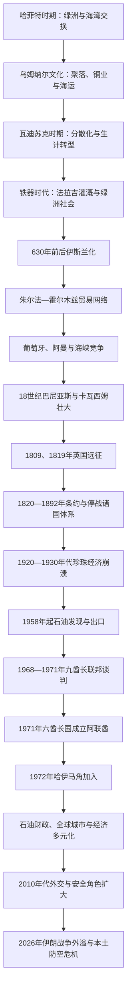

# 阿联酋历史

## 历史主线

## 历史主线概括

今阿联酋地区的历史由绿洲、山地和两侧海岸共同塑造。青铜时代的乌姆纳尔文化与铁器时代法拉吉显示稳定农业、金属业和海湾贸易很早便已形成；伊斯兰化后，朱尔法等港口接入霍尔木兹、印度与东非网络。18世纪巴尼亚斯联盟向阿布扎比、迪拜发展，卡瓦西姆则以拉斯海马、沙迦经营海上势力。

英国在1809、1819年远征后，以1820年总条约、1835年起的海上休战、1853年永久停战和1892年排他协议建立特殊保护体系。条约降低海战，却也通过选择性承认把众多部落港口逐渐固定为七个酋长国。20世纪30年代珍珠经济崩溃，1958年以后阿布扎比石油和1960年代迪拜石油改变财政条件。英国撤出促成联邦：六个酋长国于1971年12月2日建国，哈伊马角在1972年2月10日加入。

联邦以阿布扎比资源财政和迪拜商业网络互补，保留七个王朝与地方政府，同时建设共同货币、军队和行政体系。2008—2009年迪拜债务危机显示地方发展模式的风险与联邦财政后盾。2010年代阿联酋外交、安全和全球投资角色扩大；2026年伊朗战争的大规模导弹、无人机、港口和机场威胁，又使本土防空、霍尔木兹航运与核设施安全成为新的历史主线。

## 阶段导航

| 顺序 | 阶段 | 时间 | 简要概括 |
|---:|---|---|---|
| 1 | [海湾部落、港口与珍珠贸易](/%E4%BA%BA%E6%96%87%E7%A7%91%E5%AD%A6/%E5%8E%86%E5%8F%B2/%E8%A5%BF%E4%BA%9A/%E9%98%BF%E6%8B%89%E4%BC%AF%E5%8D%8A%E5%B2%9B/%E9%98%BF%E8%81%94%E9%85%8B/%E6%B5%B7%E6%B9%BE%E9%83%A8%E8%90%BD%E3%80%81%E6%B8%AF%E5%8F%A3%E4%B8%8E%E7%8F%8D%E7%8F%A0%E8%B4%B8%E6%98%93.md) | 约前5000年—1820年 | 乌姆纳尔、瓦迪苏克、法拉吉、伊斯兰化、朱尔法、霍尔木兹、巴尼亚斯与卡瓦西姆。 |
| 2 | [停战诸国与英国保护体系](/%E4%BA%BA%E6%96%87%E7%A7%91%E5%AD%A6/%E5%8E%86%E5%8F%B2/%E8%A5%BF%E4%BA%9A/%E9%98%BF%E6%8B%89%E4%BC%AF%E5%8D%8A%E5%B2%9B/%E9%98%BF%E8%81%94%E9%85%8B/%E5%81%9C%E6%88%98%E8%AF%B8%E5%9B%BD%E4%B8%8E%E8%8B%B1%E5%9B%BD%E4%BF%9D%E6%8A%A4%E4%BD%93%E7%B3%BB.md) | 1820—1971年 | 四层条约、七酋长地图、珍珠危机、布赖米争端、油气开发与九方联邦谈判。 |
| 3 | [联邦建立与现代阿联酋](/%E4%BA%BA%E6%96%87%E7%A7%91%E5%AD%A6/%E5%8E%86%E5%8F%B2/%E8%A5%BF%E4%BA%9A/%E9%98%BF%E6%8B%89%E4%BC%AF%E5%8D%8A%E5%B2%9B/%E9%98%BF%E8%81%94%E9%85%8B/%E8%81%94%E9%82%A6%E5%BB%BA%E7%AB%8B%E4%B8%8E%E7%8E%B0%E4%BB%A3%E9%98%BF%E8%81%94%E9%85%8B.md) | 1971年—2026年7月13日 | 联邦宪制、石油与多元化、2008—2009年危机、外交安全转型及2026年战争外溢。 |

## 王朝与联邦领导导航

- [七酋长国统治者与联邦领导世系](/%E4%BA%BA%E6%96%87%E7%A7%91%E5%AD%A6/%E5%8E%86%E5%8F%B2/%E8%A5%BF%E4%BA%9A/%E9%98%BF%E6%8B%89%E4%BC%AF%E5%8D%8A%E5%B2%9B/%E9%98%BF%E8%81%94%E9%85%8B/%E4%B8%83%E9%85%8B%E9%95%BF%E5%9B%BD%E7%BB%9F%E6%B2%BB%E8%80%85%E4%B8%8E%E8%81%94%E9%82%A6%E9%A2%86%E5%AF%BC%E4%B8%96%E7%B3%BB.md)：列出七个酋长国全部公认统治者，保留共治、复位、短暂废立、地方实际掌权与外部承认差异；另列全部总统、代理总统、副总统和总理。

## 重要转折与时间节点

| 时间 | 事件 | 意义 |
|---|---|---|
| 前2600—前2000年 | 乌姆纳尔文化繁荣 | 聚落、铜业、海运与海湾交换体系成熟。 |
| 前1300—前300年 | 法拉吉灌溉发展 | 支撑干旱环境中的持续绿洲农业和协作制度。 |
| 630年前后 | 伊斯兰传入 | 地区纳入阿拉伯—伊斯兰政治与商贸世界。 |
| 约12—15世纪 | 朱尔法港繁荣 | 成为霍尔木兹网络中的珍珠和印度洋贸易节点。 |
| 18世纪 | 巴尼亚斯与卡瓦西姆壮大 | 近代主要酋长家族和港口中心成形。 |
| 1809、1819年 | 英国两次远征 | 卡瓦西姆海权受挫，1820年条约秩序建立。 |
| 1833年 | 迪拜从阿布扎比分离 | 马克图姆家族统治和独立商业中心形成。 |
| 1853年 | 永久海上停战 | “停战海岸／停战诸国”制度化。 |
| 1892年 | 排他协议 | 酋长国内政自治、对外关系受英国限制。 |
| 1920—1930年代 | 珍珠经济崩溃 | 养殖珍珠、大萧条和信贷收缩摧毁传统财政。 |
| 1952—1955年 | 富查伊拉获承认、布赖米危机 | 七酋长地图与现代边界加速固定。 |
| 1958／1962年 | 阿布扎比发现并出口石油 | 石油财政开始重塑国家能力。 |
| 1968年 | 英国宣布撤出，扎耶德—拉希德会谈 | 九方、后七方联邦谈判启动。 |
| 1971年12月2日 | 六个酋长国成立阿联酋 | 联邦国家诞生。 |
| 1972年2月10日 | 哈伊马角加入 | 七酋长联邦完成。 |
| 1976年 | 武装力量统一 | 国防与联邦权力进一步集中。 |
| 2008—2009年 | 迪拜金融危机 | 暴露地方债务风险，也验证联邦和阿布扎比财政后盾。 |
| 2020年 | 同以色列关系正常化 | 经贸与安全结盟扩展，外交方向显著变化。 |
| 2026年2月28日起 | 伊朗战争外溢 | 港口、机场、油气和城市设施长期面临导弹、无人机威胁。 |
| 2026年5月17日 | 巴拉卡核电站外部电力设施遇袭 | 无辐射泄漏，但核安全与代理战争风险成为国家级议题。 |

## 相关主线

- 区域背景：[阿拉伯半岛历史](/%E4%BA%BA%E6%96%87%E7%A7%91%E5%AD%A6/%E5%8E%86%E5%8F%B2/%E8%A5%BF%E4%BA%9A/%E9%98%BF%E6%8B%89%E4%BC%AF%E5%8D%8A%E5%B2%9B/README.md)。
- 阿曼方向：[阿曼历史](/%E4%BA%BA%E6%96%87%E7%A7%91%E5%AD%A6/%E5%8E%86%E5%8F%B2/%E8%A5%BF%E4%BA%9A/%E9%98%BF%E6%8B%89%E4%BC%AF%E5%8D%8A%E5%B2%9B/%E9%98%BF%E6%9B%BC/README.md)。
- 英国条约与海湾国家形成：[奥斯曼、英国与现代国家形成](/%E4%BA%BA%E6%96%87%E7%A7%91%E5%AD%A6/%E5%8E%86%E5%8F%B2/%E8%A5%BF%E4%BA%9A/%E9%98%BF%E6%8B%89%E4%BC%AF%E5%8D%8A%E5%B2%9B/%E5%A5%A5%E6%96%AF%E6%9B%BC%E3%80%81%E8%8B%B1%E5%9B%BD%E4%B8%8E%E7%8E%B0%E4%BB%A3%E5%9B%BD%E5%AE%B6%E5%BD%A2%E6%88%90.md)。

## 目录层级

- 直接上级：[阿拉伯半岛](/%E4%BA%BA%E6%96%87%E7%A7%91%E5%AD%A6/%E5%8E%86%E5%8F%B2/%E8%A5%BF%E4%BA%9A/%E9%98%BF%E6%8B%89%E4%BC%AF%E5%8D%8A%E5%B2%9B/README.md)
- 宏观区域：[西亚](/%E4%BA%BA%E6%96%87%E7%A7%91%E5%AD%A6/%E5%8E%86%E5%8F%B2/%E8%A5%BF%E4%BA%9A/README.md)
- 历史总览：[历史](/%E4%BA%BA%E6%96%87%E7%A7%91%E5%AD%A6/%E5%8E%86%E5%8F%B2/README.md)
