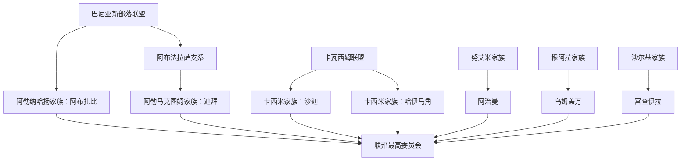

# 七酋长国统治者与联邦领导世系

## 时间

约18世纪初—2026年7月13日

## 概括

阿联酋不是由一个王朝统治的单一君主国，而是七个世袭酋长国组成的联邦。阿布扎比与迪拜的统治家族同出巴尼亚斯联盟；沙迦与哈伊马角由卡瓦西姆家族的不同支系统治；阿治曼、乌姆盖万和富查伊拉分别由努艾米、穆阿拉和沙尔基家族统治。七位酋长组成联邦最高委员会，并从成员中选举总统和副总统。惯例上，总统由阿布扎比酋长担任，迪拜酋长兼任副总统和总理，但这些职务在法律上来自联邦宪法与最高委员会决定。

## 世系关系

## 编表说明

- 表中按实际在位次序排列；复位、共治、代理、废立与短暂夺位均单列。
- 18—19世纪的口述谱系、英国档案与后来的官方纪年并不总是一致。无法精确到月日者写“约”或列出两种常见纪年，不用现代精确日期反推早期政治。
- “统治者”可能指部落联盟首领、地方实际掌权者、英国承认的停战酋长或联邦成员酋长。哈伊马角1900—1921年、富查伊拉1952年前尤其需要区分实际自治与外部承认。
- 中文译名采用便于检索的音译；同一阿拉伯姓名在不同中文资料中可能另译为哈立德／哈利德、胡迈德／侯迈德、萨克尔／赛格尔等。

## 阿布扎比酋长

统治家族为阿勒纳哈扬家族。1761年发现阿布扎比岛淡水并建立定居点，1793年前后政治中心由利瓦绿洲移到海岸。

| 顺序 | 统治者 | 在位 | 与前任关系 | 关键事件／备注 |
|---:|---|---|---|---|
| 1 | 迪亚卜·本·伊萨 | 约1761—1793年 | 建立者 | 组织阿布扎比岛定居；1793年遇害。 |
| 2 | 沙赫布特·本·迪亚卜 | 1793—1816年；1818年短暂共治 | 子 | 将统治中心稳固在阿布扎比；1818年与儿子塔赫农共治。 |
| 3 | 穆罕默德·本·沙赫布特 | 1816—1818年 | 子 | 在家族内部权力调整中失位。 |
| 4 | 塔赫农·本·沙赫布特 | 1818—1833年4月 | 弟；初与父共治 | 签署1820年条约；1833年遇害。 |
| 5 | 哈利法·本·沙赫布特 | 1833年4月—1845年7月 | 兄弟支系 | 与苏尔坦共治；1845年遇害。 |
| 6 | 苏尔坦·本·沙赫布特 | 1833年4月—1845年7月 | 哈利法之弟 | 与哈利法共同执政，二人先后在政变中死亡。 |
| 7 | 伊萨·本·哈立德·法拉希 | 1845年7—9月 | 母系外甥；非阿勒纳哈扬 | 杀害哈利法后短暂夺权，属僭位。 |
| 8 | 迪亚卜·本·伊萨·法拉希 | 1845年9—12月 | 法拉希支系；非阿勒纳哈扬 | 击败前一僭位者后又被哈立德·本·伊萨杀死。 |
| 9 | 赛义德·本·塔赫农 | 1845年12月—1855年 | 塔赫农之子 | 由主要派系推举，后被迫退位。 |
| 10 | **扎耶德·本·哈利法** | 1855—1909年5月 | 家族支系 | 长期扩张阿布扎比影响，调解部落与绿洲关系，后称“扎耶德大帝”。 |
| 11 | 塔赫农·本·扎耶德 | 1909年5月—1912年10月 | 子 | 任期短，延续与英国条约关系。 |
| 12 | 哈姆丹·本·扎耶德 | 1912年10月—1922年8月22日 | 弟 | 珍珠繁荣末期执政，遇害。 |
| 13 | 苏尔坦·本·扎耶德 | 1922年8月22日—1926年8月4日 | 弟 | 在家族竞争与经济压力中遇害。 |
| 14 | 萨克尔·本·扎耶德 | 1926年8月4日—1928年1月1日 | 弟 | 夺位后不久遇害。 |
| 15 | 沙赫布特·本·苏尔坦 | 1928年1月1日—1966年8月6日 | 苏尔坦之子 | 经历珍珠业崩溃、石油勘探与首批出口；因开发节奏与财政政策争议被家族会议更替。 |
| 16 | **扎耶德·本·苏尔坦** | 1966年8月6日—2004年11月2日 | 弟 | 推动石油收入公共建设、阿布扎比—迪拜联合及1971年联邦成立；首任联邦总统。 |
| 17 | 哈利法·本·扎耶德 | 2004年11月2日—2022年5月13日 | 子 | 延续联邦建设，经历2008—2009年金融危机及地区安全转型。 |
| 18 | **穆罕默德·本·扎耶德** | 2022年5月13日至今 | 异母弟 | 现任阿布扎比酋长；2022年5月14日当选联邦总统。 |

## 迪拜酋长

统治家族为阿勒马克图姆家族，出自巴尼亚斯联盟阿布法拉萨支系。1833年该支系从阿布扎比政治体系中分离并占据迪拜。

| 顺序 | 统治者 | 在位 | 与前任关系 | 关键事件／备注 |
|---:|---|---|---|---|
| 1 | 乌拜德·本·赛义德 | 1833年7月9日—约1836年 | 共同建立者 | 与马克图姆·本·布提共同领导迁入；有些名录把其单独统治截止于1833年，另一些视为共治至1836年。 |
| 2 | **马克图姆·本·布提** | 1833年7月9日—1852年 | 共同建立者 | 奠定马克图姆家族统治，迪拜成为独立酋长国。 |
| 3 | 赛义德·本·布提 | 1852—1859年 | 兄弟 | 维持海上停战与商贸秩序。 |
| 4 | 哈希尔·本·马克图姆 | 1859年—1886年11月22日 | 马克图姆之子 | 珍珠与港口贸易扩张。 |
| 5 | 拉希德·本·马克图姆 | 1886年11月22日—1894年4月7日 | 弟 | 签署1892年排他协议。 |
| 6 | **马克图姆·本·哈希尔** | 1894年4月7日—1906年2月16日 | 哈希尔之子 | 降低关税、吸引波斯商人和转口贸易，强化迪拜自由港地位。 |
| 7 | 布提·本·苏海勒 | 1906年2月16日—1912年11月 | 家族长辈 | 珍珠业仍是财政主柱。 |
| 8 | 赛义德·本·马克图姆 | 1912年11月—1929年4月15日 | 家族支系 | 首次在位；经济与商人政治矛盾加剧。 |
| 9 | 马尼·本·拉希德 | 1929年4月15—18日 | 叔伯支系 | 在商人支持的废立中掌权三天，随即被英国调停与家族力量推翻。 |
| 10 | 赛义德·本·马克图姆 | 1929年4月18日—1958年9月10日 | 复位 | 经历珍珠业崩溃、1938年改革运动和早期石油特许。 |
| 11 | **拉希德·本·赛义德** | 1958年9月10日—1990年10月7日 | 子 | 疏浚迪拜河、建设港口与机场；共同创建联邦，兼任首任副总统，1979年起任总理。 |
| 12 | 马克图姆·本·拉希德 | 1990年10月7日—2006年1月4日 | 子 | 兼任副总统、总理；2004年曾短暂代理总统。 |
| 13 | **穆罕默德·本·拉希德** | 2006年1月4日至今 | 弟 | 现任迪拜酋长、联邦副总统兼总理，推动航空、金融、房地产与全球城市战略。 |

## 沙迦酋长

统治家族为卡西米家族。早期卡瓦西姆的拉斯海马与沙迦支系常由同一首领或近亲共同控制，因此18—19世纪部分任期同时见于哈伊马角表。

| 顺序 | 统治者 | 在位 | 与前任关系 | 关键事件／备注 |
|---:|---|---|---|---|
| 1 | 拉希德·本·马塔尔 | 约1727—1777年 | 早期卡瓦西姆首领 | 早期统治中心与沙迦、拉斯海马的区分尚未固定。 |
| 2 | 萨克尔·本·拉希德 | 1777—1803年 | 子 | 扩展卡瓦西姆海上力量。 |
| 3 | **苏尔坦·本·萨克尔** | 1803—1840年 | 子 | 首次在位；亦统治或声索拉斯海马。 |
| 4 | 萨克尔·本·苏尔坦 | 1840年 | 子 | 短暂夺位。 |
| 5 | 苏尔坦·本·萨克尔 | 1840—1866年 | 复位 | 长期复位，维持沙迦—拉斯海马卡西米主导权。 |
| 6 | 哈立德·本·苏尔坦 | 1866年—1868年4月14日 | 子 | 同时涉及拉斯海马统治。 |
| 7 | 萨利姆·本·苏尔坦 | 1868年4月14日—1883年3月 | 弟 | 1869—1871年与兄弟易卜拉欣共治。 |
| 8 | 易卜拉欣·本·苏尔坦 | 1869—1871年 | 兄弟 | 与萨利姆共治，按其实际任期单列。 |
| 9 | 萨克尔·本·哈立德 | 1883年3月—1914年4月13日 | 哈立德之子 | 签署1892年排他协议。 |
| 10 | 哈立德·本·艾哈迈德 | 1914年4月13日—1924年11月21日 | 家族支系 | 后来亦参与拉斯海马地方政治。 |
| 11 | 苏尔坦·本·萨克尔二世 | 1924年11月21日—1951年 | 家族支系 | 珍珠危机时期执政。 |
| 12 | 穆罕默德·本·萨克尔 | 1951年—1951年5月 | 亲属 | 仅短暂在位，随后由萨克尔·本·苏尔坦取代。 |
| 13 | 萨克尔·本·苏尔坦 | 1951年5月—1965年6月24日 | 1840年短期统治者之后裔 | 1965年在英国支持的无血更替中被罢黜。 |
| 14 | 哈立德·本·穆罕默德 | 1965年6月24日—1972年1月24日 | 堂支 | 参与联邦成立；在前任发动的反政变中遇害。 |
| 15 | 萨克尔·本·穆罕默德 | 1972年1月25日—1972年内 | 哈伊马角酋长 | 哈立德遇害后短暂代理沙迦统治。 |
| 16 | **苏尔坦·本·穆罕默德** | 1972年1月25日—1987年6月17日 | 哈立德之弟 | 首次在位，推动教育文化与行政建设。 |
| 17 | 阿卜杜勒阿齐兹·本·穆罕默德 | 1987年6月17—23日 | 兄 | 发动六日政变，联邦调停后退位。部分纪年把复位日记为24或25日。 |
| 18 | **苏尔坦·本·穆罕默德** | 1987年6月23日至今 | 复位 | 现任沙迦酋长；恢复统治后延续文化、教育与城市发展。 |

## 哈伊马角酋长

哈伊马角是卡瓦西姆早期海权中心。1900年侯迈德·本·阿卜杜拉去世后，沙迦重新控制该地；1919年苏尔坦·本·萨利姆取得地方权力，英国于1921年7月7日正式承认哈伊马角再次独立。因此1900—1921年的表项是地方掌权者或沙迦任命者，不等同于完整独立酋长任期。

| 顺序 | 统治者／掌权者 | 在位 | 身份 | 关键事件／备注 |
|---:|---|---|---|---|
| 1 | 拉赫曼（或拉赫马）·卡西米 | 18世纪早期 | 卡瓦西姆首领 | 确切年份不详。 |
| 2 | 马塔尔·本·拉赫曼 | 18世纪前半 | 继承者 | 约1740年代前去世，年代存在争议。 |
| 3 | 拉希德·本·马塔尔 | 约1740年代—1777年 | 继承者 | 亦列入沙迦早期共同世系。 |
| 4 | 萨克尔·本·拉希德 | 1777—1803年 | 子 | 卡瓦西姆海权扩张。 |
| 5 | 苏尔坦·本·萨克尔 | 1803—1808年 | 子 | 首次统治。 |
| 6 | 侯赛因·本·阿里 | 1808—1814年 | 代理 | 卡瓦西姆战争期代理统治。 |
| 7 | 哈桑·本·拉赫马 | 1814—1820年 | 代理 | 1819年英国远征后签署1820年总条约。 |
| 8 | 苏尔坦·本·萨克尔 | 1820—1866年 | 复位 | 亦为沙迦酋长。 |
| 9 | 易卜拉欣·本·苏尔坦 | 1866—1867年5月 | 子 | 亦见于沙迦支系。 |
| 10 | 哈立德·本·苏尔坦 | 1867年5月—1868年4月14日 | 弟 | 同时与沙迦相连。 |
| 11 | 萨利姆·本·苏尔坦 | 1868年4月14日—1869年 | 弟 | 短期统治。 |
| 12 | 侯迈德·本·阿卜杜拉 | 1869—1900年8月 | 家族支系 | 维持独立；去世后并入沙迦。 |
| 13 | 哈马德·本·马吉德 | 1900年内 | 沙迦任命者 | 同时与卡尔巴支系有关，任期极短。 |
| 14 | 哈立德·本·萨克尔 | 1900年—约1908年3月 | 地方长官 | 沙迦统治下的地方掌权者。 |
| 15 | 萨利姆·本·苏尔坦 | 1908年3月—1919年8月 | 地方长官 | 沙迦统治下执政。 |
| 16 | **苏尔坦·本·萨利姆** | 1919年8月—1948年2月 | 实际统治者；1921年获承认 | 1919年取得地方权力，1921年7月7日获英国承认为独立酋长。 |
| 17 | **萨克尔·本·穆罕默德** | 1948年2月—2010年10月27日 | 家族支系 | 长期执政；1972年带领哈伊马角加入联邦。具体即位日另有2月7日与7月17日两说。 |
| 18 | **沙特·本·萨克尔** | 2010年10月27日至今 | 子 | 现任哈伊马角酋长。 |

## 阿治曼酋长

统治家族为努艾米家族的阿布胡赖班支系。早期名录对首任统治者、侯迈德复位后的终年及拉希德二世即位年有分歧，表中并列常见纪年。

| 顺序 | 统治者 | 在位 | 与前任关系 | 关键事件／备注 |
|---:|---|---|---|---|
| 1 | 拉希德·努艾米 | 18世纪，年月不详 | 早期首领 | 是否应计入连续酋长世系存在分歧。 |
| 2 | 侯迈德·本·拉希德 | 18世纪后期—1816年前后 | 亲属 | 一些地方传统把他列为早期统治者。 |
| 3 | 拉希德·本·侯迈德 | 1816—1838年 | 子 | 签署1820年总条约。 |
| 4 | 侯迈德·本·拉希德 | 1838—1841年 | 子 | 首次在位。 |
| 5 | 阿卜杜勒阿齐兹·本·拉希德 | 1841—1848年 | 兄弟／叔支 | 取代前任。 |
| 6 | 侯迈德·本·拉希德 | 1848—1864年或1873年 | 复位 | 不同名录把复位终年记为1864或1873年。 |
| 7 | 拉希德·本·侯迈德二世 | 1864年或1873年—1891年4月 | 子 | 起始年随前一任纪年而异。 |
| 8 | 侯迈德·本·拉希德三世 | 1891年4月—1900年7月8日 | 子 | 珍珠繁荣期统治。 |
| 9 | 阿卜杜勒阿齐兹·本·侯迈德 | 1900年7月8日—1910年2月 | 子 | 延续英国条约体系。 |
| 10 | 侯迈德·本·阿卜杜勒阿齐兹 | 1910年2月—1928年1月 | 子 | 珍珠业由盛转衰。 |
| 11 | **拉希德·本·侯迈德三世** | 1928年1月—1981年9月6日 | 子 | 联邦创建者之一，推动现代行政与教育。 |
| 12 | **侯迈德·本·拉希德** | 1981年9月6日至今 | 子 | 现任阿治曼酋长；姓名序数在不同官方译写中有差异，故不以序数判断是否漏代。 |

## 乌姆盖万酋长

统治家族为穆阿拉家族。早期马吉德与拉希德的交接年份不详，1820年条约时期由阿卜杜拉·本·拉希德统治。

| 顺序 | 统治者 | 在位 | 与前任关系 | 关键事件／备注 |
|---:|---|---|---|---|
| 1 | 马吉德·穆阿拉 | 约1775—18世纪末 | 建立者 | 从西尼亚岛一带迁向今乌姆盖万聚落；确切终年不详。 |
| 2 | 拉希德·本·马吉德 | 18世纪末—1816年或1820年 | 子 | 不同世系把终年记为1816或1820。 |
| 3 | 阿卜杜拉·本·拉希德 | 1816年或1820年—1853年 | 子 | 签署1820年总条约与后续海上休战。 |
| 4 | 阿里·本·阿卜杜拉 | 1853—1873年 | 子 | 永久海上停战初期执政。 |
| 5 | 艾哈迈德·本·阿卜杜拉 | 1873—1904年6月13日 | 弟 | 签署1892年排他协议。 |
| 6 | 拉希德·本·艾哈迈德 | 1904年6月13日—1922年8月 | 子 | 珍珠业末期执政；有名录把即位记为1903年。 |
| 7 | 阿卜杜拉·本·拉希德二世 | 1922年8月—1923年10月 | 子 | 任期短。 |
| 8 | 哈马德·本·易卜拉欣 | 1923年10月—1929年2月9日 | 亲属 | 在内部权力斗争中遇害。 |
| 9 | 艾哈迈德·本·拉希德 | 1929年2月9日—1981年2月21日 | 家族支系 | 经历珍珠崩溃、石油时代与联邦成立。 |
| 10 | 拉希德·本·艾哈迈德二世 | 1981年2月21日—2009年1月2日 | 子 | 推动地方基础设施。 |
| 11 | **沙特·本·拉希德** | 2009年1月2日至今 | 子 | 现任乌姆盖万酋长。 |

## 富查伊拉酋长

统治家族为沙尔基家族。富查伊拉在19世纪末、20世纪初已形成地方自治，但英国长期把它视为沙迦属地，直到1952年3月21日才承认为独立停战酋长国。早期世系主要来自家族传统，不能全部配上可靠公历年份。

| 顺序 | 统治者／先祖首领 | 在位 | 身份 | 关键事件／备注 |
|---:|---|---|---|---|
| 1 | 穆罕默德·本·马塔尔 | 年代不详 | 早期沙尔基首领 | 家族谱系所列，确切统治范围与年代不详。 |
| 2 | 哈米斯·本·穆罕默德 | 年代不详 | 继承者 | 口述世系。 |
| 3 | 阿卜杜拉·本·哈米斯 | 年代不详 | 继承者 | 口述世系。 |
| 4 | 哈马德·本·阿卜杜拉 | 年代不详 | 继承者 | 为区别后来的同名统治者，可称“哈马德一世”。 |
| 5 | 赛义夫·本·哈马德 | 年代不详 | 继承者 | 口述世系。 |
| 6 | 阿卜杜拉·本·赛义夫 | 19世纪 | 继承者 | 其后由哈马德·本·阿卜杜拉领导独立化。 |
| 7 | **哈马德·本·阿卜杜拉** | 约1879年或1903年前—1936／1938年 | 地方实际统治者 | 反复抵抗沙迦控制，奠定富查伊拉自治；起止年在家族、英国档案和后世名录中不同。 |
| 8 | 赛义夫·本·哈马德 | 1936／1938—1938／1942年 | 子 | 过渡统治，具体年份存在两套常见纪年。 |
| 9 | **穆罕默德·本·哈马德** | 约1937／1938／1942—1974年9月18日 | 哈马德之子 | 1952年获英国承认为停战酋长，1971年成为联邦创建者。 |
| 10 | **哈马德·本·穆罕默德** | 1974年9月18日至今 | 子 | 现任富查伊拉酋长。 |

## 联邦总统

总统由联邦最高委员会从七位酋长中选举，任期五年并可连任。下表列入2004年的代理总统，避免把权力过渡误写为空缺。

| 顺序 | 总统 | 任期 | 同期酋长身份 | 关键事件／备注 |
|---:|---|---|---|---|
| 1 | **扎耶德·本·苏尔坦·阿勒纳哈扬** | 1971年12月2日—2004年11月2日 | 阿布扎比酋长 | 联邦创建者；多次连任并推进国家整合。 |
| 代理 | 马克图姆·本·拉希德·阿勒马克图姆 | 2004年11月2—3日 | 迪拜酋长、副总统、总理 | 依宪法在总统去世后代理，直至最高委员会选出继任者。 |
| 2 | 哈利法·本·扎耶德·阿勒纳哈扬 | 2004年11月3日—2022年5月13日 | 阿布扎比酋长 | 延续联邦政策；2014年后穆罕默德·本·扎耶德承担更多日常领导。 |
| 3 | **穆罕默德·本·扎耶德·阿勒纳哈扬** | 2022年5月14日至今 | 阿布扎比酋长 | 现任总统。 |

## 联邦副总统

| 顺序 | 副总统 | 任期 | 身份 | 关键事件／备注 |
|---:|---|---|---|---|
| 1 | 拉希德·本·赛义德·阿勒马克图姆 | 1971年12月2日—1990年10月7日 | 迪拜酋长 | 联邦创建者；1979年起兼任总理。 |
| 2 | 马克图姆·本·拉希德·阿勒马克图姆 | 1990年10月7日—2006年1月4日 | 迪拜酋长、总理 | 2004年短暂代理总统。 |
| 3 | **穆罕默德·本·拉希德·阿勒马克图姆** | 2006年1月5日至今 | 迪拜酋长、总理 | 现任副总统之一。 |
| 4 | **曼苏尔·本·扎耶德·阿勒纳哈扬** | 2023年3月29日至今 | 总统法院主席、副总理 | 经最高委员会同意获任，与穆罕默德·本·拉希德同时担任副总统；任命于3月30日公布。 |

## 联邦总理

| 顺序 | 总理 | 任期 | 关键事件／备注 |
|---:|---|---|---|
| 1 | 马克图姆·本·拉希德·阿勒马克图姆 | 1971年12月9日—1979年4月25日 | 领导首届内阁；部分名录把正式交接记为4月30日。 |
| 2 | 拉希德·本·赛义德·阿勒马克图姆 | 1979年4月25日—1990年10月7日 | 迪拜酋长兼副总统。 |
| 3 | 马克图姆·本·拉希德·阿勒马克图姆 | 1990年10月7日—2006年1月4日 | 第二次任总理。 |
| 4 | **穆罕默德·本·拉希德·阿勒马克图姆** | 2006年1月5日至今 | 现任总理、迪拜酋长与副总统。 |

## 2026年7月13日的七位现任酋长

| 酋长国 | 现任酋长 | 即位时间 | 联邦角色 |
|---|---|---|---|
| 阿布扎比 | **穆罕默德·本·扎耶德·阿勒纳哈扬** | 2022年5月13日 | 联邦总统、最高委员会主席。 |
| 迪拜 | **穆罕默德·本·拉希德·阿勒马克图姆** | 2006年1月4日 | 联邦副总统、总理。 |
| 沙迦 | **苏尔坦·本·穆罕默德·卡西米** | 1972年1月25日；1987年6月23日复位 | 最高委员会成员。 |
| 阿治曼 | **侯迈德·本·拉希德·努艾米** | 1981年9月6日 | 最高委员会成员。 |
| 乌姆盖万 | **沙特·本·拉希德·穆阿拉** | 2009年1月2日 | 最高委员会成员。 |
| 哈伊马角 | **沙特·本·萨克尔·卡西米** | 2010年10月27日 | 最高委员会成员。 |
| 富查伊拉 | **哈马德·本·穆罕默德·沙尔基** | 1974年9月18日 | 最高委员会成员。 |

## 演变关系

- 政权形成与英国承认过程见[停战诸国与英国保护体系](/%E4%BA%BA%E6%96%87%E7%A7%91%E5%AD%A6/%E5%8E%86%E5%8F%B2/%E8%A5%BF%E4%BA%9A/%E9%98%BF%E6%8B%89%E4%BC%AF%E5%8D%8A%E5%B2%9B/%E9%98%BF%E8%81%94%E9%85%8B/%E5%81%9C%E6%88%98%E8%AF%B8%E5%9B%BD%E4%B8%8E%E8%8B%B1%E5%9B%BD%E4%BF%9D%E6%8A%A4%E4%BD%93%E7%B3%BB.md)。
- 联邦职务与现代发展见[联邦建立与现代阿联酋](/%E4%BA%BA%E6%96%87%E7%A7%91%E5%AD%A6/%E5%8E%86%E5%8F%B2/%E8%A5%BF%E4%BA%9A/%E9%98%BF%E6%8B%89%E4%BC%AF%E5%8D%8A%E5%B2%9B/%E9%98%BF%E8%81%94%E9%85%8B/%E8%81%94%E9%82%A6%E5%BB%BA%E7%AB%8B%E4%B8%8E%E7%8E%B0%E4%BB%A3%E9%98%BF%E8%81%94%E9%85%8B.md)。
- 上级：[阿联酋历史](/%E4%BA%BA%E6%96%87%E7%A7%91%E5%AD%A6/%E5%8E%86%E5%8F%B2/%E8%A5%BF%E4%BA%9A/%E9%98%BF%E6%8B%89%E4%BC%AF%E5%8D%8A%E5%B2%9B/%E9%98%BF%E8%81%94%E9%85%8B/README.md)。
