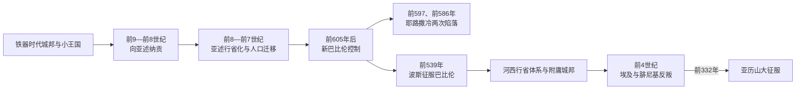

# 亚述、巴比伦与波斯统治下的黎凡特

## 时间

约前9世纪—前332年；大规模直接行省化主要始于前8世纪后期。

## 概括

从新亚述西征到亚历山大进入黎凡特，东地中海沿岸逐步被纳入以两河或伊朗为中心的大帝国。新亚述以年度军役、贡赋、围城、废立和人口迁移把反复结盟的小国改造为行省与附庸；新巴比伦继承其西部控制，摧毁耶路撒冷并长期围攻推罗；阿契美尼德波斯则在更大疆域内保留若干地方王室、神庙和社群机构，以税赋、驿路和海军义务连接帝国。

“帝国统治”不是三次简单换旗。亚述更重军事惩罚和行省化，巴比伦在埃及竞争中控制战略城市，波斯则较多通过附庸王、总督、祭司与地方精英间接治理。迁徙与流亡造成真实创伤，却没有把原居民全部迁空；居鲁士征服巴比伦后允许部分社群返回和重建圣所，也不是现代意义的民族解放或普遍宗教宽容。

## 演变图

## 建立背景

新亚述的核心位于底格里斯河上游。前9世纪起，亚述那西尔帕二世、撒缦以色三世等君主越过幼发拉底，迫使叙利亚与腓尼基城邦纳贡。前853年卡尔卡战役中，大马士革、哈马、以色列及其他力量组成联盟，暂时阻挡亚述，但联盟缺乏长期统一指挥，各国又常利用亚述打击邻国。

前8世纪，亚述军队、道路、总督和围城技术更成熟。提革拉特帕拉沙尔三世不再满足于一次性贡赋，而是吞并领土、拆分行省、干预王位并配置常备驻军。大马士革、北方以色列和沿海城邦面对的选择从“纳贡或拒绝”变为在附庸、直接省制、人口迁移与毁城之间不断调整。

## 新亚述统治

### 征服与行省化

亚述统治通常分三层：

| 层级 | 统治方式 | 地方空间 | 风险 |
|---|---|---|---|
| 直接行省 | 由亚述总督、驻军、税务和驿路机构管理 | 战略交通线、反叛频繁地区和被吞并王国 | 税役与征兵直接化，地方王室被取消 |
| 附庸王国 | 保留王室、法律和神庙，缴纳贡赋并提供军需 | 推罗、犹大等在部分时期保持此地位 | 外交受限；拒贡、结盟或继承争议可触发废立 |
| 条约伙伴 / 临时纳贡者 | 战役后宣誓和交贡，日常控制较弱 | 帝国边缘或初次接触地区 | 亚述撤军后可能反叛，下一次征服更严厉 |

前734—前732年，提革拉特帕拉沙尔三世击败大马士革与以色列联盟，吞并加利利等地并迁走部分人口。何细亚在亚述支持下取得北国王位，后来停止纳贡；撒马利亚约前722年陷落，王国被改造成行省。最终攻克横跨撒缦以色五世和萨尔贡二世时期，不能只归于一人。

前701年，犹大王希西家加入反亚述活动。西拿基立攻占拉吉等城、迁走人口并把部分领地转给忠诚城邦；耶路撒冷没有陷落，但犹大付出重贡并继续附庸。亚述的胜利铭文和犹大传统对结局强调不同：前者突出围困与贡赋，后者强调首都获救，两者都说明犹大没有在此役恢复独立。

西顿前677年反叛后被以撒哈顿摧毁，人口和领土重组；推罗凭岛城防御保留较多自治，却不断失去大陆据点。帝国以选择性惩罚形成示范，不必在每城长期驻扎同等兵力。

### 人口迁移与地方社会

亚述把被征服者迁往帝国其他地区，也把别处人口迁入新行省。迁移对象常包括王室、官员、工匠、军人和其家庭，目的在于削弱地方精英、配置劳动力、补充军队和开发土地。其规模巨大但并非全体人口清空；考古显示许多村落继续存在，地方语言、宗教和亲族结构也有延续。

迁入人口同留居者在数代中重组社会。北方以色列灭亡后形成的撒马利亚人口与宗教传统，既包含本地延续，也受到帝国迁徙影响。“十支派全部失踪”属于后世叙事，不能替代人口史。

## 新巴比伦统治

### 从卡尔凯美什到黎凡特控制

前612年尼尼微陷落后，亚述帝国瓦解。埃及一度向叙利亚推进，前609年法老尼哥二世干预犹大王位。前605年尼布甲尼撒二世在卡尔凯美什击败埃及，新巴比伦取得叙利亚—巴勒斯坦宗主权。沿海城邦和犹大仍试图借埃及复兴摆脱两河控制，使巴比伦需要反复出兵。

### 耶路撒冷两次陷落

约雅敬反叛后，巴比伦围攻耶路撒冷。前597年约雅斤投降，王室、官员、军人和工匠中的一部分被迁至巴比伦，西底家被册立。巴比伦并未立即毁灭犹大，而是以新王和贡赋维持缓冲。

西底家后来同埃及接触并反叛。巴比伦自前589 / 588年起围城，短暂应对埃及援军后恢复封锁；前586年城破，宫殿和第一圣殿被毁，西底家被俘。基大利被任命管理留居人口，却很快遇刺，又有部分人逃往埃及。流亡、留居与迁逃共同构成犹大社会的解体，不可压缩为“全体被掳”。

### 腓尼基沿海

尼布甲尼撒二世约前586—前573年长期围攻推罗。岛城没有像耶路撒冷那样被彻底摧毁，但其王权、腹地和贸易受巴比伦制约，并一度改行首席官制度。西顿、比布鲁斯等城在宗主更替中继续运作，海运网络没有完全停止。

## 阿契美尼德波斯统治

### 征服与行政框架

前539年，居鲁士二世进入巴比伦并继承其西部领土。黎凡特通常置于“河西”行政区，与叙利亚、腓尼基、巴勒斯坦和塞浦路斯等不同地方单位重叠。帝国边界和总督辖区会随时期调整，不能把一个固定现代式“第五总督区”套用于整个两百年。

波斯大王通过总督、驻军、贡税、王家道路和驿站维持统治，同时保留：

- 腓尼基的比布鲁斯、西顿、推罗、阿尔瓦德附庸王室，以舰队和贡赋服务帝国；
- 犹大“耶胡德”行省的地方总督、祭司、文士和长老；
- 撒马利亚等地区的地方精英与神庙；
- 各城市的土地、祭祀、税收与司法惯例，只要不妨碍帝国财政和安全。

“自治”不等于主权。大王可以确认或撤换统治者、调集舰队、征收税赋、驻军和镇压反叛。

### 返回、重建与共同体重组

波斯政策允许多个被迁社群恢复圣所和地方组织。部分犹大人从巴比伦返回，更多人继续留在两河、埃及等地；流亡共同体因此没有在一次返乡后消失。耶路撒冷第二圣殿约前516年完成，祭司、总督和文士共同塑造耶胡德社会。祭祀、律法、家谱和共同体边界更重要，但没有恢复独立的大卫王国。

尼希米传统反映前5世纪中叶城墙、税务、债务和地方精英冲突；以斯拉传统则强调律法诵读和婚姻边界。二者的具体年代与编纂过程有争议，却显示帝国授权同地方宗教重组相互作用。

### 腓尼基舰队与反叛

波斯帝国在东地中海缺少本土海军，腓尼基城邦因此具有特殊价值。西顿、推罗和阿尔瓦德舰队参加对希腊、塞浦路斯和埃及的战争，王室以军事服务换取领地、贸易机会和地方自治。前5世纪西顿王室扩建埃什蒙神庙并获得沿海领地，显示附庸也能在帝国框架内崛起。

前4世纪，波斯对埃及战争、地方税负和王位政治引发多轮反叛。西顿王泰内斯参加反波斯起义，前345年前后失败并被处死，城市遭严重破坏；王权由波斯重组。前333年伊苏斯战役后，亚历山大向南推进，比布鲁斯、西顿等城转向马其顿，推罗拒绝其宗教和军事要求而被围。前332年推罗陷落，波斯的黎凡特统治终止。

## 帝国统治者与本地权力

本页不重复三个跨区域帝国的完整君主世系。逐王顺序见[亚述君主世系表](/%E4%BA%BA%E6%96%87%E7%A7%91%E5%AD%A6/%E5%8E%86%E5%8F%B2/%E8%A5%BF%E4%BA%9A/%E4%B8%A4%E6%B2%B3%E6%B5%81%E5%9F%9F/%E4%BA%9A%E8%BF%B0%E5%90%9B%E4%B8%BB%E4%B8%96%E7%B3%BB%E8%A1%A8.md)、[新巴比伦王国](/%E4%BA%BA%E6%96%87%E7%A7%91%E5%AD%A6/%E5%8E%86%E5%8F%B2/%E8%A5%BF%E4%BA%9A/%E4%B8%A4%E6%B2%B3%E6%B5%81%E5%9F%9F/%E6%96%B0%E5%B7%B4%E6%AF%94%E4%BC%A6%E7%8E%8B%E5%9B%BD.md)和[阿契美尼德王朝](/%E4%BA%BA%E6%96%87%E7%A7%91%E5%AD%A6/%E5%8E%86%E5%8F%B2/%E8%A5%BF%E4%BA%9A/%E4%BC%8A%E6%9C%97/%E9%98%BF%E5%A5%91%E7%BE%8E%E5%B0%BC%E5%BE%B7%E7%8E%8B%E6%9C%9D.md)。以下只列直接改变黎凡特结构的关键统治者，不作为完整世系表。

| 帝国 | 关键统治者 | 黎凡特政策或事件 |
|---|---|---|
| 新亚述 | 撒缦以色三世 | 前853年卡尔卡战役，开始更深介入叙利亚诸国联盟。 |
| 新亚述 | 提革拉特帕拉沙尔三世 | 吞并大马士革与北国边区，以行省化替代单次贡赋。 |
| 新亚述 | 撒缦以色五世、萨尔贡二世 | 撒马利亚围攻与北国灭亡横跨两位统治者。 |
| 新亚述 | 西拿基立 | 前701年摧毁犹大多城并削弱推罗腹地。 |
| 新亚述 | 以撒哈顿、亚述巴尼拔 | 镇压西顿、控制腓尼基和埃及交通线。 |
| 新巴比伦 | 尼布甲尼撒二世 | 前597、前586年攻陷耶路撒冷，长期围攻推罗。 |
| 波斯 | 居鲁士二世 | 前539年征服巴比伦，接管黎凡特并允许多地圣所重建。 |
| 波斯 | 冈比西斯二世 | 征服埃及，腓尼基舰队成为帝国海上支柱。 |
| 波斯 | 大流士一世 | 整合税赋、道路和总督体系。 |
| 波斯 | 阿尔塔薛西斯三世 | 镇压西顿反叛并重新征服埃及。 |
| 波斯 | 大流士三世 | 伊苏斯败后失去黎凡特，地方城邦转向亚历山大。 |

## 重要事件

| 时间 | 事件 | 结果 |
|---|---|---|
| 前853年 | 卡尔卡战役 | 叙利亚诸国联盟暂缓亚述推进，但未形成持久共同体。 |
| 前734—732年 | 亚述击败大马士革—以色列联盟 | 北国边区被吞并，大马士革亡，犹大成为附庸。 |
| 约前722年 | 撒马利亚陷落 | 北国终结，行省化与人口迁移开始。 |
| 前701年 | 西拿基立西征 | 犹大多城被毁，推罗腹地削弱，耶路撒冷重贡保留。 |
| 前677年 | 西顿被毁 | 亚述惩罚反叛并重组沿海领土。 |
| 前605年 | 卡尔凯美什战役 | 新巴比伦击败埃及，取得黎凡特宗主权。 |
| 前597年 | 第一次攻陷耶路撒冷 | 王室与部分精英流亡，西底家被立。 |
| 前586年 | 耶路撒冷与第一圣殿毁灭 | 犹大王国终结。 |
| 约前586—573年 | 推罗长期被围 | 岛城未毁但受巴比伦控制，王权调整。 |
| 前539年 | 波斯征服巴比伦 | 黎凡特进入阿契美尼德体系。 |
| 约前516年 | 第二圣殿建成 | 耶胡德共同体以祭司、律法和地方行政重组。 |
| 前5世纪 | 腓尼基舰队服务波斯 | 城邦以海军义务换取自治与贸易利益。 |
| 前4世纪中叶 | 西顿反波斯起义失败 | 城市遭毁、王权重组。 |
| 前332年 | 亚历山大攻陷推罗 | 波斯统治结束，进入希腊化阶段。 |

## 崛起、衰落与更替原因

| 政权 | 取得黎凡特的机制 | 维持条件 | 失去控制的原因 |
|---|---|---|---|
| 新亚述 | 职业军队、围城技术、分批吞并和惩罚性迁徙 | 行省、附庸、道路与恐惧示范结合 | 内战、王位危机、财政军事过度扩张及巴比伦—米底联合打击 |
| 新巴比伦 | 接收亚述西部体系并在卡尔凯美什击败埃及 | 以驻军、册立和反复远征控制战略城市 | 王位更替与内政脆弱，波斯快速征服巴比伦核心 |
| 阿契美尼德波斯 | 接管巴比伦领土，以弹性间接统治整合地方王室和神庙 | 总督、税赋、道路、海军义务和地方自治交换 | 王朝内斗、埃及与地方反叛、马其顿军的战场胜利和城邦倒向亚历山大 |

帝国更替常由核心区战争直接触发，但地方结果取决于每座城市和王国的选择。投降可保留制度，反叛可能导致毁城；同一帝国在不同时期也会在宽松附庸与直接统治之间切换。

## 演变关系

- 前置政权：[腓尼基城邦](/%E4%BA%BA%E6%96%87%E7%A7%91%E5%AD%A6/%E5%8E%86%E5%8F%B2/%E8%A5%BF%E4%BA%9A/%E9%BB%8E%E5%87%A1%E7%89%B9/%E8%85%93%E5%B0%BC%E5%9F%BA%E5%9F%8E%E9%82%A6.md)、[以色列王国与犹大王国](/%E4%BA%BA%E6%96%87%E7%A7%91%E5%AD%A6/%E5%8E%86%E5%8F%B2/%E8%A5%BF%E4%BA%9A/%E9%BB%8E%E5%87%A1%E7%89%B9/%E4%BB%A5%E8%89%B2%E5%88%97%E7%8E%8B%E5%9B%BD%E4%B8%8E%E7%8A%B9%E5%A4%A7%E7%8E%8B%E5%9B%BD.md)。
- 后续节点：[希腊化与罗马时期的黎凡特](/%E4%BA%BA%E6%96%87%E7%A7%91%E5%AD%A6/%E5%8E%86%E5%8F%B2/%E8%A5%BF%E4%BA%9A/%E9%BB%8E%E5%87%A1%E7%89%B9/%E5%B8%8C%E8%85%8A%E5%8C%96%E4%B8%8E%E7%BD%97%E9%A9%AC%E6%97%B6%E6%9C%9F%E7%9A%84%E9%BB%8E%E5%87%A1%E7%89%B9.md)。
- 流亡与犹太共同体长时段对读：[古代以色列、犹大与犹太历史传统](/%E4%BA%BA%E6%96%87%E7%A7%91%E5%AD%A6/%E5%8E%86%E5%8F%B2/%E8%A5%BF%E4%BA%9A/%E9%BB%8E%E5%87%A1%E7%89%B9/%E4%BB%A5%E8%89%B2%E5%88%97/%E5%8F%A4%E4%BB%A3%E4%BB%A5%E8%89%B2%E5%88%97%E3%80%81%E7%8A%B9%E5%A4%A7%E4%B8%8E%E7%8A%B9%E5%A4%AA%E5%8E%86%E5%8F%B2%E4%BC%A0%E7%BB%9F.md)。
- 上级入口：[黎凡特](/%E4%BA%BA%E6%96%87%E7%A7%91%E5%AD%A6/%E5%8E%86%E5%8F%B2/%E8%A5%BF%E4%BA%9A/%E9%BB%8E%E5%87%A1%E7%89%B9/README.md)。
