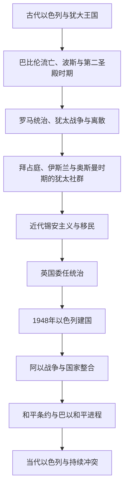

# 以色列

## 概括

现代以色列国成立于1948年，其历史背景同时涉及古代以色列与犹大王国、犹太教和犹太离散社群、近代锡安主义、奥斯曼末期移民、英国委任统治、欧洲反犹迫害与大屠杀，以及巴勒斯坦阿拉伯社会和阿以冲突。古代王国、宗教传统与现代民族国家彼此相关，但不能写成没有断裂的单一国家延续。

1948年建国和战争使犹太人获得主权国家，也造成巴勒斯坦人大规模逃离、被驱逐和财产丧失，巴勒斯坦社会称之为“纳克巴”。此后以色列接纳来自欧洲、中东、北非和其他地区的大量犹太移民，形成多元社会；同时，1967年以来的占领、定居点、耶路撒冷地位、巴勒斯坦建国和安全问题持续构成地区冲突核心。

## 演变图

## 历史主线

以色列史需要并读三条主线：犹太历史记忆和宗教文化的长期延续；19—20世纪民族主义、移民与国家建设；巴勒斯坦阿拉伯人的本地社会、流离失所和民族权利。现代阶段还应观察议会政治、移民社会、宗教与世俗关系、阿拉伯公民地位、经济科技发展以及占领和安全制度。

## 时期导航

| 顺序 | 阶段 | 时间 | 简要概括 |
|---:|---|---|---|
| 1 | [古代以色列、犹大与犹太历史传统](/%E4%BA%BA%E6%96%87%E7%A7%91%E5%AD%A6/%E5%8E%86%E5%8F%B2/%E8%A5%BF%E4%BA%9A/%E9%BB%8E%E5%87%A1%E7%89%B9/%E4%BB%A5%E8%89%B2%E5%88%97/%E5%8F%A4%E4%BB%A3%E4%BB%A5%E8%89%B2%E5%88%97%E3%80%81%E7%8A%B9%E5%A4%A7%E4%B8%8E%E7%8A%B9%E5%A4%AA%E5%8E%86%E5%8F%B2%E4%BC%A0%E7%BB%9F.md) | 约前12世纪—1517年 | 古代王国、第二圣殿、罗马统治、离散及中世纪犹太社群构成历史文化前史。 |
| 2 | [锡安主义、英国委任统治与建国](/%E4%BA%BA%E6%96%87%E7%A7%91%E5%AD%A6/%E5%8E%86%E5%8F%B2/%E8%A5%BF%E4%BA%9A/%E9%BB%8E%E5%87%A1%E7%89%B9/%E4%BB%A5%E8%89%B2%E5%88%97/%E9%94%A1%E5%AE%89%E4%B8%BB%E4%B9%89%E3%80%81%E8%8B%B1%E5%9B%BD%E5%A7%94%E4%BB%BB%E7%BB%9F%E6%B2%BB%E4%B8%8E%E5%BB%BA%E5%9B%BD.md) | 1517—1949年 | 奥斯曼社会、近代锡安主义、英国委任统治、分治方案、1948年建国和战争。 |
| 3 | [以色列国家、战争与社会变迁](/%E4%BA%BA%E6%96%87%E7%A7%91%E5%AD%A6/%E5%8E%86%E5%8F%B2/%E8%A5%BF%E4%BA%9A/%E9%BB%8E%E5%87%A1%E7%89%B9/%E4%BB%A5%E8%89%B2%E5%88%97/%E4%BB%A5%E8%89%B2%E5%88%97%E5%9B%BD%E5%AE%B6%E3%80%81%E6%88%98%E4%BA%89%E4%B8%8E%E7%A4%BE%E4%BC%9A%E5%8F%98%E8%BF%81.md) | 1949年至今 | 国家制度、移民整合、阿以战争、和平条约、占领和持续的巴以冲突。 |

## 重要转折与时间节点

| 时间 | 事件 | 意义 |
|---|---|---|
| 约前10世纪 | 以色列和犹大王国传统形成 | 成为后世犹太政治记忆与宗教叙事的重要来源。 |
| 前586年 | 新巴比伦攻陷耶路撒冷 | 犹大王国灭亡，精英被掳，流亡记忆影响犹太传统。 |
| 70年 | 罗马摧毁第二圣殿 | 犹太宗教与社群组织在失去圣殿后继续重构。 |
| 1897年 | 第一届锡安主义者大会 | 政治锡安主义运动获得跨国组织形式。 |
| 1917年 | 《贝尔福宣言》 | 英国支持在巴勒斯坦建立“犹太民族家园”，同时留下当地非犹太社群权利问题。 |
| 1947年 | 联合国大会通过第181号决议 | 建议终止委任统治并建立阿拉伯国、犹太国及国际化耶路撒冷。 |
| 1948年 | 以色列宣布独立并爆发战争 | 现代国家成立，同时发生大规模巴勒斯坦人流离失所。 |
| 1967年 | 六日战争 | 以色列占领西岸、东耶路撒冷、加沙、戈兰高地和西奈半岛。 |
| 1979年 | 与埃及签署和平条约 | 以色列首次同阿拉伯邻国正式和平。 |
| 1993年 | 以色列与巴解组织签署《奥斯陆协议》 | 双方相互承认并建立有限巴勒斯坦自治安排。 |
| 2023年10月 | 哈马斯等武装组织袭击以色列，以色列随后在加沙发动大规模军事行动 | 冲突造成严重伤亡、人质问题和人道危机，并扩大地区紧张。 |

## 关键辨析

- 古代以色列王国不是现代以色列国的同一政体。
- “以色列人”“犹太人”“以色列公民”分别可能指古代群体、民族宗教共同体和现代国籍，不能混用。
- 以色列公民包括犹太人、巴勒斯坦阿拉伯人、德鲁兹人及其他社群。
- 以色列的国家边界、耶路撒冷地位以及其对1967年占领领土的控制涉及国际争议，应在具体语境中说明。
- 巴勒斯坦人的历史不应只作为以色列国家史的附属，独立主线见[巴勒斯坦](/%E4%BA%BA%E6%96%87%E7%A7%91%E5%AD%A6/%E5%8E%86%E5%8F%B2/%E8%A5%BF%E4%BA%9A/%E9%BB%8E%E5%87%A1%E7%89%B9/%E5%B7%B4%E5%8B%92%E6%96%AF%E5%9D%A6/README.md)。

## 区域关系

- 直接上级：[黎凡特](/%E4%BA%BA%E6%96%87%E7%A7%91%E5%AD%A6/%E5%8E%86%E5%8F%B2/%E8%A5%BF%E4%BA%9A/%E9%BB%8E%E5%87%A1%E7%89%B9/README.md)；宏观区域：[西亚](/%E4%BA%BA%E6%96%87%E7%A7%91%E5%AD%A6/%E5%8E%86%E5%8F%B2/%E8%A5%BF%E4%BA%9A/README.md)。
- 古代和跨国背景见[黎凡特](/%E4%BA%BA%E6%96%87%E7%A7%91%E5%AD%A6/%E5%8E%86%E5%8F%B2/%E8%A5%BF%E4%BA%9A/%E9%BB%8E%E5%87%A1%E7%89%B9/README.md)。
- 共享现代冲突综述见[现代以色列与巴勒斯坦](/%E4%BA%BA%E6%96%87%E7%A7%91%E5%AD%A6/%E5%8E%86%E5%8F%B2/%E8%A5%BF%E4%BA%9A/%E9%BB%8E%E5%87%A1%E7%89%B9/%E7%8E%B0%E4%BB%A3%E4%BB%A5%E8%89%B2%E5%88%97%E4%B8%8E%E5%B7%B4%E5%8B%92%E6%96%AF%E5%9D%A6.md)。

## 目录层级

- 直接上级：[黎凡特](/%E4%BA%BA%E6%96%87%E7%A7%91%E5%AD%A6/%E5%8E%86%E5%8F%B2/%E8%A5%BF%E4%BA%9A/%E9%BB%8E%E5%87%A1%E7%89%B9/README.md)
- 宏观区域：[西亚](/%E4%BA%BA%E6%96%87%E7%A7%91%E5%AD%A6/%E5%8E%86%E5%8F%B2/%E8%A5%BF%E4%BA%9A/README.md)
- 历史总览：[历史](/%E4%BA%BA%E6%96%87%E7%A7%91%E5%AD%A6/%E5%8E%86%E5%8F%B2/README.md)
