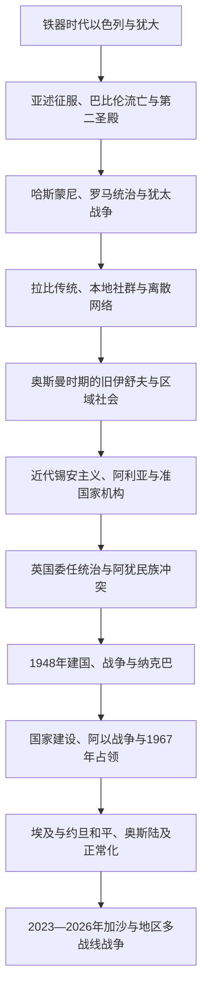

# 以色列

## 概括

现代以色列国于1948年成立。理解其“前世今生”需要分开三种连续性：古代以色列、犹大与犹太宗教文化提供历史记忆；离散和本地犹太社群维持跨地区身份；19—20世纪锡安主义则把这种记忆转化为现代民族运动、移民体系和国家建设。三者彼此相关，但不存在从古代王国直接延续到现代共和国的同一政体。

现代主线还必须并读巴勒斯坦阿拉伯社会。英国委任统治下，两种民族运动争夺同一地区的自决权；1948年建国使犹太人获得主权国家，同时造成巴勒斯坦人大规模逃离、被驱逐和财产损失，即“纳克巴”。1967年以来的占领、定居点、耶路撒冷、边界、安全与巴勒斯坦国家问题仍未解决。

截至2026年7月13日，以色列是由本雅明·内塔尼亚胡领导第37届政府的议会制共和国。2025年10月加沙停火和2026年1月全部人质返回没有完成战后政治安排；2026年的伊朗、黎巴嫩战事说明冲突已具有地区多战线性质。

## 演变图

## 历史主线

- **古代与中世纪**：王国、流亡、第二圣殿、罗马战争、拉比犹太教和离散共同体构成文化前史；跨国帝国本身在黎凡特区域节点维护。
- **近代建国**：奥斯曼改革、欧洲反犹主义、犹太移民、锡安主义组织和英国委任统治共同形成建国条件；巴勒斯坦阿拉伯民族运动和殖民统治矛盾同步发展。
- **现代国家**：议会政治、移民整合、经济与社会转型，同战争、占领、和平进程和地区外交不可分割。
- **当代冲突**：2023年10月7日袭击后，战争扩展至加沙、黎巴嫩、伊朗、红海和叙利亚；停火、人质返回与最终和平是不同层次，不能混写。

## 时期导航

| 顺序 | 阶段 | 时间 | 简要概括 |
|---:|---|---|---|
| 1 | [古代以色列、犹大与犹太历史传统](/%E4%BA%BA%E6%96%87%E7%A7%91%E5%AD%A6/%E5%8E%86%E5%8F%B2/%E8%A5%BF%E4%BA%9A/%E9%BB%8E%E5%87%A1%E7%89%B9/%E4%BB%A5%E8%89%B2%E5%88%97/%E5%8F%A4%E4%BB%A3%E4%BB%A5%E8%89%B2%E5%88%97%E3%80%81%E7%8A%B9%E5%A4%A7%E4%B8%8E%E7%8A%B9%E5%A4%AA%E5%8E%86%E5%8F%B2%E4%BC%A0%E7%BB%9F.md) | 约前12世纪—1517年 | 古代王国、第二圣殿、罗马战争、拉比传统和中世纪社群；明确史料争议与国家断裂。 |
| 2 | [锡安主义、英国委任统治与建国](/%E4%BA%BA%E6%96%87%E7%A7%91%E5%AD%A6/%E5%8E%86%E5%8F%B2/%E8%A5%BF%E4%BA%9A/%E9%BB%8E%E5%87%A1%E7%89%B9/%E4%BB%A5%E8%89%B2%E5%88%97/%E9%94%A1%E5%AE%89%E4%B8%BB%E4%B9%89%E3%80%81%E8%8B%B1%E5%9B%BD%E5%A7%94%E4%BB%BB%E7%BB%9F%E6%B2%BB%E4%B8%8E%E5%BB%BA%E5%9B%BD.md) | 1517—1949年 | 奥斯曼社会、锡安主义路线、委任统治双重结构、1947—1949年战争和难民形成。 |
| 3 | [以色列国家、战争与社会变迁](/%E4%BA%BA%E6%96%87%E7%A7%91%E5%AD%A6/%E5%8E%86%E5%8F%B2/%E8%A5%BF%E4%BA%9A/%E9%BB%8E%E5%87%A1%E7%89%B9/%E4%BB%A5%E8%89%B2%E5%88%97/%E4%BB%A5%E8%89%B2%E5%88%97%E5%9B%BD%E5%AE%B6%E3%80%81%E6%88%98%E4%BA%89%E4%B8%8E%E7%A4%BE%E4%BC%9A%E5%8F%98%E8%BF%81.md) | 1949年至今 | 国家制度、政党轮替、移民社会、历次战争、占领与和平进程，并核验至2026年7月。 |
| 4 | [以色列总统与总理世系表](/%E4%BA%BA%E6%96%87%E7%A7%91%E5%AD%A6/%E5%8E%86%E5%8F%B2/%E8%A5%BF%E4%BA%9A/%E9%BB%8E%E5%87%A1%E7%89%B9/%E4%BB%A5%E8%89%B2%E5%88%97/%E4%BB%A5%E8%89%B2%E5%88%97%E6%80%BB%E7%BB%9F%E4%B8%8E%E6%80%BB%E7%90%86%E4%B8%96%E7%B3%BB%E8%A1%A8.md) | 1948年至今 | 完整列出11位正式总统、14位曾正式担任总理者，以及代理、复任、看守和轮换安排。 |

## 重要转折与时间节点

| 时间 | 事件 | 意义 |
|---|---|---|
| 约前1208年 | 埃及碑铭提到“以色列” | 较早外部证据，所指为人群而非现代国家。 |
| 前722年前后 | 亚述灭亡北方以色列王国 | 北方政权终结并被帝国重组。 |
| 前586年 | 新巴比伦摧毁耶路撒冷和第一圣殿 | 犹大王国灭亡，流亡与经典重构成为核心记忆。 |
| 70年 | 罗马摧毁第二圣殿 | 犹太共同体逐步转向拉比、会堂和跨地区网络。 |
| 1897年 | 第一届锡安主义者大会 | 政治锡安主义取得跨国组织和纲领。 |
| 1917年 | 《贝尔福宣言》 | 英国支持“犹太民族家园”，未解决当地阿拉伯多数的集体政治权利。 |
| 1936—1939年 | 巴勒斯坦阿拉伯人大起义 | 英国镇压削弱阿拉伯组织，社群冲突进一步军事化。 |
| 1947年 | 联合国大会第181号决议 | 建议分治和耶路撒冷国际化，但未获双方接受与共同执行。 |
| 1948—1949年 | 建国和第一次阿以战争 | 以色列存续并扩大控制；巴勒斯坦阿拉伯国未建立，约70万人流离失所。 |
| 1967年 | 六日战争 | 以色列占领西岸、东耶路撒冷、加沙、戈兰和西奈，开启长期占领体系。 |
| 1979年 | 埃以和平条约 | 以撤出西奈换取首个阿拉伯邻国正式和平。 |
| 1993—1994年 | 奥斯陆协议与约以和平 | 相互承认、有限自治和地区和平取得突破，最终地位仍悬而未决。 |
| 2005年 | 撤出加沙定居点与常驻军队 | 结束境内定居，但封锁、控制和占领法律争议继续。 |
| 2020年 | 《亚伯拉罕协议》 | 同部分阿拉伯国家正常化，未解决巴勒斯坦问题。 |
| 2023年10月7日 | 哈马斯主导袭击与加沙战争开始 | 国家安全体系遭重大失败，冲突迅速地区化。 |
| 2025年10月—2026年1月 | 加沙停火及全部人质返回 | 人质危机结束，撤军、治理、解除武装和重建仍未完成。 |
| 2026年2—7月 | 对伊战争与黎巴嫩战事复燃 | 截止日期上以色列仍处多战线战争和脆弱停火并存状态。 |

## 关键辨析

- 古代以色列王国、犹大王国和现代以色列国不是同一政体。
- “以色列人”“犹太人”“以色列公民”分别可能指古代群体、民族宗教共同体和现代国籍；以色列公民还包括巴勒斯坦阿拉伯人、德鲁兹人及其他社群。
- “1949年绿线”原是停战线；东耶路撒冷、西岸、加沙和戈兰的主权、占领与控制状态应分别说明。
- 以色列2005年撤出加沙不等于法律争议消失；2023年后境内长期军事部署又改变实际控制。
- “停火”只表示降低或暂停部分战斗，不等于和平条约、完全撤军、解除武装或最终地位协议。
- 巴勒斯坦历史有独立主体性，见[巴勒斯坦](/%E4%BA%BA%E6%96%87%E7%A7%91%E5%AD%A6/%E5%8E%86%E5%8F%B2/%E8%A5%BF%E4%BA%9A/%E9%BB%8E%E5%87%A1%E7%89%B9/%E5%B7%B4%E5%8B%92%E6%96%AF%E5%9D%A6/README.md)。

## 区域关系

- 直接上级：[黎凡特](/%E4%BA%BA%E6%96%87%E7%A7%91%E5%AD%A6/%E5%8E%86%E5%8F%B2/%E8%A5%BF%E4%BA%9A/%E9%BB%8E%E5%87%A1%E7%89%B9/README.md)。
- 宏观区域：[西亚](/%E4%BA%BA%E6%96%87%E7%A7%91%E5%AD%A6/%E5%8E%86%E5%8F%B2/%E8%A5%BF%E4%BA%9A/README.md)。
- 跨地区冲突综述：[现代以色列与巴勒斯坦](/%E4%BA%BA%E6%96%87%E7%A7%91%E5%AD%A6/%E5%8E%86%E5%8F%B2/%E8%A5%BF%E4%BA%9A/%E9%BB%8E%E5%87%A1%E7%89%B9/%E7%8E%B0%E4%BB%A3%E4%BB%A5%E8%89%B2%E5%88%97%E4%B8%8E%E5%B7%B4%E5%8B%92%E6%96%AF%E5%9D%A6.md)。
- 历史总览：[历史](/%E4%BA%BA%E6%96%87%E7%A7%91%E5%AD%A6/%E5%8E%86%E5%8F%B2/README.md)。
