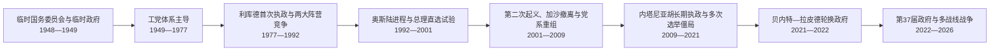

# 以色列总统与总理世系表

## 时间

1948年至今（当代信息核验截至2026年7月13日）

## 概括

以色列是议会制共和国。总统是由克奈塞特选出的国家元首，主要承担礼仪、国家象征、任命组阁人选和赦免等职能；总理是政府首脑，必须维持内阁和克奈塞特多数支持，掌握日常行政与国家安全决策的核心协调权。总统和总理不是上下级关系，二者的政治实权也不对称。

下表按实际在位次序列出全部正式总统和正式总理。复任者分行列出；因死亡、遇刺、失能或辞职形成的代理、临时过渡另表说明。总理短期出访时由代总理代行日常职责的常规安排不逐次列入，只有实际接管国家行政首脑职务的时期才列入世系。

## 领导更替与政治阶段

## 正式总统完整表

| 顺序 | 姓名 | 在位时间 | 政治背景 | 与前任关系 | 关键事件与说明 |
|---:|---|---|---|---|---|
| 1 | **哈伊姆·魏茨曼** | 1949年2月17日—1952年11月9日 | 犹太复国主义运动与魏茨曼派 | 首任；此前任临时国家委员会主席 | 建国初期承担国际代表和国家象征职能，任内去世。 |
| 2 | **伊扎克·本-兹维** | 1952年12月10日—1963年4月23日 | 马派、劳工锡安主义 | 魏茨曼去世后经选举继任 | 连任三届，重视以色列境内不同犹太社群和东方犹太传统，任内去世。 |
| 3 | 扎勒曼·夏扎尔 | 1963年5月21日—1973年5月24日 | 马派、工党体系 | 本-兹维去世后的正式继任者 | 任内经历六日战争、消耗战及移民社会继续整合。 |
| 4 | 埃弗拉伊姆·卡齐尔 | 1973年5月24日—1978年5月29日 | 科学家，无日常党务角色 | 夏扎尔任期届满后继任 | 任内经历赎罪日战争、战后调查和1977年政党轮替。 |
| 5 | 伊扎克·纳冯 | 1978年5月29日—1983年5月5日 | 工党体系 | 卡齐尔任期届满后继任 | 首位塞法迪背景总统，任内发生埃以和平、黎巴嫩战争和国内族群政治讨论。 |
| 6 | 哈伊姆·赫尔佐格 | 1983年5月5日—1993年5月13日 | 工党体系，曾任军人与外交官 | 纳冯任期届满后继任 | 任内跨越联合政府、第一次巴勒斯坦大起义及冷战结束。 |
| 7 | 埃泽尔·魏茨曼 | 1993年5月13日—2000年7月13日 | 工党阵营，曾任空军司令和国防部长 | 赫尔佐格任期届满后继任 | 支持和平进程；因未申报资金等争议提前辞职。 |
| 8 | 摩西·卡察夫 | 2000年8月1日—2007年7月1日 | 利库德 | 魏茨曼辞职后经竞争性选举继任 | 2007年1月因刑事调查请假，后辞职；其刑事责任由法院另行处理。 |
| 9 | 西蒙·佩雷斯 | 2007年7月15日—2014年7月24日 | 工党、前进党；曾两任总理 | 卡察夫辞职后继任 | 以资深政治家和和平进程象征身份履职，完成七年单一任期。 |
| 10 | 鲁文·里夫林 | 2014年7月24日—2021年7月7日 | 利库德 | 佩雷斯任期届满后继任 | 任内多次指定组阁人选，面对2019—2021年连续选举和社会撕裂。 |
| 11 | **伊萨克·赫尔佐格** | 2021年7月7日至今 | 工党、曾任反对党领袖 | 里夫林任期届满后继任 | 截至2026年7月13日仍任总统；在司法改革争议、战争与人质问题中主要承担调停和国家代表职能，任期预计至2028年。 |

## 总统代理与过渡安排

| 顺序 | 代理人 | 代理时间 | 原职 | 触发原因与地位 |
|---:|---|---|---|---|
| 1 | 约瑟夫·施普林扎克 | 1952年11月9日—12月10日 | 克奈塞特议长 | 魏茨曼任内去世后，依职权代理至本-兹维就任。 |
| 2 | 卡迪什·卢兹 | 1963年4月23日—5月21日 | 克奈塞特议长 | 本-兹维任内去世后代理至夏扎尔就任。 |
| 3 | 阿夫拉罕·伯格 | 2000年7月13日—8月1日 | 克奈塞特议长 | 埃泽尔·魏茨曼辞职后代理至卡察夫就任。 |
| 4 | 达莉娅·伊茨克 | 2007年1月25日—7月15日 | 克奈塞特议长 | 卡察夫请假期间为代总统；卡察夫7月1日辞职后转为临时总统，直至佩雷斯就任。 |
| 5 | 马贾利·瓦哈比 | 2007年2月短期 | 克奈塞特副议长、代议长 | 伊茨克出访期间暂代总统职能，是首位短期履行该职能的德鲁兹人与非犹太人；其任期嵌套于伊茨克代理期。 |

说明：总统出国或短期不能履职时，克奈塞特议长可能依法代行职能；这类日常短暂替代很多，不构成总统世系中的独立正式任期。

## 总理完整表

以色列共有14位曾正式担任总理者。下表的“任期序次”按连续执政段落编号，因此复任者会重复出现；代理行不计入正式任期序次。

| 任期序次 | 姓名 | 任职时间 | 主要政党或联盟 | 取得或离任方式 | 关键事件与说明 |
|---:|---|---|---|---|---|
| 1 | **戴维·本-古里安** | 1948年5月14日—1954年1月26日 | 马派 | 临时政府首脑，后获议会支持 | 领导建国、1948年战争、军队整合、国家机构和大规模移民吸收。 |
| 2 | 摩西·夏里特 | 1954年1月26日—1955年11月3日 | 马派 | 本-古里安退居后接任 | 强调外交协调，在边境报复行动和安全路线争论中受制于本-古里安阵营。 |
| 3 | **戴维·本-古里安** | 1955年11月3日—1963年6月26日 | 马派 | 复出组阁 | 领导1956年苏伊士战争，推动核与国防体系建设，后因“拉冯事件”等争议辞职。 |
| 4 | 列维·艾希科尔 | 1963年6月26日—1969年2月26日 | 马派、工党联盟 | 同党继任 | 任内建立民族团结政府并经历1967年战争；任内去世。 |
| 代理 | 伊加尔·阿隆 | 1969年2月26日—3月17日 | 工党联盟 | 艾希科尔去世后代理 | 仅在新总理产生前主持政府，不计入正式总理编号。 |
| 5 | 果尔达·梅厄 | 1969年3月17日—1974年6月3日 | 工党联盟 | 执政党推举并组阁 | 经历消耗战和1973年赎罪日战争；战前判断与战后问责削弱政府，随后辞职。 |
| 6 | **伊扎克·拉宾** | 1974年6月3日—1977年6月20日 | 工党联盟 | 战后党内交替 | 签订西奈临时协议、实施恩德培行动；因外汇账户争议辞任党首，工党随后败选。 |
| 7 | **梅纳赫姆·贝京** | 1977年6月20日—1983年10月10日 | 利库德 | 1977年政党轮替 | 与埃及签署和平条约并撤出西奈，同时扩大定居政策、发动1982年黎巴嫩战争；后辞职。 |
| 8 | **伊扎克·沙米尔** | 1983年10月10日—1984年9月13日 | 利库德 | 贝京辞职后继任 | 处理黎巴嫩战场和经济危机，1984年选举后与工党组成轮换政府。 |
| 9 | **西蒙·佩雷斯** | 1984年9月13日—1986年10月20日 | 工党联盟 | 全国团结政府首段轮换 | 推动1985年经济稳定计划和从黎巴嫩大部撤军，按协议移交总理职位。 |
| 10 | **伊扎克·沙米尔** | 1986年10月20日—1992年7月13日 | 利库德 | 轮换接任，后再次组阁 | 经历第一次大起义、海湾战争和马德里和会；1992年败选。 |
| 11 | **伊扎克·拉宾** | 1992年7月13日—1995年11月4日 | 工党 | 复任组阁 | 推动《奥斯陆协议》和约以和平条约；1995年遇刺身亡。 |
| 12 | **西蒙·佩雷斯** | 1995年11月4日—1996年6月18日 | 工党 | 遇刺后先代理，11月22日起正式主持新政府 | 继续和平进程，在暴力袭击和黎巴嫩冲突背景下于首次总理直选中败选。 |
| 13 | **本雅明·内塔尼亚胡** | 1996年6月18日—1999年7月6日 | 利库德 | 首次总理直选获胜 | 在联盟压力下推进希伯伦与怀伊安排，同时放缓奥斯陆进程；1999年败选。 |
| 14 | 埃胡德·巴拉克 | 1999年7月6日—2001年3月7日 | “一个以色列”联盟、工党 | 总理直选获胜 | 从黎巴嫩南部撤军，参加戴维营与塔巴谈判；第二次起义中在特别选举败北。 |
| 15 | 阿里埃勒·沙龙 | 2001年3月7日—2006年4月14日 | 利库德、后创建前进党 | 2001年总理特别选举获胜，后组阁 | 应对第二次起义、建设隔离墙并于2005年单方面撤出加沙；2006年1月重病失能。 |
| 代理 | 埃胡德·奥尔默特 | 2006年1月4日—4月14日 | 前进党 | 沙龙暂时失能后代理 | 依法代理100天；4月14日沙龙被认定永久失能后转为临时总理。 |
| 16 | 埃胡德·奥尔默特 | 2006年4月14日—2009年3月31日 | 前进党 | 先任临时总理，5月4日所组政府获信任后成为正式总理 | 经历2006年黎巴嫩战争、加沙冲突和安纳波利斯谈判；因腐败调查辞去党首并留任看守至新政府成立。 |
| 17 | **本雅明·内塔尼亚胡** | 2009年3月31日—2021年6月13日 | 利库德 | 复任并连续领导多届联盟 | 经历多轮加沙冲突、2011年社会抗议、2018年民族国家基本法、《亚伯拉罕协议》及2019—2021年选举僵局；因反对阵营组阁而离任。 |
| 18 | 纳夫塔利·贝内特 | 2021年6月13日—2022年7月1日 | 右倾、拥有未来等八党联盟 | 轮换协议首段 | 领导从右派到阿拉伯联合名单的异质联盟；失去多数后推动解散议会。 |
| 19 | 亚伊尔·拉皮德 | 2022年7月1日—12月29日 | 拥有未来 | 依轮换协议在议会解散后接任 | 作为正式总理兼看守政府首脑，完成黎以海上边界协议；2022年选举后离任。 |
| 20 | **本雅明·内塔尼亚胡** | 2022年12月29日至今 | 利库德与右翼、宗教政党联盟 | 第三段执政，组建第37届政府 | 任内发生司法改革危机、2023年10月7日袭击及加沙、黎巴嫩和伊朗多战线战争。截至2026年7月13日仍为总理；下一次克奈塞特选举已安排于2026年10月27日，尚未举行。 |

## 代理、看守与轮换的区别

- **代理总理**：总理暂时不能履职时，由依法指定者短期接管；伊加尔·阿隆和2006年1—4月的奥尔默特属于实际接管国家行政首脑的案例。
- **临时总理**：总理永久失能或死亡后，在新政府产生前继续主持政府。奥尔默特于2006年4月14日后先以此身份任职。
- **看守政府首脑**：政府辞职、议会解散或选举后仍继续执行职务，直至新政府宣誓。其法律权限并非完全消失，但重大任命与长期政策通常受到更严格审慎要求。
- **轮换总理**：1984—1988年的佩雷斯—沙米尔轮换依政治协议完成；2021—2022年的贝内特—拉皮德轮换被写入基本法框架，拉皮德在议会解散触发条款后成为正式总理。
- 1996、1999和2001年曾由选民直接选举总理；制度后来取消，行政首脑重新完全取决于克奈塞特选举后的组阁与信任关系。

## 截至2026年7月13日的实际权力结构

| 角色或机构 | 现任或构成 | 实际作用 |
|---|---|---|
| 总统 | 伊萨克·赫尔佐格 | 国家元首；在组阁、赦免、外交礼仪和社会调停中有制度性作用，但不指挥政府或军队。 |
| 总理 | 本雅明·内塔尼亚胡 | 第37届政府首脑，主持政府和国家安全决策协调，是行政与战争政策的核心政治人物。 |
| 克奈塞特 | 第25届，120席 | 决定政府能否维持多数、通过预算和基本法，并通过委员会监督行政部门。 |
| 国家安全内阁 | 总理主持，法定部长及获任命成员组成 | 在战争目标、重大军事行动、谈判与停火问题上承担集体内阁责任；不能简单等同于总理个人命令。 |
| 国防与安全机构 | 国防部长、以色列国防军、辛贝特、摩萨德及国家安全委员会 | 提供军事行动、情报、国内安全和战略评估；文官政府作出政策决定，军队负责执行。 |
| 司法与法律体系 | 最高法院、总检察长、国家审计等 | 审查行政合法性、处理基本法和政府行为争议；其权限范围是2023年以来国内政治冲突的核心。 |

## 演变关系

- 国家制度、战争和政治阶段见[以色列国家、战争与社会变迁](/%E4%BA%BA%E6%96%87%E7%A7%91%E5%AD%A6/%E5%8E%86%E5%8F%B2/%E8%A5%BF%E4%BA%9A/%E9%BB%8E%E5%87%A1%E7%89%B9/%E4%BB%A5%E8%89%B2%E5%88%97/%E4%BB%A5%E8%89%B2%E5%88%97%E5%9B%BD%E5%AE%B6%E3%80%81%E6%88%98%E4%BA%89%E4%B8%8E%E7%A4%BE%E4%BC%9A%E5%8F%98%E8%BF%81.md)。
- 临时政府的形成见[锡安主义、英国委任统治与建国](/%E4%BA%BA%E6%96%87%E7%A7%91%E5%AD%A6/%E5%8E%86%E5%8F%B2/%E8%A5%BF%E4%BA%9A/%E9%BB%8E%E5%87%A1%E7%89%B9/%E4%BB%A5%E8%89%B2%E5%88%97/%E9%94%A1%E5%AE%89%E4%B8%BB%E4%B9%89%E3%80%81%E8%8B%B1%E5%9B%BD%E5%A7%94%E4%BB%BB%E7%BB%9F%E6%B2%BB%E4%B8%8E%E5%BB%BA%E5%9B%BD.md)。
- 上级入口：[以色列](/%E4%BA%BA%E6%96%87%E7%A7%91%E5%AD%A6/%E5%8E%86%E5%8F%B2/%E8%A5%BF%E4%BA%9A/%E9%BB%8E%E5%87%A1%E7%89%B9/%E4%BB%A5%E8%89%B2%E5%88%97/README.md)。
