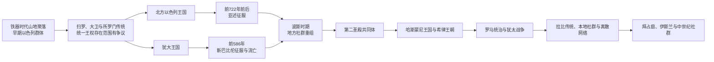

# 古代以色列、犹大与犹太历史传统

## 时间

约前12世纪—1517年

## 概括

古代以色列与犹大是铁器时代南黎凡特形成的相关政治共同体。它们的历史不能只按《希伯来圣经》叙事复述，也不能只用现代民族国家概念解释；较可靠的重建需要并读考古层位、聚落变化、埃及和两河铭文、本地碑铭、钱币及后世整理的宗教文献。

北方以色列王国在前9—前8世纪是区域性国家，前722年前后被新亚述征服；南方犹大王国以耶路撒冷为中心，前586年被新巴比伦终结。巴比伦流亡、波斯时期的返回和第二圣殿制度改变了“犹大人”与犹太共同体的组织方式。希腊化时期马加比起义建立哈斯蒙尼国家，罗马随后介入并最终直接统治。70年第二圣殿毁灭和132—135年巴尔·科赫巴起义失败没有使当地犹太人口立即消失，却促使犹太教进一步转向经典、拉比、会堂和跨地区社群网络。

拜占庭、早期伊斯兰、十字军、阿尤布与马穆鲁克时期，巴勒斯坦地区的犹太社群规模、分布和法律地位不断变化，并同巴比伦、埃及、北非、伊比利亚和欧洲离散社群保持联系。宗教记忆、礼仪方向、希伯来文经典和部分人口延续是真实的；古代王国到1948年现代以色列国之间却不存在连续国家机构、主权或完整人口链条。

## 史料与年代辨析

| 史料 | 能说明什么 | 使用限制 |
|---|---|---|
| 埃及、亚述、巴比伦铭文 | 战争、贡赋、王名、征服和帝国行政 | 由胜利者书写，重在王权宣传，常省略失败和地方视角。 |
| 本地碑铭与印章 | 王朝名称、官员、语言、书写和宗教实践 | 数量有限，发现地点和断代可能有争议。 |
| 聚落与物质文化 | 山地村落增长、城市破坏、贸易和人口结构变化 | 物质文化不能自动等同民族身份，同一器物可能由不同群体使用。 |
| 《希伯来圣经》 | 保存王权、战争、宗教改革、流亡和共同体记忆 | 文本多经后世编纂，具有神学和政治目的；事件年代与规模需外证。 |
| 希腊罗马作者及犹太文献 | 第二圣殿、哈斯蒙尼、希律、罗马战争和社群制度 | 作者立场、写作年代和文学体裁不同，不能都当作同时代档案。 |
| 拉比、基督教和伊斯兰文献 | 圣殿毁灭后的社群、法律、城市与宗教互动 | 常反映规范理想或后世记忆，未必等同全部人口的日常生活。 |

前1208年前后的梅尔奈普塔赫石碑提到“以色列”，其表述更像人群而非成熟国家，是目前较早的外部证据。前10世纪是否存在由扫罗、大卫和所罗门统治的大型“统一王国”，以及其领土和行政能力有多大，仍有争议。特尔丹碑等材料支持前9世纪邻国已把犹大王室称作“大卫家”，但不能单独证明后世叙事中的全部疆域、建筑和人物活动。

## 王朝世系 / 统治结构

| 阶段 | 时间 | 政治与社群结构 | 主要变化 |
|---|---|---|---|
| 山地聚落与早期以色列人形成 | 约前12—前11世纪 | 村落、亲族、部落联盟和地方首领 | 青铜时代城邦体系崩溃后，中央山地聚落增加；“以色列”身份逐步形成。 |
| 早期王权传统 | 约前11—前10世纪 | 扫罗、大卫、所罗门的王权传统 | 军事首领、宫廷和耶路撒冷中心化出现，统一程度与疆域存在争议。 |
| 北方以色列王国 | 约前10世纪—前722年 | 撒马利亚王廷、军队、地方官与多个圣所 | 暗利王朝时期国家能力增强，后受亚述贡赋和干预，最终灭亡。 |
| 南方犹大王国 | 约前10世纪—前586年 | 大卫王朝、耶路撒冷圣殿、官僚和乡村网络 | 前8世纪后国家化加快，先受亚述控制，后被新巴比伦摧毁。 |
| 新巴比伦与波斯时期 | 前586—前332年 | 流亡社群、犹大行省、总督、祭司和文士 | 部分精英流亡巴比伦，部分人口留居；返回、圣殿重建和经典制度形成。 |
| 希腊化与哈斯蒙尼时期 | 前332—前63年 | 托勒密、塞琉古行政治理；后为祭司王朝 | 希腊化、宗教冲突和马加比起义后，犹太国家扩张并内部分裂。 |
| 罗马、希律与行省时期 | 前63年—4世纪 | 罗马附庸王、总督、圣殿精英、城市与拉比社群 | 两次大起义失败，圣殿制度终结，犹太共同体重心多元化。 |
| 拜占庭时期 | 4世纪—7世纪 | 基督教帝国、主教区、城市、犹太和撒马利亚少数社群 | 基督教圣地体系扩张，犹太社群主要分布在加利利等地。 |
| 伊斯兰与中世纪 | 7世纪—1517年 | 哈里发行省、地方会众、宗教法地位及跨地中海网络 | 统治王朝和城市中心多次改变，犹太人口在限制、迁徙与复兴之间波动。 |

以色列与犹大诸王的公认顺序、共治、废立和年代争议见[以色列与犹大君主世系表](/%E4%BA%BA%E6%96%87%E7%A7%91%E5%AD%A6/%E5%8E%86%E5%8F%B2/%E8%A5%BF%E4%BA%9A/%E9%BB%8E%E5%87%A1%E7%89%B9/%E4%BB%A5%E8%89%B2%E5%88%97%E4%B8%8E%E7%8A%B9%E5%A4%A7%E5%90%9B%E4%B8%BB%E4%B8%96%E7%B3%BB%E8%A1%A8.md)，逐王政治过程见[以色列王国与犹大王国](/%E4%BA%BA%E6%96%87%E7%A7%91%E5%AD%A6/%E5%8E%86%E5%8F%B2/%E8%A5%BF%E4%BA%9A/%E9%BB%8E%E5%87%A1%E7%89%B9/%E4%BB%A5%E8%89%B2%E5%88%97%E7%8E%8B%E5%9B%BD%E4%B8%8E%E7%8A%B9%E5%A4%A7%E7%8E%8B%E5%9B%BD.md)。本页只解释这些政权怎样进入犹太历史传统，不重复跨区域帝国的全部世系。

## 铁器时代国家的形成与灭亡

### 山地社会和早期王权

约前12世纪，南黎凡特中央山地出现大量小型聚落。其居民与迦南文化具有明显连续性，同时在饮食、村落组织和身份表达上逐渐形成区别。以色列人的形成更可能包含本地人口重组、边缘群体聚合和有限迁徙，而不是能够由单一征服事件完整解释。

非利士城邦、亚扪、摩押、以东和沿海城市等邻近力量促使山地群体建立更稳定军事领导。扫罗、大卫和所罗门的传统表达从部落联盟到王权的过程。耶路撒冷成为王朝和圣所中心，但前10世纪王国的财政、城市规模和远距离控制能力在考古学上仍有不同解释。

### 北方以色列王国

北方拥有更肥沃土地、人口和国际交通线，较早形成强国家。暗利建立撒马利亚，暗利王朝同腓尼基联姻、修建宫殿和参与区域联盟；亚述铭文中的“暗利家”甚至在王朝灭亡后仍被用作北方国名。亚哈参与前853年卡尔卡战役，显示其军力和外交地位。

耶户政变终结暗利王朝并向亚述纳贡。前8世纪耶罗波安二世时期一度扩张繁荣，但财富集中、宫廷斗争和亚述压力同步增加。提革拉特帕拉沙尔三世逐步吞并边区并干预废立；何细亚反叛后，撒马利亚被围，王国约前722年灭亡。亚述实施行省化、人口迁移和精英重组，但北方居民没有全部消失；后来的撒马利亚共同体同这一地区人口和耶和华崇拜传统有关，其与犹太社群的分化是长期过程。

### 犹大王国

犹大人口和国家能力在前8世纪明显增长，部分变化同北方难民南迁和亚述区域重组有关。希西家反抗西拿基立，前701年亚述摧毁拉吉等城，耶路撒冷得以保留但犹大继续臣服。约西亚时期利用亚述衰退推动中央化和宗教改革，其具体范围与《申命记》传统关系仍有争议。

新巴比伦击败埃及后控制黎凡特。前597年尼布甲尼撒二世攻占耶路撒冷，废黜约雅斤并迁走部分王室、工匠和精英；西底家再次反叛，前586年耶路撒冷、宫殿和第一圣殿被毁，大卫王朝的本地统治终结。人口损失、迁徙和经济崩溃严重，但乡村及北部地区仍有人口留居。

王国灭亡的结构因素包括小国夹在埃及与两河帝国之间、财政和兵力不足、地方精英与王室路线冲突；外部压力是亚述、新巴比伦的行省扩张；直接触发因素则是统治者在不利国际形势下反复反叛。宗教改革或个人品德并不能替代地缘政治解释。

## 流亡、返回与第二圣殿共同体

巴比伦征服把部分王室、祭司、工匠和官员迁往两河，形成有土地、家族和经济活动的流亡社群；并非所有犹大居民都被掳。流亡使失去王权和圣殿后的共同体重新解释盟约、律法、历史和身份，“巴比伦之囚”因此既是人口事件，也是经典传统重组过程。

前539年波斯居鲁士二世征服巴比伦。波斯允许多地被迁社群恢复圣所和地方生活，部分犹大人返回，部分继续留在巴比伦等地。耶路撒冷第二圣殿约前516年建成，犹大成为波斯帝国的“耶胡德”行省。总督、祭司、文士和地方长老共同治理，祭司谱系、安息日、割礼、婚姻边界和律法诵读在身份维持中更重要。

这一时期没有恢复独立的大卫王国。犹太共同体已同时存在于犹大、巴比伦、埃及等地，离散不是70年以后才突然发生。阿拉米语成为广泛日常和行政语言，希伯来语继续用于经典、礼仪和部分社会环境。

## 希腊化、哈斯蒙尼和希律时期

亚历山大东征后，犹太地区先后处于托勒密埃及和塞琉古王国控制。希腊语、城市制度、教育和商业进入社会，犹太人对希腊化的接受程度各异，并非“犹太传统”与“希腊文化”完全分开的两群人。

前2世纪，塞琉古王安条克四世的王位战争、财政征收、耶路撒冷精英内斗和宗教禁令共同触发马加比起义。犹大·马加比及其兄弟以游击和外交逐步恢复圣殿礼仪，并利用塞琉古内战扩大自治。哈斯蒙尼家族后来兼具大祭司和王权，扩张至撒马利亚、加利利、以土买和外约旦部分地区，也以战争、人口迁移和宗教整合重塑疆域。

王朝从反抗外来干预崛起，却因王位和大祭司权竞争、法利赛派与撒都该派等社会宗教分歧及兄弟内战削弱。前63年庞培借哈斯蒙尼继承战争进入耶路撒冷，犹太独立终结。罗马扶持希律，希律大王前37—前4年统治，修建港口、城市和宏大的第二圣殿建筑群，以罗马支持、婚姻清洗和强力财政维持附庸王权。

## 罗马统治、犹太战争与拉比传统

希律死后领地被分给子嗣，部分地区后来改为罗马直接统治。总督、地方王、公会、祭司贵族和城市自治交叠；税收、土地、罗马权威、圣殿政治和宗教末世期待造成紧张。早期基督教也从这一犹太和希腊罗马环境中产生，随后逐渐形成独立宗教共同体。

66年犹太大起义爆发，内部不同派别同时反罗马并彼此争斗。提图斯军队70年攻陷耶路撒冷并毁灭第二圣殿，马萨达抵抗约至73或74年。圣殿税、献祭和祭司中心不再可维持，拉比传统、会堂、家庭礼仪和律法学习的重要性上升，但这一转型经过数代发展，不能归结为单一“雅夫内会议”立即完成。

132—135年巴尔·科赫巴起义一度建立反罗马政权，后被哈德良镇压，犹太地区人口和村落遭到严重破坏，耶路撒冷重建为罗马殖民城，犹太人进入城内受到限制。罗马把行省重组为“叙利亚巴勒斯坦”，但这一名称和行政改革不意味着犹太人口完全离开。加利利、戈兰和沿海仍有重要社群，《米示拿》约在3世纪初编成，后续巴勒斯坦塔木德和巴比伦塔木德显示本地与两河中心并存。

## 拜占庭、伊斯兰与中世纪社群

### 拜占庭时期

罗马帝国基督教化以后，耶路撒冷成为朝圣和教会中心，教堂、修道院和主教区扩张。犹太人和撒马利亚人在税法、宗教建筑与公职方面受到不同时期限制，也曾参与起义。犹太社群主要分布在加利利、戈兰和若干城市；基督教人口和希腊语文化占据更突出地位。

614年萨珊波斯攻占耶路撒冷，部分犹太人协助波斯，随后拜占庭短暂收复并报复。长期拜占庭—波斯战争耗尽区域资源，为7世纪阿拉伯征服创造条件。

### 早期伊斯兰统治

638年前后，阿拉伯穆斯林军队取得耶路撒冷。倭马亚、阿拔斯和后续王朝把地区纳入沙姆行省体系，耶路撒冷又成为伊斯兰圣城。犹太人通常以受保护宗教社群身份生活，缴纳特别税并受若干身份限制；具体处境随统治者、城市和经济环境变化，既不能概括为永久宽容，也不能概括为持续迫害。

耶路撒冷、提比里亚、拉姆拉、加沙等地存在犹太会众。巴勒斯坦学院传统同巴比伦盖奥尼姆竞争并交流，希伯来语、阿拉米语和阿拉伯语共同使用。开罗藏经库等材料显示商人、学者、家庭和慈善网络跨越埃及、叙利亚、伊拉克和地中海。

### 十字军、阿尤布与马穆鲁克

1099年十字军攻占耶路撒冷时屠杀穆斯林和犹太居民，许多本地社群受毁；沿海和加利利仍有犹太人口，欧洲与东方移民后来又逐步进入。1187年萨拉丁夺回耶路撒冷后允许犹太人重新定居，阿尤布时期城市和朝圣网络恢复。

马穆鲁克在13世纪中叶控制地区，击退蒙古并逐步消灭十字军据点。1267年纳赫马尼德到达耶路撒冷并帮助重建会众；采法特等城市后来吸引学者和商人。税负、战争、瘟疫和经济边缘化限制人口规模。1492年西班牙驱逐犹太人后，部分塞法迪犹太人移入奥斯曼东地中海；1517年奥斯曼征服开启下一阶段。

## 连续性与断裂

| 层面 | 连续性 | 断裂 |
|---|---|---|
| 宗教与文化 | 耶路撒冷、锡安、圣殿记忆、希伯来经典、礼仪方向和节期长期存在 | 圣殿祭祀终结，宗教权威转向拉比、会堂和多中心解释传统。 |
| 人口 | 巴勒斯坦地区各时期都有犹太社群，并非70年后完全空白 | 战争、迁徙、改宗和经济变化使人口规模与分布巨大波动；多数犹太人长期生活在离散地区。 |
| 语言 | 希伯来语持续作为经典、礼仪和学术语言 | 日常语言先后包括阿拉米语、希腊语、阿拉伯语、意第绪语和拉迪诺语；现代口语希伯来语复兴属于近代工程。 |
| 政治 | 古代王国和哈斯蒙尼国家提供主权记忆与象征 | 前63年以后缺乏连续独立犹太国家；现代以色列的法律、机构和民族主义来自19—20世纪。 |
| 土地关系 | 朝圣、慈善和本地社群维持实际联系 | 古代归属不能自动决定近现代居民的个人财产权、政治权利和边界。 |

因此，“离散”不是一次把所有犹太人逐出巴勒斯坦的单一事件，而是亚述、巴比伦、希腊化、罗马和中世纪多轮迁徙累积的结果；“返回”也不是19世纪才第一次发生，而是长期存在的宗教迁居和社群重建。近代锡安主义把这些传统转化为群众民族运动和国家计划，这是历史创新，不是被中断两千年的政府简单复位。

## 重要事件

| 时间 | 事件 | 意义 |
|---|---|---|
| 约前1208年 | 梅尔奈普塔赫石碑提到“以色列” | 较早的外部文字证据，指向南黎凡特人群。 |
| 约前11—前10世纪 | 早期王权传统形成 | 扫罗、大卫、所罗门成为后世政治与宗教记忆核心，历史规模有争议。 |
| 前9世纪 | 暗利王朝和撒马利亚建设 | 北方以色列成为可由多种外部证据确认的区域国家。 |
| 前853年 | 卡尔卡战役 | 亚哈参与反亚述联盟，显示北方王国军力。 |
| 前841年前后 | 耶户向亚述纳贡 | 北方王国进入亚述势力压力。 |
| 前722年前后 | 亚述攻陷撒马利亚 | 北方以色列王国灭亡并被行省化。 |
| 前701年 | 西拿基立进攻犹大 | 犹大城镇受重创，耶路撒冷保留但继续臣服。 |
| 前597年 | 第一次攻占耶路撒冷 | 王室和部分精英被迁往巴比伦。 |
| 前586年 | 耶路撒冷与第一圣殿被毁 | 犹大王国终结，流亡和经典重组开始。 |
| 前539年后 | 波斯征服巴比伦并允许返回 | 犹大行省和跨地区犹太共同体形成。 |
| 约前516年 | 第二圣殿建成 | 祭司、律法和圣殿重新成为共同体中心。 |
| 前167年起 | 马加比起义 | 反对塞琉古干预，推动哈斯蒙尼国家崛起。 |
| 前63年 | 庞培进入耶路撒冷 | 罗马介入终结哈斯蒙尼独立。 |
| 前37—前4年 | 希律大王统治 | 附庸王国和第二圣殿建筑达到高峰。 |
| 66—73/74年 | 第一次犹太—罗马战争 | 70年第二圣殿被毁，马萨达最后陷落。 |
| 132—135年 | 巴尔·科赫巴起义 | 罗马重创犹太地区，政治独立尝试失败。 |
| 约200年 | 《米示拿》编成 | 拉比法律传统制度化的重要节点。 |
| 4—6世纪 | 拜占庭基督教化 | 圣地教会体系扩张，犹太社群成为重要少数。 |
| 638年前后 | 阿拉伯穆斯林征服耶路撒冷 | 地区进入伊斯兰帝国和阿拉伯语文化圈。 |
| 1099年 | 十字军攻陷耶路撒冷 | 穆斯林和犹太社群遭屠杀，圣地政治重组。 |
| 1187年 | 萨拉丁收复耶路撒冷 | 阿尤布统治恢复，犹太人获准重新定居。 |
| 1267年 | 纳赫马尼德到达耶路撒冷 | 中世纪会众重建的象征节点。 |
| 1492年后 | 塞法迪迁徙进入东地中海 | 伊比利亚驱逐改变奥斯曼时期犹太社群结构。 |
| 1517年 | 奥斯曼征服 | 进入近代移民和锡安主义形成前的帝国阶段。 |

## 历史演变图

## 演变关系

- 铁器时代区域主节点见[以色列王国与犹大王国](/%E4%BA%BA%E6%96%87%E7%A7%91%E5%AD%A6/%E5%8E%86%E5%8F%B2/%E8%A5%BF%E4%BA%9A/%E9%BB%8E%E5%87%A1%E7%89%B9/%E4%BB%A5%E8%89%B2%E5%88%97%E7%8E%8B%E5%9B%BD%E4%B8%8E%E7%8A%B9%E5%A4%A7%E7%8E%8B%E5%9B%BD.md)。
- 前置文化背景：[迦南与青铜时代黎凡特](/%E4%BA%BA%E6%96%87%E7%A7%91%E5%AD%A6/%E5%8E%86%E5%8F%B2/%E8%A5%BF%E4%BA%9A/%E9%BB%8E%E5%87%A1%E7%89%B9/%E8%BF%A6%E5%8D%97%E4%B8%8E%E9%9D%92%E9%93%9C%E6%97%B6%E4%BB%A3%E9%BB%8E%E5%87%A1%E7%89%B9.md)。
- 帝国征服背景见[亚述、巴比伦与波斯统治下的黎凡特](/%E4%BA%BA%E6%96%87%E7%A7%91%E5%AD%A6/%E5%8E%86%E5%8F%B2/%E8%A5%BF%E4%BA%9A/%E9%BB%8E%E5%87%A1%E7%89%B9/%E4%BA%9A%E8%BF%B0%E3%80%81%E5%B7%B4%E6%AF%94%E4%BC%A6%E4%B8%8E%E6%B3%A2%E6%96%AF%E7%BB%9F%E6%B2%BB%E4%B8%8B%E7%9A%84%E9%BB%8E%E5%87%A1%E7%89%B9.md)。
- 希腊化与罗马共同背景见[希腊化与罗马时期的黎凡特](/%E4%BA%BA%E6%96%87%E7%A7%91%E5%AD%A6/%E5%8E%86%E5%8F%B2/%E8%A5%BF%E4%BA%9A/%E9%BB%8E%E5%87%A1%E7%89%B9/%E5%B8%8C%E8%85%8A%E5%8C%96%E4%B8%8E%E7%BD%97%E9%A9%AC%E6%97%B6%E6%9C%9F%E7%9A%84%E9%BB%8E%E5%87%A1%E7%89%B9.md)。
- 伊斯兰征服后区域史见[阿拉伯征服与伊斯兰化时期的黎凡特](/%E4%BA%BA%E6%96%87%E7%A7%91%E5%AD%A6/%E5%8E%86%E5%8F%B2/%E8%A5%BF%E4%BA%9A/%E9%BB%8E%E5%87%A1%E7%89%B9/%E9%98%BF%E6%8B%89%E4%BC%AF%E5%BE%81%E6%9C%8D%E4%B8%8E%E4%BC%8A%E6%96%AF%E5%85%B0%E5%8C%96%E6%97%B6%E6%9C%9F%E7%9A%84%E9%BB%8E%E5%87%A1%E7%89%B9.md)。
- 十字军至马穆鲁克背景见[十字军国家与阿尤布、马穆鲁克时期](/%E4%BA%BA%E6%96%87%E7%A7%91%E5%AD%A6/%E5%8E%86%E5%8F%B2/%E8%A5%BF%E4%BA%9A/%E9%BB%8E%E5%87%A1%E7%89%B9/%E5%8D%81%E5%AD%97%E5%86%9B%E5%9B%BD%E5%AE%B6%E4%B8%8E%E9%98%BF%E5%B0%A4%E5%B8%83%E3%80%81%E9%A9%AC%E7%A9%86%E9%B2%81%E5%85%8B%E6%97%B6%E6%9C%9F.md)。
- 后一阶段：[锡安主义、英国委任统治与建国](/%E4%BA%BA%E6%96%87%E7%A7%91%E5%AD%A6/%E5%8E%86%E5%8F%B2/%E8%A5%BF%E4%BA%9A/%E9%BB%8E%E5%87%A1%E7%89%B9/%E4%BB%A5%E8%89%B2%E5%88%97/%E9%94%A1%E5%AE%89%E4%B8%BB%E4%B9%89%E3%80%81%E8%8B%B1%E5%9B%BD%E5%A7%94%E4%BB%BB%E7%BB%9F%E6%B2%BB%E4%B8%8E%E5%BB%BA%E5%9B%BD.md)。
- 上级国家入口：[以色列](/%E4%BA%BA%E6%96%87%E7%A7%91%E5%AD%A6/%E5%8E%86%E5%8F%B2/%E8%A5%BF%E4%BA%9A/%E9%BB%8E%E5%87%A1%E7%89%B9/%E4%BB%A5%E8%89%B2%E5%88%97/README.md)。
