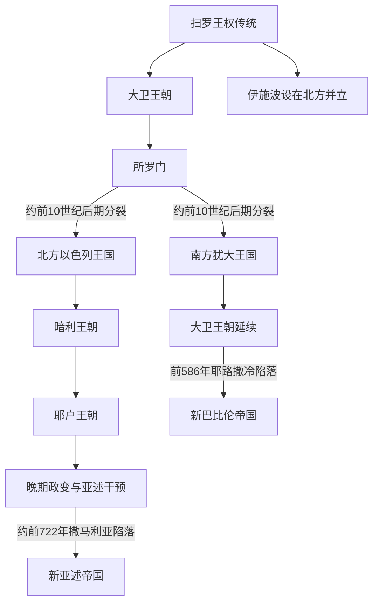

# 以色列与犹大君主世系表

## 范围与年代口径

本表整理铁器时代早期王权传统、北方以色列王国与南方犹大王国的公认统治者顺序。约前10世纪的绝对年代、联合王国规模以及若干共治关系存在争议；前9世纪以后可同亚述、摩押等外部铭文交叉核对的节点较多，但《列王纪》《历代志》中的在位年数仍需解释共治、两地历法和登基年计算差异。因此表中日期采用常见重建的约数，不把一套学术年表写成唯一结论。

“完整”在这里指不省略文献传统和主流历史重建中逐名列出的君主，也列出并立者、篡位者、女王和短期统治者；它不表示每个人物都得到同等强度的同时代外证。

## 世系分化图

## 早期王权与“联合王国”传统

| 顺序 | 统治者 | 王室 / 地位 | 约在位时间 | 与前任关系 | 证据与关键事件 |
|---:|---|---|---|---|---|
| 1 | **扫罗** | 便雅悯支派；早期军事王权 | 约前11世纪后期 | 首位王权人物 | 传统称其在非利士压力下整合部分山地集团；统治范围和精确年代不详。 |
| 并立 | 伊施波设（伊施巴力） | 扫罗家 | 约前11世纪末，约两年 | 扫罗之子 | 据传统在北方受押尼珥拥立，同大卫并立；被部下杀死。 |
| 2 | **大卫** | 大卫家建立者 | 约前10世纪前半 | 扫罗女婿、后与扫罗家竞争 | 先以希伯仑为中心，后取得耶路撒冷；“大卫家”名称获前9世纪碑铭支持，国家规模仍有争议。 |
| 3 | **所罗门** | 大卫家 | 约前10世纪中叶 | 大卫之子 | 传统称建立圣殿、宫廷和行政区；工程规模、疆域与后世叙事形成过程存在争议。 |

## 北方以色列王国完整君主表

| 顺序 | 君主 | 王朝 | 约在位时间 | 与前任关系 | 关键事件 / 备注 |
|---:|---|---|---|---|---|
| 1 | **耶罗波安一世** | 耶罗波安家 | 约前930—910年 | 原为所罗门官员；北方脱离后被拥立 | 以示剑等地为中心，伯特利与但的王室圣所传统同其相连。 |
| 2 | 拿答 | 耶罗波安家 | 约前910—909年 | 耶罗波安一世之子 | 围攻非利士城市基比顿时被巴沙杀死。 |
| 3 | 巴沙 | 巴沙家 | 约前909—886年 | 篡夺者 | 清除耶罗波安家，继续同犹大争夺边境。 |
| 4 | 以拉 | 巴沙家 | 约前886—885年 | 巴沙之子 | 被战车部队长心利杀死。 |
| 5 | 心利 | 无稳定王朝 | 约前885年，七日 | 政变夺位 | 军队拥立暗利后，心利在得撒宫中自焚。 |
| 并立 | 提比尼 | 地方派系推举 | 约前885—880年 | 与暗利竞争 | 同暗利长期并立，战败或死后暗利取得单独王权。 |
| 6 | **暗利** | 暗利王朝 | 约前885 / 880—874年 | 军队拥立 | 建设撒马利亚为首都；亚述后来长期以“暗利家”称北国。 |
| 7 | **亚哈** | 暗利王朝 | 约前874—853年 | 暗利之子 | 同推罗王室联姻；前853年参加卡尔卡战役联盟，王国军力达到高峰。 |
| 8 | 亚哈谢 | 暗利王朝 | 约前853—852年 | 亚哈之子 | 在位短，摩押反叛加剧；坠楼受伤后去世。 |
| 9 | 约兰（约兰姆） | 暗利王朝 | 约前852—841年 | 亚哈之子、亚哈谢之弟 | 与犹大结盟作战；耶户政变中被杀。 |
| 10 | **耶户** | 耶户王朝 | 约前841—814年 | 军官政变 | 清除暗利家并杀犹大王亚哈谢；黑色方尖碑记其向亚述纳贡。 |
| 11 | 约哈斯 | 耶户王朝 | 约前814—798年 | 耶户之子 | 受大马士革压迫，军事能力收缩。 |
| 12 | 约阿施 | 耶户王朝 | 约前798—782年 | 约哈斯之子 | 逐步收复被亚兰夺取的城镇，并击败犹大王亚玛谢。 |
| 13 | **耶罗波安二世** | 耶户王朝 | 约前793 / 782—753年 | 约阿施之子；可能先共治 | 利用亚述暂缓西进而扩张，贸易繁荣但社会分化加深。 |
| 14 | 撒迦利雅 | 耶户王朝 | 约前753—752年，约六个月 | 耶罗波安二世之子 | 被沙龙杀死，耶户王朝终结。 |
| 15 | 沙龙 | 无稳定王朝 | 约前752年，一个月 | 政变夺位 | 被米拿现杀死。 |
| 16 | 米拿现 | 米拿现家 | 约前752—742年 | 政变夺位 | 向亚述提革拉特帕拉沙尔三世纳重贡以维持王位。 |
| 17 | 比加辖 | 米拿现家 | 约前742—740年 | 米拿现之子 | 被军官比加杀死。 |
| 18 | 比加 | 无稳定王朝 | 约前740—732年；其早期称王年代有争议 | 政变夺位 | 同大马士革组成反亚述联盟并发动叙利亚—以法莲战争；亚述干预后被何细亚杀死。 |
| 19 | **何细亚** | 无稳定王朝 | 约前732—722年 | 在亚述压力下夺位 | 停止纳贡并寻求埃及支持；撒马利亚被围，王国灭亡。 |

## 南方犹大王国完整君主表

| 顺序 | 君主 | 庙号 / 谥号 | 年号 | 约在位时间 | 生卒 | 与前任关系 | 关键事件 / 备注 |
|---:|---|---|---|---|---|---|---|
| 1 | 罗波安 | 无 | 无 | 约前930—913年 | 不详 | 所罗门之子 | 北方集团脱离；埃及舍顺克一世入侵南黎凡特。 |
| 2 | 亚比雅（亚比央） | 无 | 无 | 约前913—911年 | 不详 | 罗波安之子 | 在位短，继续同北国战争。 |
| 3 | 亚撒 | 无 | 无 | 约前911—870年 | 不详 | 亚比雅之子 | 强化王权并同大马士革结盟牵制北国；晚年或与约沙法共治。 |
| 4 | **约沙法** | 无 | 无 | 约前870—849年 | 不详 | 亚撒之子 | 同暗利王朝联姻与结盟，参与区域战争；可能较早让儿子共治。 |
| 5 | 约兰 | 无 | 无 | 约前849—842年 | 不详 | 约沙法之子 | 娶亚哈之女亚他利雅；以东摆脱犹大控制。 |
| 6 | 亚哈谢 | 无 | 无 | 约前842—841年 | 不详 | 约兰之子 | 与北国约兰结盟，耶户政变中被杀。 |
| 7 | 亚他利雅 | 无；女王 | 无 | 约前841—835年 | 不详 | 亚哈谢之母、暗利王朝成员 | 掌握王权约六年，后被圣殿—宫廷联盟推翻。 |
| 8 | 约阿施（约阿施） | 无 | 无 | 约前835—796年 | 不详 | 亚哈谢之子 | 幼年在圣殿集团支持下登位；整修圣殿，后被臣仆刺杀。 |
| 9 | 亚玛谢 | 无 | 无 | 约前796—767年 | 不详 | 约阿施之子 | 击败以东后挑战北国失败，耶路撒冷城墙受损；后遭刺杀。 |
| 10 | **乌西雅（亚撒利雅）** | 无 | 无 | 约前792 / 767—740年 | 不详 | 亚玛谢之子；可能长期共治 | 农业、城防和军力发展；晚年患病，由约坦摄政。 |
| 11 | 约坦 | 无 | 无 | 约前750 / 740—732年 | 不详 | 乌西雅之子；先摄政或共治 | 加强建筑和边防，末期面临亚兰与北国压力。 |
| 12 | 亚哈斯 | 无 | 无 | 约前735 / 732—716年 | 不详 | 约坦之子；可能先共治 | 叙利亚—以法莲战争中求助亚述，犹大成为亚述附庸。 |
| 13 | **希西家** | 无 | 无 | 约前716—687年 | 不详 | 亚哈斯之子 | 推动宗教中央化并反亚述；前701年西拿基立毁灭犹大多城但未攻下耶路撒冷。 |
| 14 | 玛拿西 | 无 | 无 | 约前687—642年 | 不详 | 希西家之子 | 长期服从亚述，国家在附庸框架下恢复；宗教政策受后世严厉批判。 |
| 15 | 亚们 | 无 | 无 | 前642—640年 | 不详 | 玛拿西之子 | 被宫廷臣仆刺杀，地方“国民”推翻刺客后拥立约西亚。 |
| 16 | **约西亚** | 无 | 无 | 前640—609年 | 约前648—609年 | 亚们之子 | 利用亚述衰退扩张并推动宗教改革；在米吉多与埃及军交锋时死亡。 |
| 17 | 约哈斯（沙龙） | 无 | 无 | 前609年，约三个月 | 不详 | 约西亚之子 | 被地方拥立，埃及法老尼哥二世废黜并带往埃及。 |
| 18 | 约雅敬（以利亚敬） | 无 | 无 | 前609—598年 | 不详 | 约西亚之子、约哈斯兄 | 由埃及改名册立，后转臣新巴比伦又反叛；耶路撒冷围城前后去世。 |
| 19 | 约雅斤（耶哥尼雅） | 无 | 无 | 前598—597年，约三个月 | 不详—前6世纪中叶以后 | 约雅敬之子 | 前597年向尼布甲尼撒二世投降并被迁巴比伦；流亡社群仍承认其王室地位。 |
| 20 | **西底家（玛探雅）** | 无 | 无 | 前597—586年 | 不详 | 约西亚之子、约雅斤叔父 | 由巴比伦改名册立，后反叛；耶路撒冷陷落后被俘，大卫王朝本地统治终结。 |

## 王朝连续性与争议

- 北国多次由军官政变更换王朝；南国除亚他利雅时期外维持“大卫家”名义连续，但也经历幼主、共治、外帝废立和宫廷政变。
- 撒马利亚约前722年陷落的最终攻克可能横跨撒缦以色五世与萨尔贡二世时期，不能简单只归于一位亚述王。
- 前597年后约雅斤虽被流放，巴比伦文书仍显示其及家属受供给；西底家则是在巴比伦宗主权下统治耶路撒冷的被册立者。
- “失踪的十支派”是后世宗教和族群想象。亚述确实迁走部分人口并迁入他地居民，但北方人口并未整体消失，撒马利亚等地延续有人居住。

## 演变关系

- 政权形成、战争与灭亡过程见[以色列王国与犹大王国](/%E4%BA%BA%E6%96%87%E7%A7%91%E5%AD%A6/%E5%8E%86%E5%8F%B2/%E8%A5%BF%E4%BA%9A/%E9%BB%8E%E5%87%A1%E7%89%B9/%E4%BB%A5%E8%89%B2%E5%88%97%E7%8E%8B%E5%9B%BD%E4%B8%8E%E7%8A%B9%E5%A4%A7%E7%8E%8B%E5%9B%BD.md)。
- 更长时段的犹太共同体与历史传统见[古代以色列、犹大与犹太历史传统](/%E4%BA%BA%E6%96%87%E7%A7%91%E5%AD%A6/%E5%8E%86%E5%8F%B2/%E8%A5%BF%E4%BA%9A/%E9%BB%8E%E5%87%A1%E7%89%B9/%E4%BB%A5%E8%89%B2%E5%88%97/%E5%8F%A4%E4%BB%A3%E4%BB%A5%E8%89%B2%E5%88%97%E3%80%81%E7%8A%B9%E5%A4%A7%E4%B8%8E%E7%8A%B9%E5%A4%AA%E5%8E%86%E5%8F%B2%E4%BC%A0%E7%BB%9F.md)。
- 上级入口：[黎凡特](/%E4%BA%BA%E6%96%87%E7%A7%91%E5%AD%A6/%E5%8E%86%E5%8F%B2/%E8%A5%BF%E4%BA%9A/%E9%BB%8E%E5%87%A1%E7%89%B9/README.md)。
