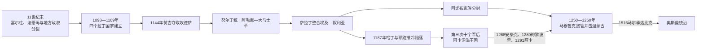

# 十字军国家与阿尤布、马穆鲁克时期

## 时间

1097—1516年；拉丁十字军实体政权主要存在于1098—1291年。

## 概括

第一次十字军东征在塞尔柱诸支、法蒂玛、拜占庭与地方埃米尔竞争中进入黎凡特，1098年建立埃德萨伯国和安条克公国，1099年攻陷耶路撒冷并屠杀大量穆斯林、犹太居民，1109年完成的黎波里伯国。四国不是一个统一“十字军王国”，而是各有君主、封臣、教会、城市和外交的政权；拉丁精英统治人口多元的乡村与城市，并依赖意大利海港、亚美尼亚、东方基督徒、穆斯林农民和不定期西欧援军。

赞吉夺取埃德萨、努尔丁统一阿勒颇—大马士革、萨拉丁取得埃及和叙利亚后，穆斯林反击由地方竞争逐步转为较大政治整合。1187年哈丁战役后耶路撒冷陷落，但第三次十字军保住阿卡等沿海据点，拉丁王国继续约一百年。阿尤布家族以分封统治埃及、叙利亚和外约旦，既对抗十字军也彼此竞争；1250年后埃及马穆鲁克取得主导，在1260年艾因贾鲁特击退蒙古，随后逐城消灭拉丁据点，1291年攻陷阿卡。

马穆鲁克统治并未在1291年结束“黎凡特历史”。其以开罗为最高中心、以大马士革等省城、军事封邑、驿传和宗教基金管理地区，重建内陆交通并削弱部分海岸要塞。瘟疫、税收、军政派系、贸易路线变化和农村人口损失带来长期压力。1516年马尔季达比克战役后，奥斯曼帝国吞并叙利亚，结束马穆鲁克在黎凡特的统治。

## 演变图

## 十字军进入与四国建立

### 第一次十字军的背景

拜占庭皇帝阿莱克修斯一世在曼齐克特战败和安纳托利亚突厥扩张后向西方求援。教宗乌尔班二世1095年动员远征，把援助东方教会、朝圣、赎罪、贵族战争文化和教廷领导结合。参与者动机包括宗教承诺、家族荣誉、土地机会、债务与封建关系，不能只归为殖民贪欲或纯粹虔诚。

1097年十字军穿过安纳托利亚。布洛涅的鲍德温转向埃德萨，同亚美尼亚统治者托罗斯结盟并在其死后建立伯国。主力围攻安条克近八个月，1098年借城内关系入城，随后又被摩苏尔援军包围；十字军突围后，博希蒙德拒绝按对拜占庭承诺归还城市，建立安条克公国。

1099年军队南下时，沿海城市多以物资、停战或观望避免直接攻城。耶路撒冷当时由法蒂玛于1098年从突厥守军手中夺回。十字军围城约五周后于1099年7月破城，对穆斯林和犹太居民实施大规模杀戮；具体死亡数字在夸张的胜利叙事中难以精确，但暴力与驱逐本身没有争议。

### 四国与边界

| 政权 | 存续 | 核心 | 结构与弱点 |
|---|---|---|---|
| 埃德萨伯国 | 1098—1150年，埃德萨城1144年失守 | 幼发拉底上游的城镇与要塞 | 内陆、无海港、领土分散，依赖亚美尼亚与叙利亚基督徒人口；最易被赞吉、阿勒颇和摩苏尔夹击 |
| 安条克公国 | 1098—1268年 | 安条克、奥龙特河谷与北部沿海 | 诺曼亲王、拜占庭宗主权主张、奇里乞亚亚美尼亚和穆斯林邻国反复竞争 |
| 耶路撒冷王国 | 1099—1291年；1187年后以阿卡为中心 | 巴勒斯坦、沿海和外约旦领地 | 国王、高等法院、封臣、军事修会与港口城市共治；人口和军力有限 |
| 的黎波里伯国 | 1102 / 1109—1289年 | 的黎波里及黎巴嫩北部沿海 | 依赖海港和山地堡垒，后与安条克王室共主但制度分立 |

四国完整统治者、摄政、共治和争位顺序见[十字军国家统治者表](/%E4%BA%BA%E6%96%87%E7%A7%91%E5%AD%A6/%E5%8E%86%E5%8F%B2/%E8%A5%BF%E4%BA%9A/%E9%BB%8E%E5%87%A1%E7%89%B9/%E5%8D%81%E5%AD%97%E5%86%9B%E5%9B%BD%E5%AE%B6%E7%BB%9F%E6%B2%BB%E8%80%85%E8%A1%A8.md)。

## 拉丁政权的统治结构

拉丁国家把西欧封建领地、教会和城市制度移植到本地，却必须适应人口、土地和商贸结构。耶路撒冷王国的高等法院由国王与大封臣讨论继承、军役和司法；地方领主拥有城堡、税收和法庭。安条克亲王权力较集中，的黎波里和埃德萨的制度也各不相同。

拉丁教会接管或新建宗主教区、主教座和修道院，希腊正教、叙利亚正教、亚美尼亚教会、马龙派等东方基督徒地位因地点和时期不同。把所有东方基督徒视为拉丁人的天然盟友不准确：他们既可能合作，也会因教产、礼仪和政治从属冲突。

农村人口大多仍是本地穆斯林、东方基督徒、犹太人或撒马利亚人，向领主缴纳地租、税赋和劳役。领主通常不把西欧农民大规模移入所有村庄，而是保留地方头人和耕作结构。城市中法兰克人、叙利亚人、亚美尼亚人、希腊人、穆斯林与犹太人分区居住又在市场互动。

威尼斯、热那亚和比萨以舰队协助夺取港口，换取街区、仓库、法庭和关税特权。海上贸易带来糖、橄榄油、纺织、香料和朝圣收入，却也使王室失去部分海关收益，并让意大利城市在本地战争中各选阵营。

圣殿骑士团、医院骑士团和条顿骑士团拥有跨国捐赠、城堡和独立指挥。它们提供常备军，却不完全服从国王；军事修会、贵族、城市公社和缺席君主之间的权力分散，在13世纪尤其明显。

## 赞吉、努尔丁与穆斯林政治整合

十字军建立初期，摩苏尔、阿勒颇、大马士革和埃及彼此竞争，地方穆斯林统治者有时同拉丁国家结盟对付另一穆斯林对手。宗教性的“圣战”语言逐步被统治者、法学家和传道者强化，但政治整合不是自动发生。

摩苏尔统治者赞吉同时控制阿勒颇，利用埃德萨伯国军力空虚于1144年攻陷埃德萨城。城内拉丁人死亡或被俘，部分东方基督徒最初获准留下；1146年若瑟兰二世反攻后，努尔丁重新攻占并严厉破坏。埃德萨陷落促成第二次十字军，但西方军转攻大马士革失败，反而推动大马士革向努尔丁靠拢。

努尔丁通过阿勒颇、大马士革、宗教基金、军队和宣传建立更稳定的叙利亚政权。其将领谢尔库赫与侄子萨拉丁进入埃及，先在法蒂玛宫廷权斗和对十字军防御中取得军政权。萨拉丁1169年任宰相，1171年终止法蒂玛哈里发，努尔丁1174年死后又逐步控制大马士革、阿勒颇等地，形成阿尤布家族霸权。

## 萨拉丁、哈丁与第三次十字军

耶路撒冷王鲍德温四世病重和继承争议使宫廷分裂。沙蒂永的雷纳德多次袭击商队并威胁红海航路，破坏停战；居伊在1187年动员大军救援提比里亚，离开水源。萨拉丁在哈丁附近切断补给、用火烟和骑兵骚扰，7月4日击溃拉丁主力，俘获国王和大量贵族。

战役后，大多数内陆城镇和沿海据点迅速投降。萨拉丁10月取得耶路撒冷，允许居民赎身并保护部分圣地；仍有无法赎身者被奴役，胜利不应浪漫化为完全无暴力。推罗在蒙费拉托的康拉德指挥下守住，为拉丁政权恢复提供基地。

第三次十字军夺回阿卡，英王理查一世沿海作战但未能稳妥取得耶路撒冷。1192年和约让拉丁人保有从推罗到雅法的沿海带，并允许基督徒朝圣。王国以阿卡为政治中心延续，塞浦路斯则成为海上补给和王室后方。

## 阿尤布家族分封与十字军外交

萨拉丁1193年死后，儿子、兄弟和侄辈分治埃及、大马士革、阿勒颇、哈马、霍姆斯和外约旦。家族承认资深苏丹的名义领导，却频繁结盟、废立和争城。阿尤布统治因此不是一条从萨拉丁直传末王的统一叙利亚世系。

阿迪勒一世最终在约1200年前后成为主要苏丹，以停战、商业和家族分封维持秩序。第五次十字军进攻埃及达米埃塔，阿尤布曾提出以耶路撒冷换撤军；十字军拒绝后在1221年尼罗河洪水与包围中失败。

第六次十字军中，埃及苏丹卡米勒面对家族战争，通过1229年雅法条约把无防御的耶路撒冷、伯利恒和通道交给神圣罗马皇帝腓特烈二世，穆斯林保留圣殿山宗教管理。该安排是十年停战和主权分割，不是永久“和平归还”。条约期满后局势再变。

1244年，受蒙古扩张挤压的花剌子模军攻入耶路撒冷并严重破坏城市，随后同埃及阿尤布军在拉福比战役击败拉丁—大马士革联军。耶路撒冷此后不再回到拉丁实体控制。法国路易九世发动第七次十字军，1249年夺取达米埃塔，却在曼苏拉和撤退中失败并被俘。

## 马穆鲁克掌权与蒙古冲击

埃及阿尤布苏丹萨利赫·阿尤布依靠马穆鲁克军事奴隶军团。其1249年去世后，王后舍哲尔·杜尔、马穆鲁克军官和继承人图兰沙之间冲突；1250年图兰沙被杀，埃及进入马穆鲁克统治。政权合法性依赖军事实力、阿拔斯礼仪哈里发、伊斯兰护卫者形象和精英内部承认，而非父子世袭。

1258年蒙古攻陷巴格达，旭烈兀军又取阿勒颇、大马士革。蒙古主力因大汗去世和伊儿汗国内安排东撤，怯的不花留守叙利亚。1260年，马穆鲁克苏丹忽秃思与将领拜巴尔斯在艾因贾鲁特击败蒙古分遣军，随后夺回大马士革。胜利阻止蒙古在当时建立稳定的埃及—叙利亚统治，但伊儿汗国此后仍多次入侵，边界战争延续数十年。

## 消灭拉丁据点

拜巴尔斯将抗蒙古防御、海岸堡垒战和宗教宣传结合。1265年起攻取凯撒利亚、海法、阿尔苏夫和采法特，1268年攻陷安条克并进行大规模杀戮、奴役和破坏。拉丁国家同蒙古或奇里乞亚亚美尼亚结盟，反而让马穆鲁克视其为伊儿汗国登陆支点。

嘉拉温1289年攻陷的黎波里，摧毁旧海岸城并在内陆附近重建。其子阿什拉夫·哈利勒1291年围攻阿卡，利用火炮式投石机、工兵和大军破城；幸存者经海路逃往塞浦路斯，其余被杀或俘。推罗、西顿、贝鲁特等残余据点随即放弃或失守。鲁阿德岛上的圣殿骑士团据点1302 / 1303年被清除，拉丁大陆政权彻底消失。

## 马穆鲁克统治结构

| 层级 | 机构 | 作用 |
|---|---|---|
| 开罗苏丹与军政集团 | 苏丹、埃米尔会议、禁卫与文官机构 | 决定省长、军役、外交、税收和继承；苏丹更替常由军政联盟而非血缘决定 |
| 大马士革总督 | 黎凡特最高省级军政长官之一 | 协调叙利亚军队、驿传、边防和地方总督 |
| 地方省区 | 阿勒颇、哈马、的黎波里、萨法德、加沙、卡拉克等 | 由埃米尔统治，负责税收、治安、要塞和朝觐道路 |
| 军事封邑 | 向马穆鲁克埃米尔分配税收收益 | 以地方收入供养骑兵，不等于土地完全私有 |
| 法官、宗教基金和城市精英 | 四大逊尼法学派法官、乌里玛、商人、手工业行会、宗教社群 | 管理司法、教育、慈善、市场和社群事务 |
| 驿传与道路 | 驿站、烽火、信鸽和马匹网络 | 让开罗与大马士革、边疆快速传令，支持抗蒙古军动员 |

完整马穆鲁克苏丹顺序见[马穆鲁克苏丹国](/%E4%BA%BA%E6%96%87%E7%A7%91%E5%AD%A6/%E5%8E%86%E5%8F%B2/%E5%8C%97%E9%9D%9E/%E5%9F%83%E5%8F%8A/%E9%A9%AC%E7%A9%86%E9%B2%81%E5%85%8B%E8%8B%8F%E4%B8%B9%E5%9B%BD.md)；阿尤布埃及主系见[阿尤布王朝统治下的埃及](/%E4%BA%BA%E6%96%87%E7%A7%91%E5%AD%A6/%E5%8E%86%E5%8F%B2/%E5%8C%97%E9%9D%9E/%E5%9F%83%E5%8F%8A/%E9%98%BF%E5%B0%A4%E5%B8%83%E7%8E%8B%E6%9C%9D%E7%BB%9F%E6%B2%BB%E4%B8%8B%E7%9A%84%E5%9F%83%E5%8F%8A.md)。黎凡特阿尤布诸支并立，本页不把大马士革、阿勒颇、哈马和埃及的统治者误排成一条继承线。

## 马穆鲁克时期的社会与经济

马穆鲁克恢复被蒙古和十字军战争破坏的内陆城市、清真寺、学校、苏菲场所、市场与商队驿站。大马士革是行政、学术和朝觐中心，阿勒颇连接安纳托利亚、伊拉克和伊朗，的黎波里在新址重建。基督徒、犹太人、什叶派、德鲁兹及其他社群继续存在，法律地位、税负和安全随统治者与战争变化。

为防欧洲舰队再登陆，马穆鲁克拆毁或限制部分海岸要塞和港口，行政重心更偏内陆。这没有终止所有地中海贸易，威尼斯、热那亚和加泰罗尼亚商人仍通过条约经营香料、糖、棉花、染料和奴隶贸易；但港口规模与安全受军事战略限制。

1348年起黑死病及后续疫情反复袭击城市与乡村。人口损失造成土地荒芜、租税下降和劳动力短缺，军政集团则加重征收以维持收入。14—15世纪马穆鲁克派系斗争、货币问题、贝都因冲突、帖木儿1400年洗劫大马士革以及葡萄牙绕好望角航路竞争，加剧财政压力。仍不能把15世纪描述为完全停滞，城市学术、手工业和区域贸易继续活跃。

## 1516年奥斯曼征服

奥斯曼与马穆鲁克围绕安纳托利亚边境、杜勒卡迪尔缓冲国、萨法维威胁和商路关系恶化。塞利姆一世以火器、野战炮、步兵和更集中指挥向南进军。1516年8月马尔季达比克战役中，马穆鲁克苏丹坎苏·古里阵亡；部分埃米尔倒戈、指挥和火器劣势使军队崩溃。

阿勒颇、大马士革相继归降。1517年奥斯曼再入埃及，结束马穆鲁克苏丹国。黎凡特城市、法官、宗教基金和部分地方精英被吸收进新行省体系，政权更替不是社会制度全部清零。

## 关键统治者与实际权力

| 阶段 | 统治者 / 权力中心 | 时间 | 黎凡特作用 |
|---|---|---|---|
| 赞吉王朝 | 赞吉 | 1127—1146年 | 统一摩苏尔与阿勒颇，1144年夺取埃德萨。 |
| 赞吉王朝 | **努尔丁** | 1146—1174年 | 取得大马士革，建设叙利亚军政与宗教动员体系。 |
| 阿尤布 | **萨拉丁** | 埃及1171年起；大马士革1174年起；1193年卒 | 整合埃及和叙利亚，1187年哈丁取胜并收复耶路撒冷。 |
| 阿尤布 | 阿迪勒一世 | 约1200—1218年为主要苏丹 | 以家族分封、停战和贸易维持统合。 |
| 阿尤布 | 卡米勒 | 埃及1218—1238年 | 抵抗第五次十字军，1229年以条约暂交耶路撒冷。 |
| 阿尤布诸支 | 大马士革、阿勒颇、哈马、卡拉克等王公 | 12—13世纪 | 名义同族、实际并立，常与拉丁国家交叉结盟。 |
| 马穆鲁克 | 忽秃思 | 1259—1260年 | 领导艾因贾鲁特胜利，旋即被拜巴尔斯取代。 |
| 马穆鲁克 | **拜巴尔斯** | 1260—1277年 | 重建叙利亚防线，夺取多处拉丁据点和安条克。 |
| 马穆鲁克 | **嘉拉温** | 1279—1290年 | 巩固王朝、攻取马尔加特和的黎波里。 |
| 马穆鲁克 | 阿什拉夫·哈利勒 | 1290—1293年 | 1291年攻陷阿卡并清除主要沿海据点。 |
| 马穆鲁克 | 纳西尔·穆罕默德 | 三次在位，1293—1341年 | 长期统治期稳定军政和贸易，埃米尔权力仍强。 |
| 马穆鲁克 | 坎苏·古里 | 1501—1516年 | 财政和外部压力下对奥斯曼作战，马尔季达比克阵亡。 |

## 重要事件

| 时间 | 事件 | 结果 |
|---|---|---|
| 1098年 | 埃德萨、安条克拉丁政权建立 | 第一次十字军在北部形成两个国家。 |
| 1099年 | 十字军攻陷耶路撒冷 | 屠杀与驱逐后建立王国。 |
| 1109年 | 的黎波里陷落 | 四个主要拉丁国家体系完成。 |
| 1144年 | 赞吉夺取埃德萨 | 首个拉丁国家首都失守，促成第二次十字军。 |
| 1154年 | 努尔丁取得大马士革 | 叙利亚较大范围政治整合。 |
| 1171—1174年 | 萨拉丁终止法蒂玛并接管大马士革 | 埃及—叙利亚整合基础形成。 |
| 1187年 | 哈丁战役与耶路撒冷陷落 | 拉丁主力覆灭，王国转向沿海。 |
| 1191—1192年 | 第三次十字军与和约 | 阿卡王国保留，朝圣开放，耶路撒冷仍归萨拉丁。 |
| 1221年 | 第五次十字军在埃及失败 | 阿尤布保住埃及核心。 |
| 1229年 | 雅法条约 | 耶路撒冷暂由拉丁人控制，圣殿山由穆斯林管理。 |
| 1244年 | 花剌子模军攻入耶路撒冷、拉福比战役 | 拉丁势力失去圣城，地区联盟重组。 |
| 1250年 | 埃及马穆鲁克掌权 | 阿尤布埃及主系终结。 |
| 1260年 | 艾因贾鲁特战役 | 蒙古推进受阻，马穆鲁克控制叙利亚。 |
| 1268年 | 安条克陷落 | 安条克公国实体终结。 |
| 1289年 | 的黎波里陷落 | 伯爵国终结。 |
| 1291年 | 阿卡陷落 | 耶路撒冷王国大陆实体终结。 |
| 1348年起 | 黑死病反复 | 人口、农业、财政和军役体系受长期打击。 |
| 1400—1401年 | 帖木儿洗劫大马士革 | 城市人口、工匠和经济遭严重损失。 |
| 1516年 | 马尔季达比克战役 | 奥斯曼吞并黎凡特。 |

## 崛起、衰落与灭亡原因

| 政权 | 崛起机制 | 结构性弱点 | 外部压力 | 直接灭亡过程 |
|---|---|---|---|---|
| 拉丁四国 | 宗教动员、拜占庭通道、穆斯林政治分裂、意大利舰队与城堡网络 | 人口和骑士有限、继承争议、政权彼此独立、依赖海外援军 | 赞吉—努尔丁—萨拉丁整合，后有马穆鲁克集中军力 | 埃德萨1144 / 1150；安条克1268；的黎波里1289；阿卡1291逐城陷落 |
| 阿尤布诸国 | 萨拉丁整合埃及财政与叙利亚军政、圣战合法性 | 家族分封和继承分裂，地方王公常交叉结盟 | 十字军、花剌子模、蒙古前锋和内部军团 | 埃及主系在1250年被马穆鲁克军官取代；叙利亚诸支随后被并入 |
| 马穆鲁克 | 精锐骑兵军团、埃及财政、抗蒙古胜利与宗教合法性 | 苏丹非固定世袭、埃米尔派系、封邑财政和疫情人口损失 | 伊儿汗、帖木儿、葡萄牙商路竞争、奥斯曼火器国家 | 1516年马尔季达比克主力败亡，1517年埃及核心被征服 |

## 演变关系

- 前置节点：[阿拉伯征服与伊斯兰化时期的黎凡特](/%E4%BA%BA%E6%96%87%E7%A7%91%E5%AD%A6/%E5%8E%86%E5%8F%B2/%E8%A5%BF%E4%BA%9A/%E9%BB%8E%E5%87%A1%E7%89%B9/%E9%98%BF%E6%8B%89%E4%BC%AF%E5%BE%81%E6%9C%8D%E4%B8%8E%E4%BC%8A%E6%96%AF%E5%85%B0%E5%8C%96%E6%97%B6%E6%9C%9F%E7%9A%84%E9%BB%8E%E5%87%A1%E7%89%B9.md)。
- 后续节点：[奥斯曼统治下的黎凡特](/%E4%BA%BA%E6%96%87%E7%A7%91%E5%AD%A6/%E5%8E%86%E5%8F%B2/%E8%A5%BF%E4%BA%9A/%E9%BB%8E%E5%87%A1%E7%89%B9/%E5%A5%A5%E6%96%AF%E6%9B%BC%E7%BB%9F%E6%B2%BB%E4%B8%8B%E7%9A%84%E9%BB%8E%E5%87%A1%E7%89%B9.md)。
- 欧洲远征过程：[十字军东征](/%E4%BA%BA%E6%96%87%E7%A7%91%E5%AD%A6/%E5%8E%86%E5%8F%B2/%E6%AC%A7%E6%B4%B2/_%E9%80%9A%E5%8F%B2/%E5%8D%81%E5%AD%97%E5%86%9B%E4%B8%9C%E5%BE%81/README.md)。
- 地区对读：[古代叙利亚与伊斯兰时代](/%E4%BA%BA%E6%96%87%E7%A7%91%E5%AD%A6/%E5%8E%86%E5%8F%B2/%E8%A5%BF%E4%BA%9A/%E9%BB%8E%E5%87%A1%E7%89%B9/%E5%8F%99%E5%88%A9%E4%BA%9A/%E5%8F%A4%E4%BB%A3%E5%8F%99%E5%88%A9%E4%BA%9A%E4%B8%8E%E4%BC%8A%E6%96%AF%E5%85%B0%E6%97%B6%E4%BB%A3.md)、[古代至奥斯曼时期的巴勒斯坦](/%E4%BA%BA%E6%96%87%E7%A7%91%E5%AD%A6/%E5%8E%86%E5%8F%B2/%E8%A5%BF%E4%BA%9A/%E9%BB%8E%E5%87%A1%E7%89%B9/%E5%B7%B4%E5%8B%92%E6%96%AF%E5%9D%A6/%E5%8F%A4%E4%BB%A3%E8%87%B3%E5%A5%A5%E6%96%AF%E6%9B%BC%E6%97%B6%E6%9C%9F%E7%9A%84%E5%B7%B4%E5%8B%92%E6%96%AF%E5%9D%A6.md)。
- 上级入口：[黎凡特](/%E4%BA%BA%E6%96%87%E7%A7%91%E5%AD%A6/%E5%8E%86%E5%8F%B2/%E8%A5%BF%E4%BA%9A/%E9%BB%8E%E5%87%A1%E7%89%B9/README.md)。
