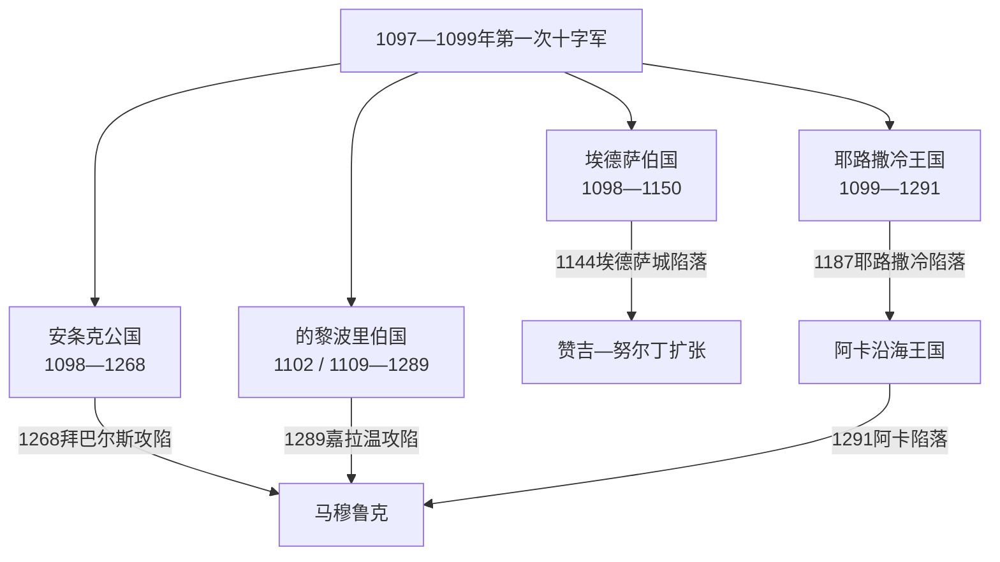

# 十字军国家统治者表

## 范围与口径

本表列出第一次十字军东征后在黎凡特形成的四个拉丁政权：埃德萨伯国、安条克公国、的黎波里伯国和耶路撒冷王国。四国彼此独立，存在宗主、摄政、婚姻共治和继承争议；不能合并成一条“十字军国王世系”。

表中以实际在黎凡特拥有政权的时期为界。1268年安条克陷落、1291年阿卡陷落后，欧洲和塞浦路斯王室继续使用安条克亲王或耶路撒冷国王等名义头衔，但已无相应大陆国家，不列入实体政权世系。日期在不同编年史间可能相差数月，短期共治和实际摄政在备注中说明。

## 四国更替关系

## 埃德萨伯国伯爵

| 顺序 | 统治者 | 在位时间 | 与前任关系 | 实际统治与结局 |
|---:|---|---|---|---|
| 前置 | 埃德萨的托罗斯 | 约1094—1098年 | 亚美尼亚地方统治者 | 收养鲍德温为继承人；1098年城内政变中死亡，不属拉丁伯爵世系。 |
| 1 | **布洛涅的鲍德温** | 1098—1100年 | 托罗斯养子，十字军领袖 | 建立首个拉丁政权；1100年前往耶路撒冷即王位。 |
| 2 | **布尔克的鲍德温** | 1100—1118年 | 前任亲族 | 扩大幼发拉底沿岸据点，多次被俘；1118年成为耶路撒冷国王。 |
| 3 | **若瑟兰一世·德·库特奈** | 1118—1131年 | 鲍德温二世的同盟与继任者 | 依靠亚美尼亚社群和要塞维持边疆，伤重去世。 |
| 4 | **若瑟兰二世** | 1131—1150年 | 若瑟兰一世之子 | 把主要宫廷移至图尔贝塞尔；1144年赞吉攻陷埃德萨，1146年反攻失败；1150年残余领地转让拜占庭后被俘。 |

## 安条克公国亲王与摄政

| 顺序 | 统治者 / 摄政 | 身份与在位 | 与前任关系 | 关键说明 |
|---:|---|---|---|---|
| 1 | **博希蒙德一世** | 亲王，1098—1111年 | 建国者 | 夺取安条克后拒绝完全归还拜占庭；1100年被俘，后长期在欧洲。 |
| 摄政 | 坦克雷德 | 1100—1103、1104—1112年 | 博希蒙德一世之侄 | 在亲王被俘或离境时实际统治，并扩张边界。 |
| 2 | 博希蒙德二世 | 名义亲王1111—1126年；亲政1126—1130年 | 博希蒙德一世之子 | 幼年居欧洲；回国后在奇里乞亚作战死亡。 |
| 摄政 | 萨莱诺的罗杰 | 1112—1119年 | 坦克雷德亲属 | 1119年“血田战役”战死。 |
| 摄政 | 耶路撒冷国王鲍德温二世 | 1119—1126、1130—1131年 | 以宗主和外祖父身份 | 在继承空缺中保护公国。 |
| 3 | **康斯坦丝** | 女亲王，1130—1163年 | 博希蒙德二世之女 | 幼年继位；先后与普瓦捷的雷蒙、沙蒂永的雷纳德共治。 |
| 共治 | 普瓦捷的雷蒙 | 亲王配偶，1136—1149年 | 康斯坦丝第一位成年丈夫 | 同拜占庭、赞吉和努尔丁周旋，1149年战死。 |
| 共治 | 沙蒂永的雷纳德 | 亲王配偶，1153—1160年 | 康斯坦丝第二任丈夫 | 袭掠塞浦路斯；1160年被俘后长期囚禁。 |
| 4 | **博希蒙德三世** | 1163—1201年 | 康斯坦丝之子 | 长期统治，处理拜占庭宗主、萨拉丁压力和奇里乞亚亚美尼亚竞争。 |
| 5 | 博希蒙德四世 | 1201—1216年 | 博希蒙德三世之子 | 同时为的黎波里伯爵，继承受到外甥雷蒙—鲁本挑战。 |
| 争位 | 雷蒙—鲁本 | 1216—1219年 | 博希蒙德三世外孙 | 获奇里乞亚亚美尼亚支持夺取安条克，后失位。 |
| 复位 | 博希蒙德四世 | 1219—1233年 | 恢复统治 | 兼领安条克、的黎波里，公国与教会、亚美尼亚继续冲突。 |
| 6 | 博希蒙德五世 | 1233—1252年 | 博希蒙德四世之子 | 维持沿海贸易与反复停战。 |
| 7 | **博希蒙德六世** | 1252—1268年 | 博希蒙德五世之子 | 联合蒙古与奇里乞亚亚美尼亚；1268年拜巴尔斯攻陷安条克，实体公国终结。 |

## 的黎波里伯国伯爵

| 顺序 | 统治者 | 在位时间 | 与前任关系 | 关键说明 |
|---:|---|---|---|---|
| 前置 | **图卢兹的雷蒙四世** | 1102—1105年 | 建国远征领袖 | 建立蒙佩勒兰要塞并围困的黎波里，未及攻城成功。 |
| 并立继承 | 阿方索—约旦 | 1105—1109年 | 雷蒙四世幼子 | 名义继承，幼年回欧洲；实际由威廉—约旦掌权。 |
| 摄政 / 争位 | 威廉二世—约旦 | 1105—1109年 | 雷蒙四世外甥或亲属 | 继续围城；同贝特朗争位，1109年遇刺。 |
| 1 | **贝特朗** | 1109—1112年 | 雷蒙四世长子 | 借耶路撒冷和热那亚援助攻陷的黎波里，正式建立伯国。 |
| 2 | 蓬斯 | 1112—1137年 | 贝特朗之子 | 同安条克和耶路撒冷联姻，后被大马士革军俘杀。 |
| 3 | 雷蒙二世 | 1137—1152年 | 蓬斯之子 | 面对努尔丁压力和内部贵族冲突，被阿萨辛刺杀。 |
| 4 | **雷蒙三世** | 1152—1187年 | 雷蒙二世之子 | 多次任耶路撒冷摄政；哈丁战役前主张谨慎路线，死后无直系子嗣。 |
| 5 | 雷蒙四世 | 1187—1189年 | 安条克博希蒙德三世之子 | 被指定继承，后回安条克，把伯国交由弟弟。 |
| 6 | 博希蒙德一世（安条克博希蒙德四世） | 1189—1233年 | 雷蒙四世之弟 | 将安条克与的黎波里置于同一家族，但两地法律与财政仍分立。 |
| 7 | 博希蒙德二世（安条克博希蒙德五世） | 1233—1252年 | 前任之子 | 沿海贸易与停战维持政权。 |
| 8 | 博希蒙德三世（安条克博希蒙德六世） | 1252—1275年 | 前任之子 | 安条克1268年陷落后仍统治的黎波里。 |
| 9 | 博希蒙德四世（安条克博希蒙德七世） | 1275—1287年 | 前任之子 | 同圣殿骑士团、热那亚家族和城内贵族冲突。 |
| 10 | **露西亚** | 1287—1289年 | 前任之妹 | 城内公社与女伯爵争权；1289年马穆鲁克苏丹嘉拉温攻陷的黎波里。 |

## 耶路撒冷王国统治者

1187年以后，王国失去耶路撒冷，政治中心转至阿卡等沿海城市；“耶路撒冷国王”仍是实体沿海王国的王号，直到1291年阿卡陷落。霍亨斯陶芬时期君主多不在本地，实际由摄政、贵族高等法院、军事修会和城市公社分担权力。

| 顺序 | 统治者 | 王号 / 在位 | 与前任关系 | 关键事件与共治 |
|---:|---|---|---|---|
| 1 | **布永的戈弗雷** | 圣墓守护者，1099—1100年 | 被十字军领袖推选 | 拒用“国王”称号；阿斯卡隆战役保住新政权。 |
| 2 | **鲍德温一世** | 国王，1100—1118年 | 戈弗雷之弟 | 正式加冕，扩张沿海与外约旦据点，建立世俗王权。 |
| 3 | **鲍德温二世** | 1118—1131年 | 鲍德温一世亲族；由贵族推举 | 扩张至推罗，安排女儿梅利桑德继承。 |
| 4 | **梅利桑德** | 女王，1131—1152 / 1153年 | 鲍德温二世长女 | 与丈夫富尔克共治，1143年后同儿子鲍德温三世共治；内战后让出主要权力。 |
| 共治 | 富尔克 | 国王配偶，1131—1143年 | 梅利桑德丈夫 | 试图强化安茹家臣，引发本地贵族反弹；狩猎事故死亡。 |
| 5 | **鲍德温三世** | 1143—1163年；1152年后独掌 | 梅利桑德之子 | 第二次十字军时期；1153年攻取阿斯卡隆。 |
| 6 | 阿马尔里克一世 | 1163—1174年 | 鲍德温三世之弟 | 多次远征埃及，促使努尔丁与萨拉丁介入。 |
| 7 | **鲍德温四世** | 1174—1185年 | 阿马尔里克一世之子 | 身患麻风病，以摄政和联盟维持国家；继承争议加深。 |
| 8 | 鲍德温五世 | 1185—1186年 | 鲍德温四世外甥 | 幼王，由的黎波里雷蒙三世摄政；早逝。 |
| 9 | **西比拉** | 女王，1186—1190年 | 鲍德温四世之姐、鲍德温五世之母 | 与丈夫居伊共治；1187年哈丁败后失去耶路撒冷，围阿卡期间去世。 |
| 共治 | 吕西尼昂的居伊 | 国王配偶1186—1190年；争位至1192年 | 西比拉丈夫 | 哈丁战败被俘；妻死后王权合法性消失，后转为塞浦路斯领主。 |
| 10 | **伊莎贝拉一世** | 女王，1190 / 1192—1205年 | 阿马尔里克一世之女、西比拉异母妹 | 通过婚姻延续王权，在阿卡王国阶段先后同康拉德、香槟的亨利、吕西尼昂的艾默里共治。 |
| 共治 | 蒙费拉托的康拉德一世 | 1190—1192年；正式当选后不久遇刺 | 伊莎贝拉第二任丈夫 | 守卫推罗并同居伊争位。 |
| 共治 | 香槟的亨利 | 1192—1197年 | 伊莎贝拉第三任丈夫 | 通常以“领主”身份治理，未正式加冕；坠楼死亡。 |
| 共治 | 吕西尼昂的艾默里 | 1198—1205年 | 伊莎贝拉第四任丈夫、塞浦路斯王 | 使塞浦路斯与耶路撒冷王冠形成暂时共主而非国家合并。 |
| 11 | **蒙费拉托的玛丽亚** | 女王，1205—1212年 | 伊莎贝拉与康拉德之女 | 幼年由伊贝林的约翰摄政；1210年与布里安的约翰共治，产后去世。 |
| 共治 / 摄政 | 布里安的约翰 | 国王配偶1210—1212年；摄政1212—1225年 | 玛丽亚丈夫、伊莎贝拉二世之父 | 妻死后为幼女摄政，后把女儿嫁给腓特烈二世。 |
| 12 | **伊莎贝拉二世（约兰德）** | 女王，1212—1228年 | 玛丽亚之女 | 1225年与腓特烈二世结婚，生子后去世。 |
| 共治 / 摄政 | **腓特烈二世** | 国王配偶1225—1228年；以儿子监护人自居至1243年 | 伊莎贝拉二世丈夫 | 第六次十字军通过条约短暂取得耶路撒冷；其代理同本地贵族发生伦巴第战争。 |
| 13 | 康拉德二世（德意志康拉德四世） | 1228—1254年 | 伊莎贝拉二世与腓特烈二世之子 | 从未亲临王国；本地由摄政、贵族和代理统治。 |
| 14 | 康拉德三世（康拉丁） | 1254—1268年 | 康拉德二世之子 | 幼年且未亲临；1268年在意大利被处决，继承出现争议。 |
| 15 | **于格一世（塞浦路斯于格三世）** | 1269—1284年 | 通过伊莎贝拉一世后裔主张继承 | 在阿卡加冕；同玛丽亚·安条克—安茹派争位，实际控制受贵族和军事修会限制。 |
| 争位 | 安条克的玛丽亚 / 安茹的查理 | 1269年后提出竞争权利 | 玛丽亚把继承权出售给查理 | 查理一派一度控制阿卡官署，未形成稳定全王国统治。 |
| 16 | 让二世（塞浦路斯让一世） | 1284—1285年 | 于格一世之子 | 在位一年。 |
| 17 | **亨利二世** | 1285—1291年为实体王国君主 | 让二世之弟 | 1286年恢复阿卡控制；1291年阿卡陷落后退往塞浦路斯，实体王国终结。 |

## 世系辨析

- 共主、配偶王和女王不是“女性幕后、男性才是正式君主”的关系；梅利桑德、伊莎贝拉等凭自身继承权拥有王位，其丈夫的地位来自婚姻。
- 1187年失去耶路撒冷后，王国仍在阿卡、推罗等沿海据点延续；不能把1187直接写成王国完全灭亡。
- 1228—1268年霍亨斯陶芬君主长期缺席，本地政治由摄政、高等法院、伊贝林家族、军事修会和城市商人共同决定。
- 塞浦路斯与耶路撒冷在若干时期共享君主，但保有不同法律、财政和政治机构，不是一个统一国家。
- 1291年后的“耶路撒冷国王”属于名义头衔竞争，超出本表实体统治范围。

## 演变关系

- 四国建立、战争与灭亡过程见[十字军国家与阿尤布、马穆鲁克时期](/%E4%BA%BA%E6%96%87%E7%A7%91%E5%AD%A6/%E5%8E%86%E5%8F%B2/%E8%A5%BF%E4%BA%9A/%E9%BB%8E%E5%87%A1%E7%89%B9/%E5%8D%81%E5%AD%97%E5%86%9B%E5%9B%BD%E5%AE%B6%E4%B8%8E%E9%98%BF%E5%B0%A4%E5%B8%83%E3%80%81%E9%A9%AC%E7%A9%86%E9%B2%81%E5%85%8B%E6%97%B6%E6%9C%9F.md)。
- 远征批次与欧洲动员见[十字军东征](/%E4%BA%BA%E6%96%87%E7%A7%91%E5%AD%A6/%E5%8E%86%E5%8F%B2/%E6%AC%A7%E6%B4%B2/_%E9%80%9A%E5%8F%B2/%E5%8D%81%E5%AD%97%E5%86%9B%E4%B8%9C%E5%BE%81/README.md)。
- 上级入口：[黎凡特](/%E4%BA%BA%E6%96%87%E7%A7%91%E5%AD%A6/%E5%8E%86%E5%8F%B2/%E8%A5%BF%E4%BA%9A/%E9%BB%8E%E5%87%A1%E7%89%B9/README.md)。
