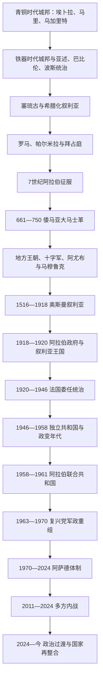

# 叙利亚

## 概括

叙利亚位于东地中海、安纳托利亚、两河流域与阿拉伯草原的交汇处。历史地理上的“叙利亚”或“大叙利亚”经常包括今天的黎巴嫩、约旦、巴勒斯坦及土耳其南部部分地区，因此不能把古代城邦、罗马行省或奥斯曼行省直接等同于现代叙利亚共和国。现代国界主要在奥斯曼帝国解体和法国委任统治时期形成。

这一地区先后出现埃卜拉、马里、乌加里特和阿拉米城邦，经历亚述、巴比伦、波斯、塞琉古、罗马和拜占庭统治。7世纪阿拉伯征服后，大马士革成为倭马亚哈里发国首都；阿拔斯迁都以后，叙利亚又成为地方王朝、拜占庭、十字军、赞吉—阿尤布政权和马穆鲁克争夺的边区。1516年奥斯曼征服开启四百年统治，第一次世界大战后的阿拉伯王国则被法国委任统治取代。

叙利亚于1946年完全独立。早期议会共和国因军队干政、地区精英竞争、阿以战争和冷战压力而频繁更替；1958—1961年同埃及组成阿拉伯联合共和国。复兴党1963年掌权，哈菲兹·阿萨德1970年建立以总统、党、军队和安全机构为支柱的长期体制，巴沙尔·阿萨德于2000年继任。2011年抗议演变为国际化内战。2024年12月阿萨德政权垮台后，叙利亚进入以艾哈迈德·沙拉为总统的过渡期；截至2026年7月13日，全国武装、地方行政与宪政秩序仍未完全整合。

## 演变图

## 历史主线

叙利亚史可以沿三条线理解：城市与商路把地中海和内陆相连；外来帝国、中央政府与地方社群持续协商或冲突；现代国家则在委任统治划界、军队政治、阿拉伯民族主义和区域战争中成形。2011年后的“叙利亚政府”“反对派”“库尔德主导自治行政”“外国军力”并非同一层级，2024年后的权力转移也不是一次性完成的统一。

## 时期导航

| 顺序 | 阶段 | 时间 | 简要概括 |
|---:|---|---|---|
| 1 | [古代叙利亚与伊斯兰时代](/%E4%BA%BA%E6%96%87%E7%A7%91%E5%AD%A6/%E5%8E%86%E5%8F%B2/%E8%A5%BF%E4%BA%9A/%E9%BB%8E%E5%87%A1%E7%89%B9/%E5%8F%99%E5%88%A9%E4%BA%9A/%E5%8F%A4%E4%BB%A3%E5%8F%99%E5%88%A9%E4%BA%9A%E4%B8%8E%E4%BC%8A%E6%96%AF%E5%85%B0%E6%97%B6%E4%BB%A3.md) | 约前3千纪—1516年 | 城邦文明、帝国行省、倭马亚首都及中世纪多方竞争。 |
| 2 | [奥斯曼叙利亚与法国委任统治](/%E4%BA%BA%E6%96%87%E7%A7%91%E5%AD%A6/%E5%8E%86%E5%8F%B2/%E8%A5%BF%E4%BA%9A/%E9%BB%8E%E5%87%A1%E7%89%B9/%E5%8F%99%E5%88%A9%E4%BA%9A/%E5%A5%A5%E6%96%AF%E6%9B%BC%E5%8F%99%E5%88%A9%E4%BA%9A%E4%B8%8E%E6%B3%95%E5%9B%BD%E5%A7%94%E4%BB%BB%E7%BB%9F%E6%B2%BB.md) | 1516—1946年 | 奥斯曼行省、阿拉伯王国、法国分区治理与独立运动。 |
| 3 | [独立、复兴党统治、内战与政治过渡](/%E4%BA%BA%E6%96%87%E7%A7%91%E5%AD%A6/%E5%8E%86%E5%8F%B2/%E8%A5%BF%E4%BA%9A/%E9%BB%8E%E5%87%A1%E7%89%B9/%E5%8F%99%E5%88%A9%E4%BA%9A/%E7%8B%AC%E7%AB%8B%E3%80%81%E5%A4%8D%E5%85%B4%E5%85%9A%E7%BB%9F%E6%B2%BB%E3%80%81%E5%86%85%E6%88%98%E4%B8%8E%E6%94%BF%E6%B2%BB%E8%BF%87%E6%B8%A1.md) | 1946年至今 | 政变共和国、复兴党与阿萨德体制、内战及2024年后过渡。 |

## 专题导航

| 专题 | 内容 |
|---|---|
| [叙利亚国家元首与政府首脑表](/%E4%BA%BA%E6%96%87%E7%A7%91%E5%AD%A6/%E5%8E%86%E5%8F%B2/%E8%A5%BF%E4%BA%9A/%E9%BB%8E%E5%87%A1%E7%89%B9/%E5%8F%99%E5%88%A9%E4%BA%9A/%E5%8F%99%E5%88%A9%E4%BA%9A%E5%9B%BD%E5%AE%B6%E5%85%83%E9%A6%96%E4%B8%8E%E6%94%BF%E5%BA%9C%E9%A6%96%E8%84%91%E8%A1%A8.md) | 法国高级专员、叙利亚国家元首、历届总理、代理与并立政权的实际权力。 |

## 重要转折与时间节点

| 时间 | 事件 | 意义 |
|---|---|---|
| 约前24世纪 | 埃卜拉王国及宫廷档案繁荣 | 显示叙利亚城邦已深度参与西亚贸易和外交。 |
| 前64年 | 罗马建立叙利亚行省 | 安条克、大马士革和帕尔米拉进入罗马东部体系。 |
| 636年 | 雅穆克河战役 | 拜占庭失去叙利亚大部，伊斯兰统治确立。 |
| 661年 | 倭马亚以大马士革为首都 | 叙利亚成为早期伊斯兰帝国政治核心。 |
| 1516年 | 马穆鲁克在达比克草原战败 | 叙利亚并入奥斯曼帝国。 |
| 1920年 | 迈萨隆战役与法军占领大马士革 | 阿拉伯叙利亚王国终结，法国分区治理确立。 |
| 1925—1927年 | 叙利亚大起义 | 跨地区反法运动推动统一与独立诉求。 |
| 1946年4月17日 | 法军撤离 | 叙利亚获得完整独立。 |
| 1949年 | 三次军事政变 | 军队成为共和国政治的决定性力量。 |
| 1958—1961年 | 阿拉伯联合共和国 | 泛阿拉伯统一理想与中央集权矛盾集中显现。 |
| 1963年 | 复兴党政变 | 党、军队和安全机构主导的秩序形成。 |
| 1970年 | “纠正运动” | 哈菲兹·阿萨德建立长期总统集权体制。 |
| 2011年 | 抗议、镇压与武装化 | 长期内战和国际介入开始。 |
| 2024年12月8日 | 阿萨德政权垮台 | 阿萨德家族统治终结，过渡机构接管中央政权。 |
| 2025—2026年 | 宪政过渡、议会重建与地方整合 | 新中央政府逐步恢复机构，但东北部和苏韦达等地整合尚未完成。 |

## 区域关系

- 直接上级：[黎凡特](/%E4%BA%BA%E6%96%87%E7%A7%91%E5%AD%A6/%E5%8E%86%E5%8F%B2/%E8%A5%BF%E4%BA%9A/%E9%BB%8E%E5%87%A1%E7%89%B9/README.md)；宏观区域：[西亚](/%E4%BA%BA%E6%96%87%E7%A7%91%E5%AD%A6/%E5%8E%86%E5%8F%B2/%E8%A5%BF%E4%BA%9A/README.md)。
- 倭马亚与早期哈里发国主线见[阿拉伯帝国](/%E4%BA%BA%E6%96%87%E7%A7%91%E5%AD%A6/%E5%8E%86%E5%8F%B2/%E8%A5%BF%E4%BA%9A/_%E9%80%9A%E5%8F%B2/%E9%98%BF%E6%8B%89%E4%BC%AF%E5%B8%9D%E5%9B%BD/README.md)。
- 奥斯曼整体主线见[奥斯曼帝国](/%E4%BA%BA%E6%96%87%E7%A7%91%E5%AD%A6/%E5%8E%86%E5%8F%B2/%E8%A5%BF%E4%BA%9A/%E5%9C%9F%E8%80%B3%E5%85%B6/%E5%A5%A5%E6%96%AF%E6%9B%BC%E5%B8%9D%E5%9B%BD/README.md)。
- 委任统治的跨黎凡特背景见[英法委任统治时期](/%E4%BA%BA%E6%96%87%E7%A7%91%E5%AD%A6/%E5%8E%86%E5%8F%B2/%E8%A5%BF%E4%BA%9A/%E9%BB%8E%E5%87%A1%E7%89%B9/%E8%8B%B1%E6%B3%95%E5%A7%94%E4%BB%BB%E7%BB%9F%E6%B2%BB%E6%97%B6%E6%9C%9F.md)。
- 大黎巴嫩及其独立过程见[黎巴嫩](/%E4%BA%BA%E6%96%87%E7%A7%91%E5%AD%A6/%E5%8E%86%E5%8F%B2/%E8%A5%BF%E4%BA%9A/%E9%BB%8E%E5%87%A1%E7%89%B9/%E9%BB%8E%E5%B7%B4%E5%AB%A9/README.md)。

## 目录层级

- 直接上级：[黎凡特](/%E4%BA%BA%E6%96%87%E7%A7%91%E5%AD%A6/%E5%8E%86%E5%8F%B2/%E8%A5%BF%E4%BA%9A/%E9%BB%8E%E5%87%A1%E7%89%B9/README.md)
- 宏观区域：[西亚](/%E4%BA%BA%E6%96%87%E7%A7%91%E5%AD%A6/%E5%8E%86%E5%8F%B2/%E8%A5%BF%E4%BA%9A/README.md)
- 历史总览：[历史](/%E4%BA%BA%E6%96%87%E7%A7%91%E5%AD%A6/%E5%8E%86%E5%8F%B2/README.md)
