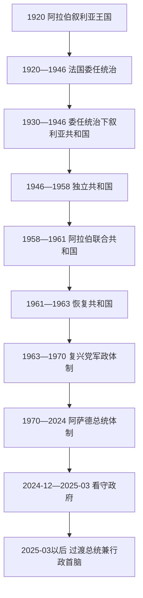

# 叙利亚国家元首与政府首脑表

## 范围与口径

本表从1920年阿拉伯叙利亚王国列至2026年7月13日，区分四类角色：叙利亚本地国家元首、法国委任统治的最高殖民行政首脑、独立后中央政府首脑，以及内战期间的并立或事实权力。日期按实际履职、政变接管或内阁交接计算；代理、集体机构、职位空缺和职位取消均单列。法国高级专员同叙利亚地方总统可以同时存在，因为前者掌握委任统治最高军政权，后者只在受限自治机构中履职。

2011年后反对派组织并非都自称“叙利亚国家元首”。全国联盟主要承担政治代表，叙利亚临时政府、救国政府和北部与东部叙利亚自治行政才拥有不同程度的行政或领土能力，因此另表说明，不把其领导人混入国际承认的中央总统序列。2025年3月29日起总理职位取消，过渡总统同时是国家元首和行政首脑。

## 制度演变图

## 1920年王国与委任统治下的叙利亚国家元首

| 顺序 | 人物 / 机构 | 职位 | 任期 | 产生方式、继任与实际地位 |
|---:|---|---|---|---|
| 1 | **费萨尔一世** | 阿拉伯叙利亚国王 | 1920年3月8日—7月28日 | 由叙利亚国民大会拥立；法军7月25日占领大马士革后离境，王国终结。 |
| — | 法国军事行政与分立政体 | 无统一叙利亚国家元首 | 1920年7月—1922年6月 | 法国高级专员分设大马士革、阿勒颇等邦，最高权力在法国当局。 |
| 2 | 苏卜希·巴拉卡特 | 叙利亚邦联总统；后为叙利亚国总统 | 1922年6月29日—1925年12月21日 | 先由邦联委员会选出，邦联1925年改组为叙利亚国；在大起义中辞职。 |
| — | 职位空缺 | — | 1925年12月21日—1926年2月9日 | 法国高级专员署直接控制。 |
| — | 皮埃尔-阿利普 | 高级专员特使、代管叙利亚国事务 | 1926年2月9日—4月29日 | 法国任命的临时行政首脑，不是民选总统。 |
| 3 | 艾哈迈德·纳米 | 叙利亚国元首 | 1926年4月29日—1928年2月14日 | 由法国高级专员任命；赦免部分起义者但未取得完整主权。 |
| 4 | 塔杰丁·哈萨尼 | 部长会议主席、代行国家元首 | 1928年2月14日—1931年11月19日 | 以政府首脑身份主持国家事务，法国仍可否决宪政。 |
| — | 法国高级专员直接管理 | 无本地国家元首 | 1931年11月19日—1932年6月11日 | 为1930年宪法生效与总统选举之间的过渡。 |
| 5 | 穆罕默德·阿里·阿比德 | 叙利亚共和国总统 | 1932年6月11日—1936年12月21日 | 议会选举；委任统治下首任共和国总统。 |
| 6 | **哈希姆·阿塔西** | 叙利亚共和国总统 | 1936年12月21日—1939年7月8日 | 国民集团领袖；法叙条约不获法国批准后辞职。 |
| 7 | 巴希杰·哈提卜 | 总理事会主席、代行国家元首 | 1939年7月8日—1941年4月2日 | 法国暂停宪法后任命，实际受高级专员控制。 |
| 8 | 哈立德·阿兹姆 | 叙利亚政府首脑、代行国家元首 | 1941年4月2日—9月16日 | 二战期间短期过渡；自由法国进入后更替。 |
| 9 | 塔杰丁·哈萨尼 | 叙利亚共和国总统 | 1941年9月16日—1943年1月17日 | 由自由法国当局支持任命，在任内去世。 |
| 10 | 贾米勒·乌尔希 | 部长会议主席、代行国家元首 | 1943年1月17日—3月25日 | 哈萨尼去世后的临时接任。 |
| 11 | 阿塔·阿尤比 | 国家元首兼政府首脑 | 1943年3月25日—8月17日 | 组织选举并向民选总统交权。 |
| 12 | **舒克里·库瓦特利** | 叙利亚共和国总统 | 1943年8月17日—1949年3月30日 | 议会选举；1946年4月17日法军撤离，其任期跨越委任统治和完全独立，1949年政变被推翻。 |

## 法国在黎凡特的最高行政首脑

| 顺序 | 高级专员 / 自由法国总代表 | 任期 | 实际权力与说明 |
|---:|---|---|---|
| 1 | **亨利·古罗** | 1919年10月9日—1922年11月23日 | 指挥迈萨隆战役后占领，建立大黎巴嫩及叙利亚分区。 |
| — | 罗贝尔·德凯（代理） | 1922年11月23日—1923年4月19日 | 高级专员署代理首脑。 |
| 2 | 马克西姆·魏刚 | 1923年4月19日—1924年11月29日 | 委任统治正式生效后继续邦联和分区治理。 |
| 3 | 莫里斯·萨赖 | 1924年11月29日—1925年12月23日 | 叙利亚大起义初期以军事镇压和炮击应对，后被召回。 |
| 4 | 亨利·德·儒弗内尔 | 1925年12月23日—1926年6月23日 | 尝试赦免、谈判与军事镇压并用。 |
| 5 | **亨利·蓬索** | 1926年8月—1933年7月13日 | 大起义后恢复秩序，监督1928制宪与1930共和国建立。 |
| 6 | 达米安·德·马泰尔 | 1933年7月16日—1938年10月22日 | 面对1936总罢工并签署法叙条约，但条约未获法国议会批准。 |
| 7 | 加布里埃尔·皮奥 | 1938年10月22日—1940年11月 | 暂停叙利亚宪法，并处理亚历山大勒塔转为哈塔伊及并入土耳其。 |
| — | 让·基亚普 | 1940年11月24—27日 | 获任命但赴任途中座机被击落，未实际建立统治。 |
| 8 | 亨利·登茨 | 1940年12月6日—1941年7月14日 | 代表维希法国；英军和自由法国进攻后投降撤离。 |
| 9 | **乔治·卡特鲁** | 1941年6月24日—1943年6月7日 | 自由法国总代表；同维希当局短暂重叠，宣布承认叙利亚独立但保留关键军权。 |
| 10 | 让·埃勒 | 1943年6月7日—11月23日 | 同新选出的叙利亚政府围绕主权移交冲突。 |
| 11 | 伊夫·沙泰涅 | 1943年11月23日—1944年1月23日 | 短期过渡总代表。 |
| 12 | 保罗·贝内 | 1944年1月23日—1946年9月1日 | 任内发生1945年大马士革危机；法军1946年4月17日撤离，专员职位稍后正式撤销。 |

1926年6月至8月、1933年7月13日至16日等短暂交接期由高级专员署维持日常事务，不另计正式任次。

## 独立后、阿联与过渡期国家元首

| 顺序 | 人物 / 机构 | 法定职位 | 任期 | 与前任关系及实际权力 |
|---:|---|---|---|---|
| 1 | **舒克里·库瓦特利** | 总统 | 1946年4月17日—1949年3月30日 | 完全独立后的首任总统；胡斯尼·扎伊姆政变推翻。 |
| 2 | 胡斯尼·扎伊姆 | 武装部队总司令；后任总统 | 1949年3月30日—8月14日 | 政变掌权，6月26日起正式任总统；被欣纳维政变推翻并处决。 |
| — | 萨米·欣纳维 | 武装部队总司令、事实最高权力 | 1949年8月14—15日 | 政变首脑，迅速把法定行政交给阿塔西；仍控制军队。 |
| 3 | **哈希姆·阿塔西** | 总理代国家元首；国家元首；总统 | 1949年8月15日—1951年12月2日 | 先由军方任命，后由制宪会议选出；希沙克利军事接管后辞职。 |
| — | 阿迪卜·希沙克利 | 总参谋长、最高军事委员会主席 | 1951年12月2—3日 | 发动第二次全面接管，随即安排塞卢任名义元首。 |
| 4 | 法乌齐·塞卢 | 国家元首 | 1951年12月3日—1953年7月11日 | 名义元首，实际权力在希沙克利。 |
| 5 | **阿迪卜·希沙克利** | 总统 | 1953年7月11日—1954年2月26日 | 把事实军事统治转为总统职位；军队与反对派联合迫使其辞职。 |
| — | 马蒙·库兹巴里 | 众议院议长代国家元首 | 1954年2月26—28日 | 宪法顺位短期代理。 |
| 6 | **哈希姆·阿塔西** | 总统 | 1954年2月28日—1955年9月6日 | 恢复1951年被中断的总统任期。 |
| 7 | **舒克里·库瓦特利** | 总统 | 1955年9月6日—1958年2月22日 | 再次当选；叙埃合并后把国家元首权交给纳赛尔。 |
| 8 | 贾迈勒·阿卜杜-纳赛尔 | 阿拉伯联合共和国总统 | 1958年2月22日—1961年9月29日 | 开罗为中心的统一国家元首；叙利亚分离政变后失去当地权力。 |
| 9 | 马蒙·库兹巴里 | 总理兼代国家元首 | 1961年9月29日—11月20日 | 分离政变后接管。 |
| 10 | 伊扎特·努斯 | 总理兼代国家元首 | 1961年11月20日—12月14日 | 过渡至总统选举。 |
| 11 | 纳齐姆·库德西 | 总统 | 1961年12月14日—1963年3月8日 | 议会共和国总统；复兴党军事委员会发动政变推翻。 |
| — | 全国革命指挥委员会 | 集体国家元首 | 1963年3月8—23日 | 政变后集体机构，实际核心为复兴党军事委员会。 |
| 12 | 卢埃·阿塔西 | 全国革命指挥委员会主席 | 1963年3月23日—7月27日 | 复兴党与纳赛尔派联盟时期；清洗纳赛尔派后辞职。 |
| 13 | 阿明·哈菲兹 | 革命指挥委员会主席；总统委员会主席 | 1963年7月27日—1966年2月23日 | 复兴党元老派法定首脑；1966年党内军事政变推翻。 |
| — | 复兴党临时地区领导机构 | 集体国家元首 | 1966年2月23—25日 | 政变两日过渡。 |
| 14 | 努尔丁·阿塔西 | 国家元首 | 1966年2月25日—1970年11月18日 | 法定首脑；萨拉赫·贾迪德掌党务和实际最高权力，后被哈菲兹·阿萨德推翻。 |
| 15 | 艾哈迈德·哈提卜 | 国家元首 | 1970年11月18日—1971年2月22日 | “纠正运动”后的过渡元首，实权在哈菲兹。 |
| 16 | **哈菲兹·阿萨德** | 先以总理代国家元首；后任总统 | 1971年2月22日—2000年6月10日 | 3月14日起正式总统；统合党、军队和安全机构，在任内去世。 |
| — | 阿卜杜勒-哈利姆·哈达姆 | 第一副总统代总统 | 2000年6月10日—7月17日 | 哈菲兹去世后的宪法代理，组织继任。 |
| 17 | **巴沙尔·阿萨德** | 总统 | 2000年7月17日—2024年12月8日 | 哈菲兹之子；经修宪、公投及后续选举延续家族统治，反对派进入大马士革后逃亡。 |
| — | 艾哈迈德·沙拉 | 军事行动指挥部领导人、事实中央最高权力 | 2024年12月8日—2025年1月29日 | 未有正式国家元首任命，以胜利武装领袖身份主导看守政府和安全决策。 |
| 18 | **艾哈迈德·沙拉** | 过渡期总统；2025年3月后兼行政首脑 | 2025年1月29日至今 | 由参会武装派别任命；截至2026年7月13日在任，未经过全民总统选举。 |

## 1920—1946年王国与委任统治下的政府首脑

此表列王国、法国接管初期、叙利亚邦联 / 叙利亚国及委任统治下共和国的中央政府首脑。职位虽称总理或部长会议主席，但高级专员保留解散、任命、财政和军事控制权。日期与上面的国家元首表可能重叠，因为部分人物兼任两职。

| 任次 | 政府首脑 | 任期 | 性质与关键说明 |
|---:|---|---|---|
| 1 | 里达·帕夏·里卡比 | 1920年3月8日—5月3日 | 阿拉伯叙利亚王国首任正式总理；此前任大马士革军事长官。 |
| — | 哈希姆·阿塔西（代理） | 1920年5月3日—7月26日 | 王国末期代理；法军占领大马士革后短暂延续。 |
| 2 | 阿拉丁·德鲁比 | 1920年7月26日—8月21日 | 法军接管后组阁；赴南部征税和谈判途中遇袭身亡。 |
| — | 职位空缺 | 1920年8月21日—9月6日 | 法国军事行政直接维持。 |
| 3 | 贾米勒·乌尔希 | 1920年9月6日—11月30日 | 大马士革邦初期政府。 |
| — | 哈基·阿兹姆（代理） | 1920年12月1日—1922年6月28日 | 分区统治下大马士革行政首脑。 |
| 4 | 苏卜希·巴拉卡特 | 1922年6月28日—1925年12月21日 | 兼具邦联总统和政府首脑地位，任期跨叙利亚邦联与叙利亚国。 |
| — | 职位空缺 | 1925年12月21—29日 | 大起义中的政府危机。 |
| — | 塔杰丁·哈萨尼（代理） | 1925年12月29日—1926年1月6日 | 无正式内阁的短期代理。 |
| — | 职位空缺 | 1926年1月6日—4月28日 | 高级专员署直接掌行政。 |
| 5 | 艾哈迈德·纳米 | 1926年4月28日—1928年2月9日 | 兼叙利亚国元首；5月4日后组成正式内阁。 |
| — | 职位空缺 | 1928年2月9日—4月15日 | 组阁空档。 |
| 6 | 塔杰丁·哈萨尼 | 1928年4月15日—1931年11月19日 | 任期跨1928制宪和1930共和国成立。 |
| — | 莱昂·索洛米亚克（代理） | 1931年11月19日—1932年6月11日 | 法国官员代行政府首脑，监督总统选举过渡。 |
| 7 | 哈基·阿兹姆 | 1932年6月7日—1934年3月16日 | 穆罕默德·阿里·阿比德总统下的首届共和国政府。 |
| 8 | 塔杰丁·哈萨尼 | 1934年3月16日—1936年2月22日 | 1936年总罢工后辞职。 |
| 9 | 阿塔·阿尤比 | 1936年2月22日—12月21日 | 过渡内阁主持法叙谈判和议会选举。 |
| 10 | 贾米勒·马尔达姆 | 1936年12月21日—1939年2月23日 | 国民集团政府；因亚历山大勒塔 / 哈塔伊危机辞职。 |
| 11 | 卢特菲·哈法尔 | 1939年2月23日—4月5日 | 哈塔伊抗议中的短期内阁。 |
| 12 | 纳苏希·布哈里 | 1939年4月5日—7月4日 | 未能平息领土危机；5月中旬后无完整内阁。 |
| — | 巴希杰·哈提卜（代理） | 1939年7月4日—1941年4月4日 | 法国暂停宪法后任命，兼代国家元首。 |
| 13 | 哈立德·阿兹姆 | 1941年4月4日—9月21日 | 任内发生英军和自由法国进攻维希黎凡特。 |
| 14 | 哈桑·哈基姆 | 1941年9月21日—1942年4月19日 | 自由法国承诺独立后的首届政府之一。 |
| 15 | 胡斯尼·巴拉齐 | 1942年4月19日—1943年1月10日 | 二战时期政府。 |
| 16 | 贾米勒·乌尔希 | 1943年1月10日—3月25日 | 塔杰丁去世前后，兼短期代国家元首。 |
| 17 | 阿塔·阿尤比 | 1943年3月25日—8月19日 | 主持议会与总统选举。 |
| 18 | 萨阿达拉·贾比里 | 1943年8月19日—1944年10月14日 | 民选民族主义政府首脑。 |
| 19 | 法里斯·胡里 | 1944年10月14日—1945年10月1日 | 推进国际承认、加入联合国及主权交涉。 |
| 20 | 萨阿达拉·贾比里 | 1945年10月1日—1946年4月17日 | 任期跨法国撤军；独立后继续任总理至12月16日。 |

## 独立后的中央政府首脑

下表从1946年完全独立列起。“任次”是本表的时间顺序，不等同官方人物编号；同一人物复任时再次出现。阿联时期所列为叙利亚地区执行委员会负责人，不是独立国家总理。

### 1946—1961年

| 任次 | 政府首脑 | 任期 | 性质与关键说明 |
|---:|---|---|---|
| 1 | 萨阿达拉·贾比里 | 1946年4月17日—12月16日 | 内阁始于1945年，跨越法军撤离；任内去职。 |
| — | 哈立德·阿兹姆（代理） | 1946年12月16—29日 | 贾比里离任后的短期代理。 |
| 2 | 贾米勒·马尔达姆 | 1946年12月29日—1948年12月17日 | 1948年战争和内阁危机时期。 |
| 3 | 哈立德·阿兹姆 | 1948年12月17日—1949年3月30日 | 扎伊姆政变推翻。 |
| 4 | 胡斯尼·扎伊姆 | 1949年3月30日—6月26日 | 兼掌军政，初期没有常规内阁。 |
| 5 | 穆赫辛·巴拉齐 | 1949年6月26日—8月14日 | 扎伊姆盟友；随政变被处决。 |
| 6 | 哈希姆·阿塔西 | 1949年8月14日—12月24日 | 欣纳维政变后主持文官过渡。 |
| 7 | 纳齐姆·库德西 | 1949年12月24—27日 | 三日内阁。 |
| 8 | 哈立德·阿兹姆 | 1949年12月27日—1950年6月4日 | 制宪过渡。 |
| 9 | 纳齐姆·库德西 | 1950年6月4日—1951年3月27日 | 任期跨越1950年宪法生效。 |
| 10 | 哈立德·阿兹姆 | 1951年3月27日—8月9日 | 文官竞争与军方压力并存。 |
| 11 | 哈桑·哈基姆 | 1951年8月9日—11月13日 | 短期文官内阁。 |
| — | 扎基·哈提卜（代理） | 1951年11月13—28日 | 哈基姆离任后的代理。 |
| 12 | 马鲁夫·达瓦利比 | 1951年11月28—29日 | 希沙克利政变终止；内阁名义延续至12月1日。 |
| — | 职位空缺 | 1951年11月29日—12月3日 | 军事接管。 |
| 13 | 法乌齐·塞卢 | 1951年12月3日—1953年7月19日 | 名义政府首脑，实权在希沙克利；部分时期无正式内阁。 |
| — | 总理职位取消 | 1953年7月19日—1954年3月1日 | 希沙克利总统直接掌行政。 |
| 14 | 萨卜里·阿萨利 | 1954年3月1日—6月19日 | 希沙克利倒台后恢复议会政府。 |
| 15 | 赛义德·加齐 | 1954年6月19日—11月3日 | 选举过渡。 |
| 16 | 法里斯·胡里 | 1954年11月3日—1955年2月13日 | 人民党内阁。 |
| 17 | 萨卜里·阿萨利 | 1955年2月13日—9月13日 | 库瓦特利复任总统前后。 |
| 18 | 赛义德·加齐 | 1955年9月13日—1956年6月14日 | 冷战和阿拉伯民族主义升温。 |
| 19 | 萨卜里·阿萨利 | 1956年6月14日—1958年2月1日 | 走向同埃及合并；内阁名义延至3月6日。 |
| — | 职位空缺 | 1958年2月1—22日 | 合并制度交接。 |
| — | 阿联叙利亚地区未设对应职位 | 1958年2月22日—10月7日 | 行政直接重组。 |
| 20 | 努尔丁·卡哈拉 | 1958年10月7日—1960年9月20日 | 叙利亚地区执行委员会负责人，受纳赛尔中央政府领导。 |
| 21 | 阿卜杜勒-哈米德·萨拉杰 | 1960年9月20日—1961年8月16日 | 叙利亚地区行政和安全核心。 |
| — | 职位空缺 | 1961年8月16日—9月28日 | 阿联末期行政真空。 |

### 1961—1970年

| 任次 | 政府首脑 | 任期 | 性质与关键说明 |
|---:|---|---|---|
| 22 | 马蒙·库兹巴里 | 1961年9月29日—11月20日 | 分离政变后兼代国家元首。 |
| 23 | 伊扎特·努斯 | 1961年11月20日—12月14日 | 兼代国家元首，内阁名义延至12月22日。 |
| — | 职位空缺 | 1961年12月14—22日 | 总统选出后的组阁空档。 |
| 24 | 马鲁夫·达瓦利比 | 1961年12月22日—1962年3月28日 | 政变中下台。 |
| — | 职位空缺 | 1962年3月28日—4月16日 | 军政过渡。 |
| 25 | 巴希尔·阿兹马 | 1962年4月16日—9月17日 | 恢复文官内阁。 |
| 26 | 哈立德·阿兹姆 | 1962年9月17日—1963年3月9日 | 3月8日政变后数小时仍名义留任。 |
| 27 | 萨拉赫丁·比塔尔 | 1963年3月9日—5月11日 | 复兴党首届内阁。 |
| — | 萨米·君迪（代理） | 1963年5月11—13日 | 两日代理。 |
| 28 | 萨拉赫丁·比塔尔 | 1963年5月13日—11月11日 | 第二次组阁。 |
| 29 | 阿明·哈菲兹 | 1963年11月12日—1964年5月13日 | 同时为国家最高军政领导之一。 |
| 30 | 萨拉赫丁·比塔尔 | 1964年5月14日—10月3日 | 第三次任期。 |
| 31 | 阿明·哈菲兹 | 1964年10月4日—1965年9月22日 | 总统委员会与内阁权力集中。 |
| 32 | 优素福·祖阿因 | 1965年9月22日—12月21日 | 激进国有化阶段；内阁名义延至12月27日。 |
| — | 职位空缺 | 1965年12月21日—1966年1月1日 | 组阁空档。 |
| 33 | 萨拉赫丁·比塔尔 | 1966年1月1日—2月23日 | 复兴党元老派末届内阁，被党内政变推翻。 |
| — | 职位空缺 | 1966年2月23日—3月1日 | 政变过渡。 |
| 34 | 优素福·祖阿因 | 1966年3月1日—1968年10月29日 | 新复兴党激进派内阁。 |
| 35 | 努尔丁·阿塔西 | 1968年10月29日—1970年11月18日 | 兼国家元首，实际最高权力多在萨拉赫·贾迪德。 |
| — | 职位空缺 | 1970年11月18—21日 | “纠正运动”交接。 |
| 36 | **哈菲兹·阿萨德** | 1970年11月21日—1971年4月3日 | 先以总理整合政权，后转任总统。 |

### 1971—2025年

| 任次 | 政府首脑 | 任期 | 性质与关键说明 |
|---:|---|---|---|
| 37 | 阿卜杜勒-拉赫曼·赫莱法维 | 1971年4月3日—1972年12月21日 | 阿萨德总统下的行政内阁。 |
| 38 | 马哈茂德·阿尤比 | 1972年12月21日—1976年8月7日 | 1973年战争和黎巴嫩介入初期。 |
| 39 | 阿卜杜勒-拉赫曼·赫莱法维 | 1976年8月7日—1978年3月27日 | 第二次任期。 |
| 40 | 穆罕默德·阿里·哈拉比 | 1978年3月27日—1980年1月9日 | 国内暴力升级期。 |
| 41 | 阿卜杜勒-拉乌夫·卡斯姆 | 1980年1月9日—1987年11月1日 | 哈马冲突、经济紧缩和总统继承危机时期。 |
| 42 | 马哈茂德·祖阿比 | 1987年11月1日—2000年3月7日 | 阿萨德后期最长任总理。 |
| 43 | 穆罕默德·穆斯塔法·米鲁 | 2000年3月7日—2003年9月10日 | 跨越哈菲兹去世和巴沙尔继任。 |
| 44 | 穆罕默德·纳吉·奥特里 | 2003年9月10日—2011年4月14日 | 市场化与起义爆发初期。 |
| 45 | 阿迪勒·萨法尔 | 2011年4月14日—2012年6月23日 | 起义军事化阶段。 |
| 46 | 里亚德·希贾卜 | 2012年6月23日—8月6日 | 任内叛逃反对派。 |
| — | 奥马尔·加拉万吉（代理） | 2012年8月6—9日 | 三日代理。 |
| 47 | 瓦埃勒·哈勒基 | 2012年8月9日—2016年7月3日 | 内战全面化和俄罗斯介入初期。 |
| 48 | 伊马德·哈米斯 | 2016年7月3日—2020年6月11日 | 政府反攻和经济恶化。 |
| 49 | 侯赛因·阿尔努斯 | 2020年6月11日—2024年9月14日 | 战线冻结与经济崩溃。 |
| 50 | 穆罕默德·加齐·贾拉利 | 2024年9月14日—12月8日 | 阿萨德时期末任总理。 |
| — | 穆罕默德·加齐·贾拉利（看守） | 2024年12月8—10日 | 阿萨德出逃后维持行政并向新当局交接。 |
| 51 | **穆罕默德·巴希尔** | 2024年12月10日—2025年3月29日 | 由伊德利卜救国政府转任全国看守总理。 |
| — | 总理职位取消 | 2025年3月29日至今 | 过渡宪法宣言下，总统兼行政首脑，内阁以秘书长协调。 |

## 内战时期的并立政府与事实权力

### 叙利亚临时政府

该政府由反对派全国联盟建立，实际行政主要依靠土耳其支持区和地方议会；“全国联盟主席”是政治代表，不等同国家总统。

| 顺序 | 政府首脑 | 任期 | 实际辖区与结局 |
|---:|---|---|---|
| 1 | 加桑·希托 | 2013年3月19日—7月8日 | 获选但未能在叙利亚境内建立稳定内阁，辞职。 |
| 2 | 艾哈迈德·图马 | 2013年9月14日—2016年5月17日 | 2014年曾被解职后复任；行政能力受地方武装和外部赞助限制。 |
| 3 | 贾瓦德·阿布·哈塔卜 | 2016年5月17日—2019年3月10日 | 在阿扎兹等土耳其影响区运作，并参与组建叙利亚国民军。 |
| — | 过渡空档 | 2019年3月10日—6月30日 | 全国联盟重新选任政府首脑。 |
| 4 | 阿卜杜勒-拉赫曼·穆斯塔法 | 2019年6月30日—2025年1月30日 | 依托土耳其支持区；阿萨德倒台后把人员与权限移交大马士革看守政府。 |

### 叙利亚救国政府

救国政府在沙姆解放组织优势下治理伊德利卜。形式上设舒拉委员会和文官内阁，安全、战争与战略决策长期受沙姆解放组织及沙拉影响。

| 顺序 | 总理 | 任期 | 关键说明 |
|---:|---|---|---|
| 1 | 穆罕默德·谢赫 | 2017年11月2日—2018年8月18日 | 首届救国政府。 |
| — | 看守与组阁期 | 2018年8月18日—12月10日 | 机构调整。 |
| 2 | 法瓦兹·希拉勒 | 2018年12月10日—2019年11月18日 | 行政部门合并重组。 |
| 3 | 阿里·凯达 | 2019年11月18日—2024年1月13日 | 战线冻结期扩展税务、公共服务和地方行政。 |
| 4 | **穆罕默德·巴希尔** | 2024年1月13日—12月10日 | 反对派攻势时任总理；政权垮台后转任全国看守总理。 |

### 东北自治行政、叙利亚民主力量与其他事实权力

| 力量 / 地区 | 时段 | 主要领导或权力中心 | 名义与实际关系 |
|---|---|---|---|
| 库尔德自治州与北叙联邦尝试 | 2014—2018年 | 民主联盟党、人民保护部队；2016—2018年联邦执行委员会共同主席赫迪娅·优素福、曼苏尔·塞卢姆 | 以共同主席和地方议会治理，未获大马士革承认为联邦实体。 |
| 北部与东部叙利亚自治行政 | 2018—2026年整合期 | 文官共同主席机构；叙利亚民主委员会负责政治代表；马兹卢姆·阿卜迪任叙利亚民主力量总司令 | 文官机构法定管理公共事务，军事实力和对外谈判主要依托叙利亚民主力量；2025、2026年协议后分阶段并入中央。 |
| “伊斯兰国”领土政权 | 2014—2019年 | 阿布·贝克尔·巴格达迪自称“哈里发” | 在拉卡和叙伊边境实施恐怖统治，不获合法承认；2019年连续领土被消灭，后继者只领导地下组织。 |
| 复兴党政府控制区 | 2011—2024年 | 巴沙尔·阿萨德为法定总统；军队、安全机构、俄罗斯与伊朗支持网络共同维持 | 在联合国席位和多数国家外交中仍代表叙利亚，但不能在反对派、东北和外国占领区行使有效行政。 |
| 2024年12月后的中央 | 2024年12月8日以后 | 沙拉和军事行动指挥部先掌事实权力；2025年1月后转为过渡总统制 | 临时政府与救国政府先后移交；武装编制整合和地方权力移交仍慢于法定统一。 |
| 苏韦达地方武装 | 2025年至今 | 多个德鲁兹地方派别、宗教领袖和社区安全组织，没有统一国家级政府首脑 | 反对中央直接控制；截至2026年7月仍是法定中央主权与地方事实控制分离最明显地区。 |

## 2025—2026年过渡国家的权力配置

| 机构 | 负责人 / 组成 | 截至2026年7月13日的权限 |
|---|---|---|
| 总统 | **艾哈迈德·沙拉** | 国家元首、武装力量最高统帅和行政首脑；任命部长、高级官员及部分议员。 |
| 总理 | 无 | 2025年3月29日取消，不能把内阁秘书长误写成总理。 |
| 内阁 | 2025年3月29日成立的过渡政府，后有局部人事调整 | 各部长直接对总统负责；秘书长负责协调，不形成独立于总统的政府首脑。 |
| 人民议会 | 210席；140席由地区选举团产生、70席由总统任命 | 2026年7月12日开议，阿卜杜勒-哈米德·阿瓦克任议长；任期30个月，苏韦达地区选举尚缺。 |
| 国防与内政系统 | 原反对派编入国防部；地方警力、旧军人和东北阿萨伊什分轨审查 | 法定统一已经宣布，实际指挥、训练、问责和东北人员并轨仍在进行。 |
| 东北整合谈判 | 总统沙拉与叙利亚民主力量总司令马兹卢姆·阿卜迪 | 2026年中央已收回原自治行政大部分辖区；哈塞克、卡米什利等地仍采取分阶段移交。 |
| 苏韦达 | 法定由中央政府任命省级机构 | 德鲁兹武装实际控制多地，尚未完成解除武装和行政统一。 |

## 相关笔记

- 委任统治的形成与独立过程：[奥斯曼叙利亚与法国委任统治](/%E4%BA%BA%E6%96%87%E7%A7%91%E5%AD%A6/%E5%8E%86%E5%8F%B2/%E8%A5%BF%E4%BA%9A/%E9%BB%8E%E5%87%A1%E7%89%B9/%E5%8F%99%E5%88%A9%E4%BA%9A/%E5%A5%A5%E6%96%AF%E6%9B%BC%E5%8F%99%E5%88%A9%E4%BA%9A%E4%B8%8E%E6%B3%95%E5%9B%BD%E5%A7%94%E4%BB%BB%E7%BB%9F%E6%B2%BB.md)。
- 政变、复兴党、内战和过渡权力：[独立、复兴党统治、内战与政治过渡](/%E4%BA%BA%E6%96%87%E7%A7%91%E5%AD%A6/%E5%8E%86%E5%8F%B2/%E8%A5%BF%E4%BA%9A/%E9%BB%8E%E5%87%A1%E7%89%B9/%E5%8F%99%E5%88%A9%E4%BA%9A/%E7%8B%AC%E7%AB%8B%E3%80%81%E5%A4%8D%E5%85%B4%E5%85%9A%E7%BB%9F%E6%B2%BB%E3%80%81%E5%86%85%E6%88%98%E4%B8%8E%E6%94%BF%E6%B2%BB%E8%BF%87%E6%B8%A1.md)。
- 总入口：[叙利亚](/%E4%BA%BA%E6%96%87%E7%A7%91%E5%AD%A6/%E5%8E%86%E5%8F%B2/%E8%A5%BF%E4%BA%9A/%E9%BB%8E%E5%87%A1%E7%89%B9/%E5%8F%99%E5%88%A9%E4%BA%9A/README.md)。
