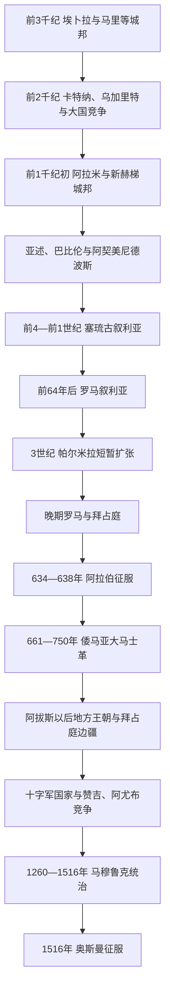

# 古代叙利亚与伊斯兰时代

## 时间

约前3千纪—1516年

## 概括

现代叙利亚处在地中海港口、安纳托利亚山口、幼发拉底河谷、两河平原和阿拉伯草原之间。这里长期不是孤立的单一王国，而是城邦网络、商队路线、帝国行省和边疆军区的叠合地带。埃卜拉、马里、乌加里特和卡特纳分别代表内陆宫廷、河谷节点与海港贸易；安条克、大马士革、阿勒颇和帕尔米拉后来又成为希腊化、罗马和伊斯兰世界的重要城市。

## 演进图

## 青铜时代城邦

### 埃卜拉与马里

- 埃卜拉约在前24世纪形成强大的宫廷国家，其档案记录贡赋、外交婚姻、宗教与远距离贸易，显示叙利亚北部已连接美索不达米亚、安纳托利亚和地中海。王国数次毁灭和重建，说明城邦繁荣依赖商路、农业腹地及在强邻之间维持联盟。
- 幼发拉底河畔的马里控制河运和沙漠商路。前18世纪，马里王齐姆里-林建立广泛外交网络；巴比伦王汉谟拉比先结盟后征服并摧毁马里，河谷政治中心随之转移。
- 内陆卡特纳等城市处在埃及、米坦尼与赫梯争夺带。当地统治者通常同时依靠宫廷仓储、附属乡村、战车贵族和跨国婚姻维持权力。

### 乌加里特与晚期青铜时代体系

乌加里特是现代叙利亚海岸的港口王国，受埃及、米坦尼和赫梯势力交替影响。其档案使用多种语言，乌加里特字母楔形文字则体现本地书写创新。约前12世纪初，东地中海贸易、宫廷财政和区域安全同时崩解，乌加里特被毁；海上袭击、内部危机和大国体系瓦解共同作用，不能归因于单一“海上民族”。

## 铁器时代城邦与帝国征服

晚期青铜时代崩溃后，叙利亚北部出现多个新赫梯政权，内陆则形成大马士革、哈马、阿尔帕德等阿拉米城邦。阿拉米语逐渐成为跨地区通用语。城邦可凭灌溉农业、商路关税和联盟短期崛起，却难以抵挡拥有常备军、攻城技术和行省制度的新亚述帝国。

前8世纪，新亚述逐步吞并阿尔帕德、大马士革与哈马，把人口迁徙、贡赋和行省治理结合起来。亚述灭亡后，地区先归新巴比伦，前539年后进入阿契美尼德波斯体系。波斯通过总督辖区、地方城市与王家道路间接治理，沿海、内陆和幼发拉底河谷仍保有不同社会结构。

## 希腊化与罗马—拜占庭时期

### 塞琉古叙利亚

亚历山大东征后，继业者长期争夺叙利亚。塞琉古一世约前300年营建安条克、塞琉西亚、阿帕米亚和拉奥迪基亚等城市，以希腊—马其顿移民城市、王室土地和本地社群共同支撑王朝。叙利亚既是塞琉古王朝核心，也是与托勒密埃及反复交战的边区。王位内斗、东西两线战争、罗马扩张与地方独立削弱王朝，亚美尼亚王提格兰二世一度占领叙利亚；前64年庞培终结塞琉古残余政权。

### 罗马行省与帕尔米拉

罗马叙利亚由总督、驻军、税收体系和享有不同自治权的城市组成。安条克是帝国东部政治与军事中心，大马士革和阿勒颇连接商路，帕尔米拉则以商队税、跨沙漠网络和本地贵族议事结构繁荣。3世纪罗马陷入危机时，奥登纳图斯以罗马盟友身份抵抗萨珊波斯；其遗孀芝诺比娅控制叙利亚、埃及和小亚细亚部分地区，272年被奥勒良击败。帕尔米拉的失败源于罗马中央恢复兵力、扩张战线过长和联盟基础有限。

晚期罗马把庞大行省拆分，加强边防和税制。安条克成为重要基督教中心，叙利亚语传统、希腊语城市文化、修道院和不同基督教派并存。拜占庭以要塞、城市和加萨尼德阿拉伯盟友守卫沙漠边疆。6—7世纪同萨珊波斯的长期战争反复破坏安条克、大马士革等地；拜占庭虽在628年前后恢复失地，财政、军队和地方认同已严重受损。

## 阿拉伯征服与倭马亚大马士革

634年后，哈里发军队沿约旦河谷和沙漠边缘进入叙利亚。636年雅穆克河战役摧毁拜占庭在该区的主力，此后大马士革、霍姆斯、阿勒颇相继纳入统治。征服并非人口和宗教立即更替：早期行政仍借用既有税务人员，基督徒、犹太人与新来的阿拉伯部族长期共存，阿拉伯化和伊斯兰化历经数世纪。

穆阿维叶于661年建立倭马亚哈里发国，以大马士革为首都。叙利亚各军区及其部族军队构成王朝支柱；阿卜杜勒-马利克时期推进货币、行政语言和中央财政改革，大马士革倭马亚清真寺则体现帝国资源与城市象征的结合。王朝鼎盛依靠叙利亚军团、地中海—内陆税源和统一行政，但远距离扩张成本、部族派系、继承争端与各地反对力量持续积累。750年阿拔斯革命推翻倭马亚，政治中心迁往伊拉克，叙利亚从帝国核心转为重要行省和边疆。

## 阿拔斯以后与十字军时代

9世纪以后，阿拔斯中央权力减弱，叙利亚先后受埃及的图伦、伊赫什德和法蒂玛政权，以及阿勒颇的哈姆丹王朝、塞尔柱诸侯和地方军事家控制。拜占庭一度恢复北部攻势，阿勒颇等城市常以纳贡、结盟和更换宗主维持生存。频繁更替并不意味着城市生活中断，市场、宗教基金、手工业和学术网络仍能跨政权延续。

1098年第一次十字军东征建立安条克公国，随后沿海堡垒和内陆城市形成长期对峙。大马士革、阿勒颇诸政权起初彼此竞争；赞吉及其子努尔丁逐步整合北叙利亚，努尔丁1154年进入大马士革，形成对十字军更连贯的战线。萨拉丁1174年控制大马士革，随后把埃及和叙利亚纳入阿尤布家族统治，并在1187年哈丁战役后重创耶路撒冷王国。阿尤布政权采用家族分封，继承时常分裂，但可借宗族谈判重新联合。

## 蒙古冲击、马穆鲁克与奥斯曼征服

1258年蒙古攻陷巴格达后继续西进，1260年夺取阿勒颇和大马士革。埃及马穆鲁克在同年的艾因·贾鲁战役击败蒙古军，继而恢复对叙利亚的控制。其统治以开罗苏丹、驻叙总督、军事封地、驿路和城堡构成；拜巴尔攻取多座十字军堡垒，马穆鲁克到13世纪末基本清除黎凡特十字军领地。

马穆鲁克叙利亚仍受蒙古袭扰、黑死病、派系冲突和商路变化影响。1401年帖木儿攻陷并破坏大马士革，政权后来恢复，但人口损失、财政压力和葡萄牙开辟印度洋海路削弱传统过境收益。1516年，奥斯曼苏丹塞利姆一世在阿勒颇以北的达比克草原击败马穆鲁克；火器、动员能力和马穆鲁克内部失序共同决定战局，叙利亚随之进入奥斯曼时期。

## 重要事件

| 时间 | 事件 | 过程与影响 |
|---|---|---|
| 约前24世纪 | 埃卜拉宫廷国家繁荣 | 档案显示城市管理、外交和西亚贸易网络。 |
| 约前1761年 | 巴比伦摧毁马里 | 幼发拉底河中游政治中心重组。 |
| 约前12世纪初 | 乌加里特毁灭 | 晚期青铜时代宫廷和贸易体系瓦解。 |
| 前732年 | 亚述攻陷大马士革 | 阿拉米王国被纳入帝国行省。 |
| 前539年后 | 波斯统治确立 | 叙利亚进入阿契美尼德行政与交通网络。 |
| 约前300年 | 安条克等塞琉古城市建立 | 希腊化城市网络成为王朝核心。 |
| 前64年 | 罗马建立叙利亚行省 | 地区并入罗马东部军政体系。 |
| 272年 | 罗马击败芝诺比娅 | 帕尔米拉帝国扩张终结。 |
| 636年 | 雅穆克河战役 | 拜占庭失去叙利亚大部。 |
| 661年 | 倭马亚建都大马士革 | 叙利亚成为哈里发帝国核心。 |
| 750年 | 阿拔斯革命 | 政治中心东移，叙利亚地位改变。 |
| 1098年 | 安条克公国建立 | 十字军在北叙利亚形成长期据点。 |
| 1154年 | 努尔丁控制大马士革 | 阿勒颇与大马士革开始统一对抗十字军。 |
| 1174年 | 萨拉丁进入大马士革 | 阿尤布政权整合埃及与叙利亚。 |
| 1260年 | 蒙古占领与马穆鲁克反攻 | 马穆鲁克确立对叙利亚的宗主统治。 |
| 1401年 | 帖木儿攻陷大马士革 | 城市人口、工匠和财政遭严重破坏。 |
| 1516年 | 达比克草原战役 | 马穆鲁克统治终结，奥斯曼接管。 |

## 演变关系

- 黎凡特共同古代分期见[黎凡特](/%E4%BA%BA%E6%96%87%E7%A7%91%E5%AD%A6/%E5%8E%86%E5%8F%B2/%E8%A5%BF%E4%BA%9A/%E9%BB%8E%E5%87%A1%E7%89%B9/README.md)。
- 倭马亚与阿拔斯的完整主线见[阿拉伯帝国](/%E4%BA%BA%E6%96%87%E7%A7%91%E5%AD%A6/%E5%8E%86%E5%8F%B2/%E8%A5%BF%E4%BA%9A/_%E9%80%9A%E5%8F%B2/%E9%98%BF%E6%8B%89%E4%BC%AF%E5%B8%9D%E5%9B%BD/README.md)。
- 十字军、阿尤布与马穆鲁克的区域主线见[十字军国家与阿尤布、马穆鲁克时期](/%E4%BA%BA%E6%96%87%E7%A7%91%E5%AD%A6/%E5%8E%86%E5%8F%B2/%E8%A5%BF%E4%BA%9A/%E9%BB%8E%E5%87%A1%E7%89%B9/%E5%8D%81%E5%AD%97%E5%86%9B%E5%9B%BD%E5%AE%B6%E4%B8%8E%E9%98%BF%E5%B0%A4%E5%B8%83%E3%80%81%E9%A9%AC%E7%A9%86%E9%B2%81%E5%85%8B%E6%97%B6%E6%9C%9F.md)。
- 后续进入[奥斯曼叙利亚与法国委任统治](/%E4%BA%BA%E6%96%87%E7%A7%91%E5%AD%A6/%E5%8E%86%E5%8F%B2/%E8%A5%BF%E4%BA%9A/%E9%BB%8E%E5%87%A1%E7%89%B9/%E5%8F%99%E5%88%A9%E4%BA%9A/%E5%A5%A5%E6%96%AF%E6%9B%BC%E5%8F%99%E5%88%A9%E4%BA%9A%E4%B8%8E%E6%B3%95%E5%9B%BD%E5%A7%94%E4%BB%BB%E7%BB%9F%E6%B2%BB.md)。
- 总入口：[叙利亚](/%E4%BA%BA%E6%96%87%E7%A7%91%E5%AD%A6/%E5%8E%86%E5%8F%B2/%E8%A5%BF%E4%BA%9A/%E9%BB%8E%E5%87%A1%E7%89%B9/%E5%8F%99%E5%88%A9%E4%BA%9A/README.md)。
