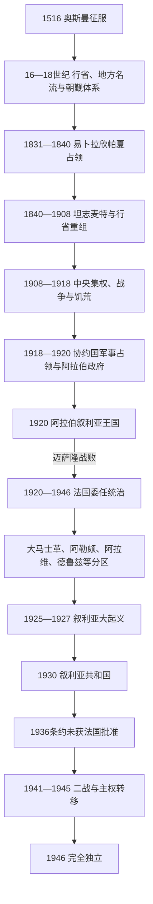

# 奥斯曼叙利亚与法国委任统治

## 时间

1516—1946年

## 概括

1516年奥斯曼征服后的“叙利亚”不是边界固定的单一行省。大马士革、阿勒颇、的黎波里、西顿及后来贝鲁特等行政区分别受总督管理，地方名流、宗教法庭、行会、部落和山地社群共同参与治理。19世纪埃及占领、坦志麦特改革、世界贸易和铁路加快行政整合，也加深征兵、土地、宗派和外来干预的矛盾。

第一次世界大战结束后，费萨尔领导的阿拉伯政府试图以大马士革为中心建立独立王国，却同英法战时安排和圣雷莫会议的委任决定冲突。法国1920年击败该政权，以高级专员、驻军和分区政府控制叙利亚。地方起义、叙利亚大起义、国民集团谈判、总罢工和二战后的国际压力逐步压缩法国权力；1946年4月17日最后一批法国军队撤离，完整独立实现。

## 演进图

## 奥斯曼统治的建立

塞利姆一世在达比克草原取胜后，奥斯曼接管阿勒颇、大马士革和沿海交通线。中央政府任命总督、法官和军政人员，通过军役封地、包税与宗教基金征集资源。大马士革总督还须组织每年赴麦加的朝觐商队，保护道路、筹备补给；完成这一任务既带来威望，也需要同沙漠部落协商护送和补贴。

奥斯曼行政区并不等同现代国界。阿勒颇经济面向安纳托利亚、伊拉克和伊朗，大马士革连接内陆和朝觐路线，沿海港口则日益依赖欧洲贸易。地方家族、行会首领、乌里玛和军人可以在中央与社区之间中介税收和司法，因此“帝国统治”不是单纯从伊斯坦布尔向下执行。

## 17—18世纪的地方力量

17世纪初，阿勒颇总督詹布拉德·阿里帕夏利用王朝战争发动叛乱，奥斯曼平定后重建北部控制。黎凡特西部的法赫尔丁二世、阿卡的扎希尔·欧麦尔等地方强人也曾跨越行政边界扩张，但其势力依赖税源、商路、雇佣军和帝国任命，不能视为现代民族国家。

18世纪阿兹姆家族多次出任大马士革总督，依靠城市宅邸、商业联系和朝觐组织形成地方基础。奥斯曼常以更换总督、承认地方名流和军事讨伐相结合维持秩序。阿勒颇的欧亚贸易一度繁荣，后因国际商路、战争和生产中心变化而相对衰退。

## 埃及占领与坦志麦特改革

### 1831—1840年易卜拉欣帕夏统治

埃及总督穆罕默德·阿里之子易卜拉欣帕夏击败奥斯曼军队，占领叙利亚。新当局加强直接征税、人口登记、征兵、治安和武器管制，并扩大对非穆斯林社群的部分平等待遇。这些措施提高国家汲取能力，却触犯地方名流、农民、部落和山地社群，1834年等地爆发反抗。1840年英国、奥地利等列强支持奥斯曼反攻，埃及军队撤回，说明叙利亚已成为“东方问题”和欧洲均势的一部分。

### 行政、土地与交通重组

奥斯曼恢复统治后推进坦志麦特。1858年土地法要求登记土地，既为税收和产权提供制度，也让部分城市名流、部落首领或中介者取得大片名义所有权。1864年行省法及后续调整建立省、县、区层级和地方行政会议；大马士革、阿勒颇与1888年设立的贝鲁特行省分别管理不同区域。

电报、现代学校、市政机构和新式法院扩展，贝鲁特—大马士革公路与铁路、20世纪初汉志铁路改善人员和货物流动。欧洲领事保护、教会学校和贸易资本则改变社群关系。改革扩大中央国家存在，却因征兵、税负、产权重组和代表权不均产生新冲突。

## 1860年暴力与宗派政治

黎巴嫩山地的社会、土地和政治矛盾在1860年转化为德鲁兹与马龙派之间的严重暴力，随后大马士革基督徒街区遭袭，许多居民死亡或流离失所。部分穆斯林名流和阿尔及利亚流亡者阿卜杜勒-卡迪尔保护难民，奥斯曼随后处决或惩办部分责任者。法国出兵和欧洲列强介入促成黎巴嫩山地特别行政安排。事件不是“自古宗派仇恨”的简单爆发，而是地方权力、农村阶层变化、帝国改革和外部保护制度叠加的结果。

## 晚期帝国、文化复兴与战争

19世纪后期，大马士革、阿勒颇与贝鲁特的学校、报刊和社团推动阿拉伯文化复兴。认同并不只有一种方向：有人主张奥斯曼宪政和地方分权，有人强调阿拉伯语言与省级权利，少数人在战争中转向独立。1908年青年土耳其革命恢复宪法，但联合进步委员会随后加强中央集权，阿拉伯政治团体与伊斯坦布尔的矛盾加深。

第一次世界大战期间，杰马勒帕夏统辖叙利亚战区，实行军事审查、征粮、征兵和政治镇压，并在1915、1916年于贝鲁特和大马士革处决阿拉伯活动人士。海上封锁、军队征发、交通中断、通货膨胀和1915年蝗灾共同造成黎凡特严重饥荒；受灾程度因地区而异，不能只归因于一项政策。1916年汉志爆发阿拉伯起义，费萨尔麾下阿拉伯军与英军合作北进；1918年9月底至10月初，奥斯曼撤离，大马士革由阿拉伯与协约国军队接管。

## 阿拉伯政府与叙利亚王国

1918年后，大马士革处于协约国军事占领体系之下，费萨尔建立阿拉伯行政机构，吸收旧奥斯曼官员、阿拉伯军官和民族主义者。1919年叙利亚国民大会要求在“大叙利亚”范围内独立，反对法国委任及犹太复国主义方案。1920年3月，大会宣布费萨尔为阿拉伯叙利亚国王，并通过带有君主立宪色彩的制度设计。

与此同时，英法已在战时协议和圣雷莫会议中划分控制区。英国撤出内陆支持后，法国高级专员古罗发出最后通牒。国王接受部分条件，但战争部长优素福·阿兹迈仍率有限兵力抵抗；1920年7月24日迈萨隆战役中叙军战败、阿兹迈阵亡，法军进入大马士革，费萨尔流亡。王国失败的直接原因是军力悬殊和英国不愿对法开战，结构原因则是财政、军队和国际承认尚未稳固。

## 法国委任统治的制度

法国依据圣雷莫安排和国际联盟委任书，以贝鲁特的高级专员掌握外交、驻军、财政监督和否决权。其下先后建立大马士革邦、阿勒颇邦、阿拉维邦、德鲁兹山邦、大黎巴嫩及亚历山大勒塔区。1922年大马士革、阿勒颇和阿拉维组成叙利亚邦联；1925年大马士革与阿勒颇合为叙利亚国，1930年改称叙利亚共和国。分区既利用真实存在的地区差异，也服务于削弱大马士革民族主义中心的统治目标。

地方政府设总统或内阁、代表会议和行政人员，但法国高级专员可暂停宪法、解散议会并调动黎凡特特别部队。完整的地方国家元首、法国高级专员和独立后政府首脑序列见[叙利亚国家元首与政府首脑表](/%E4%BA%BA%E6%96%87%E7%A7%91%E5%AD%A6/%E5%8E%86%E5%8F%B2/%E8%A5%BF%E4%BA%9A/%E9%BB%8E%E5%87%A1%E7%89%B9/%E5%8F%99%E5%88%A9%E4%BA%9A/%E5%8F%99%E5%88%A9%E4%BA%9A%E5%9B%BD%E5%AE%B6%E5%85%83%E9%A6%96%E4%B8%8E%E6%94%BF%E5%BA%9C%E9%A6%96%E8%84%91%E8%A1%A8.md)。

## 抵抗、谈判与独立

### 地方起义与叙利亚大起义

法国接管前后，萨利赫·阿里在阿拉维山区、易卜拉欣·哈纳努在北部发动抵抗。1925年，法国官员拘押德鲁兹领袖引发苏丹·阿特拉什领导的起义；起义迅速扩展到大马士革、古塔、哈马等地，城市民族主义者和乡村武装在不同阶段参加。法国以增兵、分化、集体惩罚和炮击大马士革镇压，到1927年基本恢复控制。起义未能击败法国，原因包括武器和补给不足、地区协调有限及法国军事优势，但它把反分区、统一和独立塑造成共同政治纲领。

### 宪政斗争与二战

1928年制宪会议起草强调统一和主权的宪法，法国删改争议条款后于1930年颁布。国民集团转向罢工、选举和谈判，1936年全国总罢工迫使法国签订独立条约；条约承诺逐步撤军和统一阿拉维、德鲁兹地区，却未获法国议会批准。1938年亚历山大勒塔成为哈塔伊邦，1939年并入土耳其，叙利亚历届政府持续不承认这一领土变更。

1940年法国本土战败后，黎凡特由维希当局控制；1941年英军和自由法国军队进入叙利亚，自由法国代表卡特鲁宣布承认独立，但军权和关键行政权仍未立即移交。1943年选举后，舒克里·库瓦特利任总统，叙利亚政府逐步接管机构。1945年法国企图保留军事特权并炮击大马士革，引发英国干预和国际压力。1946年4月17日最后一批法国军队撤离，这一天成为叙利亚独立日。

## 兴衰与制度遗产

| 层次 | 奥斯曼后期与委任统治的影响 |
|---|---|
| 结构因素 | 行政区、城市经济和地方名流长期分散，现代中央政府需把差异很大的区域纳入同一财政和军队体系。 |
| 外部压力 | 欧洲列强、英法划界、土耳其和巴勒斯坦问题不断影响边界与安全。 |
| 政治动员 | 学校、报刊、军队和议会形成新的民族主义精英，也把军官与城市名流带入国家权力。 |
| 直接转折 | 一战使奥斯曼秩序崩溃；迈萨隆战败建立委任统治；二战削弱法国并使撤军不可逆。 |
| 长期遗产 | 法国分区、特别部队和弱议会留下中央集权、地区不信任与军队政治化问题，但宪政、选举和全国组织也在此期形成。 |

## 演变关系

- 前一阶段：[古代叙利亚与伊斯兰时代](/%E4%BA%BA%E6%96%87%E7%A7%91%E5%AD%A6/%E5%8E%86%E5%8F%B2/%E8%A5%BF%E4%BA%9A/%E9%BB%8E%E5%87%A1%E7%89%B9/%E5%8F%99%E5%88%A9%E4%BA%9A/%E5%8F%A4%E4%BB%A3%E5%8F%99%E5%88%A9%E4%BA%9A%E4%B8%8E%E4%BC%8A%E6%96%AF%E5%85%B0%E6%97%B6%E4%BB%A3.md)。
- 奥斯曼完整帝国史见[奥斯曼帝国](/%E4%BA%BA%E6%96%87%E7%A7%91%E5%AD%A6/%E5%8E%86%E5%8F%B2/%E8%A5%BF%E4%BA%9A/%E5%9C%9F%E8%80%B3%E5%85%B6/%E5%A5%A5%E6%96%AF%E6%9B%BC%E5%B8%9D%E5%9B%BD/README.md)。
- 委任统治的跨黎凡特背景见[英法委任统治时期](/%E4%BA%BA%E6%96%87%E7%A7%91%E5%AD%A6/%E5%8E%86%E5%8F%B2/%E8%A5%BF%E4%BA%9A/%E9%BB%8E%E5%87%A1%E7%89%B9/%E8%8B%B1%E6%B3%95%E5%A7%94%E4%BB%BB%E7%BB%9F%E6%B2%BB%E6%97%B6%E6%9C%9F.md)。
- 大黎巴嫩后续见[黎巴嫩](/%E4%BA%BA%E6%96%87%E7%A7%91%E5%AD%A6/%E5%8E%86%E5%8F%B2/%E8%A5%BF%E4%BA%9A/%E9%BB%8E%E5%87%A1%E7%89%B9/%E9%BB%8E%E5%B7%B4%E5%AB%A9/README.md)。
- 后一阶段：[独立、复兴党统治、内战与政治过渡](/%E4%BA%BA%E6%96%87%E7%A7%91%E5%AD%A6/%E5%8E%86%E5%8F%B2/%E8%A5%BF%E4%BA%9A/%E9%BB%8E%E5%87%A1%E7%89%B9/%E5%8F%99%E5%88%A9%E4%BA%9A/%E7%8B%AC%E7%AB%8B%E3%80%81%E5%A4%8D%E5%85%B4%E5%85%9A%E7%BB%9F%E6%B2%BB%E3%80%81%E5%86%85%E6%88%98%E4%B8%8E%E6%94%BF%E6%B2%BB%E8%BF%87%E6%B8%A1.md)。
- 总入口：[叙利亚](/%E4%BA%BA%E6%96%87%E7%A7%91%E5%AD%A6/%E5%8E%86%E5%8F%B2/%E8%A5%BF%E4%BA%9A/%E9%BB%8E%E5%87%A1%E7%89%B9/%E5%8F%99%E5%88%A9%E4%BA%9A/README.md)。
