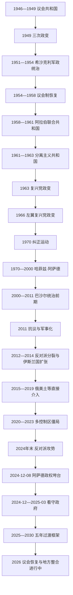

# 独立、复兴党统治、内战与政治过渡

## 时间

1946年至今（现代事实核验截至2026年7月13日）

## 概括

独立后的叙利亚先实行议会共和制，但1948年阿以战争失利、军队迅速扩张、地区与阶层精英竞争以及冷战介入，使文官政府难以控制军官集团。1949年三次政变开创军队反复改造政治的先例。1958年叙利亚同埃及合并，1961年退出；1963年复兴党军官掌权，1970年哈菲兹·阿萨德建立以总统、复兴党、军队和多套安全机构为核心的个人化党国体制。巴沙尔·阿萨德2000年继任。

2011年抗议遭镇压后，起义军事化并碎片化。政府军、地方反对派、圣战组织、库尔德主导力量和多国外部军队形成重叠战线。俄罗斯和伊朗支持阿萨德政权，土耳其支持部分反对派并打击库尔德武装，美国及其盟友以打击“伊斯兰国”为主同叙利亚民主力量合作，以色列则持续打击伊朗及叙利亚军事目标。2024年11—12月，反对派攻势与政府军崩溃结束阿萨德家族统治。新政府恢复了大部分中央机构和国土控制，但截至2026年7月，东北部整合、苏韦达地方武装、南部以军存在、少数群体安全与过渡宪政仍未解决。

## 演进图

## 独立共和国与政变链

### 1946—1949年：文官制度的脆弱基础

1946年撤军后，总统舒克里·库瓦特利、议会和内阁继承委任统治时期的制度。城市名流主导全国党和人民党，地方利益、对伊拉克或埃及的外交取向及社会改革路线分歧明显。军队规模小但升迁迅速，既缺乏稳定文官监督，也因装备、预算和1948年巴勒斯坦战争失败而把责任归咎政客。通货膨胀、军需腐败和战败信誉危机为政变提供直接机会。

### 1949年的三次政变

1. **3月30日，胡斯尼·扎伊姆政变**：总参谋长扎伊姆逮捕库瓦特利和总理哈立德·阿兹姆，暂停议会。他承认以色列停战安排、批准跨叙管线并推进世俗法令，但统治缺乏稳定军政联盟。
2. **8月14日，萨米·欣纳维政变**：扎伊姆和总理穆赫辛·巴拉齐被推翻并处决。欣纳维恢复哈希姆·阿塔西领导的文官机构，倾向同哈希姆王朝的伊拉克结盟，引起反对者警惕。
3. **12月19日，阿迪卜·希沙克利政变**：希沙克利排除欣纳维派，却暂时保留阿塔西政府。1951年12月他再次发动军事接管，以法乌齐·塞卢为名义国家元首，1953年亲任总统、压制政党并以军队和阿拉伯解放运动集中权力。

希沙克利试图跨越地区与宗派建立中央国家，却以炮击德鲁兹山区、控制议会和排挤传统政党制造广泛联盟反对。1954年军队内部倒戈、德鲁兹抵抗和文官动员迫使其下台，阿塔西恢复总统职务。

### 1954—1958年：议会恢复与走向合并

议会政治恢复后，复兴党、共产党、传统名流和军官派系并存。土地不平等、工会和农民动员促使改革议题上升，苏伊士危机和西方支持的区域联盟又加剧“反帝、统一”的阿拉伯民族主义。军官和复兴党担忧共产党壮大及国内政变，转而要求同纳赛尔领导的埃及迅速合并。合并谈判时间短，叙利亚没有保留联邦式自主制度。

## 阿拉伯联合共和国与复兴党掌权

### 1958—1961年：同埃及合并

1958年2月，埃及和叙利亚组成阿拉伯联合共和国，贾迈勒·阿卜杜-纳赛尔任总统。叙利亚政党被要求解散，军官调动、行政决策和经济政策集中到开罗。土地改革与国有化削弱旧地主和商界，但官僚集中、埃及干部影响和政策突变使部分军官及企业家不满。1961年9月28日，大马士革军官发动政变；叙利亚退出联盟，恢复独立共和国。

### 1961—1963年：分离主义政府

复国后恢复议会和私营经济，但军队内部的复兴党、纳赛尔主义者和独立军官继续竞争。1962年政变和反政变显示文官机构仍不能控制军队。1963年3月8日，复兴党军事委员会同纳赛尔主义军官联合推翻纳齐姆·库德西政府；7月复兴党清除纳赛尔主义军事对手，宣布紧急状态，实施土地改革、国有化和一党主导的群众组织体系。

### 1966—1970年：复兴党内斗

1966年2月，萨拉赫·贾迪德、哈菲兹·阿萨德等更激进军官推翻阿明·哈菲兹。努尔丁·阿塔西任名义国家元首，贾迪德控制党组织，阿萨德掌国防部和空军。新政权扩大国有经济、农村动员和对巴勒斯坦武装支持，却在1967年六日战争中失去戈兰高地。战败后，贾迪德主张革命外交，阿萨德强调军队重建和国家利益；1970年约旦“黑色九月”危机中，双方因是否投入空军支援叙利亚装甲部队彻底决裂。11月，阿萨德逮捕贾迪德与阿塔西，发动“纠正运动”。

## 阿萨德家族统治

### 哈菲兹·阿萨德：体制建立与稳定机制

哈菲兹先任总理，1971年通过公投任总统。1973年宪法赋总统广泛任免、军队统帅和紧急权力；复兴党通过全国进步阵线、人民议会、工会和地方组织吸纳社会，多套情报机关相互监控。阿拉维派军官在关键安全部门比例上升，但体制同时依靠逊尼派城市商人、农村干部、军队和国家雇员的跨社群 patronage。其稳定不是单一教派统治，而是总统仲裁、机构重叠、庇护—分配网络和高压镇压共同作用的结果。

1973年叙利亚与埃及进攻以色列，初期进入戈兰高地，后被击退；1974年脱离接触协议形成联合国监督区。阿萨德以“抵抗以色列”和苏联援助重建军力。1976年叙军进入黎巴嫩内战，随后长期控制黎巴嫩政治和安全事务。国内方面，复兴党国家同穆斯林兄弟会及其他反对力量在1970年代末进入暴力循环；1982年哈马起义遭军队大规模镇压，造成严重平民伤亡并摧毁有组织国内反对派。

1983—1984年哈菲兹患病时，其弟里法特试图凭“防卫连”扩大权力，最终被排挤出国，显示家族内部也受总统对军队和安全机构的平衡控制。冷战结束后，叙利亚参加1991年反伊拉克战争联盟并进入马德里和谈，以换取外交空间；但戈兰谈判未成功。国有部门低效、人口增长、腐败和特权网络使经济逐渐停滞。原定继承人巴西勒1994年去世后，巴沙尔被召回培养，继承安排日益制度化。

### 巴沙尔·阿萨德：有限开放与再集中

哈菲兹2000年去世后，宪法规定的总统最低年龄从40岁改为34岁，巴沙尔由复兴党和公投完成继任。短暂的“大马士革之春”出现论坛、请愿和政治讨论，2001年后主要活动人士被捕。政府引入私人银行、通信和“社会市场经济”，但机会集中于总统亲属、军商网络和少数新企业集团；取消补贴、地区发展失衡和青年失业扩大社会压力。

2005年黎巴嫩总理拉菲克·哈里里遇刺后的国内外压力迫使叙军撤出黎巴嫩。2006—2010年东北部严重干旱、农业政策失误和农村迁移加重城市边缘压力，但干旱只是众多背景因素之一，不能单独解释2011年起义。安全机构不受监督、政治参与封闭和腐败才使局部抗议迅速转化为全国危机。

## 2011—2024年战争的阶段

### 第一阶段：抗议、镇压与军事化（2011—2012）

2011年3月，德拉儿童涂写反政府口号后被拘押和虐待，引发地方抗议；安全部队开枪、逮捕和围城使示威扩展到霍姆斯、哈马、大马士革郊区等地。政府取消长期紧急状态，却同时扩大武力镇压。军人叛逃和地方自卫力量组成“自由叙利亚军”松散网络。到2012年，阿勒颇、大马士革周边和多座城市爆发持续战斗，和平抗议与武装起义并存的局面转为全国性内战。

### 第二阶段：碎片化与圣战组织扩张（2013—2014）

反对派在政治、地方军阀、伊斯兰主义和外部赞助之间分裂。伊朗革命卫队、黎巴嫩真主党和其他亲伊朗武装扩大对政府支持。2013年8月古塔发生大规模化学武器袭击；在美俄协议下，叙利亚加入禁化武组织并申报销毁库存，但此后仍有使用化学武器的指控和调查。

“伊拉克和沙姆伊斯兰国”同努斯拉阵线决裂，2014年占领拉卡、代尔祖尔部分地区并跨境建立所谓“哈里发国”，以屠杀、奴役和恐怖统治控制人口。库尔德民主联盟党及人民保护部队在北部建立自治地区。美国主导的国际联盟自2014年空袭“伊斯兰国”，并逐渐同以库尔德力量为骨干的叙利亚民主力量合作。

### 第三阶段：俄军介入与政府反攻（2015—2016）

2015年9月俄罗斯直接空袭并部署兵力，伊朗、真主党与政府地面部队协同作战。介入保护大马士革—霍姆斯—海岸核心区，切断部分反对派补给，并使阿萨德政权从防守转为反攻。2016年12月政府收复阿勒颇东部，成为战争战略转折。围城、密集轰炸和强制撤离给平民造成严重伤亡，也把许多反对派武装集中到伊德利卜。

### 第四阶段：消灭“伊斯兰国”领土与多国控制区形成（2017—2019）

政府及盟友沿幼发拉底河向东推进；美国支持的叙利亚民主力量夺取拉卡，并于2019年3月攻下巴古兹，“伊斯兰国”的连续领土统治结束，但地下细胞仍存在。政府2018年收复东古塔和德拉大部，常以围攻、俄方谈判、撤离和地方“和解”并用。

土耳其先后发动“幼发拉底河盾”“橄榄枝”和“和平之泉”行动，控制边境部分地区并扶持叙利亚国民军，主要目标包括驱逐“伊斯兰国”和阻止库尔德武装连成一体。美国在东北维持反恐合作，俄罗斯和叙政府进入部分边境地带。叙利亚由单一内战转为多个受外部力量保护的控制区。

### 第五阶段：冻结战线与国家耗竭（2020—2023）

2020年俄土在伊德利卜达成停火，主战线大体冻结：阿萨德政府控制西部主要城市和人口中心；沙姆解放组织通过“叙利亚救国政府”治理伊德利卜；土耳其支持的临时政府和国民军控制北部若干地带；叙利亚民主力量和北部与东部叙利亚自治行政控制东北。各区内部仍有暗杀、炮击、拘押和经济封锁。

黎巴嫩金融危机、国际制裁、腐败、货币崩溃、基础设施破坏和毒品经济使阿萨德政府财政枯竭。2023年地震重创西北和北部；同年叙利亚恢复阿拉伯国家联盟席位，但外交解冻没有解决难民、重建或政治和解。军队薪饷低、指挥体系空心化，许多部队依赖地方武装和外国盟友。

## 2024年政权崩溃

### 十一日攻势

- **11月27日**：以沙姆解放组织为主的“军事行动指挥部”联同多支反对派从伊德利卜方向进攻；另有土耳其支持的叙利亚国民军在北部展开行动。
- **11月29—30日**：政府军从阿勒颇大部撤退，反对派控制城市和机场。
- **12月5日**：反对派夺取哈马，中央防线失去关键节点。
- **12月7日**：霍姆斯失守，首都同海岸和俄军基地之间的陆路被切断；南部地方武装也控制德拉、苏韦达方向多地。
- **12月8日**：反对派进入大马士革，赛德纳亚等监狱被打开；巴沙尔·阿萨德逃往俄罗斯，军政机构停止有组织抵抗。

### 为什么迅速垮台

| 因素层次 | 具体机制 |
|---|---|
| 结构性衰弱 | 多年战争、腐败、低薪和征兵逃避使军队空心化；经济崩溃削弱军政庇护网络与补给。 |
| 政治基础 | 政权拒绝实质性和解，地方“和解区”与旧反对派未真正融入，社会恐惧并未转化为主动保卫意愿。 |
| 反对派准备 | 伊德利卜当局用数年整编部队、无人机、指挥和行政体系，减少以往派系间公开冲突。 |
| 外部环境 | 俄罗斯集中资源于乌克兰战争；真主党在同以色列作战后受重创；伊朗补给和动员能力下降。 |
| 直接触发 | 11月27日攻势突破静止战线后，政府指挥和士气发生连锁崩溃，城市守军多选择撤退而非长期巷战。 |

因此，政权灭亡不是单场战役或一国撤援造成，而是国家财政、军队组织、政治合法性和盟友能力同时失效。

## 2024—2026年政治过渡

### 看守政府与总统任命

12月8日，末任阿萨德政府总理穆罕默德·加齐·贾拉利短暂维持行政并同新当局交接。12月10日，原伊德利卜“叙利亚救国政府”总理穆罕默德·巴希尔组建看守内阁。早期中央实际权力集中于艾哈迈德·沙拉领导的军事行动指挥部和从伊德利卜进入各部委的干部，旧官僚负责维持工资、公共服务和档案。

2025年1月29日，参加“革命胜利大会”的武装派别任命沙拉为过渡期总统，同时宣布废止2012年宪法、解散旧人民议会、复兴党、旧军队和安全机构，并要求革命派别纳入国家机构。任命来自胜利武装的政治协商，不是普选结果。2月全国对话会议提出过渡正义、宪法与机构改革方向；3月13日签署宪法宣言，设定五年过渡期，行政权高度集中于总统。

3月29日，新过渡政府宣誓就职。宪法宣言取消总理职位，总统兼具国家元首和行政首脑地位，直接任命部长；内阁设秘书长协调事务。2026年5月总统府和部分部长、地方长官又有调整，但没有恢复总理职位。

### 过渡议会

2025年10月开始的间接选举由各地区选举团产生三分之二议席；东北部因当时尚未整合而延至2026年5月投票，苏韦达没有举行同类投票。2026年7月1日，沙拉任命其余70名议员。210席人民议会于7月12日首次开会，选举阿卜杜勒-哈米德·阿瓦克为议长，任期30个月，任务包括普通立法和制定未来选举法。议会恢复终结一年半的立法真空，但间接选举、总统任命三分之一及部分地区缺席，使代表性仍有争议。

### 安全整合与群体暴力

新当局宣布把原反对派派别并入国防部，旧军人则通过“身份和解”或个案审查处理。正式编制并不等于指挥链已经统一；原沙姆解放组织及伊德利卜网络在总统府、内政和安全部门仍具显著影响，部分地方武装保留自身人员关系。

2025年3月，前政权武装在海岸袭击新安全部队，随后政府部队、附属派别和当地武装卷入报复性暴力，大量阿拉维派平民遇害。政府成立调查委员会并移交嫌疑人，但问责与受害者信任仍在建立。7月苏韦达德鲁兹和贝都因社群冲突升级，政府部队、地方武装及以色列介入，发生针对平民的严重暴行。两次事件表明，国家垄断武力、少数群体保护和派别纪律仍是过渡成败的核心。

### 东北部整合

2025年3月10日，沙拉同叙利亚民主力量总司令马兹卢姆·阿卜迪签署框架协议，要求东北军政机构、边境口岸、机场及油气设施在年底前并入国家；执行因军队编制、地方自治、库尔德权利和资源分配分歧而延迟。2026年1月战斗后，中央政府夺取拉卡、代尔祖尔及原自治行政控制的大部分阿拉伯人口地区和能源设施。1月18日、30日的新协议规定停火、撤军、国防部编旅、哈塞克和卡米什利行政移交及阿萨伊什警力并入内政部。

截至2026年7月13日，国家机构已进入东北多地并举行议会选举，但哈塞克、卡米什利及部分库尔德聚居区仍采用联合或分阶段安全安排；人员审查、警察并轨、教育和财产问题尚未完成。因此应把这一阶段称为“整合进行中”，而非自治行政已经在一次签字后完全消失。

## 截至2026年7月13日的实际权力结构

| 层级 / 地区 | 法定安排 | 实际权力与未决问题 |
|---|---|---|
| 总统与中央行政 | 艾哈迈德·沙拉任过渡总统；五年宪政框架下兼国家元首和行政首脑，不设总理。 | 总统任命部长、高级官员及部分议员；原伊德利卜和沙姆解放组织网络在核心安全部门影响突出。 |
| 人民议会 | 210席，140席由地区选举团产生、70席由总统任命；2026年7月12日开议。 | 已恢复立法，但非全民直选，苏韦达没有完成地区投票，制衡能力仍待观察。 |
| 国防与内政系统 | 革命派别、部分旧军人、东北武装分别纳入国防部或内政部。 | 编制统一快于指挥、训练和问责统一；地方派别关系仍影响行动纪律。 |
| 西部与中部主要城市 | 大马士革政府直接行政。 | 国家机关和税务基本恢复，但海岸安全、旧政权残余、经济危机和“伊斯兰国”细胞仍构成风险；2026年7月大马士革爆炸案显示首都也未完全稳定。 |
| 东北部 | 依据2025、2026协议逐步并入中央。 | 中央已收回大部分原自治区及能源设施；哈塞克、卡米什利等地的阿萨伊什和原自治行政人员仍在分阶段并轨。 |
| 苏韦达 | 法定上属于叙利亚中央政府。 | 德鲁兹地方武装反对中央直接控制，2025年冲突后的路线图与信任措施尚未完成，是最明显的内部控制缺口。 |
| 北部土耳其影响区 | 原临时政府于2025年移交权力，国民军名义并入国防部。 | 土耳其仍有军事与安全影响，地方武装和行政整合程度不一。 |
| 戈兰与南部缓冲区 | 叙利亚主张全部主权；1974年脱离接触协议由联合国观察。 | 以色列继续占领戈兰，并在2024年12月后进入分离区、建立阵地和多次空袭，中央政府无法在相关地带行使完整控制。 |
| 外国军事力量 | 过渡政府主张统一主权。 | 土耳其、美国、俄罗斯和以色列仍以不同方式保有军事存在或影响；伊朗和真主党在阿萨德倒台后大幅撤退。 |
| “伊斯兰国” | 无连续领土统治。 | 地下组织仍以沙漠、道路和城市细胞发动袭击或策划暗杀，是安全问题而非并立政府。 |

完整的总统、代理国家元首、历任总理、法国委任统治行政首脑和并立政府领导序列见[叙利亚国家元首与政府首脑表](/%E4%BA%BA%E6%96%87%E7%A7%91%E5%AD%A6/%E5%8E%86%E5%8F%B2/%E8%A5%BF%E4%BA%9A/%E9%BB%8E%E5%87%A1%E7%89%B9/%E5%8F%99%E5%88%A9%E4%BA%9A/%E5%8F%99%E5%88%A9%E4%BA%9A%E5%9B%BD%E5%AE%B6%E5%85%83%E9%A6%96%E4%B8%8E%E6%94%BF%E5%BA%9C%E9%A6%96%E8%84%91%E8%A1%A8.md)。

## 2011年战争的因果层次

| 层次 | 因素 |
|---|---|
| 结构因素 | 长期紧急统治、安全机构不受制约、腐败与裙带资本、青年失业、地区发展失衡及农村危机。 |
| 政治过程 | 地方抗议遭致命镇压，谈判空间关闭；军人叛逃和社区自卫使冲突军事化。 |
| 反对派内部 | 政治纲领、地方利益、宗教路线和外部赞助分裂，难以形成统一指挥。 |
| 政权生存机制 | 党国机构、精锐部队、城市核心区和少数群体恐惧使政府没有在2011—2012年立即崩溃。 |
| 外部国际化 | 伊朗、俄罗斯、真主党支持政府；土耳其、海湾国家和西方支持不同反对力量；美军主导反“伊斯兰国”行动。 |
| 极端组织 | 国家真空、伊拉克战争网络和反对派碎片化为努斯拉阵线、“伊斯兰国”等提供扩张空间。 |
| 长期结果 | 人口流离失所、城市破坏、国家财政崩溃、地方政权化和外国驻军使任何一方的军事胜利都不能自动恢复统一国家。 |

## 演变关系

- 前一阶段：[奥斯曼叙利亚与法国委任统治](/%E4%BA%BA%E6%96%87%E7%A7%91%E5%AD%A6/%E5%8E%86%E5%8F%B2/%E8%A5%BF%E4%BA%9A/%E9%BB%8E%E5%87%A1%E7%89%B9/%E5%8F%99%E5%88%A9%E4%BA%9A/%E5%A5%A5%E6%96%AF%E6%9B%BC%E5%8F%99%E5%88%A9%E4%BA%9A%E4%B8%8E%E6%B3%95%E5%9B%BD%E5%A7%94%E4%BB%BB%E7%BB%9F%E6%B2%BB.md)。
- 与埃及组成阿拉伯联合共和国的背景见[埃及](/%E4%BA%BA%E6%96%87%E7%A7%91%E5%AD%A6/%E5%8E%86%E5%8F%B2/%E5%8C%97%E9%9D%9E/%E5%9F%83%E5%8F%8A/README.md)。
- 叙利亚对黎巴嫩政治和内战的介入见[黎巴嫩](/%E4%BA%BA%E6%96%87%E7%A7%91%E5%AD%A6/%E5%8E%86%E5%8F%B2/%E8%A5%BF%E4%BA%9A/%E9%BB%8E%E5%87%A1%E7%89%B9/%E9%BB%8E%E5%B7%B4%E5%AB%A9/README.md)。
- 戈兰高地和地区战争背景见[以色列](/%E4%BA%BA%E6%96%87%E7%A7%91%E5%AD%A6/%E5%8E%86%E5%8F%B2/%E8%A5%BF%E4%BA%9A/%E9%BB%8E%E5%87%A1%E7%89%B9/%E4%BB%A5%E8%89%B2%E5%88%97/README.md)。
- 总入口：[叙利亚](/%E4%BA%BA%E6%96%87%E7%A7%91%E5%AD%A6/%E5%8E%86%E5%8F%B2/%E8%A5%BF%E4%BA%9A/%E9%BB%8E%E5%87%A1%E7%89%B9/%E5%8F%99%E5%88%A9%E4%BA%9A/README.md)。
