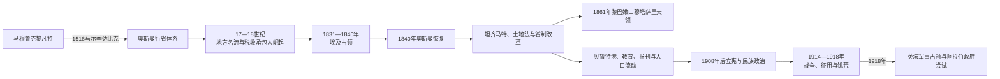

# 奥斯曼统治下的黎凡特

## 时间

1516—1918年。

## 概括

1516年奥斯曼苏丹塞利姆一世在马尔季达比克击败马穆鲁克，阿勒颇、大马士革、巴勒斯坦与黎巴嫩沿海转入奥斯曼体系。帝国没有建立一个固定边界的“黎凡特省”，而是随财政、战争和改革调整阿勒颇、大马士革、的黎波里、西顿、贝鲁特等行省及耶路撒冷直辖区。苏丹主权通过总督、法官、驻军、税收承包人、宗教基金、城市名流、山地埃米尔和村社层层落实。

16—18世纪地方家族和军政强人并非独立民族国家：马安、希哈布、阿兹姆、扎希尔·欧麦尔和贾扎尔帕夏等在纳税、获任命和军事控制之间扩大自治。19世纪埃及占领、欧洲介入和坦齐马特改革改变征兵、土地、法律、交通与宗派政治；贝鲁特港、丝绸、学校、印刷和报刊推动城市社会与“阿拉伯复兴”。与此同时，土地商品化、农村债务、山地冲突、欧洲领事保护和新型民族政治制造新张力。

第一次世界大战中，军事征用、海上封锁、蝗灾、运输崩溃和地方投机共同造成叙利亚—黎巴嫩严重饥荒；杰马尔帕夏镇压异议并处决阿拉伯知识人与政治人物。英国—阿拉伯部队1917年进入耶路撒冷、1918年进入大马士革，奥斯曼主权终结。战后英法军事占领和委任统治不是预先确定的自然接班，而是战争承诺、列强协议和地面军政竞争的结果。

## 演变图

## 征服与早期行省化

塞利姆一世同马穆鲁克冲突涉及安纳托利亚边境缓冲国、萨法维威胁、商路和两大帝国竞争。1516年8月，奥斯曼军在阿勒颇以北的马尔季达比克使用火器、野战炮和更集中指挥击败马穆鲁克，苏丹坎苏·古里死亡。部分马穆鲁克埃米尔倒戈或投降，大马士革随后接受新主权。1517年开罗陷落后，奥斯曼取得埃及和汉志圣地保护权，黎凡特成为首都通往麦加、埃及和红海的关键走廊。

帝国保留许多马穆鲁克时代法官、宗教基金、地方税籍和城市精英，同时重新登记土地、分配军役收入、驻扎禁卫与西帕希。大马士革总督常兼朝觐商队长，负责组织每年从叙利亚出发的朝觐队伍、护送补给并同沙漠部落谈判。朝觐道路、堡垒、水站和市场把宗教职责、军事威望和地方经济结合。

## 行政与实际权力结构

奥斯曼行政区划多次变化，不能把19世纪的贝鲁特州或耶路撒冷直辖区倒推到16世纪。

| 层级 | 官职 / 机构 | 权力来源与限制 |
|---|---|---|
| 苏丹与帝国中央 | 苏丹、帝国会议、各部和军令 | 任命总督、法官与高级军官，规定税制、战争和宗教法框架 |
| 行省总督 | 大马士革、阿勒颇、的黎波里、西顿，后有贝鲁特等总督 | 掌军政与征税，但任期常短，需同驻军、法官和地方家族合作 |
| 特殊直辖区 | 19世纪后期耶路撒冷穆塔萨里夫领 | 直接向伊斯坦布尔内政体系负责，以加强圣地和列强敏感区控制 |
| 法官与宗教机构 | 卡迪、穆夫提、宗教基金管理人及各教会社群首领 | 管理司法、婚姻、财产、教育和慈善；并非所有案件只用同一套法 |
| 驻军与地方军事集团 | 禁卫、要塞军、地方骑兵、部落辅助 | 可保护城市，也会参与税收、派系和总督废立 |
| 税收承包人与城市名流 | 阿扬、商人、地主、官僚家族 | 预付税款并征收，向中央提供兵员和秩序；长期化后形成地方权力 |
| 山地埃米尔与村社首领 | 马安、希哈布等受任命家族，德鲁兹、马龙派及其他地方领袖 | 以税收承包、亲族和武装统治山区，并不拥有独立主权 |
| 非穆斯林社群机构 | 主教、宗主教、拉比、会众与教产 | 在帝国等级和税制下管理内部事务；欧洲保护使部分机构权力扩大 |

奥斯曼苏丹完整顺序见[奥斯曼苏丹世系表](/%E4%BA%BA%E6%96%87%E7%A7%91%E5%AD%A6/%E5%8E%86%E5%8F%B2/%E8%A5%BF%E4%BA%9A/%E5%9C%9F%E8%80%B3%E5%85%B6/%E5%A5%A5%E6%96%AF%E6%9B%BC%E5%B8%9D%E5%9B%BD/%E5%A5%A5%E6%96%AF%E6%9B%BC%E8%8B%8F%E4%B8%B9%E4%B8%96%E7%B3%BB%E8%A1%A8.md)。本页不重复所有苏丹，也不把每位短任总督误作地方君主。

## 16—17世纪：整合与地方王权扩张

大马士革、阿勒颇和的黎波里是行政、商贸、手工业和学术中心。阿勒颇连接伊朗、安纳托利亚和地中海港口，欧洲商人建立领事与商馆；大马士革依靠朝觐、内陆商路和农业腹地。萨法维战争使叙利亚北部和伊拉克通道具有军事价值。

黎巴嫩山和巴勒斯坦乡村由不同税区、家族和社群控制。马安家族的法赫尔丁二世在16世纪末至1635年间兼领多个税收承包区，建设军队、堡垒并同托斯卡纳等外部势力交往。其势力扩张建立在奥斯曼任命和纳税基础上，既非现代“黎巴嫩民族国王”，也不只是普通地方官。中央在其拒绝服从、扩军和外交超界后出兵，1635年将其处死。

帝国并未因地方强人存在而“退出”。总督轮换、税款核算、军事远征和法官制度仍提供主权框架；但中央兵力和财政受战争牵制时，地方家族能把临时税职变成代际资源。

## 18世纪：地方名流与沿海重组

### 阿兹姆家族

阿兹姆家族在18世纪多次出任大马士革、的黎波里、西顿等总督，依靠官职、商业、土地和城市庇护建立区域网络。阿萨德帕夏·阿兹姆长期主持大马士革和朝觐，修建商队旅舍、宫殿和基础设施。家族权力来自中央任命，并受宫廷派系、朝觐安全和财政绩效约束。

### 扎希尔·欧麦尔

扎希尔·欧麦尔由加利利地方税收承包人崛起，控制提比里亚、阿卡和部分沿海，在棉花贸易中同欧洲商人合作，修建城防并吸引人口。他利用大马士革总督、贝都因、山地家族和中央间竞争扩大自治。1770年代同埃及马穆鲁克强人阿里贝结盟，挑战奥斯曼；1775年中央舰队和军队攻取阿卡，扎希尔死亡。

### 贾扎尔帕夏

艾哈迈德·贾扎尔帕夏以西顿总督和阿卡为中心建立军事财政政权，控制棉花、税收和要塞，以严厉手段压制地方家族。1799年拿破仑从埃及北上围攻阿卡，贾扎尔在英国海军、奥斯曼援军和坚固城防支持下守城成功。拿破仑撤回埃及，显示欧洲军队尚不能仅凭一支远征军接管黎凡特。

## 1831—1840年埃及占领

埃及总督穆罕默德·阿里要求获得叙利亚作为参与希腊战争的补偿，其子易卜拉欣帕夏1831年攻占阿卡并北上，1832年在科尼亚击败奥斯曼军。叙利亚—巴勒斯坦由埃及军政体系控制，法理上仍涉及奥斯曼主权争议，实际行政则来自开罗。

易卜拉欣推行人口登记、征兵、武器收缴、垄断采购、直接税和较统一治安，修路并削弱部分地方势力。基督徒在若干领域获得较平等待遇，欧洲商人与传教网络扩大；同时征兵、重税和强制劳役触发1834年巴勒斯坦农民起义、山地反抗和城市不满。改革既提高国家穿透力，也破坏旧有协商。

奥斯曼在英国、奥地利、俄国和普鲁士支持下于1840年发动海陆行动，炮击贝鲁特、夺取阿卡并鼓励地方起义。埃及撤军，奥斯曼恢复统治。欧洲列强介入由此从贸易和领事保护更深进入地方制度。

## 坦齐马特、宗派冲突与省制改革

1839年和1856年改革诏书承诺生命财产安全、较统一征税和非穆斯林臣民平等，帝国建立新式省议会、世俗法院、学校、军队和官僚。改革执行不一，旧法庭与新机构并存，地方名流常通过议会和土地登记重建权力，而非被中央彻底替代。

1858年土地法要求登记权利，目的包括明确税收和减少集体、隐名占有。实际中，农民可能因税、征兵恐惧或登记成本把土地记在名流、商人名下；同时也有村民主动登记。土地更可交易、抵押和集中，后来犹太移民机构、城市商人和地方地主的购地都在这一法律环境中发生，但不能把全部失地单因归于一部法令。

黎巴嫩山在埃及撤军后取消希哈布埃米尔制，1842年设德鲁兹与基督徒双凯马坎。人口混居、地主—农民矛盾、宗派组织、欧洲领事保护和帝国改革使冲突被重新解释为宗派对立。1840年代暴力后，1860年德鲁兹—马龙派战争扩展，基督徒村庄遭屠杀；大马士革也发生针对基督徒的严重屠杀，部分穆斯林名流和阿卜杜勒—卡迪尔保护难民。

法国出兵、列强调停和奥斯曼调查后，1861年建立黎巴嫩山穆塔萨里夫领，由非本地的奥斯曼基督徒总督和宗派行政委员会治理。它在列强监督下获得特殊自治，但不包括贝鲁特、的黎波里、赛达、贝卡等后来现代黎巴嫩重要地区。完整总督顺序见[黎巴嫩山统治者、总督与共和国领导人表](/%E4%BA%BA%E6%96%87%E7%A7%91%E5%AD%A6/%E5%8E%86%E5%8F%B2/%E8%A5%BF%E4%BA%9A/%E9%BB%8E%E5%87%A1%E7%89%B9/%E9%BB%8E%E5%B7%B4%E5%AB%A9/%E9%BB%8E%E5%B7%B4%E5%AB%A9%E5%B1%B1%E7%BB%9F%E6%B2%BB%E8%80%85%E3%80%81%E6%80%BB%E7%9D%A3%E4%B8%8E%E5%85%B1%E5%92%8C%E5%9B%BD%E9%A2%86%E5%AF%BC%E4%BA%BA%E8%A1%A8.md)。

1864年省制法及后续调整建立更层级化的州—省—县体系。1887年耶路撒冷直辖区强化圣地行政，1888年贝鲁特州整合大部分沿海。边界不是民族国界，而是中央试图改善征税、治安、交通和欧洲关系的行政工具。

## 城市、经济与文化转型

### 贝鲁特、港口与丝绸

19世纪贝鲁特由中型港口成长为地区商业和出版中心。蒸汽船、港口工程、贝鲁特—大马士革公路和铁路把山地丝绸、内陆粮食与欧洲市场连接。黎巴嫩山蚕丝业依靠家庭尤其女性劳动，法国需求带来繁荣，也使地区易受价格波动、债务和粮食进口影响。

阿勒颇部分远途贸易地位下降，但仍是北部商业中心；大马士革继续依靠手工业、朝觐和内陆市场。雅法以柑橘、港口和移民增长，海法在铁路和新港规划中上升。城市扩张带来郊区、公共卫生、银行、电报和市政机构，也扩大贫富差距。

### 教育、印刷与阿拉伯复兴

天主教、新教、东正教和本地社群学校扩张，贝鲁特出现叙利亚新教学院和圣约瑟夫大学等机构。传教教育既有宗教竞争，也传播医学、科学、语言和新职业。布拉格、开罗并非唯一出版中心，贝鲁特报刊、出版社和翻译网络使现代标准阿拉伯语、历史写作和公共舆论发展。

“阿拉伯复兴”包含基督徒与穆斯林知识人、语言学、文学、改革伊斯兰、奥斯曼爱国主义、地方主义和后来的阿拉伯民族主义。早期文化复兴不应倒推为从一开始就要求脱离帝国。

## 人口迁移与新政治

19世纪人口增长、经济波动和社群冲突推动黎凡特居民移往埃及、美洲、西非和其他奥斯曼城市，形成侨民汇款和出版网络。高加索穆斯林、阿尔及利亚流亡者、亚美尼亚难民及其他群体也被安置于叙利亚和约旦，重塑边疆聚落。

1882年前后开始的第一次阿利亚使东欧、也门等地犹太移民增加。锡安主义组织购买土地、建立农业定居点和希伯来语教育；本地阿拉伯农民、地主、奥斯曼官员和既有犹太社群对移民立场不一。中央尝试限制外国犹太人永久定居和购地，但地方执行、国籍转换和领事保护使政策效果有限。现代冲突的基础逐步形成，却不能把19世纪所有犹太移民都视为同一政治组织。

1908年青年土耳其革命恢复宪法和议会，叙利亚、巴勒斯坦代表参与帝国政治。中央集权、土耳其语行政、军役和地方自治争论加深；阿拉伯知识人与社团从奥斯曼主义、地方分权到民族主义有多条路线。1913年巴黎阿拉伯会议要求行政分权和阿拉伯语权利，多数参与者当时仍设想改革帝国而非立即建立完全独立国家。

## 第一次世界大战

### 军事统治与镇压

奥斯曼1914年加入同盟国，叙利亚成为第四军后方和进攻苏伊士运河的基地。杰马尔帕夏兼具军政大权，征用铁路、牲畜、粮食和劳工，审判被指同英法联系或鼓吹分离的人士。1915年、1916年贝鲁特和大马士革处决多名阿拉伯政治人物，后被纪念为“烈士日”；镇压推动部分改革派转向反帝国路线。

亚美尼亚人口被从安纳托利亚驱逐、押送和屠杀，叙利亚的代尔祖尔、阿勒颇等地成为驱逐路线与集中区域。地方官、军队、部落和救援者角色不同，但国家组织的驱逐与大规模死亡不能只写成一般战时迁徙。

### 饥荒

1915—1918年黎巴嫩山和叙利亚沿海发生严重饥荒。原因相互叠加：

- 协约国海上封锁切断粮食和出口市场；
- 奥斯曼军事征用、价格管制失败和运输优先军用；
- 1915年蝗灾破坏庄稼；
- 丝绸市场崩溃使山地缺乏购买粮食的现金；
- 地方囤积、投机、官员腐败和省际运输限制；
- 疾病与征兵进一步削弱劳动力。

死亡人数只能估算且地区差异大。把饥荒完全归于封锁或完全归于杰马尔个人都过于单一，帝国政策、战争经济、自然灾害和国际海战共同造成灾难。

### 战线崩溃

谢里夫侯赛因1916年发动阿拉伯起义，在英国支持下攻击汉志铁路；其军事活动逐步北上，但大部分黎凡特战线仍由英埃远征军、印度和帝国部队直接作战。1917年英军攻取加沙后进入耶路撒冷，1918年米吉多战役摧毁奥斯曼南部战线，阿拉伯部队与英国军先后进入大马士革。

战争期间的侯赛因—麦克马洪通信、赛克斯—皮科协定和贝尔福宣言对同一地区提出相互冲突或含混的承诺。1918年奥斯曼撤退只结束帝国主权，没有决定叙利亚、黎巴嫩、巴勒斯坦和外约旦的最终边界。

## 关键地方统治者与实际权力

| 人物 / 家族 | 主要时期与职位 | 权力性质 | 关键事件 |
|---|---|---|---|
| **法赫尔丁二世** | 约1590—1633年扩张，1635年被处死 | 马安家族税收承包首长、奥斯曼任命地方埃米尔 | 控制山地与沿海多区、建设军力并开展外部外交，后被中央清除 |
| 希哈布家族 | 1697—1842年 | 黎巴嫩山埃米尔与税收承包人 | 在德鲁兹、马龙派和奥斯曼总督间平衡，巴希尔二世时期权力最大 |
| 阿兹姆家族 | 18世纪多次任叙利亚总督 | 帝国官僚—城市名流家族 | 控制行省、朝觐与商业网络，地位依赖任命 |
| **扎希尔·欧麦尔** | 约1730年代—1775年 | 加利利、阿卡地方强人 | 以棉花贸易、城防和联盟建立事实自治，遭奥斯曼军消灭 |
| **艾哈迈德·贾扎尔帕夏** | 1775—1804年 | 西顿总督、阿卡军政强人 | 集中税收，1799年守住阿卡 |
| 易卜拉欣帕夏 | 1831—1840年 | 埃及占领军与行政首脑 | 推行征兵、税制和治安改革，引发起义，后被列强迫撤 |
| 黎巴嫩山穆塔萨里夫 | 1861—1915年八位正式总督 | 列强监督下的奥斯曼特殊行政长官 | 维持山地自治与宗派委员会，完整顺序见专表 |
| 杰马尔帕夏 | 1914—1917年第四军司令及叙利亚军政主导者 | 战时军政长官 | 苏伊士战役、征用、审判与镇压；非整个战争期唯一地方权力 |

## 重要事件

| 时间 | 事件 | 结果 |
|---|---|---|
| 1516年 | 马尔季达比克战役 | 马穆鲁克在黎凡特统治终结。 |
| 1517年 | 奥斯曼征服埃及 | 黎凡特成为首都—埃及—麦加交通枢纽。 |
| 17世纪前半 | 法赫尔丁二世扩张与覆亡 | 地方税收承包权可扩大为区域强权，但仍受中央军力制约。 |
| 1775年 | 扎希尔·欧麦尔败亡 | 奥斯曼重新控制阿卡，加利利地方政权终结。 |
| 1799年 | 拿破仑围攻阿卡失败 | 法国远征未能进入叙利亚内陆。 |
| 1831—1832年 | 易卜拉欣征服黎凡特 | 埃及建立近十年直接军政统治。 |
| 1834年 | 巴勒斯坦农民起义 | 反征兵、税负和武器收缴，被埃及军镇压。 |
| 1840年 | 列强帮助奥斯曼恢复 | 埃及撤军，欧洲介入深化。 |
| 1858年 | 土地法 | 土地登记、税收与市场化改变产权和地方权力。 |
| 1860年 | 黎巴嫩山与大马士革暴力 | 大量基督徒遇害，引发法国出兵和国际制度重组。 |
| 1861年 | 黎巴嫩山穆塔萨里夫领建立 | 特殊自治和宗派委员会制度化。 |
| 1887—1888年 | 耶路撒冷直辖与贝鲁特州调整 | 中央加强圣地、海岸和交通治理。 |
| 1882年以后 | 犹太移民和农业定居增加 | 土地、劳工、语言和民族政治逐步重组。 |
| 1908年 | 青年土耳其革命 | 恢复议会，地方自治与中央集权争论扩大。 |
| 1913年 | 巴黎阿拉伯会议 | 阿拉伯语与分权诉求公开化。 |
| 1915—1918年 | 征用、封锁、蝗灾与饥荒 | 黎巴嫩山和叙利亚人口遭灾难性损失。 |
| 1915、1916年 | 贝鲁特和大马士革处决 | 阿拉伯反对运动记忆强化。 |
| 1917年 | 英军进入耶路撒冷 | 巴勒斯坦南部奥斯曼统治瓦解。 |
| 1918年 | 米吉多战役与大马士革易手 | 奥斯曼退出黎凡特。 |

## 稳定条件、危机与灭亡原因

| 类型 | 因素 | 作用 |
|---|---|---|
| 长期稳定 | 行省—法官—税收承包多层治理，吸收地方精英；朝觐和城市贸易 | 帝国可用较少中央官员统治多样地区 |
| 结构弱点 | 总督短任、税收承包盘剥、驻军派系、边远山地和沙漠控制有限 | 地方强人周期性扩大自治 |
| 19世纪压力 | 欧洲军事经济介入、埃及占领、债务、民族与宗派政治 | 迫使中央改革，也扩大领事和地方冲突空间 |
| 社会经济转型 | 土地商品化、港口贸易、移民、学校和传媒 | 产生新中产与公共政治，同时加深不平等和身份竞争 |
| 战争冲击 | 征兵、征用、封锁、饥荒、亚美尼亚驱逐和镇压 | 摧毁人口、财政和对帝国的忠诚 |
| 直接触发 | 英军1917—1918年突破加沙—米吉多防线，奥斯曼整体战败 | 军队撤退、城市易手，中央主权终结 |

奥斯曼帝国在黎凡特的终结不是因为“民族主义自然觉醒”单独造成。多数人在战争前仍可同时拥有地方、宗教、阿拉伯和奥斯曼身份；军事失败、国际列强、财政危机、战时暴力和新政治组织共同把多层身份推向国家分割。

## 演变关系

- 前置节点：[十字军国家与阿尤布、马穆鲁克时期](/%E4%BA%BA%E6%96%87%E7%A7%91%E5%AD%A6/%E5%8E%86%E5%8F%B2/%E8%A5%BF%E4%BA%9A/%E9%BB%8E%E5%87%A1%E7%89%B9/%E5%8D%81%E5%AD%97%E5%86%9B%E5%9B%BD%E5%AE%B6%E4%B8%8E%E9%98%BF%E5%B0%A4%E5%B8%83%E3%80%81%E9%A9%AC%E7%A9%86%E9%B2%81%E5%85%8B%E6%97%B6%E6%9C%9F.md)。
- 后续节点：[英法委任统治时期](/%E4%BA%BA%E6%96%87%E7%A7%91%E5%AD%A6/%E5%8E%86%E5%8F%B2/%E8%A5%BF%E4%BA%9A/%E9%BB%8E%E5%87%A1%E7%89%B9/%E8%8B%B1%E6%B3%95%E5%A7%94%E4%BB%BB%E7%BB%9F%E6%B2%BB%E6%97%B6%E6%9C%9F.md)。
- 国家细化：[奥斯曼叙利亚与法国委任统治](/%E4%BA%BA%E6%96%87%E7%A7%91%E5%AD%A6/%E5%8E%86%E5%8F%B2/%E8%A5%BF%E4%BA%9A/%E9%BB%8E%E5%87%A1%E7%89%B9/%E5%8F%99%E5%88%A9%E4%BA%9A/%E5%A5%A5%E6%96%AF%E6%9B%BC%E5%8F%99%E5%88%A9%E4%BA%9A%E4%B8%8E%E6%B3%95%E5%9B%BD%E5%A7%94%E4%BB%BB%E7%BB%9F%E6%B2%BB.md)、[奥斯曼边疆与外约旦酋长国](/%E4%BA%BA%E6%96%87%E7%A7%91%E5%AD%A6/%E5%8E%86%E5%8F%B2/%E8%A5%BF%E4%BA%9A/%E9%BB%8E%E5%87%A1%E7%89%B9/%E7%BA%A6%E6%97%A6/%E5%A5%A5%E6%96%AF%E6%9B%BC%E8%BE%B9%E7%96%86%E4%B8%8E%E5%A4%96%E7%BA%A6%E6%97%A6%E9%85%8B%E9%95%BF%E5%9B%BD.md)、[古代至奥斯曼时期的巴勒斯坦](/%E4%BA%BA%E6%96%87%E7%A7%91%E5%AD%A6/%E5%8E%86%E5%8F%B2/%E8%A5%BF%E4%BA%9A/%E9%BB%8E%E5%87%A1%E7%89%B9/%E5%B7%B4%E5%8B%92%E6%96%AF%E5%9D%A6/%E5%8F%A4%E4%BB%A3%E8%87%B3%E5%A5%A5%E6%96%AF%E6%9B%BC%E6%97%B6%E6%9C%9F%E7%9A%84%E5%B7%B4%E5%8B%92%E6%96%AF%E5%9D%A6.md)、[腓尼基、山地社群与奥斯曼黎巴嫩](/%E4%BA%BA%E6%96%87%E7%A7%91%E5%AD%A6/%E5%8E%86%E5%8F%B2/%E8%A5%BF%E4%BA%9A/%E9%BB%8E%E5%87%A1%E7%89%B9/%E9%BB%8E%E5%B7%B4%E5%AB%A9/%E8%85%93%E5%B0%BC%E5%9F%BA%E3%80%81%E5%B1%B1%E5%9C%B0%E7%A4%BE%E7%BE%A4%E4%B8%8E%E5%A5%A5%E6%96%AF%E6%9B%BC%E9%BB%8E%E5%B7%B4%E5%AB%A9.md)。
- 帝国总览：[奥斯曼帝国](/%E4%BA%BA%E6%96%87%E7%A7%91%E5%AD%A6/%E5%8E%86%E5%8F%B2/%E8%A5%BF%E4%BA%9A/%E5%9C%9F%E8%80%B3%E5%85%B6/%E5%A5%A5%E6%96%AF%E6%9B%BC%E5%B8%9D%E5%9B%BD/README.md)。
- 上级入口：[黎凡特](/%E4%BA%BA%E6%96%87%E7%A7%91%E5%AD%A6/%E5%8E%86%E5%8F%B2/%E8%A5%BF%E4%BA%9A/%E9%BB%8E%E5%87%A1%E7%89%B9/README.md)。
