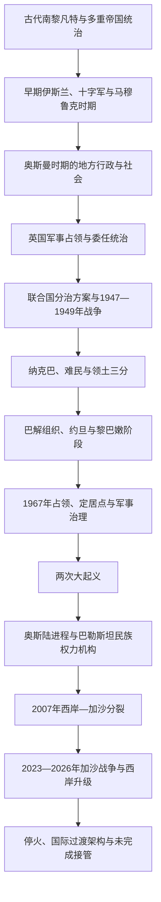

# 巴勒斯坦

## 概括

“巴勒斯坦”在历史上既是地理名称，也曾用于罗马—拜占庭行政区、早期伊斯兰军区、奥斯曼末期地区称呼和英国委任统治地；现代还指巴勒斯坦人民、民族运动和1988年宣布成立的巴勒斯坦国。这些含义的范围和法律性质不同，不能把古代非利士人、罗马行省或全部南黎凡特居民直接等同于现代巴勒斯坦民族。

现代主线形成于奥斯曼末期、英国委任统治、阿拉伯与犹太民族运动竞争以及1948年战争。1948年纳克巴造成大规模流离失所，1967年以色列占领西岸、东耶路撒冷和加沙；巴解组织由武装流亡运动转向外交与国家建设，奥斯陆进程建立有限自治，却没有完成最终地位谈判。2007年后西岸与加沙长期分裂。2023—2026年战争、停火、占领控制与尚未落实的加沙过渡架构，使“国际承认扩大”与“有效主权仍缺失”同时存在。

现代现状核验截止 **2026年7月13日**。

## 演变图

## 历史主线

巴勒斯坦史需要同时观察地方城镇、村庄、宗教圣地和家族社会，跨区域帝国与移民网络，难民和侨民政治，以及现代民族主义、占领和国际法。以色列史与巴勒斯坦史高度交叉，但巴勒斯坦人的社会瓦解、流亡组织、起义、有限自治、内部政治分裂和国家承认构成独立主线。

## 时期导航

| 顺序 | 阶段 | 时间 | 简要概括 |
|---:|---|---|---|
| 1 | [古代至奥斯曼时期的巴勒斯坦](/%E4%BA%BA%E6%96%87%E7%A7%91%E5%AD%A6/%E5%8E%86%E5%8F%B2/%E8%A5%BF%E4%BA%9A/%E9%BB%8E%E5%87%A1%E7%89%B9/%E5%B7%B4%E5%8B%92%E6%96%AF%E5%9D%A6/%E5%8F%A4%E4%BB%A3%E8%87%B3%E5%A5%A5%E6%96%AF%E6%9B%BC%E6%97%B6%E6%9C%9F%E7%9A%84%E5%B7%B4%E5%8B%92%E6%96%AF%E5%9D%A6.md) | 约前3千纪—1918年 | 南黎凡特城邦和诸王国、罗马—拜占庭、伊斯兰、十字军、马穆鲁克与奥斯曼多层统治。 |
| 2 | [英国委任统治、分治与1948年战争](/%E4%BA%BA%E6%96%87%E7%A7%91%E5%AD%A6/%E5%8E%86%E5%8F%B2/%E8%A5%BF%E4%BA%9A/%E9%BB%8E%E5%87%A1%E7%89%B9/%E5%B7%B4%E5%8B%92%E6%96%AF%E5%9D%A6/%E8%8B%B1%E5%9B%BD%E5%A7%94%E4%BB%BB%E7%BB%9F%E6%B2%BB%E3%80%81%E5%88%86%E6%B2%BB%E4%B8%8E1948%E5%B9%B4%E6%88%98%E4%BA%89.md) | 1917—1949年 | 英国的双重承诺、阿犹民族运动、阿拉伯人大起义、联合国分治、战争与纳克巴。 |
| 3 | [巴勒斯坦民族运动、占领与自治治理](/%E4%BA%BA%E6%96%87%E7%A7%91%E5%AD%A6/%E5%8E%86%E5%8F%B2/%E8%A5%BF%E4%BA%9A/%E9%BB%8E%E5%87%A1%E7%89%B9/%E5%B7%B4%E5%8B%92%E6%96%AF%E5%9D%A6/%E5%B7%B4%E5%8B%92%E6%96%AF%E5%9D%A6%E6%B0%91%E6%97%8F%E8%BF%90%E5%8A%A8%E3%80%81%E5%8D%A0%E9%A2%86%E4%B8%8E%E8%87%AA%E6%B2%BB%E6%B2%BB%E7%90%86.md) | 1949年至今 | 难民政治、巴解组织、1967年占领、起义、奥斯陆、两地分裂与2023—2026年战争。 |

## 领导与治理专表

| 专表 | 内容 |
|---|---|
| [巴解组织、巴勒斯坦国与自治机构领导人表](/%E4%BA%BA%E6%96%87%E7%A7%91%E5%AD%A6/%E5%8E%86%E5%8F%B2/%E8%A5%BF%E4%BA%9A/%E9%BB%8E%E5%87%A1%E7%89%B9/%E5%B7%B4%E5%8B%92%E6%96%AF%E5%9D%A6/%E5%B7%B4%E8%A7%A3%E7%BB%84%E7%BB%87%E3%80%81%E5%B7%B4%E5%8B%92%E6%96%AF%E5%9D%A6%E5%9B%BD%E4%B8%8E%E8%87%AA%E6%B2%BB%E6%9C%BA%E6%9E%84%E9%A2%86%E5%AF%BC%E4%BA%BA%E8%A1%A8.md) | 完整区分巴解组织主席、巴勒斯坦国总统与副总统、权力机构总统、总理、立法机构和现行继任规则。 |
| [加沙与约旦河西岸并立治理结构表](/%E4%BA%BA%E6%96%87%E7%A7%91%E5%AD%A6/%E5%8E%86%E5%8F%B2/%E8%A5%BF%E4%BA%9A/%E9%BB%8E%E5%87%A1%E7%89%B9/%E5%B7%B4%E5%8B%92%E6%96%AF%E5%9D%A6/%E5%8A%A0%E6%B2%99%E4%B8%8E%E7%BA%A6%E6%97%A6%E6%B2%B3%E8%A5%BF%E5%B2%B8%E5%B9%B6%E7%AB%8B%E6%B2%BB%E7%90%86%E7%BB%93%E6%9E%84%E8%A1%A8.md) | 逐阶段说明西岸A／B／C区、哈马斯事实治理、以色列军事控制、2025年停火后控制线及2026年未完成的过渡接管。 |

## 重要转折与时间节点

| 时间 | 事件 | 意义 |
|---|---|---|
| 1516—1517年 | 奥斯曼征服黎凡特 | 地区进入约四百年的奥斯曼统治，但并非单一“巴勒斯坦省”。 |
| 1917—1918年 | 英军征服与《贝尔福宣言》 | 英国统治和犹太民族家园政策改变地区政治。 |
| 1922—1923年 | 国际联盟委任统治获批并生效 | 英国责任和相互冲突的民族诉求制度化。 |
| 1936—1939年 | 巴勒斯坦阿拉伯人大起义 | 反英和民族独立运动达高峰，镇压削弱1948年前的阿拉伯组织。 |
| 1947年 | 联大第181号决议 | 建议建立阿拉伯国、犹太国和国际化耶路撒冷，未获双方共同接受。 |
| 1947—1949年 | 战争与纳克巴 | 巴勒斯坦社会大规模瓦解，难民问题形成；拟议阿拉伯国未建立。 |
| 1964年 | 巴解组织成立 | 民族运动获得跨国政治中心。 |
| 1967年 | 以色列占领西岸、东耶路撒冷和加沙 | 占领、定居点、军事治理与再次流离失所成为现代主线。 |
| 1970—1982年 | 巴解组织先后撤出约旦和黎巴嫩 | 武装运动转入更分散的流亡阶段，外交路线上升。 |
| 1987—1988年 | 第一次大起义与巴勒斯坦国宣言 | 本土群众动员推动建国与谈判路线。 |
| 1993—1995年 | 奥斯陆协议、权力机构与A／B／C区 | 建立有限自治，同时把最终地位和领土控制问题延后。 |
| 2000—2005年 | 第二次大起义与加沙撤离 | 和平进程崩溃，隔离墙、军事再占领与新的加沙控制形式出现。 |
| 2006—2007年 | 哈马斯胜选与两地分裂 | 全国统一行政、武装和选举连续性中断。 |
| 2012年 | 联合国非会员观察员国地位 | 巴勒斯坦国际国家地位进一步提升。 |
| 2023年10月7日以后 | 哈马斯等武装袭击以色列，以色列发动加沙战争 | 大规模杀戮、劫持、人道灾难、破坏和流离失所重塑地区政治。 |
| 2025年1—3月 | 第一轮停火 | 完成人质—囚犯交换并扩大援助，随后恢复大规模战争。 |
| 2025年10月 | 第二轮停火 | 剩余在世人质获释，战斗强度下降但伤亡和军事控制持续。 |
| 2025年11月—2026年 | 安理会授权过渡架构，NCAG成立 | 和平委员会、国际稳定部队与技术官僚治理获制度设计，但截至核验日尚未完成加沙接管。 |

## 关键辨析

- 古代“非利士人”、罗马“巴勒斯坦”行省名称和现代巴勒斯坦阿拉伯人不能直接等同。
- 1948年后，西岸由约旦控制、加沙由埃及管理；1967年后两地被以色列占领。
- 联合国通常把西岸包括东耶路撒冷和加沙合称“被占领巴勒斯坦领土”；以色列对2005年撤离后加沙的占领法律定性持不同意见。
- 巴解组织、巴勒斯坦国和巴勒斯坦民族权力机构是不同层级；同一人兼任多职不等于机构完全相同。
- 权力机构不是拥有完整主权的中央政府，其权限受奥斯陆分区、以色列控制、财政依赖和巴勒斯坦内部政治分裂限制。
- 2007年后“西岸政府”和“加沙事实治理”并立；2026年获授权的加沙过渡委员会尚未完成地面接管。
- 停火、控制线、事实执法和国际过渡授权可以同时存在，不能把“停火”理解为战争后果已经终结。
- 以色列国家与犹太社会的独立主线见[以色列](/%E4%BA%BA%E6%96%87%E7%A7%91%E5%AD%A6/%E5%8E%86%E5%8F%B2/%E8%A5%BF%E4%BA%9A/%E9%BB%8E%E5%87%A1%E7%89%B9/%E4%BB%A5%E8%89%B2%E5%88%97/README.md)；双方共享背景见[现代以色列与巴勒斯坦](/%E4%BA%BA%E6%96%87%E7%A7%91%E5%AD%A6/%E5%8E%86%E5%8F%B2/%E8%A5%BF%E4%BA%9A/%E9%BB%8E%E5%87%A1%E7%89%B9/%E7%8E%B0%E4%BB%A3%E4%BB%A5%E8%89%B2%E5%88%97%E4%B8%8E%E5%B7%B4%E5%8B%92%E6%96%AF%E5%9D%A6.md)。

## 目录层级

- 直接上级：[黎凡特](/%E4%BA%BA%E6%96%87%E7%A7%91%E5%AD%A6/%E5%8E%86%E5%8F%B2/%E8%A5%BF%E4%BA%9A/%E9%BB%8E%E5%87%A1%E7%89%B9/README.md)
- 宏观区域：[西亚](/%E4%BA%BA%E6%96%87%E7%A7%91%E5%AD%A6/%E5%8E%86%E5%8F%B2/%E8%A5%BF%E4%BA%9A/README.md)
- 历史总览：[历史](/%E4%BA%BA%E6%96%87%E7%A7%91%E5%AD%A6/%E5%8E%86%E5%8F%B2/README.md)
