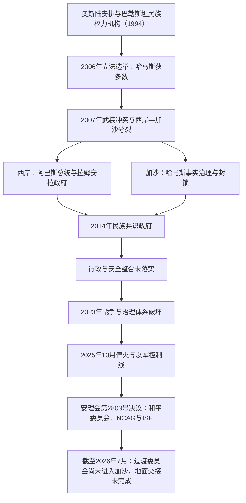

# 加沙与约旦河西岸并立治理结构表

## 时间与范围

1994年至今；现状核验截止 **2026年7月13日**。

本页区分四个经常被混为一谈的层次：巴勒斯坦内部的法定机构、地面事实治理、以色列的占领与军事控制，以及2025年停火后获授权但尚未完全落实的国际过渡架构。表中的“管辖”不等于主权获得国际承认，“名义移交”也不等于地面权力已经交接。

## 并立治理演变图

## 历史阶段

| 阶段 | 西岸 | 加沙 | 关键特征 |
|---|---|---|---|
| 1994—2005年 | 权力机构逐步接管部分民政与安全职能；以色列仍控制定居点、边界和大量安全事务 | 权力机构在城市和人口中心施政，以色列保留定居点、驻军、边境与外部控制 | 名义上是一个自治机构，领土和权限由多份临时协议分割。 |
| 2005—2006年 | 阿巴斯领导权力机构，法塔赫仍控制多数行政与安全资源 | 以色列撤出定居点与常驻地面部队；权力机构接管定居点原址，哈马斯政治影响上升 | 以色列继续控制领空、海域、人口登记和多数出入口；埃及控制拉法口岸一侧。联合国继续把加沙视为被占领领土的一部分，以色列对此法律定性持异议。 |
| 2006—2007年 | 哈马斯在立法选举获胜并组阁；总统、政府、安全机构与外援体系发生冲突 | 法塔赫与哈马斯武装冲突升级 | 国际制裁、双重安全力量和未完成的民族团结安排共同导致制度崩解。 |
| 2007—2014年 | 阿巴斯任命法耶兹等政府，主要在西岸运作并获多数外部援助方承认 | 哈马斯武力击败法塔赫安全力量，哈尼亚政府继续事实执政 | 以色列与埃及实施严格口岸限制；加沙封锁、火箭攻击和多轮战争并存。 |
| 2014—2023年 | 哈姆达拉、什塔耶等政府自称覆盖全部巴勒斯坦领土 | 共识政府名义成立，哈马斯内阁形式上辞职，但安全、警务、税费和行政人员仍由哈马斯体系掌握 | 多轮和解协议没有形成统一武装、财政或选举制度。 |
| 2023年10月—2025年10月 | 以军突袭、定居点扩张、行动限制与权力机构财政危机加深 | 哈马斯主导的10月7日袭击后，以色列发动大规模陆海空战争；行政、警务、医疗和基础设施严重破坏 | 大多数人口反复流离失所；哈马斯领导层遭重大打击，但其残余安全与组织网络并未立即消失。 |
| 2025年10月至今 | 权力机构仍在分散的A、B区人口中心履职，以军可进入并持续行动 | 停火后以军保留大面积部署与禁入区；哈马斯事实机构、地方公务员和拟议过渡机构同时存在 | 国际过渡架构已获授权，但截至2026年7月尚未完成地面权力交接。 |

## 约旦河西岸的权限分区

| 区域 | 约占西岸面积 | 奥斯陆名义安排 | 2026年前后的实际限制 |
|---|---:|---|---|
| A区 | 18% | 权力机构负责民政与内部安全 | 由巴勒斯坦城市和人口中心组成，地理上不连续；以军仍多次进入搜捕或作战，权力机构无法控制外部边界。 |
| B区 | 22% | 权力机构负责民政，安全责任由以巴双方分担 | 村镇民政由权力机构承担，以色列仍掌握总体安全、道路与跨区行动能力。 |
| C区 | 约60% | 过渡期由以色列负责民政与安全，原计划在最终地位谈判处理 | 包含多数土地储备、约旦河谷、定居点与主要跨区道路；以色列民政管理局审批规划和建设。巴勒斯坦建设许可极难取得，拆除、定居点扩张与牧民社区迁离持续。 |
| 东耶路撒冷 | 未纳入A、B、C区自治划分 | 作为最终地位问题搁置 | 以色列把东耶路撒冷纳入其市政与国内法体系，国际社会普遍不承认其吞并；巴勒斯坦居民多持永久居留而非以色列公民身份。 |

即使在A区，权力机构也不拥有完整主权。以色列掌握西岸对外边界、空域、人口登记、跨区道路和代征税款，并通过军队与民政管理局影响全境。到2020年代中期，西岸与东耶路撒冷的以色列定居者合计已超过70万人；定居点、前哨、道路和安全区使巴勒斯坦辖区进一步碎片化。

## 加沙的事实权力与领导层

### 哈马斯政治领导沿革

| 阶段 | 主要领导 | 时间 | 角色与说明 |
|---|---|---|---|
| 创建与宗教领导 | **艾哈迈德·亚辛** | 1987—2004年 | 哈马斯创始人和精神领袖；2004年被以色列空袭杀害。其职位不完全等同于后来设在境外的政治局主席。 |
| 政治局初期 | 穆萨·阿布·马尔祖克 | 1992—1996年 | 早期政治局主席，后因被美国拘押及组织重组而由马沙阿勒接任。 |
| 境外领导中心 | **哈立德·马沙阿勒** | 1996—2017年 | 在安曼、大马士革和多哈等地领导政治局，经历约旦驱逐、第二次大起义、加沙掌权与多轮战争。 |
| 政治局主席 | **伊斯梅尔·哈尼亚** | 2017年5月—2024年7月31日 | 曾任权力机构总理和加沙事实政府首脑；在德黑兰遇袭身亡。 |
| 短期单一主席 | **叶海亚·辛瓦尔** | 2024年8月6日—10月16日 | 原加沙领导人，接替哈尼亚后不久在加沙被以军杀死。 |
| 集体领导 | 穆罕默德·伊斯梅尔·达尔维什主持领导委员会；成员包括哈立德·马沙阿勒、哈利勒·哈亚、扎赫尔·贾巴林等 | 2024年10月17日至今 | 辛瓦尔死后以五人委员会集体决策。到2026年7月，哈马斯对外活动仍称达尔维什为领导委员会负责人，哈亚是加沙地区负责人和主要停火谈判代表。有关2026年内部选出单一最高领导人的报道相互矛盾，未见组织公开、稳定地完成职位交接，故不写成确定任命。 |

### 加沙行政负责人及其有效性

| 机构或阶段 | 负责人 | 时间 | 实际权力 |
|---|---|---|---|
| 哈尼亚事实政府 | 伊斯梅尔·哈尼亚 | 2007年6月—2014年6月 | 掌握加沙警察、安全机构和主要行政部门；阿巴斯政府不承认其继续任总理。 |
| 哈马斯行政与安全体系 | 多届事实行政负责人；哈马斯加沙领导层居于其上 | 2014—2023年 | 2014年共识政府后不再公开维持同名内阁，但地方部委、公务员、警务和安全系统仍受哈马斯主导。2017年的行政委员会曾在和解协议后宣布解散，实际整合仍失败。 |
| 战时紧急政府委员会 | 穆罕默德·法拉 | 约2025年—2026年7月6日 | 在战争和停火初期协调残存民政。2026年7月6日宣布辞职并解散，声称把权限和公务员移交给全国加沙管理委员会；但后者仍无法进入加沙，武装与安全权也未完成移交。 |
| 战后技术官僚架构 | 阿里·沙阿斯领导的全国加沙管理委员会（NCAG） | 2026年1月15日成立至今 | 被设计为13名左右的巴勒斯坦技术官僚机构，负责日常民政、服务和重建准备。到2026年7月13日仍主要在开罗筹备，尚未能进入加沙建立全面行政。 |

## 2025年停火后的国际过渡架构

| 层级 | 负责人或组成 | 授权 | 截至2026年7月13日的状态 |
|---|---|---|---|
| 和平委员会（Board of Peace） | 美国总统唐纳德·特朗普任主席 | 安理会第2803号决议欢迎其作为过渡管理与重建协调平台 | 2026年1月正式启动；是国际过渡监督机构，不是经巴勒斯坦选举产生的主权政府。 |
| 加沙高级代表办公室 | 尼古拉·姆拉德诺夫任高级代表 | 在和平委员会、NCAG、权力机构、以色列和停火保证方之间协调 | 已开展制度设计和对外协调，但不能代替地面行政。 |
| 全国加沙管理委员会（NCAG） | 首席委员阿里·沙阿斯及巴勒斯坦技术官僚委员 | 负责加沙日常公务、基本服务、恢复和重建，直至权力机构完成改革并接手 | 已制定法律、财政、人事与警务框架；尚未进入加沙建立全面运作。 |
| 国际稳定部队（ISF） | 统一指挥架构；指定指挥官贾斯珀·杰弗斯少将 | 安理会授权为临时力量，任务包括稳定安全、保护平民、支持解除武装和边境安全 | 授权存在，但部署、规模和对加沙全境的实际控制尚未达到制度设想。 |
| 哈马斯残余事实权力 | 集体政治领导、武装组织、安全人员与地方公务员网络 | 无国际过渡授权；以2007年以来事实控制及武装能力为基础 | 紧急委员会虽宣布解散，哈马斯并未完成单方面解除武装。联合国人道报告仍以“事实当局”称呼当地搜查和执法人员，说明地面权力交接未落实。 |
| 以色列军方 | 以军及其设定的部署、禁入和协调机制 | 以停火安全安排与军事控制为依据；其范围与合法性持续受争议 | 仍控制边界、领空、海域、援助准入和大面积地面区域，并继续发动有限军事行动。 |

## “黄线”“橙线”与实际控制

- 2025年10月10日停火实施后，“黄线”大致标示以军暂时保留部署的区域，最初约占加沙 **53%**，巴勒斯坦居民通常只能进入其余约47%。
- 以色列随后用于人道协调的“橙线”进一步向人口区扩展。到2026年6月23日，其覆盖范围相当于加沙 **64.9%** 处于更严格、更直接的以色列控制或准入限制下。
- 这些线并非稳定、清晰标定的国际边界。居民常无法准确辨认禁入区，越线或靠近线附近发生枪击、空袭和新一轮迁移。
- 因此，“停火后哈马斯仍在未被以军直接驻守地区维持部分治安”“NCAG获得过渡授权”“以军控制大面积禁入区”三种事实可以同时成立，不能用单一颜色把全境简单归属某一政府。

## 当前权力对照

| 地区或层级 | 名义元首／政府首脑 | 实际最高政治领导 | 地面执行者 | 主要限制 |
|---|---|---|---|---|
| 巴勒斯坦国／巴解组织 | 总统兼巴解组织主席马哈茂德·阿巴斯；副总统侯赛因·谢赫 | 阿巴斯 | 外交使团、巴解组织机构与权力机构 | 国家地位广获承认，但不掌握完整领土、边界和军队。 |
| 西岸权力机构 | 总统阿巴斯；总理穆罕默德·穆斯塔法 | 阿巴斯及法塔赫—巴解组织高层 | 部委、地方政府与安全部门 | 辖区碎片化、以军行动、C区控制、定居点、代征税款扣留和长期无选举。 |
| 加沙哈马斯残余体系 | 不承认阿巴斯对加沙的有效统治；没有获普遍承认的国家元首 | 达尔维什主持集体领导；哈亚负责加沙事务与谈判 | 武装组织、安全人员、仍在岗公务员和地方网络 | 领导层伤亡、基础设施崩溃、停火约束、以军控制区及拟议过渡机制。 |
| 加沙拟议过渡政府 | NCAG不设国家元首；阿里·沙阿斯为首席委员 | 和平委员会与高级代表负责外部监督 | 尚在筹备的技术官僚部门和警务体系 | 截至核验日仍未进入加沙；经费、解除武装、以军撤离和合法性来源均未解决。 |
| 以色列占领与军事控制 | 以色列国家机构 | 以色列政府与军方 | 以军、民政管理局、口岸与协调机关 | 国际人道法与占领法义务、国际法院意见、停火承诺及持续外交争议。 |

## 演变关系

- 政治进程和战争脉络见[巴勒斯坦民族运动、占领与自治治理](/%E4%BA%BA%E6%96%87%E7%A7%91%E5%AD%A6/%E5%8E%86%E5%8F%B2/%E8%A5%BF%E4%BA%9A/%E9%BB%8E%E5%87%A1%E7%89%B9/%E5%B7%B4%E5%8B%92%E6%96%AF%E5%9D%A6/%E5%B7%B4%E5%8B%92%E6%96%AF%E5%9D%A6%E6%B0%91%E6%97%8F%E8%BF%90%E5%8A%A8%E3%80%81%E5%8D%A0%E9%A2%86%E4%B8%8E%E8%87%AA%E6%B2%BB%E6%B2%BB%E7%90%86.md)。
- 巴解组织、巴勒斯坦国和权力机构的历任负责人见[巴解组织、巴勒斯坦国与自治机构领导人表](/%E4%BA%BA%E6%96%87%E7%A7%91%E5%AD%A6/%E5%8E%86%E5%8F%B2/%E8%A5%BF%E4%BA%9A/%E9%BB%8E%E5%87%A1%E7%89%B9/%E5%B7%B4%E5%8B%92%E6%96%AF%E5%9D%A6/%E5%B7%B4%E8%A7%A3%E7%BB%84%E7%BB%87%E3%80%81%E5%B7%B4%E5%8B%92%E6%96%AF%E5%9D%A6%E5%9B%BD%E4%B8%8E%E8%87%AA%E6%B2%BB%E6%9C%BA%E6%9E%84%E9%A2%86%E5%AF%BC%E4%BA%BA%E8%A1%A8.md)。
- 以色列国家与安全政治见[以色列国家、战争与社会变迁](/%E4%BA%BA%E6%96%87%E7%A7%91%E5%AD%A6/%E5%8E%86%E5%8F%B2/%E8%A5%BF%E4%BA%9A/%E9%BB%8E%E5%87%A1%E7%89%B9/%E4%BB%A5%E8%89%B2%E5%88%97/%E4%BB%A5%E8%89%B2%E5%88%97%E5%9B%BD%E5%AE%B6%E3%80%81%E6%88%98%E4%BA%89%E4%B8%8E%E7%A4%BE%E4%BC%9A%E5%8F%98%E8%BF%81.md)。
- 上级入口：[巴勒斯坦](/%E4%BA%BA%E6%96%87%E7%A7%91%E5%AD%A6/%E5%8E%86%E5%8F%B2/%E8%A5%BF%E4%BA%9A/%E9%BB%8E%E5%87%A1%E7%89%B9/%E5%B7%B4%E5%8B%92%E6%96%AF%E5%9D%A6/README.md)。
