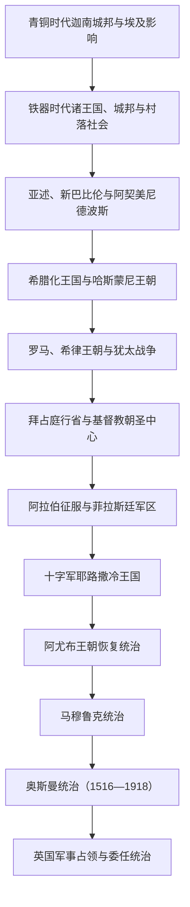

# 古代至奥斯曼时期的巴勒斯坦

## 时间

约前3千纪—1918年

## 范围与概括

今以色列、约旦河西岸、加沙地带及其邻近地区在古代属于南黎凡特。“巴勒斯坦”在不同时代可以指希罗多德笔下的地理区域、罗马—拜占庭行政名称、早期伊斯兰的“菲拉斯廷军区”、奥斯曼时代的地方性地理称呼，范围彼此并不完全相同。现代巴勒斯坦民族是在近现代社会、政治和民族主义环境中形成的，不能把古代非利士人、迦南人或任何单一古代社群直接等同于现代民族。

这一地区位于埃及、叙利亚内陆、两河流域、阿拉伯半岛和地中海之间。海岸平原、中央山地、约旦河谷、内盖夫和加沙走廊具有不同生态，耶路撒冷、雅法、加沙、阿卡、纳布卢斯、希伯伦等城市也因宗教、贸易或行政功能而兴衰。其历史不是一条单一王朝世系，而是本地城邦、村社、宗教共同体和跨区域帝国反复叠加的过程。

## 演变图

## 分阶段发展

| 阶段 | 时间 | 政治结构 | 主要变化 |
|---|---|---|---|
| 青铜时代 | 约前3千纪—前1200年 | 城邦、村落与埃及帝国势力 | 耶路撒冷、拉吉、夏琐、米吉多等城邦处于埃及与西亚外交、贡赋和贸易网络中；政治控制随时期强弱变化。 |
| 铁器时代 | 约前1200—前586年 | 非利士城市联盟、以色列与犹大等王国及地方社群 | 海岸与山地形成不同政治实体；亚述扩张摧毁北方以色列王国并使诸国纳贡，新巴比伦最终攻陷耶路撒冷。 |
| 波斯时期 | 前539—前332年 | 阿契美尼德帝国行省与地方自治共同体 | 波斯允许部分流亡者返回，耶路撒冷圣殿重建；“耶胡德”是帝国行政单元之一，撒玛利亚等社群亦发展。 |
| 希腊化时期 | 前332—前63年 | 托勒密与塞琉古争夺，后有哈斯蒙尼王朝 | 希腊语城市文化、地方宗教和帝国财政相互作用；马加比起义催生哈斯蒙尼独立与扩张。 |
| 罗马与晚期古代 | 前63年—7世纪初 | 罗马行省、附属王、自治城市与拜占庭行省 | 希律王朝重建圣殿和城市；两次大规模犹太战争改变耶路撒冷、人口和宗教中心；基督教化后形成朝圣网络。 |
| 早期伊斯兰至法蒂玛 | 7—11世纪 | 哈里发国家、菲拉斯廷军区与地方王朝 | 阿拉伯语逐渐成为行政和社会主要语言，伊斯兰化是数世纪的渐进过程；基督徒、犹太人和撒玛利亚人继续存在。 |
| 十字军、阿尤布与马穆鲁克 | 1099—1516年 | 拉丁王国、穆斯林诸侯与马穆鲁克行省 | 圣地、城堡、海港和交通线成为战争核心；1291年十字军最后主要海岸据点失守。 |
| 奥斯曼时期 | 1516—1918年 | 行省、桑贾克、宗教法庭、地方名流与村社 | 地区从未长期构成单一“巴勒斯坦省”；19世纪改革、世界市场、移民与欧洲介入重塑地方社会。 |

## 古代帝国与宗教中心

### 青铜时代至波斯时期

南黎凡特的城邦依靠灌溉、雨养农业、橄榄与葡萄种植、牧业和商路维持。新王国时期埃及通过驻军、附庸统治者和贡赋网络施加影响，但地方城邦并未消失。前12世纪前后的青铜时代崩溃使海岸和山地聚落重组，非利士城市、早期以色列社群、犹大、摩押、亚扪和以东等政治实体逐渐出现。

前8世纪亚述把地区纳入帝国体系，攻灭北方以色列王国并实施迁徙与行政重组；犹大一度作为附庸延续。前586年前后，新巴比伦攻陷耶路撒冷、毁坏第一圣殿并迁走部分精英。前539年波斯征服巴比伦后允许被迁社群回归，耶路撒冷第二圣殿在前6世纪末重建。回归、留居、迁徙和本地连续性同时存在，不能把“流亡与回归”理解为全体人口整齐更替。

### 希腊化、哈斯蒙尼与罗马时期

亚历山大东征后，托勒密埃及和塞琉古叙利亚反复争夺此地。前2世纪，塞琉古王权对耶路撒冷祭祀和政治秩序的干预触发马加比起义；哈斯蒙尼家族由祭司领袖转为王朝统治者，并向周边扩张。内部继承争端使罗马将军庞培于前63年进入耶路撒冷。

希律大王在罗马支持下统治，扩建第二圣殿、凯撒利亚港和多座要塞，但沉重征税与王位继承问题加深紧张。66—73年第一次犹太战争中，罗马于70年摧毁第二圣殿；132—135年巴尔·科赫巴起义失败后，罗马强化重组耶路撒冷，并通常把行省称为“叙利亚巴勒斯坦”。这一行政改称的具体形成过程仍有学术讨论，名称变化也不意味着所有既有居民或身份被同时消除。

4世纪罗马帝国基督教化后，耶路撒冷、伯利恒和加利利圣地成为国际朝圣中心。拜占庭把地区分为巴勒斯坦第一、第二、第三行省；希腊语行政、基督教教会和修道院网络扩张，犹太人、撒玛利亚人等社群仍在部分地区保持人口和宗教中心。614年萨珊波斯攻占耶路撒冷，629年前后拜占庭短暂恢复，为随后阿拉伯征服留下一个战争消耗严重的边区。

## 伊斯兰化、十字军与马穆鲁克

634—638年的阿拉伯征服结束拜占庭统治。倭马亚时期设立“菲拉斯廷军区”，治所先在卢德，8世纪初转到新建的拉姆拉。耶路撒冷的圆顶清真寺约于691—692年建成，阿克萨清真寺群随后发展，使城市同时成为伊斯兰、基督教和犹太教圣地。

阿拉伯化和伊斯兰化不是一次征服后的瞬间替换。行政语言、税制、通婚、城市网络和改宗在数百年间共同作用；乡村基督徒、犹太人和撒玛利亚人延续，并经历不同王朝的税负、保护和冲突。阿拔斯、突伦、伊赫什德、法蒂玛和塞尔柱相关势力先后控制或争夺地区，地震、财政变化和商路转移亦影响城市。

1099年十字军攻占耶路撒冷并建立耶路撒冷王国，城中穆斯林与犹太居民遭大规模杀戮或驱逐。拉丁领主、教会、意大利商人和本地基督徒构成新的权力秩序。1187年哈丁战役后，萨拉丁收复耶路撒冷，但十字军继续控制部分海岸城市；1291年马穆鲁克攻克阿卡，终结主要十字军海岸政权。马穆鲁克通过驿路、商队站、宗教基金和朝圣设施加强大马士革—开罗通道，同时有意削弱部分海港防御，以防新的十字军登陆。

## 奥斯曼统治结构

1516年马尔季达比克战役后奥斯曼击败马穆鲁克，1517年前后完成对黎凡特和埃及的征服。巴勒斯坦地区长期分属大马士革、赛达或后来的贝鲁特行省体系；耶路撒冷、纳布卢斯、加沙、阿卡等桑贾克的隶属关系多次变化。1872年耶路撒冷成为直接向伊斯坦布尔负责的独立穆塔萨勒夫区，而纳布卢斯、阿卡后来主要归贝鲁特省。由此不能倒推一个边界固定、连续存在四百年的“奥斯曼巴勒斯坦省”。

| 层级或力量 | 职能 | 实际作用 |
|---|---|---|
| 苏丹与中央政府 | 任命总督、制定税法、征兵与外交 | 中央能力随战争、交通与改革而变化。 |
| 行省、桑贾克与卡扎官员 | 税收、治安、征兵、土地登记 | 官员任期常短，需要同地方名流和军事集团合作。 |
| 伊斯兰法官与宗教基金 | 司法、契约、财产、慈善和圣地管理 | 法庭档案记录城市居民、妇女、商人和乡村社群的日常交易。 |
| 地方名流与税农家族 | 包税、乡村调解、武装动员和城市政治 | 里德万、图拉拜、法鲁赫等家族在早期奥斯曼地方权力中重要；18世纪阿卡势力崛起。 |
| 村社、部落与农民 | 农业生产、地方防卫、税赋与迁徙 | 国家、名流、贝都因和村庄之间既合作也冲突，不能只写成中央单向统治。 |

## 奥斯曼时期的崛起、改革与终结

### 地方权力与区域贸易

17—18世纪中央政府常借助地方军政家族治理。18世纪中期，查希尔·欧麦尔以加利利、太巴列和阿卡为中心建立近乎自治的权力网络，利用棉花贸易、港口收入和本地武装扩大势力；1775年被奥斯曼击败。此后杰扎尔帕夏以阿卡为中心恢复帝国控制，并在1799年抵挡拿破仑围攻。阿卡的兴起显示地方强人、地中海市场和帝国任命可以同时塑造“地方崛起”，而非简单的中央衰落。

### 埃及占领与坦志麦特

1831—1840年，穆罕默德·阿里之子易卜拉欣帕夏占领叙利亚和巴勒斯坦，推行征兵、解除地方武装和强化征税，引发1834年广泛反抗。列强干预后奥斯曼恢复统治。坦志麦特改革随后重建行政、征兵、户籍和司法体系；1858年《土地法》推动土地登记，但登记常由城市名流、商人或代理人完成，其后果因地区而异，不能把全部土地转移归结为单一法令。

19世纪后半，雅法柑橘、阿卡和海法港口、耶路撒冷朝圣与旅游、贝鲁特市场以及铁路和公路使地方更深进入世界经济。欧洲领事、传教机构、学校和宗教社团扩大影响。穆斯林、基督徒和犹太城市居民形成新的报刊、教育与职业网络，乡村和城市之间迁徙加快。

### 民族政治的早期条件

1880年代起，逃避欧洲迫害并受锡安主义影响的犹太移民建立农业定居点，土地购置通常经合法契约完成，但也可能使原有佃农失去使用权。奥斯曼官员、本地阿拉伯地主、农民和城市知识分子对此反应不一。到20世纪初，“南叙利亚”“巴勒斯坦”“奥斯曼公民”和阿拉伯认同可在同一社会中并存；报刊、地方议会、教育和对土地出售及移民的争论，逐渐为现代巴勒斯坦政治认同提供条件。

### 第一次世界大战与直接终结

奥斯曼参战后实施征兵、征发、价格和交通管制；海上封锁、1915年蝗灾、歉收和军需共同造成饥饿与疾病。部分政治活动者被镇压，雅法等地居民曾遭强制迁离。1917年英国攻占加沙—贝尔谢巴防线，并于12月进入耶路撒冷；1918年米吉多战役后，奥斯曼在巴勒斯坦其余地区的统治结束。英国先建立军事占领区，随后转为民政和国际联盟委任统治。

## 重要事件

| 时间 | 事件 | 过程与影响 |
|---|---|---|
| 前8—前7世纪 | 亚述扩张 | 北方王国灭亡、附庸化与人口迁徙把南黎凡特纳入帝国省制。 |
| 前586年前后 | 新巴比伦攻陷耶路撒冷 | 第一圣殿被毁，部分精英被迁往巴比伦；地方人口并未全部消失。 |
| 前167—前160年间 | 马加比起义 | 反对塞琉古干预，促成哈斯蒙尼王朝形成。 |
| 70年 | 第二圣殿被毁 | 罗马镇压起义，犹太宗教与政治中心发生长期重组。 |
| 132—135年 | 巴尔·科赫巴起义 | 起义失败后罗马强化人口、城市与行省秩序调整。 |
| 614—629年 | 萨珊占领与拜占庭恢复 | 长期战争削弱晚期古代统治体系。 |
| 634—638年 | 阿拉伯征服 | 地区纳入哈里发国家，逐步形成阿拉伯语—伊斯兰政治文化。 |
| 1099年 | 十字军攻占耶路撒冷 | 建立拉丁王国，造成严重屠杀、驱逐与土地秩序重组。 |
| 1187年 | 哈丁战役与耶路撒冷易手 | 萨拉丁击败十字军主力，阿尤布王朝恢复对内陆核心地区的统治。 |
| 1291年 | 马穆鲁克攻克阿卡 | 十字军主要海岸政权终结。 |
| 1516—1517年 | 奥斯曼征服 | 地区纳入延续约四百年的奥斯曼帝国秩序。 |
| 1799年 | 阿卡抵挡拿破仑 | 杰扎尔帕夏在英国海军协助下守住阿卡，阻止法军向叙利亚内陆推进。 |
| 1831—1840年 | 埃及占领 | 强化征兵与税收引发1834年起义，列强干预后奥斯曼复位。 |
| 1872年 | 耶路撒冷独立穆塔萨勒夫区形成 | 圣城及周边更直接受伊斯坦布尔管理，反映列强关注与行政改革。 |
| 1882年以后 | 新一轮犹太移民与定居 | 同土地市场、欧洲迫害和锡安主义结合，逐渐改变地方政治议题。 |
| 1917—1918年 | 英军征服 | 奥斯曼统治在战争、物资危机和军事失败中终结，地区进入英国统治。 |

## 演变关系

- 青铜时代背景见[迦南与青铜时代黎凡特](/%E4%BA%BA%E6%96%87%E7%A7%91%E5%AD%A6/%E5%8E%86%E5%8F%B2/%E8%A5%BF%E4%BA%9A/%E9%BB%8E%E5%87%A1%E7%89%B9/%E8%BF%A6%E5%8D%97%E4%B8%8E%E9%9D%92%E9%93%9C%E6%97%B6%E4%BB%A3%E9%BB%8E%E5%87%A1%E7%89%B9.md)。
- 以色列和犹大王国详见[以色列王国与犹大王国](/%E4%BA%BA%E6%96%87%E7%A7%91%E5%AD%A6/%E5%8E%86%E5%8F%B2/%E8%A5%BF%E4%BA%9A/%E9%BB%8E%E5%87%A1%E7%89%B9/%E4%BB%A5%E8%89%B2%E5%88%97%E7%8E%8B%E5%9B%BD%E4%B8%8E%E7%8A%B9%E5%A4%A7%E7%8E%8B%E5%9B%BD.md)。
- 希腊化与罗马背景见[希腊化与罗马时期的黎凡特](/%E4%BA%BA%E6%96%87%E7%A7%91%E5%AD%A6/%E5%8E%86%E5%8F%B2/%E8%A5%BF%E4%BA%9A/%E9%BB%8E%E5%87%A1%E7%89%B9/%E5%B8%8C%E8%85%8A%E5%8C%96%E4%B8%8E%E7%BD%97%E9%A9%AC%E6%97%B6%E6%9C%9F%E7%9A%84%E9%BB%8E%E5%87%A1%E7%89%B9.md)。
- 阿拉伯征服与社会转型见[阿拉伯征服与伊斯兰化时期的黎凡特](/%E4%BA%BA%E6%96%87%E7%A7%91%E5%AD%A6/%E5%8E%86%E5%8F%B2/%E8%A5%BF%E4%BA%9A/%E9%BB%8E%E5%87%A1%E7%89%B9/%E9%98%BF%E6%8B%89%E4%BC%AF%E5%BE%81%E6%9C%8D%E4%B8%8E%E4%BC%8A%E6%96%AF%E5%85%B0%E5%8C%96%E6%97%B6%E6%9C%9F%E7%9A%84%E9%BB%8E%E5%87%A1%E7%89%B9.md)。
- 奥斯曼区域背景见[奥斯曼统治下的黎凡特](/%E4%BA%BA%E6%96%87%E7%A7%91%E5%AD%A6/%E5%8E%86%E5%8F%B2/%E8%A5%BF%E4%BA%9A/%E9%BB%8E%E5%87%A1%E7%89%B9/%E5%A5%A5%E6%96%AF%E6%9B%BC%E7%BB%9F%E6%B2%BB%E4%B8%8B%E7%9A%84%E9%BB%8E%E5%87%A1%E7%89%B9.md)。
- 后续进入[英国委任统治、分治与1948年战争](/%E4%BA%BA%E6%96%87%E7%A7%91%E5%AD%A6/%E5%8E%86%E5%8F%B2/%E8%A5%BF%E4%BA%9A/%E9%BB%8E%E5%87%A1%E7%89%B9/%E5%B7%B4%E5%8B%92%E6%96%AF%E5%9D%A6/%E8%8B%B1%E5%9B%BD%E5%A7%94%E4%BB%BB%E7%BB%9F%E6%B2%BB%E3%80%81%E5%88%86%E6%B2%BB%E4%B8%8E1948%E5%B9%B4%E6%88%98%E4%BA%89.md)。
- 上级入口：[巴勒斯坦](/%E4%BA%BA%E6%96%87%E7%A7%91%E5%AD%A6/%E5%8E%86%E5%8F%B2/%E8%A5%BF%E4%BA%9A/%E9%BB%8E%E5%87%A1%E7%89%B9/%E5%B7%B4%E5%8B%92%E6%96%AF%E5%9D%A6/README.md)。
