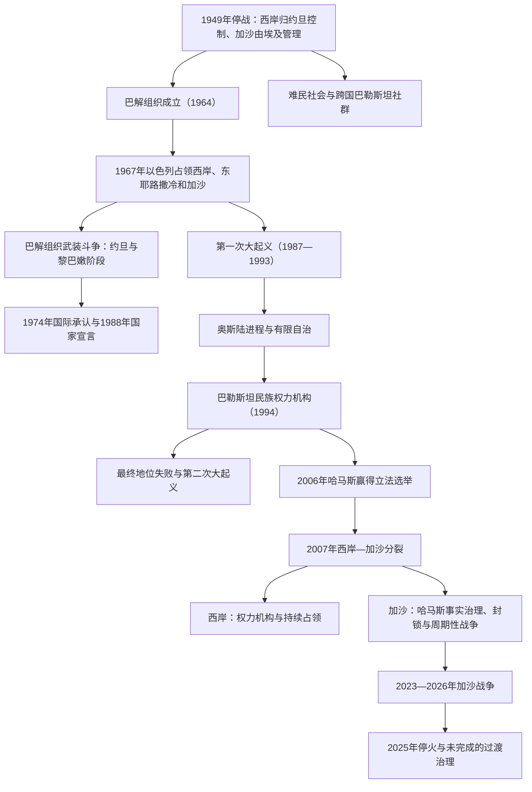

# 巴勒斯坦民族运动、占领与自治治理

## 时间

1949年至今；现代现状核验截止 **2026年7月13日**。

## 概括

1949年停战没有建立联合国分治方案中的阿拉伯国家。西岸和东耶路撒冷由约旦控制，加沙由埃及军政管理，巴勒斯坦人则分布在以色列境内、西岸、加沙、约旦、黎巴嫩、叙利亚和更广泛侨民社会。难民营、联合国近东救济工程处、跨境劳工和家庭网络成为战后社会的重要结构。

1964年巴勒斯坦解放组织成立，1967年战争后逐渐摆脱阿拉伯国家的直接主导，由法塔赫领导并成为民族运动主要代表。以色列在1967年占领西岸、东耶路撒冷和加沙，军事命令、定居点、土地与水资源分配、许可制度和行动限制由此成为现代巴勒斯坦史的长期主线。

1987年第一次大起义把动员中心重新带回被占领土。1988年巴勒斯坦国宣言和1993年《奥斯陆协议》使巴解组织以相互承认、谈判和有限自治推进建国，但边界、耶路撒冷、难民、定居点和安全等最终地位问题没有解决。2007年后，法塔赫主导的权力机构政府在西岸部分地区施政，哈马斯在加沙事实治理，领土和政治体系双重分裂。

2023年10月7日哈马斯等武装组织袭击以色列，以色列随后在加沙发动大规模战争。到2026年，战争虽经历两次停火，加沙仍有大面积以军部署与准入限制，拟议技术官僚过渡机构尚未完成接管；西岸则同时经历军事行动、定居点扩张、定居者暴力、拆除和权力机构财政危机。巴勒斯坦国的国际承认明显扩大，但有效主权、统一治理和定期选举仍未实现。

## 演变图

## 1949—1967年：领土分割与难民社会

### 约旦控制的西岸与东耶路撒冷

1949年停战后，外约旦控制西岸和东耶路撒冷。1950年约旦宣布合并两地，并向多数西岸巴勒斯坦人授予约旦国籍；西岸代表进入约旦议会，安曼成为政治与经济中心。合并只获有限国际承认，巴勒斯坦独立政治也受到王室限制。东耶路撒冷旧城由约旦管理，西耶路撒冷由以色列控制。

巴勒斯坦商人、专业人士和劳工进入约旦国家与海湾经济，难民营则保留失乡记忆和独特政治网络。王室希望把巴勒斯坦纳入哈希姆国家，但边界渗透、以色列报复行动和阿拉伯民族主义使国家整合始终不稳。

### 埃及管理的加沙

埃及没有正式吞并加沙，而以军事总督和行政机关管理。人口密集的狭长地带接纳约20万以上1948年难民，土地、就业与粮食压力极大。全巴勒斯坦政府名义设在加沙，实际受埃及控制，后迁开罗并于1959年被解散。

1956年苏伊士战争中以色列一度占领加沙与西奈，1957年在国际压力下撤出。埃及随后支持巴勒斯坦突击队和民族组织，但不允许加沙形成完全独立的国家机构。

## 巴解组织的建立、崛起与流亡

### 从阿拉伯联盟机构到法塔赫主导

1964年，在阿拉伯联盟推动下，第一次巴勒斯坦全国委员会在东耶路撒冷召开，成立巴解组织，艾哈迈德·舒凯里任执行委员会主席。组织最初受阿拉伯国家牵制，军事能力有限。法塔赫于1965年宣布发动武装行动；1967年阿拉伯国家失败后，国家军队威望下降，巴勒斯坦武装派别获得更大自主性。

1968年约旦卡拉梅战役中，以色列军队同约旦军队和法塔赫交战。军事结果复杂，但巴勒斯坦方面把抵抗塑造成象征性胜利，法塔赫招募和声望上升。1969年亚西尔·阿拉法特成为巴解组织主席，组织由法塔赫主导，同时容纳人阵、民阵等路线不同的派别。

### 约旦阶段与“黑色九月”

巴勒斯坦武装在约旦设立检查站、征税和武装基地，同王室主权发生冲突；劫机等行动又引来外部干预风险。1970年9月，约旦军队同巴勒斯坦武装爆发大规模战斗，叙利亚部队一度进入北部。王室最终恢复控制，1971年巴解组织主要武装被逐出约旦。此后出现名为“黑色九月”的秘密组织，制造包括1972年慕尼黑奥运会袭击在内的暴力事件。

### 黎巴嫩阶段

巴解组织转移到黎巴嫩后，利用难民营、南部边境和1969年《开罗协议》留下的武装空间建立基地，被一些人称为“国中之国”。其跨境袭击招致以色列报复，并卷入黎巴嫩内战。1974年阿拉伯联盟确认巴解组织为“巴勒斯坦人民唯一合法代表”，联合国大会给予观察员地位，阿拉法特在联大发言，外交线与武装线并行。

1978年以色列发动“利塔尼行动”，联合国在黎巴嫩南部部署临时部队。1982年以色列全面入侵黎巴嫩并围困贝鲁特，巴解组织主力撤往突尼斯等地。巴解撤出后，黎巴嫩长枪党民兵在以军控制包围圈内进入萨布拉和夏蒂拉难民营，杀害大量平民；以色列卡汉委员会后来认定以色列高级官员对未防止屠杀负有间接责任。1983年阿拉法特又被敌对巴勒斯坦派别和叙利亚压力迫离的黎波里，巴解组织领导中心远离被占领土。

## 1967年战争与占领体系

1967年6月战争中，以色列从约旦手中夺取西岸和东耶路撒冷，从埃及手中夺取加沙与西奈。约30万至50万巴勒斯坦人再次流离失所，估计差异取决于是否计入1948年难民的再次迁移和不同统计时点。安理会第242号决议提出以撤军、终止交战状态和难民问题公正解决为基础的框架，但文本对“从领土”还是“从全部领土”的语言解释长期有争议。

以色列扩大耶路撒冷市界并把国内法、管辖和行政适用于东耶路撒冷；1980年《耶路撒冷基本法》进一步确认其主张。联合国和多数国家不承认吞并。西岸和加沙则由军事司令通过军令治理，1981年设民政管理局处理土地、规划、许可和日常行政。

### 占领的主要机制

| 机制 | 过程 | 长期影响 |
|---|---|---|
| 军事命令与军事法院 | 以军司令发布土地、安全、集会、组织与行政命令 | 巴勒斯坦人与定居者适用不同法律制度；拘押和审判成为政治生活常态。 |
| 定居点与土地制度 | 通过国有地认定、征用、安全区、规划和道路建设发展定居点 | 到2020年代中期，西岸和东耶路撒冷定居者总数已超过70万，巴勒斯坦领土连通性下降。 |
| 水、规划与建设许可 | 关键水源和C区规划由以色列机构掌握 | 巴勒斯坦村庄扩建受限，拆除和“未经许可建设”循环加剧。 |
| 人口登记、许可与检查站 | 以色列控制人口登记、对外边界和跨区行动 | 家庭团聚、就业、医疗、教育和贸易受到许可体系影响。 |
| 东耶路撒冷居留制度 | 多数巴勒斯坦居民持永久居留而非公民身份 | 居留撤销、住宅规划、定居点和隔离墙改变城市人口与空间。 |

2004年国际法院咨询意见认为西岸隔离墙在越过绿线进入被占领土的部分及其相关制度违反国际法。2024年国际法院另一份咨询意见认为以色列在被占领巴勒斯坦领土的持续存在具有非法性，应尽快终止；以色列拒绝这一判断的若干前提与结论。法律意见没有自动改变地面控制。

## 第一次大起义与国家宣言

1987年12月，加沙一起交通事故成为长期压抑的触发点，第一次大起义扩展到西岸。统一民族起义领导机构、地方委员会、工会、学生和妇女组织推动罢工、抵制、拒税、示威和石块抗议，也发生针对被视为合作者者的暴力；以色列以逮捕、宵禁、驱逐和武力镇压。哈马斯在穆斯林兄弟会社会网络基础上于起义初期成立，主张伊斯兰抵抗，并在组织上不属于巴解组织。

起义使国际社会看到被占领土内部的群众政治，也使流亡巴解组织重新寻找外交突破。1988年约旦宣布同西岸解除行政和法律联系。11月15日，巴勒斯坦全国委员会在阿尔及尔宣布建立巴勒斯坦国，并接受以联大第181号、安理会第242和338号等决议为基础的政治进程。阿拉法特随后明确承认以色列生存权、拒绝恐怖主义，为美巴对话和后来的奥斯陆秘密谈判铺路。

## 奥斯陆进程与有限自治

### 协议与机构建立

1993年9月9日，以色列总理拉宾与阿拉法特互换承认信：以色列承认巴解组织为巴勒斯坦人民代表，巴解组织承认以色列并承诺修改与之冲突的宪章条款。9月13日双方签署《原则宣言》，设想五年过渡自治，并在过渡期内谈判最终地位。

1994年《加沙—杰里科协议》使巴勒斯坦民族权力机构成立，阿拉法特返回。1995年《奥斯陆第二协议》把西岸分为：

- **A区**：权力机构负责民政和内部安全，约占西岸18%。
- **B区**：权力机构负责民政，以巴分担安全责任，约占22%。
- **C区**：由以色列控制民政和安全，约占60%，原拟在过渡期逐步调整。

1996年举行首次总统和立法选举。权力机构建立部委、警察、学校、税务和地方行政，巴勒斯坦人第一次在本土拥有相对集中的自治官僚体系。然而辖区是不连续的飞地，边界、空域、人口登记、C区、定居点和跨区道路仍由以色列控制；外援和以色列代征税款又形成财政依赖。

### 未完成的最终地位

1997年希伯伦协议和1998年怀伊河备忘录只实现部分再部署。定居点继续扩张，以色列国内拉宾遇刺后的政治转向、巴勒斯坦武装袭击、权力机构腐败和镇压异议共同侵蚀互信。耶路撒冷、边界、难民、定居点和安全始终被推迟。

2000年戴维营会谈和2001年塔巴会谈虽缩小部分分歧，却未达成协议。各方对报价、责任和谈判是否本可成功的叙述冲突；不能把失败归因于单一领导人的一次拒绝。

## 第二次大起义、隔离墙与加沙撤离

2000年9月沙龙访问圣殿山／尊贵禁地成为直接触发点，示威和镇压迅速升级为第二次大起义。巴勒斯坦武装组织发动枪击和自杀式爆炸，杀害大量以色列平民；以色列使用坦克、空袭、定点杀害、封锁和大规模突袭，造成更高数量的巴勒斯坦伤亡与基础设施破坏。

2002年“防御盾牌行动”中，以军重新进入西岸多座A区城市，围困阿拉法特总部并摧毁自治机构设施。以色列开始修建隔离墙，声称用于阻止袭击；其大量路线进入西岸而非沿绿线，切割村庄、农地和东耶路撒冷。2003年设立权力机构总理职位，试图限制总统集权；阿拉法特2004年去世，阿巴斯于2005年当选总统。

2005年以色列单方面撤出加沙全部定居点和常驻地面部队。撤离终止了加沙内部的定居点政权，却没有达成主权交接：以色列继续控制领空、海域、人口登记和大多数口岸，埃及控制拉法一侧。联合国仍把加沙视为被占领巴勒斯坦领土的一部分，以色列则认为永久军事占领已结束。

## 2006年选举、2007年分裂与周期性战争

2006年立法选举中，哈马斯“变革与改革”名单赢得132席中的74席。选民对法塔赫腐败、派系候选人分裂和哈马斯社会服务网络的不满，与选制效应共同造成结果。以色列、美国、欧盟等要求新政府承认以色列、放弃暴力并接受既有协议，随后暂停或限制往来与资金；总统与总理争夺安全权，法塔赫、哈马斯武装冲突扩大。

2007年3月民族团结政府未能整合安全力量。6月哈马斯在加沙击败法塔赫部队，阿巴斯解散哈尼亚政府并在西岸任命法耶兹紧急政府；哈马斯拒绝解职。此后形成两套行政、安全和财政体系，全国性总统、立法选举均未再举行。

以色列对加沙实施海陆空封锁，埃及也严格限制拉法口岸。哈马斯及其他武装向以色列发射火箭、修建隧道并发动袭击；以色列实行空袭、炮击、地面行动和出入口限制。主要冲突包括：

| 时间 | 事件 | 结果 |
|---|---|---|
| 2008—2009年 | “铸铅行动” | 大规模空袭与地面战，巴勒斯坦平民和武装人员、以色列人员均有伤亡；封锁未解除。 |
| 2012年 | “防务之柱”行动 | 火箭与空袭升级后由埃及斡旋停火。 |
| 2014年 | “护刃行动” | 持续约七周，隧道与火箭成为重点，加沙城市和基础设施严重破坏。 |
| 2018—2019年 | “回归大游行” | 加沙边界长期示威要求返回权并反对封锁；以军实弹造成大量死伤，武装组织亦发动火箭和边界攻击。 |
| 2021年 | 耶路撒冷危机与加沙战争 | 谢赫杰拉、圣地冲突同火箭和空袭相互升级，显示耶路撒冷、西岸和加沙议题相连。 |

2014年民族共识政府和此后多轮开罗和解协议未能统一武器、警务、税收和公务员。权力机构担忧哈马斯保留平行武装，哈马斯则担忧被解除权力后遭排斥；以色列封锁、外部援助条件和地区国家竞争也固化分裂。

## 国家地位与外交承认

| 时间 | 进展 | 意义与局限 |
|---|---|---|
| 1988年11月15日 | 巴勒斯坦国宣言 | 以1967年被占领土和东耶路撒冷为国家主张核心，迅速获许多国家承认。 |
| 2011年 | 成为联合国教科文组织成员 | 首次成为重要联合国专门机构正式成员。 |
| 2012年11月29日 | 联大以138票赞成、9票反对、41票弃权给予“非会员观察员国”地位 | 强化条约参与和“国家”称号，但不是联合国正式会员。 |
| 2015年 | 《罗马规约》对巴勒斯坦生效 | 巴勒斯坦可参加国际刑事法院体系，相关管辖与案件持续受到政治、法律争议。 |
| 2024年 | 安理会正式会员建议案被美国否决；联大扩大巴勒斯坦参与权 | 仍无安理会推荐，故不能成为正式会员。挪威、爱尔兰、西班牙、斯洛文尼亚、亚美尼亚及多个加勒比国家等在这一年承认巴勒斯坦。 |
| 2025年9月 | 安道尔、澳大利亚、比利时、加拿大、法国、卢森堡、马耳他、摩纳哥、葡萄牙和英国宣布承认 | 新一轮承认扩大到部分西方国家；截至此轮后，承认巴勒斯坦的联合国会员国约157个。承认并未自动赋予边界、军队或领土控制。 |

## 2023—2026年加沙战争

### 2023年10月7日与以色列军事行动

2023年10月7日，哈马斯卡桑旅和其他武装突破加沙边界，袭击以色列南部社区、音乐节和军事基地。约1200名以色列人及外国人死亡，其中多数为平民；251人被劫持到加沙。联合国调查认定武装人员实施蓄意杀害、劫持人质、虐待和性别暴力等严重罪行。

以色列随后宣布战争，进行大规模空袭、围困和地面进攻，目标包括摧毁哈马斯军事与治理能力、释放人质。战事由北向中南部推进，医院、学校、住宅、道路、水电和卫生系统遭广泛破坏。以色列称哈马斯在民用区域部署人员、火箭和隧道；这不免除交战方区分、比例和预防平民伤亡的国际法义务。大多数约210万加沙居民反复流离失所，人道准入、饥饿、疾病和医疗崩溃成为核心危机。

### 伤亡统计口径

- 截至2026年7月13日，加沙卫生部门最新报告自2023年10月7日以来 **73,232名巴勒斯坦人死亡、173,686人受伤**；当日较早发布的汇总为73,231人死亡，随后又报告1人死亡。联合国机构持续转述同一统计体系，最近可同步核验的联合国人道报告采用的是稍早截点。
- 这一总数不区分平民与战斗人员，也未完整计入失踪、埋在废墟下者和由饥饿、疾病、医疗中断等造成的间接死亡；以色列对部分分类和责任归属提出异议。
- 不能据“多数为妇女儿童”或“全部是战斗人员”等政治口号反推准确构成。研究伤亡应分别记录已识别姓名、年龄性别、战斗员判断标准和间接死亡。
- 截至2026年7月13日中午，加沙卫生部门报告自2025年10月停火生效后 **1,108人死亡、3,578人受伤**；联合国人道事务协调厅7月10日按截至7月8日的数据转述为1,084人死亡、3,491人受伤。发布截点不同，但都说明“停火”没有等同于完全停止军事行动。

### 两次停火

2025年1月19日，埃及、卡塔尔和美国斡旋的停火生效。第一阶段持续42天，释放25名以色列人质和5名泰国人质、8具以色列人质遗体及1777名巴勒斯坦囚犯或被拘者，援助显著增加。3月1日第一阶段届满后，第二阶段谈判失败；以色列3月2日起阻断货物进入，3月18日恢复大规模空袭和地面行动。

2025年10月9日各方签署新的执行步骤，10月10日停火开始。10月13日哈马斯释放剩余20名在世以色列人质，以色列释放250名长期或无期徒刑巴勒斯坦囚犯及1718名自加沙拘押者；死者遗体交换随后继续。停火降低总体战斗强度，但以军空袭、枪击、拆除和巴勒斯坦武装零星袭击持续。

### 过渡治理与控制线

2025年11月17日，安理会第2803号决议以13票赞成、0票反对、2票弃权通过，支持停火综合计划，欢迎“和平委员会”并授权临时国际稳定部队。2026年1月，由阿里·沙阿斯领导的全国加沙管理委员会成立，拟以巴勒斯坦技术官僚负责日常民政、服务和重建。

制度设想尚未转化为统一地面治理。到2026年7月13日：

- 全国加沙管理委员会仍主要在开罗筹备，未能进入加沙全面接管。
- 哈马斯战时紧急政府委员会于7月6日宣布解散和移交，但哈马斯没有完成解除武装，地方安全人员、公务员与组织网络仍有事实影响。
- 停火后的“黄线”最初使以军保留部署区域约占加沙53%；到2026年6月“橙线”相关严格控制和准入限制扩至约64.9%。居民可进入的空间不足全境一半，边线又缺乏清晰标示。
- 和平委员会、高级代表、技术官僚委员会、国际稳定部队、以军和哈马斯残余体系并存，法律授权、实际控制和未来主权尚未统一。

详细职位和有效控制见[加沙与约旦河西岸并立治理结构表](/%E4%BA%BA%E6%96%87%E7%A7%91%E5%AD%A6/%E5%8E%86%E5%8F%B2/%E8%A5%BF%E4%BA%9A/%E9%BB%8E%E5%87%A1%E7%89%B9/%E5%B7%B4%E5%8B%92%E6%96%AF%E5%9D%A6/%E5%8A%A0%E6%B2%99%E4%B8%8E%E7%BA%A6%E6%97%A6%E6%B2%B3%E8%A5%BF%E5%B2%B8%E5%B9%B6%E7%AB%8B%E6%B2%BB%E7%90%86%E7%BB%93%E6%9E%84%E8%A1%A8.md)。

## 2023—2026年的西岸

加沙战争同时改变西岸。以军扩大突袭、空袭和检查站，巴勒斯坦武装在杰宁、图勒凯尔姆、纳布卢斯等地活动；定居者暴力、前哨扩张、拆除和限制牧民使用土地增加。2025年1月开始的“铁墙行动”集中于杰宁、图勒凯尔姆和努尔沙姆难民营，长期驻军和拆除使超过3.3万人到2026年7月仍流离失所。

联合国人道事务协调厅统计，2023年10月7日至2026年6月29日，西岸包括东耶路撒冷共有 **1,109名巴勒斯坦人被以军或定居者杀害，其中243名为儿童**。这一数字不包括所有在以色列拘押中死亡者。2026年截至7月初，又有超过3200人因定居者袭击、相关准入限制及“无以色列许可”拆除而流离失所。

权力机构在双重压力下进一步衰弱：一方面与以色列安全协调、压制哈马斯等武装，遭部分社会视为替占领维持秩序；另一方面以军可进入其辖区，代征税款被扣、失业和援助下降使公务员薪酬与公共服务恶化。没有选举、腐败指控和接班不确定性削弱政治合法性。

## 当前统治结构

| 机构或力量 | 领导与角色 | 实际范围 | 主要限制 |
|---|---|---|---|
| 巴解组织 | 主席马哈茂德·阿巴斯；副主席侯赛因·谢赫 | 国际代表、外交和谈判，法塔赫占主导 | 哈马斯、伊斯兰圣战不在其内；代表机构长期未全面换届。 |
| 巴勒斯坦国 | 总统阿巴斯、总理穆罕默德·穆斯塔法 | 获广泛外交承认和联合国非会员观察员国地位 | 缺乏对所主张领土、边界和武装力量的完整有效控制。 |
| 民族权力机构 | 阿巴斯任总统、穆斯塔法政府 | 西岸A区和B区的部分民政与安全 | 以军行动、C区与边界控制、财政依赖、长期无选举。 |
| 哈马斯及加沙事实体系 | 集体领导委员会；哈利勒·哈亚等负责加沙与谈判 | 加沙部分人员、武装和地方行政网络 | 战争损耗、以军控制线、封锁、停火义务和拟议过渡接管。 |
| 以色列占领体系 | 以色列政府、以军与民政管理局 | 西岸总体安全、C区、东耶路撒冷、边界与跨区移动；加沙外部及大面积军事控制 | 国际法义务、法院意见、国际外交压力和持续武装抵抗。 |
| 2026年加沙过渡架构 | 和平委员会、全国加沙管理委员会、国际稳定部队 | 获安理会授权的重建与过渡设计 | 尚未完成部署、接管、解除武装或巴勒斯坦内部合法性整合。 |

历任巴解组织主席、国家与权力机构总统、总理和继任安排见[巴解组织、巴勒斯坦国与自治机构领导人表](/%E4%BA%BA%E6%96%87%E7%A7%91%E5%AD%A6/%E5%8E%86%E5%8F%B2/%E8%A5%BF%E4%BA%9A/%E9%BB%8E%E5%87%A1%E7%89%B9/%E5%B7%B4%E5%8B%92%E6%96%AF%E5%9D%A6/%E5%B7%B4%E8%A7%A3%E7%BB%84%E7%BB%87%E3%80%81%E5%B7%B4%E5%8B%92%E6%96%AF%E5%9D%A6%E5%9B%BD%E4%B8%8E%E8%87%AA%E6%B2%BB%E6%9C%BA%E6%9E%84%E9%A2%86%E5%AF%BC%E4%BA%BA%E8%A1%A8.md)。

## 兴衰与未完成国家建设的因果分析

| 类型 | 因素 | 作用 |
|---|---|---|
| 结构因素 | 1948年领土分割与难民化 | 民族社会被分散到多个国家和法律身份，统一组织必须跨境运作。 |
| 结构因素 | 1967年占领、定居点与领土碎片化 | 自治机构难以转化为拥有连续领土和边界的主权国家。 |
| 内部因素 | 巴解组织取得代表权但逐渐官僚化 | 外交承认提升，武装与侨民网络被整合；长期未换届、腐败和派别垄断又削弱合法性。 |
| 内部因素 | 法塔赫—哈马斯路线、武器与资源竞争 | 2007年形成两地政府，国家机构、选举和安全体系无法统一。 |
| 外部因素 | 以色列军事优势、封锁与税收控制 | 限制权力机构财政、加沙经济和人员流动，并对政治结果施加强制影响。 |
| 外部因素 | 阿拉伯国家、伊朗、美国、欧洲与海湾国家介入 | 援助、军援、调停与制裁支持不同派别，也使国内妥协受地区竞争牵制。 |
| 直接触发 | 起义、袭击、报复行动和谈判破裂 | 反复打断制度建设，把资源转向安全与战争。 |
| 和平进程缺陷 | 最终地位问题被推迟，过渡安排没有终止机制 | 奥斯陆原定五年过渡长期化，A、B、C区从临时结构变成持续现实。 |
| 2023年后触发 | 10月7日袭击和以色列全面战争 | 哈马斯与加沙治理遭毁灭性打击，平民社会和基础设施付出巨大代价，但统一后战争政治方案仍未落实。 |
| 外交优势与局限 | 国家承认广泛扩大 | 强化法律与外交地位，却不能替代地面撤军、领土连通、统一政府和选举授权。 |

## 重要事件

| 时间 | 事件 | 意义 |
|---|---|---|
| 1950年 | 约旦合并西岸 | 西岸进入约旦国家体系，合并的国际承认有限。 |
| 1964年 | 巴解组织成立 | 民族运动获得跨国政治中心。 |
| 1967年 | 六日战争与以色列占领 | 西岸、东耶路撒冷和加沙进入长期占领。 |
| 1968年 | 卡拉梅战役 | 法塔赫声望和招募扩大。 |
| 1970—1971年 | 黑色九月 | 巴解武装被逐出约旦，重心转向黎巴嫩。 |
| 1974年 | 巴解组织获阿拉伯联盟和联合国代表地位 | 国际外交承认显著提升。 |
| 1982年 | 以色列入侵黎巴嫩、巴解撤离贝鲁特 | 巴解武装中心转移到突尼斯，流亡领导与本土社会距离扩大。 |
| 1987年 | 第一次大起义，哈马斯成立 | 群众动员改变民族政治力量结构。 |
| 1988年 | 约旦脱离西岸、巴勒斯坦国宣言 | 建国主张和两国外交路线制度化。 |
| 1993年 | 相互承认与《奥斯陆协议》 | 有限自治启动，最终地位问题被推迟。 |
| 1994—1995年 | 权力机构成立、A／B／C区形成 | 建立本土行政，也把领土分割制度化。 |
| 2000—2005年 | 第二次大起义 | 和平进程崩溃，军事再占领、隔离墙和互信破裂。 |
| 2005年 | 以色列撤出加沙定居点与常驻地面部队 | 改变占领形式，但边界和外部控制仍在。 |
| 2006—2007年 | 哈马斯胜选与西岸—加沙分裂 | 单一自治政府和选举连续性中断。 |
| 2012年 | 联合国非会员观察员国地位 | 巴勒斯坦国家地位提升。 |
| 2023年10月7日 | 哈马斯等武装袭击以色列 | 大规模杀害、劫持人质，触发新一轮全面战争。 |
| 2023—2025年 | 以色列加沙军事行动 | 造成极大伤亡、破坏和流离失所，哈马斯领导与治理体系遭重创。 |
| 2025年1—3月 | 第一轮停火 | 完成人质与囚犯交换并扩大援助，随后崩溃。 |
| 2025年10月 | 第二轮停火 | 剩余在世人质获释，战斗强度下降但军事行动未完全停止。 |
| 2025年11月 | 安理会第2803号决议 | 授权加沙过渡管理与国际稳定部队框架。 |
| 2026年1—7月 | NCAG成立但未完成接管 | 显示制度授权与地面事实治理之间仍有断层。 |

## 演变关系

- 前一阶段：[英国委任统治、分治与1948年战争](/%E4%BA%BA%E6%96%87%E7%A7%91%E5%AD%A6/%E5%8E%86%E5%8F%B2/%E8%A5%BF%E4%BA%9A/%E9%BB%8E%E5%87%A1%E7%89%B9/%E5%B7%B4%E5%8B%92%E6%96%AF%E5%9D%A6/%E8%8B%B1%E5%9B%BD%E5%A7%94%E4%BB%BB%E7%BB%9F%E6%B2%BB%E3%80%81%E5%88%86%E6%B2%BB%E4%B8%8E1948%E5%B9%B4%E6%88%98%E4%BA%89.md)。
- 领导人连续性见[巴解组织、巴勒斯坦国与自治机构领导人表](/%E4%BA%BA%E6%96%87%E7%A7%91%E5%AD%A6/%E5%8E%86%E5%8F%B2/%E8%A5%BF%E4%BA%9A/%E9%BB%8E%E5%87%A1%E7%89%B9/%E5%B7%B4%E5%8B%92%E6%96%AF%E5%9D%A6/%E5%B7%B4%E8%A7%A3%E7%BB%84%E7%BB%87%E3%80%81%E5%B7%B4%E5%8B%92%E6%96%AF%E5%9D%A6%E5%9B%BD%E4%B8%8E%E8%87%AA%E6%B2%BB%E6%9C%BA%E6%9E%84%E9%A2%86%E5%AF%BC%E4%BA%BA%E8%A1%A8.md)。
- 西岸—加沙并立与2026年事实治理见[加沙与约旦河西岸并立治理结构表](/%E4%BA%BA%E6%96%87%E7%A7%91%E5%AD%A6/%E5%8E%86%E5%8F%B2/%E8%A5%BF%E4%BA%9A/%E9%BB%8E%E5%87%A1%E7%89%B9/%E5%B7%B4%E5%8B%92%E6%96%AF%E5%9D%A6/%E5%8A%A0%E6%B2%99%E4%B8%8E%E7%BA%A6%E6%97%A6%E6%B2%B3%E8%A5%BF%E5%B2%B8%E5%B9%B6%E7%AB%8B%E6%B2%BB%E7%90%86%E7%BB%93%E6%9E%84%E8%A1%A8.md)。
- 现代冲突共享综述见[现代以色列与巴勒斯坦](/%E4%BA%BA%E6%96%87%E7%A7%91%E5%AD%A6/%E5%8E%86%E5%8F%B2/%E8%A5%BF%E4%BA%9A/%E9%BB%8E%E5%87%A1%E7%89%B9/%E7%8E%B0%E4%BB%A3%E4%BB%A5%E8%89%B2%E5%88%97%E4%B8%8E%E5%B7%B4%E5%8B%92%E6%96%AF%E5%9D%A6.md)。
- 以色列国家与安全政治见[以色列国家、战争与社会变迁](/%E4%BA%BA%E6%96%87%E7%A7%91%E5%AD%A6/%E5%8E%86%E5%8F%B2/%E8%A5%BF%E4%BA%9A/%E9%BB%8E%E5%87%A1%E7%89%B9/%E4%BB%A5%E8%89%B2%E5%88%97/%E4%BB%A5%E8%89%B2%E5%88%97%E5%9B%BD%E5%AE%B6%E3%80%81%E6%88%98%E4%BA%89%E4%B8%8E%E7%A4%BE%E4%BC%9A%E5%8F%98%E8%BF%81.md)。
- 西岸与约旦的历史联系见[哈希姆王国与现代约旦](/%E4%BA%BA%E6%96%87%E7%A7%91%E5%AD%A6/%E5%8E%86%E5%8F%B2/%E8%A5%BF%E4%BA%9A/%E9%BB%8E%E5%87%A1%E7%89%B9/%E7%BA%A6%E6%97%A6/%E5%93%88%E5%B8%8C%E5%A7%86%E7%8E%8B%E5%9B%BD%E4%B8%8E%E7%8E%B0%E4%BB%A3%E7%BA%A6%E6%97%A6.md)。
- 巴解组织在黎巴嫩时期见[内战、塔伊夫体制与当代黎巴嫩](/%E4%BA%BA%E6%96%87%E7%A7%91%E5%AD%A6/%E5%8E%86%E5%8F%B2/%E8%A5%BF%E4%BA%9A/%E9%BB%8E%E5%87%A1%E7%89%B9/%E9%BB%8E%E5%B7%B4%E5%AB%A9/%E5%86%85%E6%88%98%E3%80%81%E5%A1%94%E4%BC%8A%E5%A4%AB%E4%BD%93%E5%88%B6%E4%B8%8E%E5%BD%93%E4%BB%A3%E9%BB%8E%E5%B7%B4%E5%AB%A9.md)。
- 上级入口：[巴勒斯坦](/%E4%BA%BA%E6%96%87%E7%A7%91%E5%AD%A6/%E5%8E%86%E5%8F%B2/%E8%A5%BF%E4%BA%9A/%E9%BB%8E%E5%87%A1%E7%89%B9/%E5%B7%B4%E5%8B%92%E6%96%AF%E5%9D%A6/README.md)。
