# 巴解组织、巴勒斯坦国与自治机构领导人表

## 范围与口径

巴勒斯坦现代政治不是一条单一的“总统—总理”世系，而是由数套相互重叠、法律来源不同的机构组成：

- **巴勒斯坦解放组织（巴解组织，PLO）**是民族运动的伞形组织与国际谈判主体，其执行委员会主席长期是最重要的民族政治职位。
- **巴勒斯坦国**由巴勒斯坦全国委员会于1988年宣布成立，国家总统由巴解组织体系确认；其国际地位与实际领土控制并不完全一致。
- **巴勒斯坦民族权力机构（PA）**依据奥斯陆安排建立，只在被占领土的部分区域行使有限自治职能。
- **巴勒斯坦立法委员会（PLC）**是自治机构的民选立法机关，但2007年后无法正常统一运作，2018年的解散决定亦受哈马斯反对。
- 2007年以后，西岸的权力机构政府与加沙的哈马斯事实治理长期并立，不能把一方的职务表当作全境有效的统一政府世系。

以下任期截至 **2026年7月13日**。选举任期、实际留任和不同机构的称号分别注明，不以“现任”掩盖授权争议。

## 巴解组织执行委员会主席

| 顺序 | 姓名 | 任期 | 主要派别或基础 | 继任关系与重要事件 |
|---:|---|---|---|---|
| 1 | 艾哈迈德·舒凯里 | 1964—1967年 | 阿拉伯联盟支持下组建巴解组织 | 主持1964年第一次巴勒斯坦全国委员会，建立巴解组织及其章程；1967年战争后在组织内部压力下辞职。 |
| 2 | 叶海亚·哈穆达 | 1967—1969年 | 过渡领导 | 在武装派别进入巴解组织的重组期主持过渡，1969年由法塔赫领导人阿拉法特接任。 |
| 3 | **亚西尔·阿拉法特** | 1969年2月—2004年11月11日 | 法塔赫 | 将巴解组织从流亡武装运动逐步转向外交承认、1988年国家宣言和奥斯陆谈判；2004年病逝。 |
| 4 | **马哈茂德·阿巴斯** | 2004年11月11日至今 | 法塔赫 | 阿拉法特去世后由执行委员会选出；兼任巴勒斯坦国总统和民族权力机构总统。长期无全国性选举，使其持续留任的民主授权受到争议。 |

## 巴勒斯坦国总统与副总统

### 总统

| 顺序 | 姓名 | 任期口径 | 产生方式 | 说明 |
|---:|---|---|---|---|
| 1 | **亚西尔·阿拉法特** | 1989年4月—2004年11月11日 | 巴解组织中央委员会确认 | 1988年国家宣言后成为巴勒斯坦国首任总统；同时兼任巴解组织主席，1994年后又任权力机构主席。 |
| 2 | **马哈茂德·阿巴斯** | 2008年10月14日至今 | 巴解组织中央委员会选举 | 2005年已当选权力机构总统，2008年再获“巴勒斯坦国总统”称号；截至2026年7月仍在任。 |

### 副总统与现行继任规则

| 姓名 | 职务 | 任期 | 权限与争议 |
|---|---|---|---|
| **侯赛因·谢赫** | 巴勒斯坦国副总统、巴解组织执行委员会副主席 | 2025年4月26日至今 | 2025年4月巴解组织中央委员会新设副主席与国家副总统职位后获任命。2025年10月26日的新宪制宣告规定：在立法委员会缺位且权力机构总统职位出缺时，由其临时履职不超过90天，其间应举行总统选举；遇不可抗力可由中央委员会再延长一次。该安排取代2024年由全国委员会主席临时继任的方案，但不能自动解决机构代表性与长期未选举问题。 |

## 巴勒斯坦民族权力机构总统

| 顺序 | 姓名 | 任期 | 产生方式 | 关键事件与备注 |
|---:|---|---|---|---|
| 1 | **亚西尔·阿拉法特** | 1994年7月5日—2004年11月11日 | 先由奥斯陆过渡安排任职，1996年直接选举确认 | 建立自治行政、安全与财政机构；第二次大起义期间其行动受到以色列限制，2004年病逝。 |
| 代行 | 拉乌希·法图赫 | 2004年11月11日—2005年1月15日 | 依《基本法》由立法委员会主席代行 | 在阿拉法特逝世后主持法定过渡并组织总统选举。 |
| 2 | **马哈茂德·阿巴斯** | 2005年1月15日至今 | 2005年1月9日直接选举 | 原定四年任期在2009年届满；此后因法塔赫—哈马斯分裂、选举延期和法令治理继续在任。其政府主要在西岸运作，对加沙没有稳定的地面行政与安全控制。 |

## 政府首脑：总理

总理职位于2003年设立。2007年以后，“法定任命的西岸政府”与“哈马斯在加沙继续承认的政府”曾对同一职位作出不同解释，表中以权力机构总统任命、在拉姆安拉运作的政府为主，并注明事实分裂。

| 顺序 | 姓名 | 任期 | 政府性质 | 关键事件与备注 |
|---:|---|---|---|---|
| 1 | 马哈茂德·阿巴斯 | 2003年4月30日—9月6日 | 法塔赫；首任总理 | 试图集中内阁与安全权，但同阿拉法特的权力分配冲突导致辞职。 |
| 2 | 艾哈迈德·库赖 | 2003年10月7日—2006年3月29日 | 法塔赫；多届内阁 | 第二次大起义后期主持政府；任内完成2005年总统选举和2006年立法选举。 |
| 3 | 伊斯梅尔·哈尼亚 | 2006年3月29日—2007年6月14日 | 哈马斯，后为民族团结政府 | 哈马斯赢得立法选举后组阁；国际制裁、武装冲突和安全机构双重化加剧。2007年被阿巴斯解职，哈马斯不承认解职并在加沙继续以其为事实总理至2014年。 |
| 4 | 萨拉姆·法耶兹 | 2007年6月15日—2013年6月6日 | 西岸紧急／技术官僚政府 | 未取得由哈马斯控制多数席位的立法委员会信任；推进安全与财政机构建设，但自治权、财政和政治基础有限。 |
| 5 | 拉米·哈姆达拉 | 2013年6月6日—2019年4月13日 | 技术官僚政府；2014年起称民族共识政府 | 2013年曾短暂辞职后再任。2014年法塔赫与哈马斯同意共识政府，但加沙安全与行政并未真正统一。 |
| 6 | 穆罕默德·什塔耶 | 2019年4月13日—2024年3月31日 | 法塔赫主导政府 | 面临收入代征款被扣、疫情、定居点扩张和2023年战争冲击；2024年辞职。 |
| 7 | **穆罕默德·穆斯塔法** | 2024年3月31日至今 | 技术官僚取向的第19届政府 | 兼任外交部长，提出机构改革、加沙救援与重建方案；截至2026年7月仍任职，但政府尚未取得加沙事实控制。 |

## 立法机构与选举连续性

| 机构 | 关键领导或阶段 | 时间 | 状态 |
|---|---|---|---|
| 巴勒斯坦立法委员会第一届 | 议长艾哈迈德·库赖，后由拉菲克·纳察、拉乌希·法图赫接任 | 1996—2006年 | 1996年选出，主要由法塔赫控制。 |
| 巴勒斯坦立法委员会第二届 | 议长阿齐兹·杜韦克；哈马斯“变革与改革”名单获74席，共132席 | 2006年起 | 2007年分裂、议员被拘押和两地对立后无法正常统一开会；2018年巴勒斯坦宪法法院决定解散，哈马斯不承认。此后未再举行全国立法选举。 |
| 巴勒斯坦全国委员会 | 巴解组织的最高代表机构 | 1964年至今 | 由派别、侨民和社会组织代表构成，并非由被占领土全体居民定期直接普选；负责章程、执行委员会和重大政治路线。 |
| 巴解组织中央委员会 | 全国委员会闭会期间的中间决策机构 | 1973年至今 | 在国家总统称号、副总统职位和机构人事上承担重要作用；其代表性和换届方式亦有争议。 |

## 机构关系辨析

- 巴解组织主席、巴勒斯坦国总统和权力机构总统长期由同一人兼任，但三者的法律来源不同。
- 权力机构的行政权限来自过渡协议，不等于对1967年边界内领土拥有完整主权。
- 2005年以后未再举行总统选举，2006年以后未再举行立法选举；“任期届满”与“实际继续履职”必须同时记录。
- 2025年副总统职位和继任规则加强了职位出缺时的形式连续性，但没有完成民选授权更新。
- 2007年后的两地并立治理、哈马斯领导层和2026年加沙过渡机构详见[加沙与约旦河西岸并立治理结构表](/%E4%BA%BA%E6%96%87%E7%A7%91%E5%AD%A6/%E5%8E%86%E5%8F%B2/%E8%A5%BF%E4%BA%9A/%E9%BB%8E%E5%87%A1%E7%89%B9/%E5%B7%B4%E5%8B%92%E6%96%AF%E5%9D%A6/%E5%8A%A0%E6%B2%99%E4%B8%8E%E7%BA%A6%E6%97%A6%E6%B2%B3%E8%A5%BF%E5%B2%B8%E5%B9%B6%E7%AB%8B%E6%B2%BB%E7%90%86%E7%BB%93%E6%9E%84%E8%A1%A8.md)。

## 机构演变图

```mermaid
flowchart LR
    PLO["1964年<br/>巴解组织成立"] --> Arafat["1969年后<br/>阿拉法特主导"]
    Arafat --> Declaration["1988年<br/>巴勒斯坦国宣言"]
    Declaration --> Oslo["1993年<br/>奥斯陆相互承认"]
    Oslo --> PA["1994年<br/>巴勒斯坦民族权力机构"]
    PA --> Presidency["2003年总理制<br/>2005年阿巴斯任主席"]
    Presidency --> Division["2007年后<br/>西岸—加沙分裂"]
    Division --> Observer["2012年<br/>联合国观察员国"]
    Observer --> VicePresident["2025年<br/>设置巴勒斯坦国副总统"]
    VicePresident --> Parallel["截至2026年<br/>多层领导与并立治理"]
```

## 演变关系

- 历史背景与政治进程见[巴勒斯坦民族运动、占领与自治治理](/%E4%BA%BA%E6%96%87%E7%A7%91%E5%AD%A6/%E5%8E%86%E5%8F%B2/%E8%A5%BF%E4%BA%9A/%E9%BB%8E%E5%87%A1%E7%89%B9/%E5%B7%B4%E5%8B%92%E6%96%AF%E5%9D%A6/%E5%B7%B4%E5%8B%92%E6%96%AF%E5%9D%A6%E6%B0%91%E6%97%8F%E8%BF%90%E5%8A%A8%E3%80%81%E5%8D%A0%E9%A2%86%E4%B8%8E%E8%87%AA%E6%B2%BB%E6%B2%BB%E7%90%86.md)。
- 上级入口：[巴勒斯坦](/%E4%BA%BA%E6%96%87%E7%A7%91%E5%AD%A6/%E5%8E%86%E5%8F%B2/%E8%A5%BF%E4%BA%9A/%E9%BB%8E%E5%87%A1%E7%89%B9/%E5%B7%B4%E5%8B%92%E6%96%AF%E5%9D%A6/README.md)。
