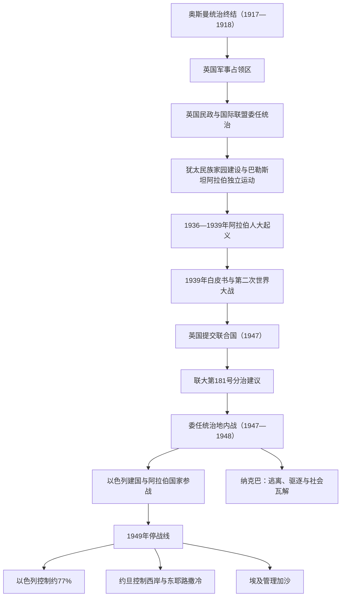

# 英国委任统治、分治与1948年战争

## 时间

1917—1949年

## 概括

英国在第一次世界大战中征服奥斯曼统治下的巴勒斯坦，先实行军事占领，1920年转为民政，1923年国际联盟委任统治正式生效。英国既承诺推动《贝尔福宣言》所称的“犹太民族家园”，又负有保护全体居民公民与宗教权利的责任；战时对阿拉伯方面的通信、英法安排和贝尔福政策之间存在难以调和的解释冲突。

委任统治下，犹太移民、土地购置、城市化和准国家机构迅速发展；巴勒斯坦阿拉伯社会则在地方名流、宗教机构、政党、工会和乡村网络中争取独立并反对英国政策。双方人口、经济和武装组织的不对称逐渐扩大。1936—1939年阿拉伯人大起义遭严厉镇压，削弱了巴勒斯坦阿拉伯政治与军事领导。第二次世界大战、大屠杀幸存者处境、犹太地下组织反英行动和持续社群暴力最终使英国把问题提交联合国。

1947年联合国分治方案未能和平实施。战争先以委任统治地内部的社群内战展开，1948年5月英国撤离和以色列建国后扩展为国家间战争。1949年停战线使以色列控制原委任统治地约77%，约旦控制西岸和东耶路撒冷，埃及管理加沙；拟议中的阿拉伯国家没有建立。超过75万巴勒斯坦人逃离或被驱逐，数百座城镇和村庄人口流失或被毁，形成“纳克巴”与长期难民问题。

## 演变图

## 建立背景：相互冲突的战时安排

| 文件或决定 | 时间 | 内容 | 长期争议 |
|---|---|---|---|
| 侯赛因—麦克马洪通信 | 1915—1916年 | 英国同麦加谢里夫侯赛因讨论阿拉伯起义与战后独立 | 巴勒斯坦是否被排除在承诺边界之外，双方解释长期不同。 |
| 《赛克斯—皮科协定》 | 1916年 | 英法秘密划分奥斯曼阿拉伯领土的势力范围，巴勒斯坦拟受国际安排 | 同阿拉伯独立预期冲突，也未按原方案完整实施。 |
| 《贝尔福宣言》 | 1917年11月2日 | 英国支持在巴勒斯坦建立“犹太民族家园”，同时声明不得损害当地非犹太社群的公民和宗教权利 | 没有承认占人口多数的巴勒斯坦阿拉伯人的政治自决权，成为委任统治的根本矛盾。 |
| 圣雷莫会议 | 1920年4月 | 协约国把巴勒斯坦委任权交给英国 | 在国际联盟正式批准前奠定战后殖民安排。 |
| 国际联盟委任统治书 | 1922年批准，1923年生效 | 纳入贝尔福政策，并要求英国建立行政、司法与公共服务 | “民族家园”与居民权利之间缺少双方认可的共同宪制。约旦河以东依第25条采取不同适用方式，逐渐形成外约旦。 |

## 委任统治结构

英国高级专员直接向伦敦负责，控制外交、移民、土地、警察、军队和财政。英方多次提出立法委员会，但阿拉伯与犹太政治组织对代表比例、贝尔福政策和国家目标无法达成一致，未形成双方认可的责任政府。

### 高级专员及短期代行者

| 顺序 | 姓名 | 任期 | 身份 | 任内要点 |
|---:|---|---|---|---|
| 1 | 赫伯特·塞缪尔 | 1920年7月1日—1925年6月30日 | 高级专员 | 建立民政、土地与移民制度；承认部分阿拉伯与犹太社群机构。 |
| 代行 | 乔治·斯图尔特·西姆斯 | 1925年7月—8月 | 代理 | 塞缪尔与普卢默之间短期代行。 |
| 2 | 赫伯特·普卢默 | 1925年8月25日—1928年7月31日 | 高级专员 | 强化治安和行政专业化，表面相对平静。 |
| 代行 | 哈里·卢克 | 1928年7月31日—12月6日 | 代理 | 西墙争议上升期代行。 |
| 3 | 约翰·钱塞勒 | 1928年12月6日—1931年9月3日 | 高级专员 | 经历1929年暴力，随后调查土地、移民与农业问题。 |
| 代行 | 马克·艾奇逊·扬 | 1931年9月3日—11月20日 | 代理 | 钱塞勒与沃科普之间代行。 |
| 4 | 阿瑟·沃科普 | 1931年11月20日—1938年3月1日 | 高级专员 | 犹太移民和经济迅速增长；任内爆发1936年大起义并提出皮尔分治。1937—1938年部分时间由威廉·巴特希尔代行。 |
| 5 | 哈罗德·麦克迈克尔 | 1938年3月3日—1944年8月30日 | 高级专员 | 镇压大起义后期并执行1939年白皮书；第二次世界大战期间面对非法移民与地下武装。 |
| 代行 | 约翰·肖 | 1944年8月30日—10月31日 | 代理 | 战时高级专员交接。 |
| 6 | 戈特子爵约翰·维里克 | 1944年10月31日—1945年11月5日 | 高级专员 | 犹太地下组织反英活动扩大，因病卸任。 |
| 代行 | 约翰·肖 | 1945年11月5日—11月21日 | 代理 | 戈特与坎宁安之间代行。 |
| 7 | 艾伦·坎宁安 | 1945年11月21日—1948年5月14日 | 高级专员 | 英国提交联合国、宣布终止委任统治并撤军；未建立共同过渡政府。 |

### 巴勒斯坦阿拉伯政治

| 机构或力量 | 主要人物／基础 | 作用与局限 |
|---|---|---|
| 阿拉伯执行委员会 | 穆萨·卡齐姆·侯赛尼等，1920—1934年 | 由阿拉伯大会产生，向英国交涉独立、移民和土地问题；缺乏正式行政权。 |
| 最高穆斯林委员会 | 哈吉·阿明·侯赛尼，1921年起 | 管理伊斯兰宗教基金、法院与圣地，形成重要政治资源；也加剧侯赛尼与纳沙希比家族竞争。 |
| 政党、工会与青年组织 | 独立党、国防党、阿拉伯党等 | 将反殖民与民族诉求扩展到城市中产、工人和学生，但派系分裂严重。 |
| 阿拉伯高级委员会 | 1936年成立，哈吉·阿明任主席 | 领导总罢工和起义初期政治协调；1937年被英国取缔，成员被捕、流亡或分裂。 |
| 乡村起义组织 | 地方指挥官、农民和跨区武装 | 1937—1939年进入游击战高峰；补给、内部清洗和英国反叛乱行动使其瓦解。 |

### 犹太“伊舒夫”准国家机构

| 机构 | 作用 | 与建国的关系 |
|---|---|---|
| 世界锡安主义组织与犹太事务局 | 移民、募款、土地、外交与同英国交涉 | 形成跨国资源网络，犹太事务局后来成为建国核心。 |
| 民族委员会 | 巴勒斯坦犹太社群代表机关 | 管理教育、卫生和地方公共事务。 |
| 犹太总工会 | 工会、企业、医疗与定居建设 | 兼具劳工组织和经济机构功能。 |
| 哈加纳 | 主流防卫组织 | 建立动员、情报和指挥系统，1948年成为以色列国防军主体。 |
| 伊尔贡、莱希 | 独立地下武装 | 采取针对英国与阿拉伯目标的袭击；同主流锡安主义领导既合作又冲突。 |

两套社群机构并非势均力敌。伊舒夫拥有稳定税费、海外融资、专业官僚和较统一的军事动员；巴勒斯坦阿拉伯社会人口虽多，但行政权受英国控制，地方派系竞争严重，1936—1939年镇压又造成领导流亡、武器损失和组织断层。

## 冲突升级与英国政策转向

### 1920、1921与1929年暴力

1920年纳比穆萨骚乱、1921年雅法暴力和1929年西墙争端引发的希伯伦、采法特等地杀戮，显示圣地、移民、土地和政治恐惧已相互强化。犹太人与阿拉伯人都遭受平民伤亡；希伯伦古老犹太社群在1929年袭击后被迫撤离。英国调查委员会反复指出土地匮乏、无地化风险和政治代表缺失，但政策在鼓励民族家园与限制移民之间摇摆。

### 1936—1939年阿拉伯人大起义

1936年总罢工最初针对英国统治、犹太移民与土地转移。阿拉伯高级委员会组织罢工，乡村武装袭击交通、管线和警察设施。1937年皮尔委员会首次正式建议分治并转移部分人口；阿拉伯领导反对领土被分割，锡安主义大会把分治视为可谈判的基础但对边界不满。

1937年后起义转为更分散的乡村游击战。英国增兵，采用紧急法、集体罚款、宵禁、行政拘留、死刑、住宅爆破和由犹太辅助警察参与的反叛乱行动。起义也发生针对犹太平民、英国人员及被视为合作者的阿拉伯人的袭击。到1939年，起义被镇压，巴勒斯坦阿拉伯领导层被杀、监禁或流亡，这一组织损失直接影响1947—1948年的战争动员。

### 1939年白皮书

英国在欧洲战争迫近和阿拉伯世界反对压力下改变政策：五年内允许7.5万名犹太移民，此后移民须经阿拉伯方面同意；在不同区域限制土地转让；设想十年内建立阿犹共同参与的独立巴勒斯坦。锡安主义运动认为这背弃民族家园，尤其在欧洲犹太人遭迫害时关闭避难通道；阿拉伯高级委员会因独立被推迟且附有条件也拒绝接受。政策因而没有建立共同政治中心。

## 第二次世界大战后的危机

大屠杀杀害约六百万欧洲犹太人，战后流离失所者急需安置，显著增强开放移民与建立犹太国家的国际支持。英国仍执行配额，犹太组织发展“非法移民”航运。哈加纳一度同伊尔贡、莱希组成联合抵抗，破坏铁路、港口和政府设施；1946年伊尔贡炸毁耶路撒冷大卫王酒店一翼，造成英国、阿拉伯、犹太等多方人员死亡。英国大规模搜捕仍未恢复政治控制。

财政压力、驻军伤亡、美国压力和双方拒绝英国方案，使伦敦于1947年2月把问题提交联合国。联合国巴勒斯坦问题特别委员会考察后，多数建议分治，少数建议联邦。

## 分治方案

1947年11月29日，联大第181号决议以33票赞成、13票反对、10票弃权通过建议：

- 建立一个犹太国和一个阿拉伯国，并成立经济联盟。
- 约占委任统治地55%—56%的土地划给犹太国，约43%划给阿拉伯国；耶路撒冷及周边设国际特别区。犹太国所分面积较大，很大部分是人口稀少的内盖夫。
- 各拟议国家内部都将有数量可观的少数族群，边界并不形成纯粹民族区域。

主流犹太事务局接受分治作为建国基础，虽不满边界和耶路撒冷安排；巴勒斯坦阿拉伯领导与阿拉伯国家认为，在阿拉伯人口仍占多数且犹太人拥有土地比例有限的情况下划出犹太国违反多数自决，因而拒绝。联大决议提出政治方案，却没有双方同意的执行机关和足够国际部队。

## 1947—1949年战争过程

### 第一阶段：委任统治地内战

1947年11月底至1948年3月，阿拉伯地方武装、阿拉伯解放军与哈加纳等犹太武装围绕混居城市、道路、村庄和耶路撒冷补给线作战。双方攻击交通和平民社区，经济联系崩解。巴勒斯坦阿拉伯圣战军由阿卜杜勒·卡迪尔·侯赛尼等领导，但缺乏统一指挥；周边阿拉伯政府也各自支持不同力量。

### 第二阶段：1948年春季攻势与大规模流离失所

1948年4月起，哈加纳为打通道路并控制分治方案所分领土及战略地区发动纳赫雄等行动，执行“达莱特计划”。该计划文本强调控制预定国家与交通线，但其是否构成预先制定的全面驱逐蓝图，学界存在争论；在实际战斗中，驱逐命令、恐惧、军事进攻、地方领导撤离和社会崩溃共同造成大规模出走。

4月9日，伊尔贡和莱希在代尔亚辛杀害大量村民，消息加剧恐慌；4月13日阿拉伯武装袭击哈达萨医疗车队，造成医护和平民等死伤。提比里亚、海法、采法特和雅法的巴勒斯坦居民在围攻、炮击、谈判失败、命令与恐惧中大量离开，具体成因随地点不同，不能用单一“自愿逃离”或“全部强制驱逐”概括。

### 第三阶段：国家间战争

1948年5月14日英国委任统治结束，以色列宣布独立。5月15日起，埃及、外约旦、叙利亚、黎巴嫩和伊拉克军队进入。各国目标并不一致：外约旦阿拉伯军团重点控制分治方案中的阿拉伯区和东耶路撒冷；埃及由南部推进；叙利亚、黎巴嫩和伊拉克在北部、约旦河谷及中部作战。巴勒斯坦阿拉伯人没有统一中央军或有效国家机构。

第一轮战斗后，联合国斡旋6月停火。7月“十日战役”中，以色列夺取卢德、拉姆拉等地并驱逐或迫使大批居民离开；秋季“约夫行动”打通内盖夫方向，“希拉姆行动”夺取上加利利，部分村庄人口被驱逐到黎巴嫩或周边；1948年末“霍雷夫行动”迫使埃及军队退出内盖夫大部。1949年以色列分别同埃及、黎巴嫩、约旦和叙利亚签署停战协定，绿色停战线并非最终国界。

## 全巴勒斯坦政府

| 职位或机构 | 人物 | 时间 | 实际作用 |
|---|---|---|---|
| 全巴勒斯坦政府总理 | 艾哈迈德·希勒米·阿卜杜勒-巴基 | 1948年9月起 | 在阿拉伯联盟和埃及支持下于加沙成立，宣称代表整个委任统治地，但缺乏军队、财政和稳定领土控制，后迁开罗。 |
| 全巴勒斯坦全国委员会主席 | 哈吉·阿明·侯赛尼 | 1948年9月起 | 通过委员会支持全巴勒斯坦国家主张，但同外约旦国王阿卜杜拉的西岸计划对立。 |
| 加沙实际行政 | 埃及军政机关 | 1948—1967年 | 全巴勒斯坦政府多为象征，日常控制由埃及承担；1959年埃及正式解散该政府。 |
| 西岸实际行政 | 外约旦政府与阿拉伯军团 | 1948年起 | 1949年停战后控制西岸和东耶路撒冷，1950年宣布合并；这一合并只获有限国际承认。 |

## 纳克巴、难民与领土结果

1947—1949年间，超过75万巴勒斯坦人逃离或被驱逐，占战前巴勒斯坦阿拉伯人口一半以上。常见村庄目录统计有400余座阿拉伯村镇被废弃、摧毁或失去原居民，但“村庄”“街区”和毁坏程度的口径不同，精确总数存在差异。部分居民成为约旦、西岸、加沙、黎巴嫩和叙利亚的难民，另一些在以色列境内成为“内部流离失所者”。

流离失所并非单一原因造成：

- 军事进攻、炮击、屠杀消息和对被包围的恐惧推动逃离。
- 部分地区存在直接驱逐、禁止返回和战后毁村。
- 地方精英先行撤离、交通与粮食体系崩溃也削弱社群维持能力。
- 阿拉伯领导在少数地点发出战术性疏散建议，但没有证据支持“全体难民都因统一阿拉伯命令离开”的概括。
- 以色列在战争期间和战后决定不普遍允许难民返回，并通过“缺席者财产”等制度接管大量土地和房产。

1948年12月联大第194号决议提出，让愿意返回并同邻人和平相处的难民尽早返回，并对不返回者或财产损失给予补偿，同时成立联合国巴勒斯坦和解委员会。政治条件、责任解释和安全争议使其未获执行。1949年联大设立联合国近东巴勒斯坦难民救济和工程处，1950年开始在约旦、黎巴嫩、叙利亚、西岸和加沙提供教育、医疗与救济。

## 兴衰与战争结果的因果分析

| 类型 | 因素 | 作用 |
|---|---|---|
| 结构因素 | 两种民族运动追求相互排斥的国家方案 | 土地、移民、代表权和主权争议无法在共同宪制中解决。 |
| 结构因素 | 机构与动员能力不对称 | 伊舒夫拥有较统一的准国家、财政和军事体系；巴勒斯坦阿拉伯领导更分散，并在大起义后遭严重削弱。 |
| 殖民因素 | 英国政策反复且拒绝建立双方认可的代表政府 | 委任统治维持秩序却未解决合法性，撤离时留下权力真空。 |
| 外部因素 | 欧洲反犹迫害、大屠杀与国际支持变化 | 犹太移民和建国诉求获得更强紧迫性与国际同情。 |
| 外部因素 | 阿拉伯国家目标互不一致 | 参战并未形成统一指挥或独立巴勒斯坦国家战略，外约旦、埃及等各有领土与安全考虑。 |
| 直接触发 | 联大分治决议及双方接受程度相反 | 决议通过后立即爆发社群内战。 |
| 直接触发 | 英国限期撤军而无共同过渡机构 | 1948年5月国家权力真空使内战升级为国家间战争。 |
| 战场结果 | 以色列动员、补给、指挥整合和停战间隙重组较成功 | 以色列从防守转向进攻，控制范围超出分治方案。 |
| 社会结果 | 恐惧、驱逐、道路封锁与城市乡村体系瓦解 | 巴勒斯坦社会失去人口中心、土地与领导网络，难民政治成为后续民族运动核心。 |

## 1949年停战结果

| 地区 | 控制者 | 地位 |
|---|---|---|
| 原委任统治地约77% | 以色列 | 比分治方案中的犹太国范围更大，包括西耶路撒冷和加利利大部。 |
| 西岸与东耶路撒冷 | 外约旦／约旦 | 1949年停战后控制，1950年合并；国际承认有限。 |
| 加沙地带 | 埃及 | 实行军事行政，不正式并入埃及；全巴勒斯坦政府仅具有限象征地位。 |
| 耶路撒冷 | 以色列与约旦分治 | 城市被停战线切开，联合国国际化方案未实施。 |

## 重要事件

| 时间 | 事件 | 意义 |
|---|---|---|
| 1917年 | 《贝尔福宣言》与英军进入耶路撒冷 | 民族家园政策与英国统治结合。 |
| 1920年 | 圣雷莫会议、英国民政开始 | 殖民行政制度化。 |
| 1922—1923年 | 委任统治获批并生效 | 国际法律框架确立。 |
| 1929年 | 西墙争端及希伯伦、采法特等地暴力 | 社群安全恐惧和民族冲突加深。 |
| 1936—1939年 | 阿拉伯人大起义 | 殖民统治遭最大规模挑战，镇压削弱阿拉伯领导。 |
| 1937年 | 皮尔委员会提出分治 | 分治首次成为英国正式方案。 |
| 1939年 | 白皮书 | 英国限制移民与土地转让，仍未获双方接受。 |
| 1946年 | 大卫王酒店爆炸 | 英国行政与锡安主义地下武装冲突达到高峰。 |
| 1947年2月 | 英国把问题提交联合国 | 委任统治退出进入倒计时。 |
| 1947年11月29日 | 联大第181号决议 | 提议两国与国际化耶路撒冷，未能和平执行。 |
| 1948年4月 | 纳赫雄行动、代尔亚辛事件与城市易手 | 战争主动权和难民规模发生转折。 |
| 1948年5月14—15日 | 委任统治结束、以色列建国、邻国参战 | 内战升级为国家间战争。 |
| 1948年9月 | 全巴勒斯坦政府成立 | 试图建立巴勒斯坦政治实体，但缺乏实权。 |
| 1948年12月 | 联大第194号决议 | 难民返回、补偿与和解成为国际议题。 |
| 1949年 | 四份停战协定 | 形成绿色线，分治方案中的阿拉伯国仍未建立。 |

## 演变关系

- 前一阶段：[古代至奥斯曼时期的巴勒斯坦](/%E4%BA%BA%E6%96%87%E7%A7%91%E5%AD%A6/%E5%8E%86%E5%8F%B2/%E8%A5%BF%E4%BA%9A/%E9%BB%8E%E5%87%A1%E7%89%B9/%E5%B7%B4%E5%8B%92%E6%96%AF%E5%9D%A6/%E5%8F%A4%E4%BB%A3%E8%87%B3%E5%A5%A5%E6%96%AF%E6%9B%BC%E6%97%B6%E6%9C%9F%E7%9A%84%E5%B7%B4%E5%8B%92%E6%96%AF%E5%9D%A6.md)。
- 委任统治共享背景见[英法委任统治时期](/%E4%BA%BA%E6%96%87%E7%A7%91%E5%AD%A6/%E5%8E%86%E5%8F%B2/%E8%A5%BF%E4%BA%9A/%E9%BB%8E%E5%87%A1%E7%89%B9/%E8%8B%B1%E6%B3%95%E5%A7%94%E4%BB%BB%E7%BB%9F%E6%B2%BB%E6%97%B6%E6%9C%9F.md)。
- 以色列建国主线见[锡安主义、英国委任统治与建国](/%E4%BA%BA%E6%96%87%E7%A7%91%E5%AD%A6/%E5%8E%86%E5%8F%B2/%E8%A5%BF%E4%BA%9A/%E9%BB%8E%E5%87%A1%E7%89%B9/%E4%BB%A5%E8%89%B2%E5%88%97/%E9%94%A1%E5%AE%89%E4%B8%BB%E4%B9%89%E3%80%81%E8%8B%B1%E5%9B%BD%E5%A7%94%E4%BB%BB%E7%BB%9F%E6%B2%BB%E4%B8%8E%E5%BB%BA%E5%9B%BD.md)。
- 后续进入[巴勒斯坦民族运动、占领与自治治理](/%E4%BA%BA%E6%96%87%E7%A7%91%E5%AD%A6/%E5%8E%86%E5%8F%B2/%E8%A5%BF%E4%BA%9A/%E9%BB%8E%E5%87%A1%E7%89%B9/%E5%B7%B4%E5%8B%92%E6%96%AF%E5%9D%A6/%E5%B7%B4%E5%8B%92%E6%96%AF%E5%9D%A6%E6%B0%91%E6%97%8F%E8%BF%90%E5%8A%A8%E3%80%81%E5%8D%A0%E9%A2%86%E4%B8%8E%E8%87%AA%E6%B2%BB%E6%B2%BB%E7%90%86.md)。
- 上级入口：[巴勒斯坦](/%E4%BA%BA%E6%96%87%E7%A7%91%E5%AD%A6/%E5%8E%86%E5%8F%B2/%E8%A5%BF%E4%BA%9A/%E9%BB%8E%E5%87%A1%E7%89%B9/%E5%B7%B4%E5%8B%92%E6%96%AF%E5%9D%A6/README.md)。
