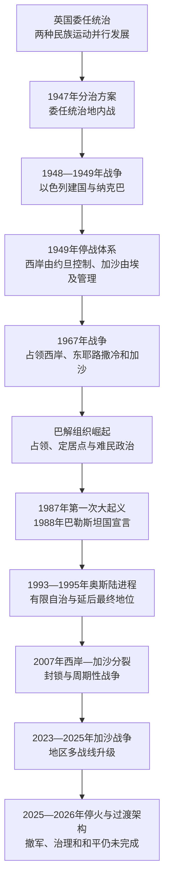

# 现代以色列与巴勒斯坦

## 时间

1947年至今（当代部分核验截至2026年7月14日）

## 概括

现代以色列与巴勒斯坦史不是一条由古代王国直接延续到现代国家的单线历史，而是奥斯曼末期社会、英国委任统治、犹太与巴勒斯坦阿拉伯民族运动、欧洲反犹主义和大屠杀、殖民治理、地区战争与国际干预共同形成的现代政治进程。1948年，以色列人把建国理解为民族自决和避难国家的实现；巴勒斯坦人则把同一场战争中的社会瓦解、大规模逃离与驱逐、土地和家园丧失称为“纳克巴”。两种历史经验发生在同一空间，不能用其中一方的叙事抹去另一方。

1949年停战没有建立巴勒斯坦国，也没有解决边界、耶路撒冷和难民问题。1967年战争后，以色列占领约旦河西岸、东耶路撒冷和加沙，领土控制、定居点与巴勒斯坦自决成为冲突核心。埃及—以色列和平、约旦—以色列和平和奥斯陆进程改变了地区关系，却没有完成以巴最终地位谈判。2007年后，巴勒斯坦民族权力机构主导的西岸有限自治与哈马斯在加沙的事实治理并立，双方政治代表性、选举连续性和统一安全体系均受到削弱。

2023年10月7日哈马斯等武装对以色列发动大规模袭击，以色列随后在加沙展开长期战争，造成严重人道灾难，并把冲突扩展到黎巴嫩、伊朗、红海和叙利亚等战线。2025年10月停火、2026年1月最后一名被扣押者遗体返回以及国际支持的加沙过渡架构，均未自动带来完全撤军、统一治理、解除武装或最终和平。截至核验日，停火与局部战斗、国际过渡授权与尚未完成的地面接管、巴勒斯坦国际承认扩大与有效主权不足仍同时存在。

## 演进图

## 1947—1949年：建国、战争与纳克巴

联合国大会第181号决议建议把英国委任统治地分为犹太国和阿拉伯国，并使耶路撒冷国际化。犹太机构接受以分治为建国法律和外交起点，阿拉伯高级委员会与阿拉伯国家则认为方案在土地、人口和政治权利上不公。1947年11月后，冲突先在委任统治地内发展为社群内战；1948年5月14日以色列宣布独立，次日周边阿拉伯国家军队参战。

以色列依靠较成熟的准国家机构、统一动员、外来军火和逐步整合的军事组织存续并扩大控制区。巴勒斯坦阿拉伯社会则因英国镇压1936—1939年起义留下的组织损失、地方领导分裂、军事资源不足和外部阿拉伯军队目标不一而迅速瓦解。约七十万巴勒斯坦人逃离或被驱逐，数百村镇被废弃、摧毁或重新安置；与此同时，中东和北非多国的犹太社群在随后数年大批迁入以色列，地区人口结构发生长期改变。

1949年停战线后来被称为“绿线”。以色列控制的领土超过分治方案所划范围；约旦控制并于1950年合并西岸和东耶路撒冷，埃及管理加沙。拟议中的阿拉伯国没有建立，难民及其后代分布于西岸、加沙、约旦、黎巴嫩、叙利亚和更广泛侨居地，返回、赔偿和公民权成为长期争议。

## 阿以战争、占领与地区和平

| 阶段 | 具体过程 | 结果与长期影响 |
|---|---|---|
| 1956年苏伊士战争 | 以色列同英国、法国协同行动，进攻埃及西奈；美国、苏联和联合国压力促使撤军。 | 显示以色列的军事能力与大国约束并存，联合国紧急部队进入西奈。 |
| 1967年六日战争 | 以色列先发制人打击埃及并同约旦、叙利亚交战，占领西奈、加沙、西岸、东耶路撒冷和戈兰高地。 | 产生长期占领体系和新一轮流离失所；安理会第242号决议提出以撤军、承认与安全为核心的框架。 |
| 1973年十月战争 | 埃及和叙利亚突袭西奈与戈兰，以军反击；美苏介入避免战争继续扩大。 | 打破1967年后以色列不可战胜的印象，也为埃以谈判创造条件。 |
| 1978—1979年戴维营与埃以和平 | 埃及承认以色列，以色列分阶段撤出西奈；巴勒斯坦自治方案未落实。 | 首个阿拉伯邻国退出对以战争，但埃及一度在阿拉伯世界受孤立。 |
| 1982年黎巴嫩战争 | 以色列以打击巴解组织为目标进军黎巴嫩并围困贝鲁特，巴解组织领导层撤往突尼斯。 | 巴勒斯坦武装中心外移，黎巴嫩冲突加深，真主党崛起条件形成。 |
| 1994年约以和平 | 约旦与以色列划界、建交并建立安全和水资源安排。 | 第二个邻国和平条约稳定东部边界，但未消除巴勒斯坦问题。 |
| 2020年后地区正常化 | 以色列同阿联酋、巴林、摩洛哥等建立或恢复正式关系。 | 地区合作不再完全以先解决巴勒斯坦问题为前提，却也使巴勒斯坦议题被边缘化的担忧加深。 |

1967年后，以色列把东耶路撒冷纳入其行政和法律体系，并在西岸和东耶路撒冷建设定居点；国际社会普遍不承认对东耶路撒冷的吞并，并认为定居点违反国际法，以色列对此提出不同法律和历史主张。西岸形成军事管制、定居点、道路、检查站、隔离设施和巴勒斯坦有限自治相互叠加的空间。以色列2005年撤出加沙境内定居点与常驻地面部队，但继续控制或影响多数边界、领空、海域、人口登记与货物流动；埃及也控制拉法方向，关于撤离后法律状态的争议并未结束。

## 巴勒斯坦民族运动与两次大起义

巴勒斯坦解放组织1964年成立，1969年后由亚西尔·阿拉法特领导的法塔赫占主导。其政治中心先后位于约旦、黎巴嫩和突尼斯，既开展武装斗争，也逐步争取阿拉伯国家与国际组织承认。1974年，阿拉伯国家承认巴解组织为巴勒斯坦人民的主要代表；1988年巴勒斯坦全国委员会宣布巴勒斯坦国，并接受以联合国决议为基础的外交路线。

1987年爆发的第一次大起义以罢工、示威、基层委员会和石块抗争为主，也伴有暴力与以色列镇压。它把冲突重心从流亡组织重新带回占领地，并推动秘密谈判。2000年第二次大起义在最终地位谈判失败、耶路撒冷争议和长期不满中爆发，随后出现自杀式袭击、以军再占领、定点清除和大规模军事行动。暴力造成双方严重伤亡，也摧毁了奥斯陆时期残余信任，促成以色列修建西岸隔离设施并转向单边安全措施。

## 奥斯陆进程与有限自治

1993年以色列与巴解组织相互承认，随后建立巴勒斯坦民族权力机构。1995年《奥斯陆二号协议》把西岸分为A、B、C区：A区由巴方承担民政和内部安全，B区由巴方负责民政而安全权限分担，C区由以色列保持主要民政和安全控制。该安排原本是五年过渡制度，却因最终地位谈判失败而长期化。

奥斯陆进程的突破在于双方首次正式承认谈判对手，并形成巴勒斯坦本土行政、警务和选举机构；其弱点是把边界、耶路撒冷、难民、定居点、安全和国家地位全部延后。定居点继续扩展、双方暴力、1995年以色列总理拉宾遇刺、领导层更替与权力不对称逐步掏空过渡安排。巴勒斯坦权力机构对外依赖援助和以色列代收税款，对内则因长期不举行全国选举、政治压制和腐败指控而失去部分合法性。

## 2005—2022年：加沙撤离、两地分裂与周期性战争

2005年，以色列撤出加沙定居点和常驻军队。2006年哈马斯赢得巴勒斯坦立法委员会选举，同法塔赫及外部力量的冲突迅速升级；2007年哈马斯武力控制加沙，巴勒斯坦权力机构继续主导西岸有限自治。此后形成两套行政、安全和政治网络，全国选举连续性中断。

以色列和埃及对加沙实行不同程度的边境限制；哈马斯及其他武装发射火箭弹、修建地道并同以色列多次交战，以色列实施空袭、封锁和地面行动。2008—2009年、2012年、2014年和2021年均发生重大冲突。每轮停火通常只处理即时安全和人道准入，没有解决封锁、武装、巴勒斯坦政治统一、以色列安全或最终地位，因而形成“升级—停火—再武装—再升级”的循环。

## 2023—2026年：加沙战争与地区化

### 2023—2024年：袭击、地面战与人道灾难

2023年10月7日，哈马斯主导的武装人员突破加沙边界，袭击以色列社区和军事据点，杀害约1200人并劫持251人。以色列宣布战争，进行大规模空袭、围困和地面作战，目标包括摧毁哈马斯军事与治理能力和解救被扣押者。战争造成加沙大量平民死亡、伤残、饥饿风险、基础设施破坏和反复流离失所；关于军事必要性、比例原则、援助准入和国际人道法的争议持续进入国际法院和国际刑事司法程序。

冲突同时向外扩散：黎以边境持续交火，也门胡塞武装袭击红海航运并向以色列发射导弹和无人机，伊朗及其地区盟友同以色列直接和间接交锋。2024年11月黎以停火降低一度升级的大战强度，但没有解决黎巴嫩南部武装、以军撤离和安理会第1701号决议的执行问题。

### 2025—2026年：停火、过渡架构与未完成的和平

2025年1月停火促成人质—囚犯交换和援助增加，但3月战斗恢复。6月以色列与伊朗直接战争进一步削弱地区“有限代理冲突”的边界。10月10日新的加沙停火生效，10月13日剩余在世人质获释；最后一名人质遗体于2026年1月返回。人质问题告一段落并不等于战争政治问题解决。

2025年11月安理会支持由国际机制、稳定力量和巴勒斯坦技术官僚组成的加沙过渡构想，2026年形成由阿里·沙阿斯领导的加沙行政委员会等架构。然而，截至2026年7月14日，过渡机构尚未完整接管地面行政和安全；以色列军事控制、巴勒斯坦地方网络、哈马斯残余组织与国际援助体系仍有重叠。停火线附近暴力、援助限制和人道困境持续，西岸的军事行动、定居点扩张、定居者暴力和巴勒斯坦社区迁离也同步加剧。

2026年2月底后，美国与以色列对伊朗的军事行动引发伊朗及地区盟友反击，黎巴嫩战线再度扩大。春夏多轮停火或降级安排降低部分战斗，却未建立地区和平条约。以巴冲突由此继续嵌入以色列—伊朗竞争、黎巴嫩国家主权、红海航运和美阿关系之中。

## 现行国家领导与政治代表

### 以色列国家元首

| 职位 | 现任者 | 就任时间 | 权限与说明 |
|---|---|---|---|
| 总统 | 艾萨克·赫尔佐格 | 2021年7月7日 | 礼仪性国家元首，履行任命组阁人选、签署法律、赦免等宪制职责，不领导日常政府。 |

历任总统完整表见[以色列总统与总理世系表](/%E4%BA%BA%E6%96%87%E7%A7%91%E5%AD%A6/%E5%8E%86%E5%8F%B2/%E8%A5%BF%E4%BA%9A/%E9%BB%8E%E5%87%A1%E7%89%B9/%E4%BB%A5%E8%89%B2%E5%88%97/%E4%BB%A5%E8%89%B2%E5%88%97%E6%80%BB%E7%BB%9F%E4%B8%8E%E6%80%BB%E7%90%86%E4%B8%96%E7%B3%BB%E8%A1%A8.md)。

### 以色列政府首脑与立法机关

| 职位 | 现任者 | 就任或本届起始 | 权限与说明 |
|---|---|---|---|
| 总理 | 本雅明·内塔尼亚胡 | 2022年12月29日 | 领导第37届政府和安全内阁，是行政与战争决策核心；仍受联合政府、议会、法院、检察机关和军方专业体系制约。 |
| 议会议长 | 阿米尔·奥哈纳 | 2022年12月29日 | 主持一院制议会；政府须维持议会多数。下一次定期选举安排在2026年10月27日。 |

### 巴勒斯坦国、巴解组织与自治机构

| 层级 | 现任者 | 就任时间 | 权限与说明 |
|---|---|---|---|
| 巴解组织执行委员会主席 | 马哈茂德·阿巴斯 | 2004年 | 代表跨地区民族组织和外交承认体系。 |
| 巴勒斯坦国总统、民族权力机构主席 | 马哈茂德·阿巴斯 | 2005年起任权力机构主席；2008年起任巴勒斯坦国总统 | 兼任多层职位，但任期、选举连续性和实际领土控制长期存在争议。 |
| 巴勒斯坦国副总统 | 侯赛因·谢赫 | 2025年4月26日 | 新设职位，承担总统授权职责并进入继任安排。 |
| 巴勒斯坦政府总理 | 穆罕默德·穆斯塔法 | 2024年3月31日 | 领导设于拉姆安拉的政府，主要在西岸自治区域运行。 |

巴解组织、巴勒斯坦国和民族权力机构不是同一机构，完整领导序列与继任规则见[巴解组织、巴勒斯坦国与自治机构领导人表](/%E4%BA%BA%E6%96%87%E7%A7%91%E5%AD%A6/%E5%8E%86%E5%8F%B2/%E8%A5%BF%E4%BA%9A/%E9%BB%8E%E5%87%A1%E7%89%B9/%E5%B7%B4%E5%8B%92%E6%96%AF%E5%9D%A6/%E5%B7%B4%E8%A7%A3%E7%BB%84%E7%BB%87%E3%80%81%E5%B7%B4%E5%8B%92%E6%96%AF%E5%9D%A6%E5%9B%BD%E4%B8%8E%E8%87%AA%E6%B2%BB%E6%9C%BA%E6%9E%84%E9%A2%86%E5%AF%BC%E4%BA%BA%E8%A1%A8.md)。

## 现行实际治理与控制

| 空间 | 名义或法定框架 | 实际权力结构与限制 |
|---|---|---|
| 以色列绿线内 | 以色列议会制国家 | 政府负责行政和安全，法院审查、议会多数、军方及独立法律机构构成制度约束；阿拉伯公民拥有国籍和选举权，但在资源、土地与身份政治上长期面对不平等争议。 |
| 东耶路撒冷 | 以色列纳入本国首都和市政体系；巴勒斯坦主张为未来国家首都 | 以色列实施行政、安全和城市规划控制；多数巴勒斯坦居民为永久居民而非公民，国际社会普遍不承认以色列吞并。 |
| 西岸A区 | 奥斯陆框架下巴方民政和内部安全 | 巴勒斯坦权力机构管理主要城市，但以军仍可进入并控制外部边界、空域和总体安全环境。 |
| 西岸B区 | 巴方民政、巴以分担安全权限 | 行政权和安全权交叠，巴方治理受以军行动和领土碎片化限制。 |
| 西岸C区及定居点 | 以色列保持主要民政和安全控制 | 约占西岸六成，包含多数土地储备和定居点；巴勒斯坦建设许可、土地使用和人员流动受严格限制。 |
| 加沙 | 国际上通常仍视为被占领巴勒斯坦领土的一部分 | 2025年停火后的以军控制区、巴勒斯坦地方治理、哈马斯残余网络、人道机构与尚未完成接管的国际支持过渡架构并存。 |
| 巴勒斯坦外交层级 | 巴勒斯坦国获联合国非会员观察员国地位并得到多数国家承认 | 国际法律人格和外交承认扩大，但完整领土主权、统一军警、边界控制和全国选举尚未实现。 |

加沙与西岸逐阶段控制范围详见[加沙与约旦河西岸并立治理结构表](/%E4%BA%BA%E6%96%87%E7%A7%91%E5%AD%A6/%E5%8E%86%E5%8F%B2/%E8%A5%BF%E4%BA%9A/%E9%BB%8E%E5%87%A1%E7%89%B9/%E5%B7%B4%E5%8B%92%E6%96%AF%E5%9D%A6/%E5%8A%A0%E6%B2%99%E4%B8%8E%E7%BA%A6%E6%97%A6%E6%B2%B3%E8%A5%BF%E5%B2%B8%E5%B9%B6%E7%AB%8B%E6%B2%BB%E7%90%86%E7%BB%93%E6%9E%84%E8%A1%A8.md)。

## 未决核心问题

| 问题 | 主要分歧 |
|---|---|
| 边界与国家地位 | 两国方案通常以1967年前线为基础并讨论土地交换，但定居点、战略纵深、领土连续性和有效主权未有共识。 |
| 耶路撒冷 | 双方均把耶路撒冷视为首都，旧城圣地又涉及犹太教、伊斯兰教和基督教跨国权益。 |
| 难民 | 巴勒斯坦要求承认返回、赔偿与历史责任；以色列担忧大规模返回改变国家民族性质，并强调犹太难民和移民经历。 |
| 定居点与土地 | 国际社会普遍认定被占领土定居点违法；以色列国内对撤除、保留和吞并路线存在分歧。 |
| 安全与武装 | 以色列要求防止袭击、火箭弹和敌对武装重建；巴勒斯坦要求结束占领、封锁、军事侵入和定居者暴力。 |
| 政治代表性 | 以色列联合政府政治分裂、巴勒斯坦长期不举行全国选举及西岸—加沙分裂均削弱谈判授权。 |
| 相互承认与历史记忆 | 犹太自决、巴勒斯坦自决、纳克巴记忆、反犹主义与殖民定性常被用于否定对方合法性，妨碍共同政治框架。 |

## 冲突持续的原因

### 结构因素

- 两个民族运动在同一土地追求自决，人口、圣地和历史记忆高度重叠，而领土与主权无法简单分割。
- 1948年难民问题、1967年占领和持续扩张的定居点不断制造新的既成事实，使临时安排越来越难逆转。
- 以色列掌握压倒性军事、经济和边界能力，巴勒斯坦政治则受领土碎片化、机构分裂与外援依赖限制，谈判权力不对称。
- 安全恐惧和历史创伤形成互相强化的逻辑：袭击推动更强控制，控制、伤亡和失地又推动激进化。
- 双方内部否决者能够通过暴力、联盟政治、定居扩张或拒绝统一权力来破坏妥协。

### 外部压力

- 美国的安全援助和外交作用、阿拉伯国家的战争与正常化、伊朗及地区武装网络，以及联合国和欧洲的援助与法律机制共同影响冲突。
- 地区竞争有时推动调停，也可能把以巴问题纳入更大的代理冲突，使地方妥协服从外部安全目标。
- 国际社会支持两国方案，却长期缺乏一致的执行、问责和安全保证机制。

### 直接触发因素

1947年分治决议、1967年战争、1973年突袭、1987年起义、2000年谈判崩溃与圣地危机、2006—2007年巴勒斯坦内部冲突、2023年10月7日袭击以及2025—2026年的地区战争，分别把长期矛盾推入新阶段。直接事件决定爆发时机，却不能单独解释持续数十年的结构性冲突。

## 重要事件

| 时间 | 事件 | 历史意义 |
|---|---|---|
| 1947年11月 | 联大第181号决议 | 建议分治与耶路撒冷国际化，随后爆发委任统治地内战。 |
| 1948—1949年 | 以色列建国、第一次阿以战争与纳克巴 | 以色列国家存续；巴勒斯坦社会瓦解、难民形成，拟议阿拉伯国未建立。 |
| 1956年 | 苏伊士战争 | 以色列地区军事角色上升，也显示大国能够迫使其撤军。 |
| 1967年 | 六日战争 | 占领西岸、东耶路撒冷和加沙，现代领土争议定型。 |
| 1973—1979年 | 十月战争至埃以和平 | 战场震荡转化为首个阿以和平条约和西奈撤军。 |
| 1987—1988年 | 第一次大起义与巴勒斯坦国宣言 | 本土动员和外交建国路线相结合。 |
| 1993—1995年 | 奥斯陆协议与有限自治 | 相互承认和本土行政建立，最终地位问题被延后。 |
| 1995年 | 拉宾遇刺 | 以色列内部反对妥协的政治暴力重创和平进程。 |
| 2000—2005年 | 第二次大起义与加沙撤离 | 暴力、隔离设施和单边主义取代互信谈判。 |
| 2006—2007年 | 哈马斯胜选与西岸—加沙分裂 | 巴勒斯坦统一行政、军警和选举连续性中断。 |
| 2012年 | 巴勒斯坦获联合国非会员观察员国地位 | 国际国家承认与法律参与扩大。 |
| 2020年 | 亚伯拉罕协议 | 以色列同部分阿拉伯国家正常化，未解决巴勒斯坦最终地位。 |
| 2023年10月7日 | 哈马斯主导袭击与加沙战争爆发 | 大规模杀戮、劫持和人道灾难使冲突地区化。 |
| 2025年1—3月 | 第一轮停火及破裂 | 交换人员、增加援助后恢复大规模战争。 |
| 2025年10月—2026年1月 | 第二轮停火与全部人质返回 | 人质危机结束，撤军、重建、治理与解除武装仍未完成。 |
| 2025年11月—2026年7月 | 国际过渡架构形成 | 加沙战后治理获得制度设计，但地面接管和持久停火尚未实现。 |
| 2026年2—7月 | 伊朗与黎巴嫩战线再升级 | 以巴问题继续嵌入地区多战线战争和脆弱停火。 |

## 演变关系

- 前置阶段：[英法委任统治时期](/%E4%BA%BA%E6%96%87%E7%A7%91%E5%AD%A6/%E5%8E%86%E5%8F%B2/%E8%A5%BF%E4%BA%9A/%E9%BB%8E%E5%87%A1%E7%89%B9/%E8%8B%B1%E6%B3%95%E5%A7%94%E4%BB%BB%E7%BB%9F%E6%B2%BB%E6%97%B6%E6%9C%9F.md)。
- 以色列完整主线：[以色列](/%E4%BA%BA%E6%96%87%E7%A7%91%E5%AD%A6/%E5%8E%86%E5%8F%B2/%E8%A5%BF%E4%BA%9A/%E9%BB%8E%E5%87%A1%E7%89%B9/%E4%BB%A5%E8%89%B2%E5%88%97/README.md)、[以色列国家、战争与社会变迁](/%E4%BA%BA%E6%96%87%E7%A7%91%E5%AD%A6/%E5%8E%86%E5%8F%B2/%E8%A5%BF%E4%BA%9A/%E9%BB%8E%E5%87%A1%E7%89%B9/%E4%BB%A5%E8%89%B2%E5%88%97/%E4%BB%A5%E8%89%B2%E5%88%97%E5%9B%BD%E5%AE%B6%E3%80%81%E6%88%98%E4%BA%89%E4%B8%8E%E7%A4%BE%E4%BC%9A%E5%8F%98%E8%BF%81.md)。
- 巴勒斯坦完整主线：[巴勒斯坦](/%E4%BA%BA%E6%96%87%E7%A7%91%E5%AD%A6/%E5%8E%86%E5%8F%B2/%E8%A5%BF%E4%BA%9A/%E9%BB%8E%E5%87%A1%E7%89%B9/%E5%B7%B4%E5%8B%92%E6%96%AF%E5%9D%A6/README.md)、[巴勒斯坦民族运动、占领与自治治理](/%E4%BA%BA%E6%96%87%E7%A7%91%E5%AD%A6/%E5%8E%86%E5%8F%B2/%E8%A5%BF%E4%BA%9A/%E9%BB%8E%E5%87%A1%E7%89%B9/%E5%B7%B4%E5%8B%92%E6%96%AF%E5%9D%A6/%E5%B7%B4%E5%8B%92%E6%96%AF%E5%9D%A6%E6%B0%91%E6%97%8F%E8%BF%90%E5%8A%A8%E3%80%81%E5%8D%A0%E9%A2%86%E4%B8%8E%E8%87%AA%E6%B2%BB%E6%B2%BB%E7%90%86.md)。
- 相邻冲突主线：[现代黎巴嫩](/%E4%BA%BA%E6%96%87%E7%A7%91%E5%AD%A6/%E5%8E%86%E5%8F%B2/%E8%A5%BF%E4%BA%9A/%E9%BB%8E%E5%87%A1%E7%89%B9/%E7%8E%B0%E4%BB%A3%E9%BB%8E%E5%B7%B4%E5%AB%A9.md)。
- 区域入口：[黎凡特](/%E4%BA%BA%E6%96%87%E7%A7%91%E5%AD%A6/%E5%8E%86%E5%8F%B2/%E8%A5%BF%E4%BA%9A/%E9%BB%8E%E5%87%A1%E7%89%B9/README.md)。
