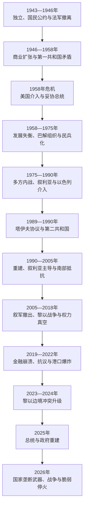

# 现代黎巴嫩

## 时间

1943年至今（当代部分核验截至2026年7月14日）

## 概括

现代黎巴嫩建立在“大黎巴嫩”边界、法国委任统治留下的议会制度和1943年“国民公约”之上。它既不是古代腓尼基城邦的直接复国，也不能只用“宗派冲突”解释。沿海商业城市、黎巴嫩山自治传统、贝卡和南部的地区差异，马龙派、逊尼派、什叶派、德鲁兹派与其他社群的权力分享，巴勒斯坦难民和武装问题，以及叙利亚、以色列、伊朗、海湾国家和西方国家的介入，共同塑造了国家的发展与危机。

独立后的权力分享制度一度为多元社群提供代表，并同贝鲁特金融、港口、旅游、教育和侨民网络相结合，形成中东重要商业文化中心。但制度长期依据旧人口和精英协议分配职位，国家税收、军队和公共服务能力弱于宗派政党及地方网络。1975—1990年内战使国家解体为多方武装和外国势力竞逐的空间；1989年《塔伊夫协议》结束主要战事并重新平衡权力，却没有取消宗派配额，也没有完成国家对武器的垄断。

战后重建依赖固定汇率、银行存款、侨汇、房地产和公共借贷，短期恢复贝鲁特，却积累债务与银行损失。2019年金融体系崩溃、2020年贝鲁特港爆炸和2023年后黎以战争把制度、经济和安全危机叠加。2025年约瑟夫·奥恩当选总统、纳瓦夫·萨拉姆组阁，结束长期权力真空；2026年政府宣布真主党的军事与安全活动违法并要求国家独占武器，但春夏战争和多轮脆弱停火表明国家主权、以军撤离、非国家武装和地区安全尚未形成最终安排。

## 演进图

## 独立与第一共和国

### 国民公约和宪制结构

1943年，马龙派总统贝沙拉·胡里和逊尼派总理里亚德·苏勒赫以不成文妥协确立独立路线：基督教政治精英不再寻求法国保护，穆斯林政治精英不推动并入叙利亚；高级职位按宗派惯例分配，总统由马龙派担任、总理由逊尼派担任、议会议长由什叶派担任。法国拘捕黎巴嫩领导人引发全国反对后承认独立，法军于1946年撤离。

这一制度把多社群协商嵌入议会政治，却以1932年人口普查和精英谈判为基础。总统在第一共和国拥有较强行政权，议会和政府则通过家族、地方领袖和宗派网络组织选举。它既防止单一社群完全垄断，也使国家职位和公共资源成为宗派讨价还价的对象。

### 商业繁荣与结构矛盾

贝鲁特凭借自由港、银行保密、阿拉伯资本、大学、出版和航空发展为地区金融文化中心，侨民汇款和转口贸易支持经济增长。繁荣主要集中于贝鲁特和山地核心，南部、贝卡和城市贫困区得到的公共投资较少。中央政府税收和社会服务有限，宗派慈善、学校和诊所填补缺口，也增强党派对社群的依附关系。

1948年战争后，大批巴勒斯坦难民进入黎巴嫩。国家担心改变宗派平衡，没有给予多数难民完整公民权；难民营逐渐成为同巴以冲突、社会排斥和跨境武装相连的特殊空间。

## 1958年危机与希哈布主义

1958年，卡米勒·夏蒙总统的外交路线、谋求延任的争议、埃及总统纳赛尔的泛阿拉伯主义影响及国内权力分配不满，引发武装反抗。伊拉克革命后，夏蒙请求美国依据“艾森豪威尔主义”派兵登陆贝鲁特。美军没有直接替政府进攻反对派；各方最终接受军队司令福阿德·希哈布出任总统。

希哈布主义尝试以公务员体系、发展规划、安全机构和对边缘地区投资来加强国家，缓和宗派精英竞争。改革扩大国家存在，却受到既得利益集团抵制，安全机构扩张也引发对监控政治的反弹。1967年阿以战争、巴勒斯坦武装壮大和地区阵营变化随后压倒了有限的制度建设。

## 巴勒斯坦武装、国家分裂与内战爆发

1968年以色列袭击贝鲁特机场，显示巴勒斯坦组织行动会把黎巴嫩卷入报复循环。1969年《开罗协议》在黎军与巴勒斯坦武装冲突后达成，承认巴勒斯坦组织在难民营和南部一定范围内的武装活动。1970—1971年巴解组织被约旦驱逐后，领导和军事中心转入黎巴嫩，南部逐渐被称为“法塔赫地带”。

巴勒斯坦武装并非内战的唯一原因。宗派代表失衡、城市化和贫富差距、国家军队受宗派制约、左翼和泛阿拉伯主义动员、基督教政党的安全恐惧以及外部军援共同推动民兵化。1975年4月艾因鲁马内枪击和巴士伏击把累积矛盾转为全面战争。

## 1975—1990年内战

| 阶段 | 过程 | 转折与后果 |
|---|---|---|
| 1975—1976年 | 长枪党等基督教民兵同黎巴嫩民族运动、巴勒斯坦武装及盟友交战，贝鲁特分为东西区。 | 叙利亚大规模出兵，先阻止左翼—巴勒斯坦联盟取胜，随后以“阿拉伯威慑部队”名义长期驻扎。 |
| 1977—1981年 | 卡迈勒·琼卜拉特遇刺，联盟重组；以色列支持南部地方武装并于1978年发动“利塔尼行动”。 | 安理会第425号决议和联合国驻黎临时部队形成，南部仍未恢复国家垄断。 |
| 1982—1984年 | 以色列入侵并围困西贝鲁特，巴解组织主力撤出；总统当选人巴希尔·杰马耶勒遇刺。 | 萨布拉和夏蒂拉难民营屠杀、跨国部队遇袭和“5月17日协议”失败，中央权威继续崩溃。 |
| 1984—1988年 | 阿迈勒同巴勒斯坦派别发生“难民营战争”，真主党在伊朗支持和反占领动员中成长，各阵营内部也爆发兼并战争。 | 什叶派政治和军事格局重组，民兵割据与外部代理关系深化。 |
| 1988—1990年 | 米歇尔·奥恩军政府同塞利姆·胡斯政府并立，奥恩先后发动“解放战争”和“消灭战争”。 | 1989年塔伊夫协议建立结束战争框架；1990年叙军击败奥恩阵营，主要内战终结。 |

内战造成大规模死亡、失踪、伤残、迁徙和城市破坏，也改变社群空间分布。阵营不是固定的“基督徒对穆斯林”：同宗派组织之间多次交战，跨宗派联盟和外国支持不断变化。把战争简化为古老宗教仇恨，会掩盖国家制度、社会分配、武装组织和地区战争的具体机制。

## 塔伊夫协议与第二共和国

| 制度 | 战后安排 | 未解决问题 |
|---|---|---|
| 议会 | 基督徒与穆斯林议席改为各半，后来固定为各64席。 | 配额仍按宗派细分，政治代表继续由传统精英和选举法塑造。 |
| 总统 | 仍由马龙派担任，但部分行政权转向内阁。 | 总统任命、组阁和重大政策仍可能因联盟否决而长期停摆。 |
| 总理与内阁 | 逊尼派总理主持政府，行政权原则上由内阁集体行使。 | 总理需要总统签署、议会信任和跨宗派妥协，难以独立推进改革。 |
| 议会议长 | 仍由什叶派担任，任期同议会一致。 | 议长在立法议程、组阁斡旋和什叶派政治中形成长期影响。 |
| 军队与民兵 | 协议要求解散民兵、统一军队并由国家恢复全境主权。 | 多数民兵转为政党，真主党以抵抗以色列占领为由保留武装。 |
| 叙黎关系 | 承认两国“特殊关系”并设想叙军分阶段重新部署。 | 没有明确最终撤军期限，形成延续至2005年的叙利亚主导秩序。 |
| 去宗派化 | 把逐步取消政治宗派主义列为长期目标。 | 全国委员会等配套制度未完整落实，临时配额变为长期结构。 |

塔伊夫终止了全面内战，却没有建立胜者能够单独统治的国家。战时领导人大多通过大赦进入议会、政府和商业网络；妥协降低了再次全面开战的概率，也保留了相互否决、公共资源分配和外部保护人政治。

## 1990—2005年：重建、叙利亚主导与南部冲突

拉菲克·哈里里多次出任总理，推动贝鲁特中央区、机场、道路和通信重建。国家以固定汇率、高利率、侨汇、外来存款和公共债务支撑消费及服务业，短期恢复信心，却没有充分重建生产、税收和普遍公共服务。重建用地、债务收益和战后大赦也加深对政商联盟和不平等的批评。

叙利亚军队、情报机构和黎巴嫩盟友影响总统任期、议会联盟和安全政策。南部则由以色列和其支持的南黎巴嫩军控制“安全区”，真主党以游击战和社会服务网络扩大影响。2000年以军撤出南部大部分地区，南黎巴嫩军迅速瓦解；舍巴农场归属争议和以色列威胁被真主党用于继续保留武装。

2004年联合国安理会第1559号决议要求外国军队撤离和民兵解除武装。2005年2月拉菲克·哈里里遇刺触发跨宗派示威和国际压力，叙军于4月撤出。叙利亚直接军事主导结束，国内政治随即重组为相互竞争的“三月十四日”和“三月八日”联盟。

## 2005—2018年：战争、联盟竞争与权力真空

2006年真主党越境袭击以军并俘获士兵，以色列发动大规模空袭和地面行动。安理会第1701号决议促成停火，要求黎军与联合国部队部署南部并使利塔尼河以南不再有国家以外武装。真主党受到损失却没有解除武装，战后以“抵抗”及重建网络巩固政治地位。

2008年，政府试图处理真主党独立通信网络，真主党及盟友以武力控制贝鲁特部分要地。《多哈协议》结束冲突并给予反对派关键否决能力，显示非国家武装可以直接改变国内谈判。2011年后叙利亚内战带来大量难民、边境战斗和政治分裂；真主党公开出兵支持叙利亚政府。2014—2016年总统职位空缺、反复组阁危机和议会延期说明协商制度在缺乏外部共识时容易停摆。

## 2019—2022年：金融崩溃与国家失能

2019年10月，一项网络通话收费计划成为全国抗议的直接触发点。示威者以“他们全都意味着全都”挑战跨宗派精英，把停电、垃圾、税负、腐败和就业危机视为共同制度问题。资本流入枯竭后，银行限制取款，黎巴嫩镑急剧贬值；政府于2020年3月停止偿还欧洲债券。固定汇率、银行向国家融资、公共债务和缺乏资本管制共同造成储蓄与工资蒸发。

2020年8月4日，长期存放在贝鲁特港仓库的硝酸铵爆炸，造成两百余人死亡、数千人受伤和大片城区受损。危险品多年无人处置，调查又受到豁免、诉讼和政治干预，港口爆炸成为国家失能和问责失败的象征。国际援助与金融重组要求同国内损失分担冲突，银行股东、存款人、国家和政治集团之间始终难以达成改革方案。

2022年10月，黎巴嫩和以色列经美国斡旋划定海上边界，为海上能源勘探提供框架。同月总统米歇尔·奥恩任期届满，议会长期无法选出继任者，看守政府和总统空缺叠加。

## 2023—2026年：黎以战争与国家主权转折

### 边境交火升级

2023年10月8日起，真主党以支援加沙为名袭击以色列，以军持续炮击和空袭。双方起初大致限制交火范围，但武器强度、遇袭地点和人员撤离不断扩大。2024年9月冲突急剧升级，真主党通信系统遭破坏，多名指挥官被杀；9月27日长期领导人哈桑·纳斯鲁拉死于以军空袭。以军随后在南部发动地面行动并广泛轰炸。

2024年11月27日停火安排以第1701号决议为基础，要求以军撤出、黎军部署南部，并使真主党武装撤离利塔尼河以南。战斗强度下降，但以军保留若干据点，空袭、武装活动和相互指控持续。

### 2025年制度重启

2025年1月9日，议会选举前军队司令约瑟夫·奥恩为总统，结束自2022年延续的职位空缺。2月8日，纳瓦夫·萨拉姆政府成立。新领导层把司法独立、银行重组、战后重建、执行第1701号决议和恢复国家对武器的垄断列为重点。政府要求军方制定把全国武器置于国家控制的计划，真主党则主张以军未完全撤离和安全保证不足时不能解除武装。

### 2026年再次开战与脆弱停火

2026年3月，地区战争扩大，真主党未经黎巴嫩政府授权再次向以色列发射火箭弹和无人机。政府宣布真主党的军事与安全活动违法，强调战争与和平决定和全部武器应归国家掌握。这是战后政府对非国家武装最明确的公开否定之一，却没有立即转化为完整的强制执行能力。

以色列扩大空袭和地面行动，造成新的伤亡、破坏和大规模流离失所。议会在战事和人口迁移条件下把原定2026年举行的议会选举推迟。春夏出现多轮停火、补充安排及撤军—解除武装谈判；联合国欢迎6月再次宣布的停火，同时持续记录严重违反停火和军事活动。截至2026年7月14日，全面和平、以军完全撤离、真主党解除武装和国家在南部的完整控制均未实现。

## 现行国家元首

| 职位 | 现任者 | 就任时间 | 宪制角色 |
|---|---|---|---|
| 总统 | 约瑟夫·奥恩 | 2025年1月9日 | 马龙派国家元首、国家统一象征和武装部队最高统帅；须同总理、内阁和议会协同运作。 |

## 现行政府首脑

| 职位 | 现任者 | 就任时间 | 宪制角色 |
|---|---|---|---|
| 总理 | 纳瓦夫·萨拉姆 | 2025年2月8日 | 逊尼派政府首脑，主持内阁并负责改革、重建和停火执行；政府须取得议会信任。 |

## 立法机关与实际权力结构

| 层次 | 截至核验日的主体 | 权力与限制 |
|---|---|---|
| 议会 | 128席议会；议长纳比·贝里 | 议席按基督徒与穆斯林各64席分配。贝里自1992年起长期任议长，也是阿迈勒运动领导人和关键斡旋者。 |
| 内阁协商 | 萨拉姆政府及参加政府的宗派政治力量 | 重大决定依赖跨社群妥协；总统、总理、议长和主要议会集团均可影响议程。 |
| 国家安全机关 | 黎巴嫩武装部队、内部安全部队等 | 是法定国家武装，负责边境、南部部署和国内秩序；资源、装备、财政和政治授权不足限制全面接管能力。 |
| 真主党 | 政党、社会网络与独立武装体系 | 2024年受到重创，2026年军事活动被政府宣布违法；组织、武器和部分社会基础仍存在，国家尚未完成解除武装。 |
| 宗派政党和家族网络 | 阿迈勒、黎巴嫩力量、自由爱国运动、进步社会党等 | 通过议会、地方服务、公共职位和联盟谈判影响组阁；同宗派内部也存在激烈竞争。 |
| 司法与金融机构 | 法院、中央银行、商业银行和监管机关 | 港口调查、银行损失和资本管制受政治争议牵制，制度改革决定国家能否恢复信用。 |
| 外部力量 | 以色列、叙利亚、伊朗、海湾国家、美国、法国、联合国等 | 军事压力、军援、制裁、重建资金、调停和代理关系持续改变国内力量平衡。 |

历任山地埃米尔、自治省总督、总统和总理分别列于[黎巴嫩山统治者、总督与共和国领导人表](/%E4%BA%BA%E6%96%87%E7%A7%91%E5%AD%A6/%E5%8E%86%E5%8F%B2/%E8%A5%BF%E4%BA%9A/%E9%BB%8E%E5%87%A1%E7%89%B9/%E9%BB%8E%E5%B7%B4%E5%AB%A9/%E9%BB%8E%E5%B7%B4%E5%AB%A9%E5%B1%B1%E7%BB%9F%E6%B2%BB%E8%80%85%E3%80%81%E6%80%BB%E7%9D%A3%E4%B8%8E%E5%85%B1%E5%92%8C%E5%9B%BD%E9%A2%86%E5%AF%BC%E4%BA%BA%E8%A1%A8.md)。

## 国家韧性与危机延续的原因

### 延续与恢复能力

- 多社群协商和“不让任何一方独占国家”的惯例，虽造成否决政治，也降低单一阵营永久排除其他社群的可能。
- 侨民、教育、商业和专业服务网络为社会提供跨国资金和人才，即使国家机构衰弱，地方社会仍能维持部分功能。
- 黎巴嫩军队作为跨宗派国家机构，长期得到国内相对广泛认同和外部援助，是恢复国家主权的主要组织基础。
- 对内战重演的共同恐惧约束多数政党，即使发生政治危机和局部武装冲突，各方通常仍寻求外部调停和精英妥协。

### 结构因素

- 宗派配额保障代表性，也使职位分配、预算、司法任命和改革易被否决；临时妥协长期固化。
- 战时领袖、家族、政党和商业网络在战后继续掌握公共资源，国家服务常被党派渠道替代。
- 重建依赖债务、固定汇率和银行吸收外汇，没有形成足以承担进口与公共支出的生产和税收基础。
- 内战罪行、政治暗杀、港口爆炸与金融损失长期缺少有效问责，削弱法律和公众信任。
- 正规军资源不足，而真主党拥有独立武装和外部支持，形成国家与非国家安全体系双轨。

### 外部压力

- 巴以冲突、叙利亚战争和伊朗—以色列竞争反复越过黎巴嫩边界。
- 国内阵营依赖不同外部支持者，组阁、总统选举和安全政策容易成为地区交易的一部分。
- 以色列占领、空袭和安全要求同真主党的“抵抗”叙事互相强化，形成“先撤军还是先解除武装”的次序困局。
- 国际援助通常要求金融、司法和行政改革，但既有利益集团会阻止可能让其承担损失的方案。

### 直接触发因素

1958年的总统延任与地区阵营争议、1975年的艾因鲁马内事件、2005年哈里里遇刺、2006年的越境俘兵、2019年的网络收费方案、2020年港口爆炸、2023年加沙战争外溢和2026年真主党未经授权发动攻击，分别把长期矛盾推向新阶段。它们决定危机爆发的时机，却不能替代对制度、经济和地区结构的解释。

## 重要事件

| 时间 | 事件 | 结果与长期影响 |
|---|---|---|
| 1943—1946年 | 国民公约、独立危机与法军撤离 | 形成宗派权力分享和独立共和国。 |
| 1948年 | 参加第一次阿以战争，巴勒斯坦难民进入 | 难民公民权、营地治理和边境冲突成为长期问题。 |
| 1958年 | 第一共和国危机与美军登陆 | 以希哈布当选达成妥协，推动有限国家建设。 |
| 1969年 | 《开罗协议》 | 巴勒斯坦武装活动空间扩大，国家安全主权进一步分裂。 |
| 1975年4月 | 艾因鲁马内冲突 | 长期制度与武装矛盾转为十五年内战。 |
| 1976年 | 叙利亚军队大规模进入 | 阻止一方迅速取胜，也开启长期军事和政治控制。 |
| 1978年 | 以色列“利塔尼行动” | 第425号决议和联合国驻黎临时部队形成。 |
| 1982年 | 以色列入侵、围困贝鲁特，巴解组织撤离 | 黎巴嫩战争地区化，萨布拉和夏蒂拉屠杀留下深重创伤。 |
| 1989—1990年 | 塔伊夫协议与内战终结 | 重配宗派权力并恢复中央政府，叙利亚主导战后秩序。 |
| 2000年 | 以色列撤出南部大部分地区 | 南黎巴嫩军瓦解，真主党保留武装的理由与争议延续。 |
| 2005年 | 哈里里遇刺、雪松革命与叙军撤出 | 结束叙军驻扎，国内联盟重新分化。 |
| 2006年 | 真主党—以色列战争 | 第1701号决议重塑南部安全框架，武装双轨未解决。 |
| 2008年 | 贝鲁特武装冲突与多哈协议 | 显示非国家武装能够决定国内谈判边界。 |
| 2011年后 | 叙利亚内战外溢 | 难民、边境战斗与真主党参战改变国内政治。 |
| 2019年 | 全国抗议和银行危机 | 跨宗派民众挑战精英体系，金融崩溃公开化。 |
| 2020年3月、8月 | 主权债务违约与贝鲁特港爆炸 | 经济和治理危机全面显现，问责长期受阻。 |
| 2022年10月 | 海上边界协议与总统空缺 | 海上争端部分制度化，国内权力真空扩大。 |
| 2023—2024年 | 边境交火升级为大规模黎以战争 | 真主党领导层和南部安全格局受重创，全国遭受破坏和迁徙。 |
| 2025年1—2月 | 约瑟夫·奥恩当选、萨拉姆政府成立 | 结束总统空缺，改革和国家垄断武器重新进入执行议程。 |
| 2026年3—7月 | 政府否定真主党军事活动、战争与多轮停火 | 国家主权立场发生重大转折，撤军、解除武装和完整控制仍未完成。 |

## 演变关系

- 前置阶段：[英法委任统治时期](/%E4%BA%BA%E6%96%87%E7%A7%91%E5%AD%A6/%E5%8E%86%E5%8F%B2/%E8%A5%BF%E4%BA%9A/%E9%BB%8E%E5%87%A1%E7%89%B9/%E8%8B%B1%E6%B3%95%E5%A7%94%E4%BB%BB%E7%BB%9F%E6%B2%BB%E6%97%B6%E6%9C%9F.md)。
- 黎巴嫩完整主线：[黎巴嫩](/%E4%BA%BA%E6%96%87%E7%A7%91%E5%AD%A6/%E5%8E%86%E5%8F%B2/%E8%A5%BF%E4%BA%9A/%E9%BB%8E%E5%87%A1%E7%89%B9/%E9%BB%8E%E5%B7%B4%E5%AB%A9/README.md)、[内战、塔伊夫体制与当代黎巴嫩](/%E4%BA%BA%E6%96%87%E7%A7%91%E5%AD%A6/%E5%8E%86%E5%8F%B2/%E8%A5%BF%E4%BA%9A/%E9%BB%8E%E5%87%A1%E7%89%B9/%E9%BB%8E%E5%B7%B4%E5%AB%A9/%E5%86%85%E6%88%98%E3%80%81%E5%A1%94%E4%BC%8A%E5%A4%AB%E4%BD%93%E5%88%B6%E4%B8%8E%E5%BD%93%E4%BB%A3%E9%BB%8E%E5%B7%B4%E5%AB%A9.md)。
- 领导人完整表：[黎巴嫩山统治者、总督与共和国领导人表](/%E4%BA%BA%E6%96%87%E7%A7%91%E5%AD%A6/%E5%8E%86%E5%8F%B2/%E8%A5%BF%E4%BA%9A/%E9%BB%8E%E5%87%A1%E7%89%B9/%E9%BB%8E%E5%B7%B4%E5%AB%A9/%E9%BB%8E%E5%B7%B4%E5%AB%A9%E5%B1%B1%E7%BB%9F%E6%B2%BB%E8%80%85%E3%80%81%E6%80%BB%E7%9D%A3%E4%B8%8E%E5%85%B1%E5%92%8C%E5%9B%BD%E9%A2%86%E5%AF%BC%E4%BA%BA%E8%A1%A8.md)。
- 相邻冲突主线：[现代以色列与巴勒斯坦](/%E4%BA%BA%E6%96%87%E7%A7%91%E5%AD%A6/%E5%8E%86%E5%8F%B2/%E8%A5%BF%E4%BA%9A/%E9%BB%8E%E5%87%A1%E7%89%B9/%E7%8E%B0%E4%BB%A3%E4%BB%A5%E8%89%B2%E5%88%97%E4%B8%8E%E5%B7%B4%E5%8B%92%E6%96%AF%E5%9D%A6.md)、[叙利亚](/%E4%BA%BA%E6%96%87%E7%A7%91%E5%AD%A6/%E5%8E%86%E5%8F%B2/%E8%A5%BF%E4%BA%9A/%E9%BB%8E%E5%87%A1%E7%89%B9/%E5%8F%99%E5%88%A9%E4%BA%9A/README.md)。
- 区域入口：[黎凡特](/%E4%BA%BA%E6%96%87%E7%A7%91%E5%AD%A6/%E5%8E%86%E5%8F%B2/%E8%A5%BF%E4%BA%9A/%E9%BB%8E%E5%87%A1%E7%89%B9/README.md)。
