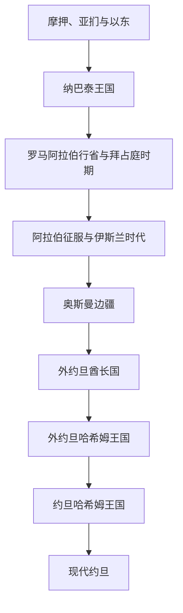

# 约旦

## 概括

约旦位于约旦河东岸、叙利亚沙漠和阿拉伯半岛西北缘之间。现代国名来自约旦河，但其疆域还包括古代摩押、亚扪、以东和纳巴泰活动区域。佩特拉是纳巴泰王国的核心，罗马征服后地区进入阿拉伯行省；伊斯兰时期又成为叙利亚朝觐、贸易和边疆网络的一部分。

现代约旦源于第一次世界大战后英国在巴勒斯坦委任统治框架下建立的外约旦酋长国。哈希姆家族自1921年起统治，并于1946年建立独立王国。约旦的国家史长期受到巴勒斯坦问题、难民迁入、约旦河西岸地位、阿以战争、有限资源和地区安全的影响。

## 演变图

## 历史主线

约旦史的连续性主要表现为三点：其一，农耕高地、沙漠牧区和红海港口之间的交通网络；其二，部落、城市和中央政权之间的协商；其三，哈希姆王朝在英国影响、阿拉伯民族主义和巴勒斯坦问题之间建立国家。现代社会由东岸原有社群、巴勒斯坦裔居民、贝都因部落和多轮地区难民共同构成。

## 时期导航

| 顺序 | 阶段 | 时间 | 简要概括 |
|---:|---|---|---|
| 1 | [古代外约旦与纳巴泰王国](/%E4%BA%BA%E6%96%87%E7%A7%91%E5%AD%A6/%E5%8E%86%E5%8F%B2/%E8%A5%BF%E4%BA%9A/%E9%BB%8E%E5%87%A1%E7%89%B9/%E7%BA%A6%E6%97%A6/%E5%8F%A4%E4%BB%A3%E5%A4%96%E7%BA%A6%E6%97%A6%E4%B8%8E%E7%BA%B3%E5%B7%B4%E6%B3%B0%E7%8E%8B%E5%9B%BD.md) | 约前2千纪—1516年 | 从摩押、亚扪、以东和纳巴泰，到罗马、拜占庭及中世纪伊斯兰统治。 |
| 2 | [奥斯曼边疆与外约旦酋长国](/%E4%BA%BA%E6%96%87%E7%A7%91%E5%AD%A6/%E5%8E%86%E5%8F%B2/%E8%A5%BF%E4%BA%9A/%E9%BB%8E%E5%87%A1%E7%89%B9/%E7%BA%A6%E6%97%A6/%E5%A5%A5%E6%96%AF%E6%9B%BC%E8%BE%B9%E7%96%86%E4%B8%8E%E5%A4%96%E7%BA%A6%E6%97%A6%E9%85%8B%E9%95%BF%E5%9B%BD.md) | 1516—1946年 | 奥斯曼边疆治理、汉志铁路、阿拉伯起义和英国支持下的酋长国。 |
| 3 | [哈希姆王国与现代约旦](/%E4%BA%BA%E6%96%87%E7%A7%91%E5%AD%A6/%E5%8E%86%E5%8F%B2/%E8%A5%BF%E4%BA%9A/%E9%BB%8E%E5%87%A1%E7%89%B9/%E7%BA%A6%E6%97%A6/%E5%93%88%E5%B8%8C%E5%A7%86%E7%8E%8B%E5%9B%BD%E4%B8%8E%E7%8E%B0%E4%BB%A3%E7%BA%A6%E6%97%A6.md) | 1946年至今 | 独立王国、约旦河西岸问题、阿以冲突、国内危机及区域调停。 |

## 重要转折与时间节点

| 时间 | 事件 | 意义 |
|---|---|---|
| 前1世纪—106年 | 纳巴泰王国以佩特拉为中心发展 | 控制香料与商队路线，形成跨沙漠商业国家。 |
| 106年 | 罗马吞并纳巴泰 | 建立阿拉伯行省，区域纳入罗马道路与城市体系。 |
| 636年后 | 阿拉伯征服 | 外约旦进入伊斯兰政治文化网络。 |
| 1900年代初 | 汉志铁路修建 | 奥斯曼加强交通、朝觐和军事控制。 |
| 1921年 | 外约旦酋长国建立 | 阿卜杜拉在英国支持下形成现代国家核心。 |
| 1946年 | 外约旦独立 | 哈希姆王国取得国际承认。 |
| 1948—1950年 | 第一次中东战争与西岸合并 | 王国控制并正式并入约旦河西岸，但国际承认有限。 |
| 1967年 | 约旦失去西岸和东耶路撒冷 | 国家人口、领土和巴勒斯坦问题格局改变。 |
| 1970—1971年 | “黑九月”冲突 | 王国军队同巴勒斯坦武装组织冲突，后者主力撤离。 |
| 1994年 | 约旦与以色列签署和平条约 | 双方正式结束战争状态。 |

## 区域关系

- 直接上级：[黎凡特](/%E4%BA%BA%E6%96%87%E7%A7%91%E5%AD%A6/%E5%8E%86%E5%8F%B2/%E8%A5%BF%E4%BA%9A/%E9%BB%8E%E5%87%A1%E7%89%B9/README.md)；宏观区域：[西亚](/%E4%BA%BA%E6%96%87%E7%A7%91%E5%AD%A6/%E5%8E%86%E5%8F%B2/%E8%A5%BF%E4%BA%9A/README.md)。
- 古代及中世纪背景见[黎凡特](/%E4%BA%BA%E6%96%87%E7%A7%91%E5%AD%A6/%E5%8E%86%E5%8F%B2/%E8%A5%BF%E4%BA%9A/%E9%BB%8E%E5%87%A1%E7%89%B9/README.md)。
- 伊斯兰帝国背景见[阿拉伯帝国](/%E4%BA%BA%E6%96%87%E7%A7%91%E5%AD%A6/%E5%8E%86%E5%8F%B2/%E8%A5%BF%E4%BA%9A/_%E9%80%9A%E5%8F%B2/%E9%98%BF%E6%8B%89%E4%BC%AF%E5%B8%9D%E5%9B%BD/README.md)。
- 奥斯曼整体主线见[奥斯曼帝国](/%E4%BA%BA%E6%96%87%E7%A7%91%E5%AD%A6/%E5%8E%86%E5%8F%B2/%E8%A5%BF%E4%BA%9A/%E5%9C%9F%E8%80%B3%E5%85%B6/%E5%A5%A5%E6%96%AF%E6%9B%BC%E5%B8%9D%E5%9B%BD/README.md)。
- 委任统治背景见[英法委任统治时期](/%E4%BA%BA%E6%96%87%E7%A7%91%E5%AD%A6/%E5%8E%86%E5%8F%B2/%E8%A5%BF%E4%BA%9A/%E9%BB%8E%E5%87%A1%E7%89%B9/%E8%8B%B1%E6%B3%95%E5%A7%94%E4%BB%BB%E7%BB%9F%E6%B2%BB%E6%97%B6%E6%9C%9F.md)。
- 巴勒斯坦与以色列国家史见[巴勒斯坦](/%E4%BA%BA%E6%96%87%E7%A7%91%E5%AD%A6/%E5%8E%86%E5%8F%B2/%E8%A5%BF%E4%BA%9A/%E9%BB%8E%E5%87%A1%E7%89%B9/%E5%B7%B4%E5%8B%92%E6%96%AF%E5%9D%A6/README.md)和[以色列](/%E4%BA%BA%E6%96%87%E7%A7%91%E5%AD%A6/%E5%8E%86%E5%8F%B2/%E8%A5%BF%E4%BA%9A/%E9%BB%8E%E5%87%A1%E7%89%B9/%E4%BB%A5%E8%89%B2%E5%88%97/README.md)。

## 目录层级

- 直接上级：[黎凡特](/%E4%BA%BA%E6%96%87%E7%A7%91%E5%AD%A6/%E5%8E%86%E5%8F%B2/%E8%A5%BF%E4%BA%9A/%E9%BB%8E%E5%87%A1%E7%89%B9/README.md)
- 宏观区域：[西亚](/%E4%BA%BA%E6%96%87%E7%A7%91%E5%AD%A6/%E5%8E%86%E5%8F%B2/%E8%A5%BF%E4%BA%9A/README.md)
- 历史总览：[历史](/%E4%BA%BA%E6%96%87%E7%A7%91%E5%AD%A6/%E5%8E%86%E5%8F%B2/README.md)
