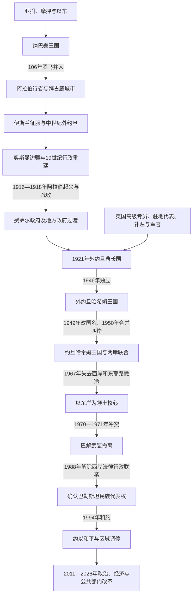

# 约旦

## 概括

约旦位于约旦河东岸、高地农耕带、叙利亚沙漠和通往红海的亚喀巴走廊之间。现代边界并不对应一个自古连续存在的“约旦国家”：铁器时代的亚扪、摩押、以东各有核心区，纳巴泰王国又横跨今约旦、叙利亚南部、内盖夫和阿拉伯半岛西北。此后罗马道路、伊斯兰军政区、朝觐路线和奥斯曼行政改革不断重组这片空间。

现代约旦起源于第一次世界大战后奥斯曼秩序瓦解。1921年，麦加哈希姆家族的阿卜杜拉在英国支持和约束下建立外约旦酋长国；1946年独立后，王国又因1948年战争控制并合并约旦河西岸，1967年失去西岸。巴勒斯坦人口与民族运动、东岸部落—军队联盟、外援、有限水土资源和周边战争，共同塑造哈希姆王国的制度与社会。

## 历史主线

- **古代多中心**：亚扪高地、摩押台地、以东与阿拉巴谷地各有不同政治经济网络。纳巴泰利用水利、商队中转和多港口路线建立跨沙漠王国。
- **帝国通道**：罗马“图拉真新道”、伊斯兰军政区、十字军城堡和马穆鲁克朝觐驿路，都把约旦高地视为连接叙利亚、汉志、埃及和红海的走廊。
- **奥斯曼再整合**：16—18世纪中央控制常集中于税收、朝觐堡垒和城镇；19世纪后期行政区、土地登记、移民定居、驻军和汉志铁路增强直接统治。
- **委任统治下建国**：英国掌握外交、军事和关键财政，埃米尔阿卜杜拉经营内部任命与部落联盟；阿拉伯军团把王室、英国补贴和地方兵源连接起来。
- **两岸王国与领土收缩**：1948—1950年王国纳入西岸和大量巴勒斯坦人口，1967年失去该领土，1970—1971年又以武力结束巴勒斯坦武装在国内的半自主地位。
- **君主制延续**：王室通过军队与安全机构、东岸部落网络、巴勒斯坦裔商业与专业群体、外援和区域外交维持国家；议会与内阁真实存在，但国王保留最终任免、安全与战略权力。

## 时期导航

| 顺序 | 阶段 | 时间 | 简要概括 |
|---:|---|---|---|
| 1 | [古代外约旦与纳巴泰王国](/%E4%BA%BA%E6%96%87%E7%A7%91%E5%AD%A6/%E5%8E%86%E5%8F%B2/%E8%A5%BF%E4%BA%9A/%E9%BB%8E%E5%87%A1%E7%89%B9/%E7%BA%A6%E6%97%A6/%E5%8F%A4%E4%BB%A3%E5%A4%96%E7%BA%A6%E6%97%A6%E4%B8%8E%E7%BA%B3%E5%B7%B4%E6%B3%B0%E7%8E%8B%E5%9B%BD.md) | 约前2千纪—1516年 | 亚扪、摩押、以东、纳巴泰完整可考王序、罗马—拜占庭和中世纪伊斯兰统治。 |
| 2 | [奥斯曼边疆与外约旦酋长国](/%E4%BA%BA%E6%96%87%E7%A7%91%E5%AD%A6/%E5%8E%86%E5%8F%B2/%E8%A5%BF%E4%BA%9A/%E9%BB%8E%E5%87%A1%E7%89%B9/%E7%BA%A6%E6%97%A6/%E5%A5%A5%E6%96%AF%E6%9B%BC%E8%BE%B9%E7%96%86%E4%B8%8E%E5%A4%96%E7%BA%A6%E6%97%A6%E9%85%8B%E9%95%BF%E5%9B%BD.md) | 1516—1946年 | 奥斯曼行政重建、汉志铁路、阿拉伯起义、战后地方政府与英国控制下的酋长国。 |
| 3 | [哈希姆王国与现代约旦](/%E4%BA%BA%E6%96%87%E7%A7%91%E5%AD%A6/%E5%8E%86%E5%8F%B2/%E8%A5%BF%E4%BA%9A/%E9%BB%8E%E5%87%A1%E7%89%B9/%E7%BA%A6%E6%97%A6/%E5%93%88%E5%B8%8C%E5%A7%86%E7%8E%8B%E5%9B%BD%E4%B8%8E%E7%8E%B0%E4%BB%A3%E7%BA%A6%E6%97%A6.md) | 1946年至今 | 西岸合并与丧失、军队阿拉伯化、黑九月、政治开放、和约及现代改革。 |
| 4 | [约旦哈希姆君主世系与王位继承表](/%E4%BA%BA%E6%96%87%E7%A7%91%E5%AD%A6/%E5%8E%86%E5%8F%B2/%E8%A5%BF%E4%BA%9A/%E9%BB%8E%E5%87%A1%E7%89%B9/%E7%BA%A6%E6%97%A6/%E7%BA%A6%E6%97%A6%E5%93%88%E5%B8%8C%E5%A7%86%E5%90%9B%E4%B8%BB%E4%B8%96%E7%B3%BB%E4%B8%8E%E7%8E%8B%E4%BD%8D%E7%BB%A7%E6%89%BF%E8%A1%A8.md) | 1921年至今 | 四任君主、摄政安排、历任王储变化和当前继承机制。 |

## 重要转折与时间节点

| 时间 | 事件 | 意义 |
|---|---|---|
| 前9—前6世纪 | 亚扪、摩押、以东王国 | 高地、死海东岸和阿拉巴谷地形成三个地方王权。 |
| 前312年 | 纳巴泰抵抗安提柯军队 | 说明佩特拉地区已有能保护商路与水源的组织。 |
| 前1世纪—40年 | 纳巴泰扩张与阿瑞塔斯四世时期 | 王国在大马士革、豪兰、内盖夫、汉志北部和红海贸易间达到高峰。 |
| 106年 | 罗马并入纳巴泰 | 建立阿拉伯行省；王国终结，但城市与贸易并未立即消失。 |
| 636年后 | 拜占庭失去黎凡特南部 | 外约旦进入哈里发军政区和阿拉伯—伊斯兰文化网络。 |
| 1187—1189年 | 萨拉丁击败十字军并夺取外约旦城堡 | 卡拉克、绍巴克重回穆斯林政权。 |
| 1516年 | 奥斯曼征服叙利亚 | 外约旦进入以大马士革和朝觐路线为轴的帝国秩序。 |
| 1870年代—1908年 | 行政建制、移民定居与汉志铁路 | 城镇、农业、征税和军队调动能力增强。 |
| 1910年 | 卡拉克起义 | 征兵、人口登记和税收激起反中央冲突。 |
| 1916—1918年 | 阿拉伯起义与奥斯曼战败 | 铁路、亚喀巴和马安成为新政治秩序的军事起点。 |
| 1921年 | 外约旦酋长国形成 | 阿卜杜拉、英国与地方精英共同建立现代国家核心。 |
| 1928—1929年 | 条约、基本法和首届立法委员会选举 | 有限代议制度形成，但英国保留关键控制。 |
| 1946年 | 独立和改建王国 | 委任统治结束，阿卜杜拉成为国王。 |
| 1948—1950年 | 战争、西岸控制与正式合并 | 王国成为“两岸国家”，人口和巴勒斯坦问题发生根本变化。 |
| 1952—1953年 | 新宪法、侯赛因即位和摄政结束 | 现代宪制框架与长期侯赛因时代开始。 |
| 1956年 | 军队指挥权阿拉伯化 | 英国高级军官被撤，王权的军事自主性加强。 |
| 1967年 | 失去西岸和东耶路撒冷 | 国家重新以东岸为领土核心。 |
| 1970—1971年 | 约军与巴勒斯坦武装冲突 | 王国恢复境内武装垄断，巴解主力转往黎巴嫩。 |
| 1988年 | 解除与西岸的法律、行政联系 | 放弃对西岸的统治主张，为巴勒斯坦代表权和和谈重新定位。 |
| 1989、1994年 | 恢复议会选举、签署约以和约 | 有限政治开放与外交战略转向并行。 |
| 2011—2012年 | 抗议与宪制调整 | 建立宪法法院、独立选举机构等，国王核心权力仍在。 |
| 2022—2024年 | 新选举法、政党法与第20届众议院选举 | 政党席位扩大；伊斯兰行动阵线成为最大单一阵营。 |
| 2026年 | 独立80周年 | 阿卜杜拉二世—贾法尔·哈桑政府继续实施政治、经济和公共部门现代化。 |

## 区域关系

- 直接上级：[黎凡特](/%E4%BA%BA%E6%96%87%E7%A7%91%E5%AD%A6/%E5%8E%86%E5%8F%B2/%E8%A5%BF%E4%BA%9A/%E9%BB%8E%E5%87%A1%E7%89%B9/README.md)；宏观区域：[西亚](/%E4%BA%BA%E6%96%87%E7%A7%91%E5%AD%A6/%E5%8E%86%E5%8F%B2/%E8%A5%BF%E4%BA%9A/README.md)。
- 帝国背景：[阿拉伯帝国](/%E4%BA%BA%E6%96%87%E7%A7%91%E5%AD%A6/%E5%8E%86%E5%8F%B2/%E8%A5%BF%E4%BA%9A/_%E9%80%9A%E5%8F%B2/%E9%98%BF%E6%8B%89%E4%BC%AF%E5%B8%9D%E5%9B%BD/README.md)、[奥斯曼帝国](/%E4%BA%BA%E6%96%87%E7%A7%91%E5%AD%A6/%E5%8E%86%E5%8F%B2/%E8%A5%BF%E4%BA%9A/%E5%9C%9F%E8%80%B3%E5%85%B6/%E5%A5%A5%E6%96%AF%E6%9B%BC%E5%B8%9D%E5%9B%BD/README.md)。
- 委任统治背景：[英法委任统治时期](/%E4%BA%BA%E6%96%87%E7%A7%91%E5%AD%A6/%E5%8E%86%E5%8F%B2/%E8%A5%BF%E4%BA%9A/%E9%BB%8E%E5%87%A1%E7%89%B9/%E8%8B%B1%E6%B3%95%E5%A7%94%E4%BB%BB%E7%BB%9F%E6%B2%BB%E6%97%B6%E6%9C%9F.md)。
- 两岸问题：[巴勒斯坦](/%E4%BA%BA%E6%96%87%E7%A7%91%E5%AD%A6/%E5%8E%86%E5%8F%B2/%E8%A5%BF%E4%BA%9A/%E9%BB%8E%E5%87%A1%E7%89%B9/%E5%B7%B4%E5%8B%92%E6%96%AF%E5%9D%A6/README.md)、[以色列](/%E4%BA%BA%E6%96%87%E7%A7%91%E5%AD%A6/%E5%8E%86%E5%8F%B2/%E8%A5%BF%E4%BA%9A/%E9%BB%8E%E5%87%A1%E7%89%B9/%E4%BB%A5%E8%89%B2%E5%88%97/README.md)。
- 历史总览：[历史](/%E4%BA%BA%E6%96%87%E7%A7%91%E5%AD%A6/%E5%8E%86%E5%8F%B2/README.md)。
