# 哈希姆王国与现代约旦

## 时间

1946年至今

## 概括

约旦1946年取得法理独立，但王国的领土、人口和军政自主仍在随后十余年剧烈变化。1948年战争后，阿拉伯军团控制约旦河西岸和东耶路撒冷，1950年王国正式合并西岸；1967年以色列占领这些地区，约旦重新以东岸为领土核心。巴勒斯坦难民与公民、东岸部落、王室和军队之间的关系，成为政治与身份问题的中心。

侯赛因国王在1956年撤换英国军官、1957年压制政党危机、1970—1971年击败境内巴勒斯坦武装，并在1989年后恢复有限议会政治、1994年同以色列签署和平条约。阿卜杜拉二世自1999年统治至今；经济开放、叙利亚难民、反恐、债务与失业、王室内部危机、加沙战争及政治现代化同时考验国家。

## 哈希姆君主完整世系

| 顺序 | 君主 | 在位 | 与前任关系 | 关键事件 |
|---:|---|---|---|---|
| 1 | **阿卜杜拉一世·本·侯赛因** | 1921—1946年任埃米尔；1946—1951年任国王 | 谢里夫侯赛因次子，国家建立者 | 建立酋长国、独立、参加1948年战争并合并西岸；1951年遇刺。 |
| 2 | 塔拉勒·本·阿卜杜拉 | 1951—1952年 | 阿卜杜拉一世长子 | 1952年宪法在其时期颁布；因健康原因退位。 |
| 3 | **侯赛因·本·塔拉勒** | 1952—1999年；1953年5月起亲政 | 塔拉勒长子 | 军队阿拉伯化、经历1967年战争和黑九月、恢复议会选举、签署约以和约。 |
| 4 | **阿卜杜拉二世·本·侯赛因** | 1999年至今 | 侯赛因长子 | 经济与国家机构改革、应对地区战争和难民、推进2022年后政治现代化。 |

侯赛因于1952年8月11日被宣布为国王，但在达到宪法规定年龄前，由易卜拉欣·哈希姆、苏莱曼·图坎、阿卜杜勒·拉赫曼·鲁谢达特组成摄政委员会行使王权，至1953年5月2日结束。详细称号、王储更替及非君主摄政见[约旦哈希姆君主世系与王位继承表](/%E4%BA%BA%E6%96%87%E7%A7%91%E5%AD%A6/%E5%8E%86%E5%8F%B2/%E8%A5%BF%E4%BA%9A/%E9%BB%8E%E5%87%A1%E7%89%B9/%E7%BA%A6%E6%97%A6/%E7%BA%A6%E6%97%A6%E5%93%88%E5%B8%8C%E5%A7%86%E5%90%9B%E4%B8%BB%E4%B8%96%E7%B3%BB%E4%B8%8E%E7%8E%8B%E4%BD%8D%E7%BB%A7%E6%89%BF%E8%A1%A8.md)。

## 1946—1953年：独立、两岸联合与宪法

### 独立仍有外部约束

1946年5月25日外约旦哈希姆王国成立，1947年加入联合国的申请一度受阻，直到1955年才成为会员。英国继续补贴阿拉伯军团并由格拉布等英国军官掌握高级指挥，说明法理独立早于全面军政自主。

### 1948年战争和西岸合并

- 1948年5月，阿拉伯军团进入原巴勒斯坦委任统治地，集中防守耶路撒冷旧城、拉姆安拉、纳布卢斯和通往约旦河的地区。
- 军团在拉特伦阻挡以色列通往耶路撒冷的道路，并控制东耶路撒冷和大部分西岸；同其他阿拉伯军队并无统一指挥。
- 战争带来大量巴勒斯坦难民。阿卜杜拉试图把所控地区纳入王国，与坚持独立巴勒斯坦领导权的派别发生冲突。
- 1948年杰里科会议支持两岸联合；1949年王国改称“约旦哈希姆王国”。
- 1950年4月，两岸代表组成的议会批准合并。王国向多数西岸巴勒斯坦人提供公民权和议会代表，但合并的国际承认非常有限，巴勒斯坦民族代表权争议持续。
- 1951年7月20日，阿卜杜拉一世在阿克萨清真寺遇刺，直接原因同其对以谈判及巴勒斯坦内部政治对立有关。

塔拉勒短暂统治期间，1952年宪法确立“世袭议会君主制”、两院制议会和内阁对众议院的责任原则。因健康问题，议会于1952年8月确认其退位，未成年的侯赛因继位。

## 侯赛因时期的国家巩固

### 1953—1967年：军队、政党与外部阵营

1. **军队阿拉伯化**：1956年3月1日，侯赛因撤换格拉布及其他英国高级军官，把阿拉伯军团改组为约旦武装部队—阿拉伯军队。这提升民族主义声望和军事主权，但英国、美国及阿拉伯援助仍是财政基础。
2. **1956年选举**：苏莱曼·纳布尔西领导的民族社会主义党在较开放选举后组阁，是约旦唯一由议会多数直接推动的政府实验。
3. **1957年危机**：王宫、政府、军官和泛阿拉伯派围绕外交取向及军权冲突。侯赛因解除纳布尔西政府、实行戒严并限制政党，王权和安全机构成为政治核心。
4. **阿拉伯联邦**：1958年约旦与哈希姆伊拉克组成短命联邦；同年伊拉克革命推翻其王室，约旦依靠英美和地区援助度过危机。
5. **边界与发展**：1965年约沙边界调整扩大亚喀巴港发展空间；教育、道路和行政扩大，但人口增长、国防支出及难民负担使国家持续依赖外援。

### 1967年战争与后果

1967年5月，侯赛因同埃及签订防务安排，并把在约旦的部队置于联合指挥。6月战争中，以色列夺取西岸和东耶路撒冷，约旦损失领土、旅游与农业资源，又接收新一轮流离失所者。王国仍向西岸支付部分工资并维持法律行政联系，形成“领土被占、法律主张保留”的状态。

1968年卡拉梅战斗中，约军和巴勒斯坦武装抵抗以军越境行动。以军撤退使巴勒斯坦游击组织声望大增，招募、武器和检查站迅速扩展；王国对合法武力的垄断因而受到挑战。

## 1970—1971年：“黑九月”冲突

### 背景与升级

- 1967年后巴解各派在约旦建立基地、征税、携枪设卡和发动跨境袭击，以色列随即报复约旦领土。
- 王室需要支持巴勒斯坦事业，却不能接受独立武装、外交行动和城市秩序脱离国家控制。
- 1970年多次暗杀未遂、街头冲突和民航客机劫持把长期“双重权力”危机推向决战。
- 9月侯赛因任命军事政府，约军进攻安曼、伊尔比德等地的巴勒斯坦武装。叙利亚装甲部队一度进入北部，随后撤退；伊拉克驻军没有决定性介入。
- 阿拉伯调停促成停火，但冲突延续。1971年约军清除北部剩余基地，巴解主力转移黎巴嫩。

### 原因与影响

| 层次 | 内容 |
|---|---|
| 结构因素 | 国家军队与跨国民族解放组织争夺境内武装、税收和外交决定权。 |
| 社会因素 | 大量巴勒斯坦居民、东岸军队兵源和王室支持网络被政治化，但双方都不能简单等同为两种血统群体。 |
| 外部压力 | 以色列越境报复、叙利亚与伊拉克介入、阿拉伯阵营竞争。 |
| 直接触发 | 1970年劫机和武装冲突使王室认定妥协已无法恢复控制。 |
| 结果 | 王国恢复武装垄断，巴解组织转向黎巴嫩；国内政治和安全控制长期收紧。 |

首相瓦斯菲·塔勒因主导清除武装政策，于1971年在开罗被“黑九月组织”刺杀。

## 1974—1999年：脱离西岸、政治开放与和平

- 1974年阿拉伯峰会承认巴解组织为巴勒斯坦人民唯一合法代表，约旦代表西岸的地区角色受削弱。
- 1980年代，约旦尝试同巴解或西岸地方精英设计谈判方案，但未能恢复主权。
- 1988年7月，侯赛因宣布解除与西岸的法律和行政联系，停止以王国名义主张治理西岸；宗教圣地监护和部分人员安排则另有延续。
- 1989年债务危机、货币贬值和补贴削减引发南部抗议。政府恢复中断多年的众议院选举，以政治开放交换经济调整的社会接受。
- 1991年解除长期戒严并制定《国家宪章》，政党重新合法化；但选举制度改革逐渐有利于地方和部落型候选人，削弱全国性反对党。
- 1991年约旦—巴勒斯坦联合代表团参加马德里和会。
- 1994年约旦与以色列签署和平条约，确定边界、水资源、安全和外交关系。和约带来美国援助与战略收益，却因巴勒斯坦问题和以色列政策长期缺乏广泛社会认同。
- 1999年1月，重病中的侯赛因撤换担任王储近34年的弟弟哈桑，重新指定长子阿卜杜拉；2月7日侯赛因去世，阿卜杜拉二世继位。

## 阿卜杜拉二世时期

### 经济开放与安全挑战

阿卜杜拉二世推动私有化、特别经济区、信息技术、旅游和国际贸易，希望减少国家雇佣与外援依赖。改革提高部分投资和服务业能力，却没有消除地区差异、青年失业、公共债务和生活成本压力。2005年安曼酒店连环爆炸后，反恐和情报机构权重进一步上升。

2011年阿拉伯抗议浪潮中，约旦出现要求就业、反腐和限制王权的示威。国王频繁更换首相，并推动宪法法院、独立选举委员会及部分议会程序改革；首相仍由国王任命，军队、安全和外交核心权力没有转向议会多数。

### 难民、战争与王室危机

- 2003年伊拉克战争及其后动荡带来伊拉克移民和资本。
- 2011年后叙利亚难民大量进入，扎塔里等营地和城市公共服务承受教育、水、住房与就业压力。
- 约旦参加打击“伊斯兰国”的国际联盟；2015年飞行员穆阿兹·卡萨斯贝被杀后，国内反恐动员加强。
- 2018年所得税法和紧缩政策引发全国抗议，哈尼·穆尔基政府辞职，奥马尔·拉扎兹接任。
- 2020年疫情期间实施国防法，政府获得广泛紧急权力，经济与就业进一步受创。
- 2021年，前王储哈姆扎同王室和安全机构公开冲突。政府指控相关人士危害国家安全，哈姆扎否认参与外部阴谋；事件经王族调停暂时收束，暴露经济不满、部落支持与王室继承政治的张力。
- 2023年后加沙战争激发大规模声援巴勒斯坦示威，也使约以和约、安全合作、边境、人道援助和国内政治承受更大压力。约旦反对强迫巴勒斯坦人迁离，并参与向加沙运送援助。

## 2022—2026年政治现代化

2021年王家委员会提出政治现代化路线，2022年通过新政党法、选举法和宪法修正。改革逐步提高全国政党名单席位，目标是在后续选举中扩大纲领型政党；同年宪法又设立国家安全委员会，使安全、国防和外交高层协调制度化，并须由国王召集及批准决定。

2024年9月选出的第20届众议院有138席，其中41席来自全国政党名单、其余来自地方选区。伊斯兰行动阵线受加沙议题推动取得31席，成为最大单一政治阵营，但亲政府和地方型议员仍占多数。选举后国王任命贾法尔·哈桑组阁，政府于9月18日宣誓。

截至2026年7月13日，贾法尔·哈桑仍任首相兼国防大臣，政府正实施2026—2029年执行计划。王储侯赛因·本·阿卜杜拉二世监督未来技术国家委员会等获授权项目，但王储职位本身不是共治机构；其权力来自国王委派，国王出国时也可依令担任摄政。

## 现行统治结构：正式制度与实际权力

| 机构或人物 | 正式地位 | 实际权力与限制 |
|---|---|---|
| **国王阿卜杜拉二世** | 国家元首、武装部队最高统帅 | 任免首相，依首相建议任免部长；任命参议院、军队和安全机关高层，召集或解散议会，并掌握外交、安全和战略最终决定。 |
| **王储侯赛因** | 第一顺位继承人 | 承担代表、青年和技术等获授权事务，可临时摄政；不因王储称号自动与国王共享行政权。 |
| **首相贾法尔·哈桑及内阁** | 最高日常行政机关；首相兼国防大臣 | 制定预算和政策、领导部委并向众议院提出施政声明；由国王选任，重大决定常依王室战略方向。 |
| 众议院 | 138名直选议员 | 审议法律、预算、质询并可对政府投不信任票；政党化正在增加，但地方选制、上院和王权限制其组阁能力。 |
| 参议院 | 人数不超过众议院一半，全部由国王任命 | 与众议院共同立法；不能单独决定政府信任。截至2026年7月，议长为费萨尔·法耶兹。 |
| 国家安全委员会 | 首相及国防、外交、内政官员和军警情报首长等组成 | 处理安全、国防和外交高层事项；由国王召集，决定经国王批准生效。 |
| 司法与宪法法院 | 普通、宗教、特别法院及宪法审查机构 | 依法审判和审查合宪性；高层任命与特殊安全案件仍体现王权和安全体系影响。 |
| 军队与安全机构 | 国防、公共安全和情报 | 国家稳定与边境安全核心，历史上同王室及东岸部落网络联系紧密。 |

“君主立宪”在约旦不能等同于西欧式议会君主：宪法规定内阁对众议院负责，但首相不是必须由议会多数领袖出任；国王不仅象征国家，还直接掌握任免、军队、安全和外交关键权力。

## 重要事件

| 时间 | 事件 | 结果与长期影响 |
|---|---|---|
| 1946年 | 独立与王国成立 | 取得法理主权，英国军事影响继续。 |
| 1948—1949年 | 第一次中东战争 | 阿拉伯军团控制西岸和东耶路撒冷，难民大量进入。 |
| 1950年 | 正式合并西岸 | 两岸共享国籍与议会，但合并国际承认有限。 |
| 1951年 | 阿卜杜拉一世遇刺 | 巴勒斯坦代表权和对以谈判矛盾直接冲击王室。 |
| 1952年 | 宪法颁布、塔拉勒退位 | 现代制度框架建立，侯赛因未成年继位。 |
| 1953年 | 摄政结束 | 侯赛因开始亲政。 |
| 1956年 | 军队指挥权阿拉伯化 | 王权摆脱英国军官直接控制。 |
| 1956—1957年 | 纳布尔西政府与王宫危机 | 短暂多数政府实验终结，戒严和王权集中。 |
| 1958年 | 阿拉伯联邦建立又瓦解 | 伊拉克王室覆灭使约旦战略孤立。 |
| 1967年 | 失去西岸和东耶路撒冷 | 领土、经济和人口格局改变。 |
| 1968年 | 卡拉梅战斗 | 巴勒斯坦武装声望上升，国家内双重权力加剧。 |
| 1970—1971年 | 黑九月冲突 | 巴解主力撤离，王国恢复武装垄断。 |
| 1971年 | 瓦斯菲·塔勒遇刺 | 冲突外溢至跨国报复。 |
| 1974年 | 阿盟承认巴解代表权 | 约旦代表西岸的政治角色下降。 |
| 1988年 | 解除西岸法律行政联系 | 国家正式调整巴勒斯坦政策。 |
| 1989年 | 经济抗议和恢复选举 | 有限政治开放开始。 |
| 1991年 | 解除戒严、参加马德里和会 | 国内合法政治和区域谈判同步重启。 |
| 1994年 | 约以和平条约 | 正式结束战争状态，社会争议持续。 |
| 1999年 | 阿卜杜拉二世继位 | 哈希姆王朝第四代统治开始。 |
| 2005年 | 安曼酒店爆炸 | 反恐、安全和宗教去极端化政策加强。 |
| 2011—2012年 | 抗议与宪制改革 | 新监督机构建立，王权核心权限保留。 |
| 2015年 | 卡萨斯贝遇害 | 约旦加大打击“伊斯兰国”。 |
| 2018年 | 税法抗议 | 穆尔基政府辞职，显示经济政策可触发政府更替。 |
| 2021年 | 哈姆扎事件 | 王室继承、部落认同和治理不满公开化。 |
| 2022年 | 新选举法、政党法和宪法修正 | 政党化和国家安全委员会同时推进。 |
| 2024年 | 第20届众议院选举、贾法尔·哈桑组阁 | 伊斯兰行动阵线扩大席位，政府继续由国王任命。 |
| 2026年 | 80周年与新执行计划 | 政治、经济、公共部门三轨现代化进入实施阶段。 |

## 王国延续条件、压力与风险

现代约旦并非处于一个可确定的“衰亡阶段”，应区分稳定机制和长期压力：

| 类型 | 内容 |
|---|---|
| 延续条件 | 哈希姆宗教—历史合法性、军队和安全机构、东岸部落联盟、巴勒斯坦裔商业与专业网络、国际援助和调停外交。 |
| 制度弹性 | 通过更换内阁、有限选举开放、补贴和地方代表吸收抗议，而不转移王权核心。 |
| 经济压力 | 水资源匮乏、能源进口、公共债务、青年失业、难民和外援依赖。 |
| 社会政治压力 | 地区和身份分配、政党代表性、腐败认知、生活成本及王室内部竞争。 |
| 外部风险 | 巴以冲突、叙利亚与伊拉克安全、走私、地区阵营竞争及援助条件变化。 |
| 政策回应 | 经济现代化愿景、公共部门改革、政党化选举、重大水利与能源项目、王储承担获授权发展项目。 |

## 国家演变图

```mermaid
flowchart LR
    Independence["1946年独立<br/>外约旦王国"] --> Union["1948—1950年<br/>战争与两岸联合"]
    Union --> Constitution["1952年宪法<br/>侯赛因亲政"]
    Constitution --> Arabization["1956年军队阿拉伯化"]
    Arabization --> War1967["1967年战争<br/>失去西岸"]
    War1967 --> BlackSeptember["1970—1971年<br/>黑九月冲突"]
    BlackSeptember --> Disengagement["1988年<br/>放弃西岸行政法律联系"]
    Disengagement --> Liberalization["1989年后<br/>政治开放与经济调整"]
    Liberalization --> Peace["1994年<br/>约以和平条约"]
    Peace --> Abdullah["1999年后<br/>阿卜杜拉二世统治"]
    Abdullah --> Modernization["2022—2026年<br/>政治现代化与地区危机应对"]
```

## 演变关系

- 前一阶段：[奥斯曼边疆与外约旦酋长国](/%E4%BA%BA%E6%96%87%E7%A7%91%E5%AD%A6/%E5%8E%86%E5%8F%B2/%E8%A5%BF%E4%BA%9A/%E9%BB%8E%E5%87%A1%E7%89%B9/%E7%BA%A6%E6%97%A6/%E5%A5%A5%E6%96%AF%E6%9B%BC%E8%BE%B9%E7%96%86%E4%B8%8E%E5%A4%96%E7%BA%A6%E6%97%A6%E9%85%8B%E9%95%BF%E5%9B%BD.md)。
- 完整王室继承：[约旦哈希姆君主世系与王位继承表](/%E4%BA%BA%E6%96%87%E7%A7%91%E5%AD%A6/%E5%8E%86%E5%8F%B2/%E8%A5%BF%E4%BA%9A/%E9%BB%8E%E5%87%A1%E7%89%B9/%E7%BA%A6%E6%97%A6/%E7%BA%A6%E6%97%A6%E5%93%88%E5%B8%8C%E5%A7%86%E5%90%9B%E4%B8%BB%E4%B8%96%E7%B3%BB%E4%B8%8E%E7%8E%8B%E4%BD%8D%E7%BB%A7%E6%89%BF%E8%A1%A8.md)。
- 西岸与民族运动：[巴勒斯坦](/%E4%BA%BA%E6%96%87%E7%A7%91%E5%AD%A6/%E5%8E%86%E5%8F%B2/%E8%A5%BF%E4%BA%9A/%E9%BB%8E%E5%87%A1%E7%89%B9/%E5%B7%B4%E5%8B%92%E6%96%AF%E5%9D%A6/README.md)。
- 战争与和约另一侧：[以色列](/%E4%BA%BA%E6%96%87%E7%A7%91%E5%AD%A6/%E5%8E%86%E5%8F%B2/%E8%A5%BF%E4%BA%9A/%E9%BB%8E%E5%87%A1%E7%89%B9/%E4%BB%A5%E8%89%B2%E5%88%97/README.md)。
- 黑九月后续：[黎巴嫩](/%E4%BA%BA%E6%96%87%E7%A7%91%E5%AD%A6/%E5%8E%86%E5%8F%B2/%E8%A5%BF%E4%BA%9A/%E9%BB%8E%E5%87%A1%E7%89%B9/%E9%BB%8E%E5%B7%B4%E5%AB%A9/README.md)。
- 上级：[约旦](/%E4%BA%BA%E6%96%87%E7%A7%91%E5%AD%A6/%E5%8E%86%E5%8F%B2/%E8%A5%BF%E4%BA%9A/%E9%BB%8E%E5%87%A1%E7%89%B9/%E7%BA%A6%E6%97%A6/README.md)。
