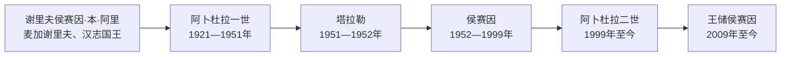

# 约旦哈希姆君主世系与王位继承表

## 时间

1921年至今

## 范围与口径

哈希姆家族自1921年统治外约旦，1946年以后改称国王。本页区分埃米尔、国王、摄政委员会和王储：摄政者代行王权但不是新一任君主，王储是继承人，也不当然拥有共同统治权。王室的政治来源可追溯至麦加谢里夫侯赛因·本·阿里和1916年阿拉伯起义，但侯赛因本人不是约旦君主。

## 约旦全部君主

| 顺序 | 君主 | 生卒 | 称号与在位 | 与前任关系 | 继位、退位或死亡 | 关键事件 |
|---:|---|---|---|---|---|---|
| 1 | **阿卜杜拉一世·本·侯赛因** | 1882—1951年 | 外约旦埃米尔：1921年4月11日—1946年5月25日；外约旦国王：1946年5月25日—1949年4月；约旦国王：1949年4月—1951年7月20日 | 谢里夫侯赛因次子，王朝建立者 | 1946年独立后由埃米尔升为国王；1951年在耶路撒冷遇刺 | 建设行政和阿拉伯军团，参加1948年战争，推动1950年两岸合并。 |
| 2 | 塔拉勒·本·阿卜杜拉 | 1909—1972年 | 国王：1951年7月20日—1952年8月11日 | 阿卜杜拉一世长子 | 父王遇刺后继位；因严重健康问题，由议会依宪制确认退位 | 1952年宪法在其时期颁布。其缺席期间，弟弟纳伊夫曾短暂担任摄政，但未成为国王。 |
| 3 | **侯赛因·本·塔拉勒** | 1935—1999年 | 国王：1952年8月11日—1999年2月7日；1953年5月2日起亲自行使宪法权力 | 塔拉勒长子 | 父王退位后被宣布为国王；未成年阶段由摄政委员会行权；1999年病逝 | 军队阿拉伯化、1967年失去西岸、黑九月、1989年政治开放、1994年和约。 |
| 4 | **阿卜杜拉二世·本·侯赛因** | 1962年至今 | 国王：1999年2月7日至今 | 侯赛因长子 | 1999年1月重新获指定王储，父王去世后继位 | 经济与行政改革、反恐、难民危机、2022年后政治现代化；截至2026年7月13日在位。 |

### 1952—1953年摄政委员会

侯赛因即位时尚未达到宪法规定的18岁。1952年8月11日至1953年5月2日，三人摄政委员会代行王权：

| 成员 | 当时身份或资历 | 说明 |
|---|---|---|
| 易卜拉欣·哈希姆 | 资深政治家、前首相 | 参与维持政府连续性。 |
| 苏莱曼·图坎 | 资深议会与行政人物 | 代表国家机构和地方政治经验。 |
| 阿卜杜勒·拉赫曼·鲁谢达特 | 政治与行政人物 | 共同履行宪法规定的摄政职责。 |

摄政委员会不是集体君主，也没有另开一任；侯赛因的在位起点仍为1952年8月11日，亲政起点则是1953年5月2日。

## 王储完整更替表

| 顺序 | 王储或第一继承人 | 任期 | 由谁指定 / 继承关系 | 变化原因与备注 |
|---:|---|---|---|---|
| 1 | 塔拉勒·本·阿卜杜拉 | 1946年王国成立—1951年7月20日 | 阿卜杜拉一世长子 | 父王遇刺后继位。 |
| 2 | 侯赛因·本·塔拉勒 | 1951年9月9日—1952年8月11日 | 塔拉勒长子 | 被指定后不足一年即因父王退位而继位。 |
| 3 | 穆罕默德·本·塔拉勒 | 1952年8月11日—1962年1月30日 | 侯赛因之弟 | 侯赛因无子时期任王储；阿卜杜拉出生后失去第一顺位。 |
| 4 | 阿卜杜拉·本·侯赛因，即后来的阿卜杜拉二世 | 1962年1月30日—1965年4月1日 | 侯赛因长子，出生即居第一顺位 | 因年幼和当时安全环境，侯赛因改指定成年弟弟哈桑。 |
| 5 | 哈桑·本·塔拉勒 | 1965年4月1日—1999年1月25日 | 侯赛因之弟 | 任王储近34年；侯赛因病重末期调整继承。 |
| 6 | 阿卜杜拉·本·侯赛因 | 1999年1月25日—2月7日 | 侯赛因长子，再次获指定 | 侯赛因去世后继位。 |
| 7 | 哈姆扎·本·侯赛因 | 1999年2月7日—2004年11月28日 | 阿卜杜拉二世异母弟 | 阿卜杜拉继位后指定；2004年解除王储称号。 |
| 8 | 未正式任命王储 | 2004年11月28日—2009年7月2日 | 阿卜杜拉二世长子侯赛因依父系长子原则居第一顺位 | 王储职位空缺不等于没有法定继承顺序。 |
| 9 | **侯赛因·本·阿卜杜拉二世** | 2009年7月2日至今 | 阿卜杜拉二世长子 | 以王家法令正式获任命；截至2026年7月13日为王储。 |

## 继承规则

1952年宪法第28条以阿卜杜拉一世男性后裔的父系继承为主线：

1. 通常由在位国王长子继承，再沿长子男性后裔延续。
2. 国王可在宪法允许范围内指定兄弟为王储，因此侯赛因能在1965年以弟弟哈桑替代年幼长子阿卜杜拉。
3. 若没有符合条件的直系男性后裔或兄弟，国民议会可在谢里夫侯赛因·本·阿里的男性后裔中选择。
4. 未成年国王由摄政者或摄政委员会代行权力；摄政不改变君主顺序。
5. 国王可以在出国或暂时不能履职时指定临时摄政。王储经任命担任摄政时，权力来自该次摄政令，而非王储头衔本身。

## 王储与实际权力

王储是继承制度的核心，但约旦没有制度化“共治王”。哈姆扎在2004年被解除王储时，阿卜杜拉二世曾明确强调王储职位本身不自动带来行政职权。现任王储侯赛因承担军政活动、青年项目、外交代表和未来技术委员会监督等任务，是王位交接准备的一部分；这些职责由国王具体授权，最终权力仍属于在位国王。

2021年哈姆扎事件并未改变正式继承顺序。哈姆扎已不再是王储，侯赛因·本·阿卜杜拉二世仍为第一继承人。

## 王朝延续机制

| 机制 | 作用 | 潜在张力 |
|---|---|---|
| 宗教与家族合法性 | 哈希姆家族以先知家族后裔和阿拉伯起义传统建立象征权威。 | 历史合法性不能自动解决经济、代表性和治理不满。 |
| 父系继承加国王调整权 | 保持世系清楚，也允许在危机时选择成年继承人。 | 1965、1999、2004年的调整显示王储人选仍带有高度个人决定。 |
| 摄政制度 | 未成年或国王离境时维持连续性。 | 需明确区分临时代理与共同统治。 |
| 军队与国家机构 | 保障继位命令执行和行政连续。 | 安全机构权重高会压缩议会与政党角色。 |
| 王储公共职务培养 | 让继承人在继位前积累军政和外交经验。 | 获授权职责不应被误写成独立宪法权力。 |

## 相关笔记

- 建国过程：[奥斯曼边疆与外约旦酋长国](/%E4%BA%BA%E6%96%87%E7%A7%91%E5%AD%A6/%E5%8E%86%E5%8F%B2/%E8%A5%BF%E4%BA%9A/%E9%BB%8E%E5%87%A1%E7%89%B9/%E7%BA%A6%E6%97%A6/%E5%A5%A5%E6%96%AF%E6%9B%BC%E8%BE%B9%E7%96%86%E4%B8%8E%E5%A4%96%E7%BA%A6%E6%97%A6%E9%85%8B%E9%95%BF%E5%9B%BD.md)。
- 独立后政治：[哈希姆王国与现代约旦](/%E4%BA%BA%E6%96%87%E7%A7%91%E5%AD%A6/%E5%8E%86%E5%8F%B2/%E8%A5%BF%E4%BA%9A/%E9%BB%8E%E5%87%A1%E7%89%B9/%E7%BA%A6%E6%97%A6/%E5%93%88%E5%B8%8C%E5%A7%86%E7%8E%8B%E5%9B%BD%E4%B8%8E%E7%8E%B0%E4%BB%A3%E7%BA%A6%E6%97%A6.md)。
- 上级：[约旦](/%E4%BA%BA%E6%96%87%E7%A7%91%E5%AD%A6/%E5%8E%86%E5%8F%B2/%E8%A5%BF%E4%BA%9A/%E9%BB%8E%E5%87%A1%E7%89%B9/%E7%BA%A6%E6%97%A6/README.md)。
