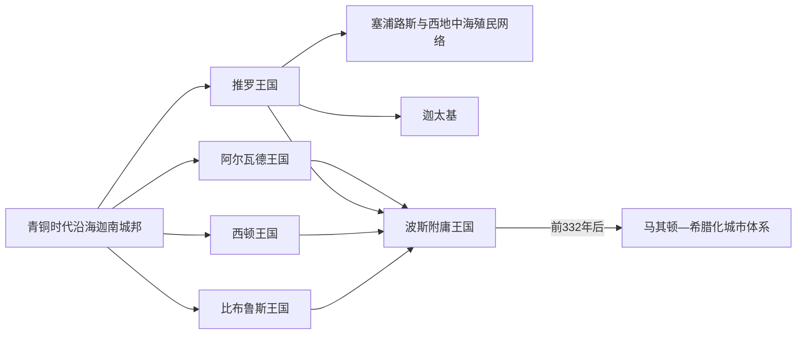

# 腓尼基主要城邦王系表

## 范围与口径

腓尼基不是一个拥有共同王室的统一国家，而是比布鲁斯、西顿、推罗、阿尔瓦德等彼此竞争又共享语言文化的城邦王国。本表按城邦分别列出铁器时代至亚历山大征服前后、由王表传统、同时代铭文、亚述记录或钱币能够辨认的统治者；没有证据的时段明确标作“资料断裂”，不以“若干后王”伪造连续世系。

比布鲁斯王表主要靠王室铭文、亚述贡赋名单和钱币重建；推罗前10—前8世纪顺序来自后世保存的推罗王表，并可在少数节点与亚述记录交叉；西顿波斯时期王系的铭文和钱币证据相对密集。绝对年代仍有不同方案，表中日期均为常见约数。阿尔瓦德和较小城邦只留下零散王名，无法恢复一条公认完整世系，故不把数个孤立名字硬接成王朝。

## 城邦并行关系

## 比布鲁斯已知王系

下表从铁器时代早期列起；更早的里布—哈达、伊利—拉庇等青铜时代君主见[迦南与青铜时代黎凡特](/%E4%BA%BA%E6%96%87%E7%A7%91%E5%AD%A6/%E5%8E%86%E5%8F%B2/%E8%A5%BF%E4%BA%9A/%E9%BB%8E%E5%87%A1%E7%89%B9/%E8%BF%A6%E5%8D%97%E4%B8%8E%E9%9D%92%E9%93%9C%E6%97%B6%E4%BB%A3%E9%BB%8E%E5%87%A1%E7%89%B9.md)。

| 顺序 | 王名 | 约在位 / 活跃时间 | 与前任关系或证据 | 关键说明 |
|---:|---|---|---|---|
| 1 | 扎卡尔—巴力 | 约前11世纪 | 《温阿蒙旅行记》中的比布鲁斯王 | 对埃及使者并非无条件服从，显示埃及宗主权衰退后的城邦自主。 |
| 2 | 阿希拉姆 | 常置于前10世纪；石棺断代有争议 | 王室石棺铭文 | 墓葬铭文是早期腓尼基字母材料之一；王位顺序和绝对年代不能完全确定。 |
| 3 | 伊托巴力 / 皮尔西巴力 | 约前10世纪 | 铭文残片，可能为阿希拉姆之子 | 名称和读法存在争议。 |
| 4 | 耶希米勒克 | 约前10世纪中叶 | 王室建筑铭文 | 自称比布鲁斯王，修建神庙设施。 |
| 5 | 阿比巴力 | 约前10世纪后期 | 耶希米勒克之子 | 向埃及法老形象题铭，显示延续的外交—宗教联系。 |
| 6 | 埃利巴力 | 约前10世纪末 | 耶希米勒克之子、阿比巴力兄弟 | 留有献给“比布鲁斯女神”的铭文。 |
| 7 | 希皮特巴力一世 | 约前9世纪初 | 埃利巴力之子 | 早期王室铭文序列的末端。 |
| 资料断裂 | 王名不详 | 前9—前8世纪中叶 | 亚述记录只称“比布鲁斯王” | 城邦继续纳贡，但王名未保存。 |
| 8 | 希皮特巴力二世 | 前738年前后 | 亚述文献记作西比提比伊尔 | 向提革拉特帕拉沙尔三世纳贡。 |
| 9 | 乌鲁米勒克 | 前701年前后 | 亚述贡赋名单 | 西拿基立西征时纳贡。 |
| 10 | 米勒基亚沙普 | 约前670—前660年代 | 亚述记录 | 奉命提供材料与贡赋，并见于亚述巴尼拔时期记录。 |
| 11 | 耶豪米勒克（较早同名王，归属年代有争议） | 约前7—前6世纪 | 名称与断代不完全确定 | 不能同前5世纪同名王简单合并。 |
| 资料断裂 | 王名不详 | 前6世纪中后期 | 记录不足 | 比布鲁斯先后处于新巴比伦和波斯宗主权下。 |
| 12 | 希皮特巴力三世 | 约前500年 | 波斯时期重建 | 年代主要由铭文与钱币序列推定。 |
| 13 | 乌鲁米勒克二世 | 约前480年 | 王系重建 | 波斯战争时代的附庸王。 |
| 14 | 耶哈巴力 | 约前470年 | 乌鲁米勒克二世之子 | 由王系和铭文重建。 |
| 15 | **耶豪米勒克** | 约前450年 | 耶哈巴力之子 | 长篇奉献铭文记其修建“比布鲁斯女神”圣所，并强调波斯大王恢复其王权。 |
| 16 | 埃尔帕尔 | 约前425年 | 钱币王名 | 钱币仅保存缩写，具体亲属关系不详。 |
| 17 | 奥兹巴力 | 约前400年 | 钱币和谱系材料 | 母为巴特诺阿姆，祭司帕尔提巴力之子；继承关系仍有讨论。 |
| 18 | 乌鲁米勒克三世 | 约前375年 | 钱币王名 | 波斯宗主权下继续铸币。 |
| 19 | **艾内尔（希腊文作恩尼洛斯）** | 前332年前后 | 末期王名 | 亚历山大围攻推罗时支持马其顿军，比布鲁斯王权随后融入希腊化秩序。 |

## 推罗王系

### 前10—前8世纪的传统王表

| 顺序 | 王名 | 约在位时间 | 与前任关系 | 关键事件 / 备注 |
|---:|---|---|---|---|
| 1 | 阿比巴力 | 约前993—981年 | 已知王表起点 | 推罗早期扩张的王室传统人物。 |
| 2 | **希兰一世** | 约前980—947年 | 阿比巴力之子 | 推动港口、神庙与海外贸易；同大卫、所罗门合作的细节主要来自后世文本。 |
| 3 | 巴力—埃塞尔一世 | 约前946—930年 | 希兰一世之子 | 王表连续继承。 |
| 4 | 阿卜达斯塔图斯 | 约前929—921年 | 巴力—埃塞尔一世之子 | 被乳母的儿子们杀死，王朝危机开始。 |
| 5 | 阿斯塔图斯 | 约前920—901年 | 政变集团成员 | 杀死前任后即位。 |
| 6 | 德莱阿斯塔图斯 | 约前900—889年 | 阿斯塔图斯之弟 | 兄弟集团相继统治。 |
| 7 | 阿斯塔里穆斯 | 约前888—880年 | 前任之弟 | 后被佩莱斯杀死。 |
| 8 | 佩莱斯 | 约前879年，约八个月 | 政变夺位 | 被伊托巴力一世杀死。 |
| 9 | **伊托巴力一世** | 约前878—847年 | 祭司出身的篡位者 | 建立新王朝；其女耶洗别与以色列王亚哈联姻，推罗影响扩大。 |
| 10 | 巴力—埃塞尔二世 | 约前846—841年 | 伊托巴力一世之子 | 前841年向亚述撒缦以色三世纳贡，为王表提供外部年代锚点。 |
| 11 | 马坦一世 | 约前840—832年 | 巴力—埃塞尔二世之子 | 皮格马利翁与埃莉萨传统中的父亲。 |
| 12 | **皮格马利翁（普迈）** | 约前831—785年 | 马坦一世之子 | 其在位期同迦太基建立传统相连；故事细节含后世文学加工。 |

### 亚述、新巴比伦与波斯时期

| 顺序 | 王名 / 统治形式 | 约在位时间 | 与前任关系 | 关键事件 / 备注 |
|---:|---|---|---|---|
| 13 | 伊托巴力二世 | 约前750—739年 | 资料断裂后出现 | 向提革拉特帕拉沙尔三世纳贡。 |
| 14 | 希兰二世 | 约前739—730年 | 不详 | 先纳贡，后卷入反亚述活动。 |
| 15 | 马坦二世 | 约前730—729年 | 不详 | 在位极短。 |
| 16 | **埃卢莱奥斯（卢利）** | 前729—694年 | 不详 | 同时控制西顿一段时期；反亚述失败后逃往塞浦路斯。 |
| 17 | 阿卜德—梅尔卡特 | 约前694—680年 | 继承关系不详 | 年代与身份重建存在争议。 |
| 18 | **巴力一世** | 约前680—660年 | 不详 | 先抵抗后臣服亚述巴尼拔，推罗保留岛城自治。 |
| 资料断裂 | 王名不详 | 约前660—591年 | 记录不足 | 亚述衰亡、埃及与新巴比伦竞争。 |
| 19 | 伊托巴力三世 | 约前591—573年 | 不详 | 尼布甲尼撒二世长期围攻推罗时的国王。 |
| 20 | 巴力二世 | 约前573—564年 | 可能由巴比伦承认 | 围城后推罗受新巴比伦宗主权约束。 |
| 21 | 亚金—巴力 | 前564年，约两个月 | 士师制首位已知首席官 | 王权中断后的“士师”或首席官。 |
| 22 | 赫尔贝斯 | 前564—563年，约十个月 | 接任首席官 | 名称由希腊文转写，腓尼基原名不完全确定。 |
| 23 | 阿巴尔 | 前563年，约三个月 | 接任首席官 | 祭司背景。 |
| 24 | 米托努斯、革拉斯特拉图斯 | 约前563—557年，共治 | 阿卜德利穆斯之子 | 两人共同任首席官，须作为共治记录。 |
| 25 | 巴拉托尔 | 约前557—556年 | 接任首席官 | 在位约一年。 |
| 26 | 梅尔巴尔 | 约前556—552年 | 接任；王号或首席官地位有争议 | 后由其兄弟希兰恢复王权。 |
| 27 | **希兰三世** | 约前551—532年 | 梅尔巴尔之兄 | 恢复王号，统治跨新巴比伦灭亡与波斯征服。 |
| 资料断裂 | 王名不详 | 前6世纪末—前5世纪初 | 记录不足 | 推罗成为波斯附庸并向帝国提供海军。 |
| 28 | 马坦四世 | 约前490—480年 | 不详 | 波斯战争时期活动。 |
| 29 | 布洛梅努斯 | 约前450年 | 不详 | 仅零散记载。 |
| 30 | 阿卜德蒙 | 约前420—411年 | 不详 | 同塞浦路斯萨拉米斯政治关系密切，具体王权范围有争议。 |
| 外部控制 | 萨拉米斯的埃瓦戈拉斯一世 | 约前411—374年 | 非推罗本地王系 | 塞浦路斯强权一度控制推罗，不应列作本地世袭国王。 |
| 31 | 埃乌戈拉斯 | 约前4世纪中叶 | 恢复后的本地王名 | 身份和年代资料有限。 |
| 32 | **阿泽米勒科斯** | 约前340—332年 | 末代独立城邦王 | 拒绝亚历山大进入梅尔卡特神庙；前332年围城后王权受马其顿控制。 |

## 西顿王系

### 亚述末期与埃什穆纳扎尔王朝

| 顺序 | 王名 | 约在位时间 | 与前任关系 | 关键事件 / 备注 |
|---:|---|---|---|---|
| 1 | 阿卜迪—米勒库蒂 | 前680—677年 | 此前王系断裂 | 反亚述后被以撒哈顿击败，旧西顿遭毁。 |
| 资料断裂 | 王名不详 | 前677—575年 | 亚述重建与后续宗主更替 | 王权恢复过程不清。 |
| 2 | **埃什穆纳扎尔一世** | 约前575—550年 | 同名王朝建立者 | 兼阿斯塔蒂祭司；可能参与新巴比伦对埃及行动。 |
| 3 | 塔布尼特一世 | 约前549—539年 | 埃什穆纳扎尔一世之子 | 石棺铭文保存其王号与祭司身份。 |
| 摄政 | 阿莫阿斯塔蒂 | 前539年前后至埃什穆纳扎尔二世成年 | 塔布尼特一世的姐妹兼王后、埃什穆纳扎尔二世之母 | 在王子出生前后维持王室连续，后同儿子共理政务。 |
| 4 | **埃什穆纳扎尔二世** | 约前539—525年 | 塔布尼特一世之子 | 少年王；铭文记波斯大王赐予多尔、约帕等沿海领地。 |
| 5 | **博达斯塔蒂** | 约前525—515年 | 塔布尼特的侄子、前王堂兄弟 | 大规模扩建埃什蒙神庙，留下大量奉献铭文。 |
| 6 | 亚顿米勒克 | 约前515—486年 | 博达斯塔蒂之子、曾被立为共同继承人 | 王号见于父子合铭；具体独立在位长度仍有讨论。 |
| 7 | 阿尼索斯 | 约前486—480年 | 关系不详 | 波斯战争前后王系重建人物。 |
| 8 | 特特拉姆涅斯托斯 | 约前480—479年 | 前任后继 | 率西顿舰队参加薛西斯远征希腊。 |

### 巴力沙利姆王朝与波斯末期

| 顺序 | 王名 | 约在位时间 | 与前任关系 | 关键事件 / 备注 |
|---:|---|---|---|---|
| 9 | **巴力沙利姆一世** | 约前450—426年 | 新王朝建立者 | 西顿独立铸币序列展开。 |
| 10 | 阿卜达蒙 | 前425年以后 | 巴力沙利姆一世之子 | 钱币缩写保存王名，结束年不详。 |
| 11 | 巴阿纳 | 不详—前401年 | 阿卜达蒙后继 | 钱币和王系铭文可辨，精确登位年不详。 |
| 12 | **巴力沙利姆二世** | 前401—366年 | 巴阿纳后继 | 在位钱币标注年次，为后续绝对年代提供基础。 |
| 13 | 阿卜达斯塔蒂一世（斯特拉通一世） | 前365—352年 | 巴力沙利姆二世之子 | 对希腊世界交往密切；晚期权力可能同继承人重叠。 |
| 14 | **泰内斯（塔布尼特二世）** | 前351—347 / 346年 | 前任近亲或共同继承人 | 领导反波斯起义，失败后被阿尔塔薛西斯三世处死，西顿遭严重破坏。 |
| 15 | 萨拉米斯的埃瓦戈拉斯二世 | 前346—343年 | 波斯王任命的塞浦路斯统治者 | 属外部册立，不是本地王朝正常继承。 |
| 16 | 阿卜达斯塔蒂二世（斯特拉通二世） | 前342—333年 | 王系关系不详 | 波斯末期国王；亚历山大到来时失位。 |
| 17 | **阿卜达洛尼穆斯** | 前332—312年 | 马其顿方面另立 | 出身王族旁支的传统人物；在希腊化宗主权下统治，已不再是独立附庸王国。 |

## 王系使用说明

- 同名王、希腊文转写和腓尼基原名常不一致，表中保留常见中文译名，并在必要处列别名。
- 文献中“西顿人之王”有时可由推罗王使用，不能据此推断两城长期统一。
- 波斯帝国通常保留地方王室，以贡赋、海军和忠诚换取自治；叛乱则会导致废立、毁城或外部册立。
- 钱币、石棺和神庙铭文常强调王的祭司身份、建造功业和神祇保护，它们提供王名，却不一定交代完整继承过程。

## 演变关系

- 城邦政治、航海贸易和帝国关系见[腓尼基城邦](/%E4%BA%BA%E6%96%87%E7%A7%91%E5%AD%A6/%E5%8E%86%E5%8F%B2/%E8%A5%BF%E4%BA%9A/%E9%BB%8E%E5%87%A1%E7%89%B9/%E8%85%93%E5%B0%BC%E5%9F%BA%E5%9F%8E%E9%82%A6.md)。
- 青铜时代前史见[迦南与青铜时代黎凡特](/%E4%BA%BA%E6%96%87%E7%A7%91%E5%AD%A6/%E5%8E%86%E5%8F%B2/%E8%A5%BF%E4%BA%9A/%E9%BB%8E%E5%87%A1%E7%89%B9/%E8%BF%A6%E5%8D%97%E4%B8%8E%E9%9D%92%E9%93%9C%E6%97%B6%E4%BB%A3%E9%BB%8E%E5%87%A1%E7%89%B9.md)。
- 帝国宗主权变化见[亚述、巴比伦与波斯统治下的黎凡特](/%E4%BA%BA%E6%96%87%E7%A7%91%E5%AD%A6/%E5%8E%86%E5%8F%B2/%E8%A5%BF%E4%BA%9A/%E9%BB%8E%E5%87%A1%E7%89%B9/%E4%BA%9A%E8%BF%B0%E3%80%81%E5%B7%B4%E6%AF%94%E4%BC%A6%E4%B8%8E%E6%B3%A2%E6%96%AF%E7%BB%9F%E6%B2%BB%E4%B8%8B%E7%9A%84%E9%BB%8E%E5%87%A1%E7%89%B9.md)。
- 上级入口：[黎凡特](/%E4%BA%BA%E6%96%87%E7%A7%91%E5%AD%A6/%E5%8E%86%E5%8F%B2/%E8%A5%BF%E4%BA%9A/%E9%BB%8E%E5%87%A1%E7%89%B9/README.md)。
