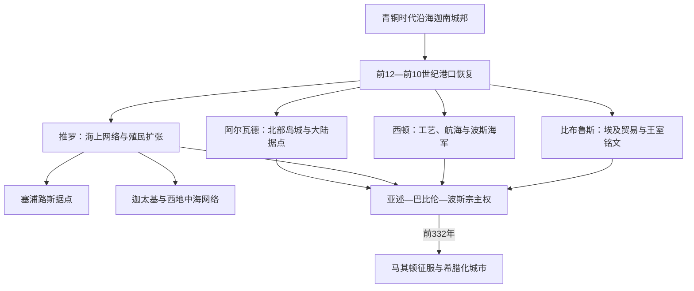

# 腓尼基城邦

## 时间

约前12世纪—前332年；其语言、城市与海外社群在希腊化、罗马及更晚时期仍有延续。

## 概括

腓尼基是希腊人对东地中海北部沿海若干城市及其居民的称呼。比布鲁斯、西顿、推罗、阿尔瓦德并未组成统一“腓尼基帝国”，而是各有王室、神庙、港口、腹地和外交路线的城邦。它们承续青铜时代沿海迦南的语言与城市传统，在约前1200年宫殿体系崩溃后重组贸易网络，并在塞浦路斯、北非、撒丁、西西里和伊比利亚建立商站与殖民城市。

腓尼基城邦的优势来自航海技术、港口位置、木材、纺织与紫色染料、金属和奢侈品转运，以及适合商业记账和铭刻的线性字母。它们的“扩张”多数不是由一支中央军队征服连续领土，而是由王室、商人、移民和地方伙伴建立分散节点。城邦长期在亚述、新巴比伦和波斯宗主权下保持不同程度自治，前332年亚历山大攻陷推罗后，独立王国体系逐步转入希腊化城市秩序。

## 演变图

## 建立背景

晚期青铜时代贸易和大国附庸体系危机中，乌加里特等北方宫殿中心毁灭，埃及退出多数亚洲据点。推罗、西顿、比布鲁斯等城市却具有不同程度的聚落和文化连续性。旧宫廷贸易缩小后，港口社群以更灵活的船运、家族商业和城邦外交重新连接塞浦路斯、爱琴海、埃及与内陆。

“腓尼基人”不是某一天迁入海岸的新民族。其语言、宗教和工艺同迦南传统相连，同时在铁器时代的政治竞争和海外活动中形成更鲜明的城市身份。居民首先常以“推罗人”“西顿人”或具体家族、神庙和社群自称；共同语言文化不等于共同国家。

## 主要城邦与统治结构

| 城邦 | 政治与经济特点 | 关键阶段 |
|---|---|---|
| 比布鲁斯 | 同埃及木材、宗教和奢侈品交换传统深厚；王室铭文保存早期字母材料 | 前10世纪仍重要，后在西顿、推罗竞争与帝国宗主权下相对收缩 |
| 西顿 | 拥有港口、工艺和舰队；波斯时期一度居腓尼基诸城之首 | 前677年被亚述毁后重建；前4世纪反波斯起义失败又遭毁城 |
| 推罗 | 岛城防御强，控制部分大陆腹地，王室和商人网络向西扩张 | 前10—前8世纪兴盛；历经亚述和巴比伦围攻，前332年被亚历山大攻陷 |
| 阿尔瓦德 | 北部岛城，依靠大陆据点、航海与叙利亚内陆通道 | 多次向亚述纳贡，波斯时期同其他腓尼基城邦提供海军 |
| 贝鲁特等较小城市 | 在大城邦势力范围与帝国行政之间调整 | 希腊化、罗马时期部分城市地位上升 |

城邦通常由国王统治，王室同神庙祭司、贵族家族、商人和船队指挥者共享资源。王既是外交和军事首脑，也通过建造神庙、主持祭祀和控制港口体现合法性。推罗在新巴比伦压力下曾短暂采用“士师”或首席官共治，说明君主制并非始终不变。各城邦可彼此结盟、竞争或一度由强城主导，但没有稳定的全腓尼基中央机构。

主要城邦的逐王顺序、短期统治、共治与资料断裂见[腓尼基主要城邦王系表](/%E4%BA%BA%E6%96%87%E7%A7%91%E5%AD%A6/%E5%8E%86%E5%8F%B2/%E8%A5%BF%E4%BA%9A/%E9%BB%8E%E5%87%A1%E7%89%B9/%E8%85%93%E5%B0%BC%E5%9F%BA%E4%B8%BB%E8%A6%81%E5%9F%8E%E9%82%A6%E7%8E%8B%E7%B3%BB%E8%A1%A8.md)。

## 航海贸易与殖民网络

腓尼基船队运输黎巴嫩山地木材、葡萄酒、橄榄油、紫色染料、纺织品、玻璃器、象牙和金属制品，也转运埃及、塞浦路斯、安纳托利亚和两河商品。紫色染料由骨螺加工，利润高但气味、劳力和沿海资源消耗都很大。木材贸易依赖山地社群和内陆交通，不是港口单独完成。

海外扩展通常分为商季停靠点、商站、混合社区和较稳定殖民城市。当地人并非被一律替代，腓尼基商人与塞浦路斯、北非、伊比利亚等地社会通过婚姻、贸易和政治协议形成混合网络。迦太基传统上由推罗移民于前9世纪建立，后来发展为独立的西地中海强国；它不是推罗可从东方长期直接指挥的“海外行省”。

殖民的动力包括寻找金银、铜、锡和农业产品，控制航线与补给点，人口和精英冲突，以及在亚述贡赋压力下扩展收入来源。不同殖民地的建立年代和母城关系常有争议，不能把所有带腓尼基器物的遗址都解释为大规模移民。

## 字母、语言与文化

腓尼基字母由更早的迦南线性文字传统发展而来，以辅音符号为主。其标准化形式适合在木材、陶片、金属和石碑上书写，随商贸和殖民网络传播。希腊人吸收并改造该体系，增加表达元音的用法；此后希腊字母又影响拉丁等文字。腓尼基人的贡献是长期传播与适应，而不是某位个人突然“发明世界上第一个字母”。

各城拥有地方主神和祭仪：推罗的梅尔卡特、西顿的埃什蒙与阿斯塔蒂、比布鲁斯的“城之女神”等同王权紧密相连。神庙是宗教中心，也可拥有土地、储藏、工匠和外交象征功能。语言文化具有共同性，祭祀和政治身份却保持地方差异。

## 分阶段发展

### 前12—前10世纪：恢复与城市竞争

海岸城市在青铜时代危机后恢复航运。比布鲁斯仍同埃及保持特殊关系，西顿和推罗逐渐扩大区域贸易。推罗岛城安全、港口条件和大陆木材来源使其在前10世纪提升地位。希兰一世的建筑与商业传统反映王室组织港口和外交的能力，但具体年代和同所罗门合作的细节主要依赖后世文献。

### 前9—前8世纪：海外网络与亚述逼近

推罗王室同北方以色列联姻，塞浦路斯与西地中海据点增加。前853年，西顿和阿尔瓦德等力量参与反亚述联盟；随后城邦更多采取纳贡换自治。贡赋、海军和商业收入让亚述愿意保留地方王室，但反叛会招致围城、废立和腹地剥夺。

### 前7—前6世纪：围城、迁徙与宗主更替

前677年，以撒哈顿摧毁反叛的西顿并重组其领土。推罗凭岛城防御多次抵抗，却逐渐失去大陆据点。尼布甲尼撒二世约在前586—前573年长期围攻推罗；城未被彻底摧毁，但王权和贸易受巴比伦约束。宗主权变动促使部分商人和海外城市更自主，迦太基的西地中海中心地位上升。

### 前539—前332年：波斯附庸王国

阿契美尼德波斯征服巴比伦后保留四大腓尼基王国，以地方王室管理税收、神庙和城市，要求提供舰队、贡赋与军事协助。西顿一度成为波斯地中海海军重镇，王室获得沿海领地并扩建圣所。前4世纪，泰内斯领导西顿反波斯起义，失败后被处死，城市遭严重破坏。

前334年亚历山大进入小亚细亚后，阿尔瓦德、比布鲁斯和西顿先后转向马其顿。推罗拒绝亚历山大进入岛上梅尔卡特圣所，试图保持中立和自治。亚历山大利用旧大陆城废墟筑堤，经约七个月围攻于前332年破城；大量居民被杀、被卖或流离，岛城此后与大陆相连。推罗仍作为重要城市复苏，但独立王权和旧式城邦外交空间终结。

## 重要事件

| 时间 | 事件 | 过程与影响 |
|---|---|---|
| 约前12世纪 | 沿海城市在青铜时代危机后重组 | 城市传统延续，贸易从大宫殿体系转向更分散网络。 |
| 约前10世纪 | 推罗在希兰一世传统下扩张 | 港口、神庙、木材与区域外交推动推罗崛起。 |
| 前9—前8世纪 | 西地中海据点扩大 | 迦太基等城市形成，母城关系逐步由依附转向自主。 |
| 前853年 | 卡尔卡反亚述联盟 | 阿尔瓦德等黎凡特力量参与，亚述西进暂受阻。 |
| 前841年以后 | 多城向亚述纳贡 | 地方王室以贡赋、船只和物资换取有限自治。 |
| 前701年 | 西拿基立西征 | 西顿王逃亡，推罗腹地被削弱，多个城邦重新纳贡。 |
| 前677年 | 亚述摧毁西顿 | 反叛失败，人口、城市和领土被重组，后又恢复。 |
| 约前586—573年 | 新巴比伦围攻推罗 | 岛城未被彻底攻毁但受制于巴比伦，王权一度转为士师制。 |
| 前539年以后 | 纳入波斯帝国 | 城邦王室保留，腓尼基舰队成为波斯海军核心。 |
| 前4世纪中叶 | 西顿反波斯起义 | 起义失败、泰内斯被处死，西顿遭毁，王权由波斯重组。 |
| 前332年 | 亚历山大攻陷推罗 | 筑堤改变海岸地形，独立城邦体系转入希腊化统治。 |

## 鼎盛、衰落与转型原因

| 类型 | 具体因素 | 作用 |
|---|---|---|
| 崛起条件 | 港口与岛城地形、木材和工艺、航海知识、跨文化商人网络 | 让狭窄沿海城邦能以贸易而非大面积农业维持财富与影响 |
| 制度条件 | 王室、神庙、商人和船队合作 | 集中高价值资源，同时允许海外节点较灵活经营 |
| 传播优势 | 字母书写、语言共同性、殖民与混合社群 | 降低跨地区交易和身份维持成本 |
| 结构弱点 | 城邦彼此竞争、腹地狭窄、粮食和木材依赖内陆 | 难以形成统一陆军抵抗帝国，也容易被切断大陆资源 |
| 外部压力 | 亚述、巴比伦、波斯的贡赋和舰队征用 | 保留自治的同时消耗资源，并让废立取决于帝国政治 |
| 直接触发 | 西顿反叛失败、推罗拒绝亚历山大要求并被围攻 | 导致具体城市毁灭或王权终结 |
| 长期转型 | 迦太基崛起、希腊竞争、希腊化行政和文化融合 | 海外腓尼基文化继续发展，东方城邦却不再是独立国际行为者 |

腓尼基的“衰落”不是居民、语言或城市在前332年突然消失。推罗、西顿、比布鲁斯继续在希腊化和罗马世界繁荣，腓尼基语与宗教传统也延续；变化的是独立王权、帝国间外交和由东方母城主导的海上网络。

## 演变关系

- 前置节点：[迦南与青铜时代黎凡特](/%E4%BA%BA%E6%96%87%E7%A7%91%E5%AD%A6/%E5%8E%86%E5%8F%B2/%E8%A5%BF%E4%BA%9A/%E9%BB%8E%E5%87%A1%E7%89%B9/%E8%BF%A6%E5%8D%97%E4%B8%8E%E9%9D%92%E9%93%9C%E6%97%B6%E4%BB%A3%E9%BB%8E%E5%87%A1%E7%89%B9.md)。
- 同期内陆政权：[以色列王国与犹大王国](/%E4%BA%BA%E6%96%87%E7%A7%91%E5%AD%A6/%E5%8E%86%E5%8F%B2/%E8%A5%BF%E4%BA%9A/%E9%BB%8E%E5%87%A1%E7%89%B9/%E4%BB%A5%E8%89%B2%E5%88%97%E7%8E%8B%E5%9B%BD%E4%B8%8E%E7%8A%B9%E5%A4%A7%E7%8E%8B%E5%9B%BD.md)。
- 亚述、新巴比伦和波斯宗主权：[亚述、巴比伦与波斯统治下的黎凡特](/%E4%BA%BA%E6%96%87%E7%A7%91%E5%AD%A6/%E5%8E%86%E5%8F%B2/%E8%A5%BF%E4%BA%9A/%E9%BB%8E%E5%87%A1%E7%89%B9/%E4%BA%9A%E8%BF%B0%E3%80%81%E5%B7%B4%E6%AF%94%E4%BC%A6%E4%B8%8E%E6%B3%A2%E6%96%AF%E7%BB%9F%E6%B2%BB%E4%B8%8B%E7%9A%84%E9%BB%8E%E5%87%A1%E7%89%B9.md)。
- 亚历山大征服后的阶段：[希腊化与罗马时期的黎凡特](/%E4%BA%BA%E6%96%87%E7%A7%91%E5%AD%A6/%E5%8E%86%E5%8F%B2/%E8%A5%BF%E4%BA%9A/%E9%BB%8E%E5%87%A1%E7%89%B9/%E5%B8%8C%E8%85%8A%E5%8C%96%E4%B8%8E%E7%BD%97%E9%A9%AC%E6%97%B6%E6%9C%9F%E7%9A%84%E9%BB%8E%E5%87%A1%E7%89%B9.md)。
- 现代黎巴嫩地区的更长时段对读：[腓尼基、山地社群与奥斯曼黎巴嫩](/%E4%BA%BA%E6%96%87%E7%A7%91%E5%AD%A6/%E5%8E%86%E5%8F%B2/%E8%A5%BF%E4%BA%9A/%E9%BB%8E%E5%87%A1%E7%89%B9/%E9%BB%8E%E5%B7%B4%E5%AB%A9/%E8%85%93%E5%B0%BC%E5%9F%BA%E3%80%81%E5%B1%B1%E5%9C%B0%E7%A4%BE%E7%BE%A4%E4%B8%8E%E5%A5%A5%E6%96%AF%E6%9B%BC%E9%BB%8E%E5%B7%B4%E5%AB%A9.md)。
- 上级入口：[黎凡特](/%E4%BA%BA%E6%96%87%E7%A7%91%E5%AD%A6/%E5%8E%86%E5%8F%B2/%E8%A5%BF%E4%BA%9A/%E9%BB%8E%E5%87%A1%E7%89%B9/README.md)。
