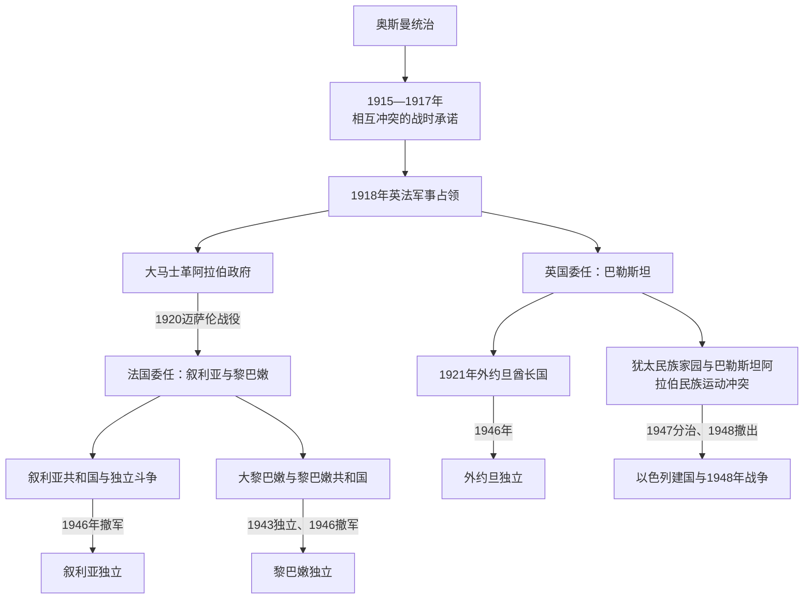

# 英法委任统治时期

## 时间

1918—1948年；法国军队于1946年撤出叙利亚、黎巴嫩，英国于1948年结束巴勒斯坦委任统治。

## 概括

第一次世界大战后，奥斯曼黎凡特没有直接形成一组自然边界的民族国家。英国、法国、费萨尔领导的阿拉伯政府、地方精英、锡安主义机构、巴勒斯坦阿拉伯运动、哈希姆家族和宗派社群围绕主权、边界和代表权竞争。圣雷莫会议与国际联盟委任状把叙利亚、黎巴嫩交法国，把巴勒斯坦和外约旦交英国；“委任统治”以协助自治为法理，却由欧洲列强掌握军队、外交、财政和最终立法权，是殖民统治的新形式。

法国以分设大黎巴嫩、大马士革、阿勒颇、阿拉维和德鲁兹等实体控制叙利亚，1925—1927年大起义遭轰炸镇压；此后通过宪法、议会和条约谈判逐步让渡权力。英国在巴勒斯坦同时承担发展“犹太民族家园”和保护非犹太居民权利的相互紧张责任，却未承认巴勒斯坦阿拉伯人的同等民族政治机构。犹太移民、土地转移、平行国家机构、阿拉伯反抗、英国政策摇摆和纳粹大屠杀共同把冲突推向分治与战争。

外约旦1921年起由阿卜杜拉埃米尔治理，在英国财政、顾问和阿拉伯军团支持下形成国家；黎巴嫩以1920年“大黎巴嫩”边界和1926年共和国宪法走向1943年独立；叙利亚在法国分治、统一和反殖民斗争中于1946年取得完全撤军。1948年英国撤出时，巴勒斯坦没有完成双方共享的继承政府，内战已转为以色列建国、巴勒斯坦人大规模流离失所和阿拉伯国家介入。

## 演变图

## 战时承诺与占领

### 侯赛因—麦克马洪通信

1915—1916年，英国埃及高级专员麦克马洪同麦加谢里夫侯赛因通信，讨论阿拉伯人反奥斯曼起义与战后独立。双方对叙利亚沿海、巴勒斯坦及边界排除条款理解不同，文本没有绘出双方一致的详细地图。阿拉伯民族主义者据此期待大范围独立，英国后来强调保留和含混；争议不能用一句“英国明确承诺整个巴勒斯坦”或“从未承诺任何独立”概括。

### 赛克斯—皮科与贝尔福宣言

1916年英法秘密赛克斯—皮科协定规划直接控制区、势力范围和巴勒斯坦国际安排，同公开的阿拉伯独立期待冲突。1917年贝尔福宣言支持在巴勒斯坦建立“犹太民族家园”，同时称不得损害当地非犹太社群的公民和宗教权利，却没有承认这些占人口多数社群的民族政治权利。三套文件服务不同战争联盟，战后被拼入新的殖民秩序。

### 军事占领与费萨尔政府

1918年奥斯曼撤退后，占领区军事行政大致分为英国控制的南部、法国控制的沿海西部和费萨尔—阿拉伯军参与治理的东部内陆。费萨尔在大马士革建立阿拉伯政府，吸收前奥斯曼官员、民族主义社团和地方精英。1919年叙利亚总会讨论独立、君主制和边界，1920年3月叙利亚国民大会宣布费萨尔为“大叙利亚”国王。

圣雷莫会议把叙利亚委任权交法国。法国将军古罗要求解除军队并接受委任安排；战争大臣优素福·阿兹迈拒绝无抵抗交出，1920年7月24日在迈萨伦战死。法军进入大马士革，费萨尔王国终结。其短命不是因为当地没有国家构想，而是国际承认、财政、军力和行政控制均不足以抵抗法国。

## 委任统治的法理与实际结构

国际联盟委任状把原奥斯曼领土列为“A类委任”，理论上认为其已具备暂时独立资格、由委任国提供行政援助。实际上：

| 层级 | 法定说法 | 实际权力 |
|---|---|---|
| 国际联盟 | 监督委任国履行条款，审查年度报告和请愿 | 无常备强制力，主要依赖委任国提供资料 |
| 英法政府 | 以受托者身份准备自治 | 决定外交、军队、边界、货币、关税和高级任命 |
| 高级专员 | 代表委任国 | 可否决法律、解散议会、宣布紧急状态和调动军警 |
| 地方总统、埃米尔、内阁和议会 | 负责日常行政并逐步积累合法性 | 权限因地区不同，受顾问、预算、条约和高级专员限制 |
| 地方社群与政党 | 选举、请愿、罢工和组织社会 | 在镇压、分治制度和代表权不平等中争取主权 |

委任统治不是中立的技术过渡。道路、学校、卫生和法典建设确有发生，却服务于边界控制、税收、军事和差异化代表制度；地方人承担成本并持续争论发展资源的分配。

## 法国委任统治：分治、起义与独立

### 国家分设与“大黎巴嫩”

古罗1920年宣布建立“大黎巴嫩”，把黎巴嫩山穆塔萨里夫领同贝鲁特、的黎波里、赛达、贝卡等地合并，使新国家拥有港口和农业区，也纳入大量逊尼派、什叶派、德鲁兹和希腊正教人口。马龙派部分领袖支持扩大和法国保护，其他社群对脱离叙利亚、宗派代表与经济方向看法不同。

法国同时建立大马士革国、阿勒颇国、阿拉维领地和德鲁兹山地区，并把亚历山大勒塔置于特殊安排。1922年大马士革、阿勒颇和阿拉维组成叙利亚邦联，1925年大马士革与阿勒颇合并为叙利亚国，阿拉维和德鲁兹地区仍一度分设。分区既利用地方差异，也服务于削弱统一民族运动和部署军队。

### 大叙利亚起义

1925年法国官员拘押德鲁兹领袖后，苏丹·阿特拉什领导起义从德鲁兹山扩展到大马士革、古塔、哈马等地。民族主义城市网络、乡村武装和地方首领合作，但目标、组织和补给并不完全统一。法国动用塞内加尔、北非等殖民部队、装甲、空军和集体惩罚，1925年炮击大马士革，造成平民死亡和城区破坏。到1927年主要武装被压制，反殖民民族政治却更广泛。

### 宪政与条约

叙利亚民族集团从持续武装转向罢工、选举和谈判。1936年总罢工迫使法国谈判独立条约，法国承诺逐步撤军并让阿拉维、德鲁兹地区并入叙利亚；法国议会没有批准条约。1938—1939年亚历山大勒塔在法国、土耳其协议和争议选举后成为哈塔伊并入土耳其，叙利亚民族主义者视为领土被让渡。

黎巴嫩1926年建立共和国和宪法，法国高级专员仍可暂停宪政。1932年人口普查及其宗派比例后来成为议席分配依据，长期不再全面普查。1943年比沙拉·胡里与里亚德·苏勒赫推动“国民公约”式平衡，议会删除法国特权条文；法国逮捕总统、总理和部长，引发全国抗议及英美压力，11月22日获释，成为独立纪念节点。

### 二战与撤军

1940年法国战败后，黎凡特由维希当局控制。1941年英军与自由法国进攻叙利亚、黎巴嫩，自由法国宣布承认独立原则却继续保留军政权。叙利亚1943年恢复选举，舒克里·库瓦特利任总统。1945年法国军轰击大马士革并同叙利亚部队冲突，在英国干预和国际压力下停火。最后法军1946年4月撤出叙利亚，随后撤离黎巴嫩，完全委任统治结束。

## 英国委任巴勒斯坦

### 双重义务与平行机构

英国把贝尔福宣言写入委任状，承认犹太人同巴勒斯坦的历史联系并支持民族家园，同时承诺保护所有居民权利。犹太机构获得移民、教育、土地、工会、卫生和代表组织的发展空间：犹太事务局、犹太国民委员会、总工会和哈加纳逐步形成准国家网络。

巴勒斯坦阿拉伯人占人口多数，却未获得一个被英国承认为同等民族政府的机构。最高穆斯林委员会管理宗教基金和法院，地方名流、政党、妇女组织、工会和阿拉伯高级委员会参与政治；侯赛尼、纳沙希比等家族竞争及英国废立削弱统一代表，但不能据此说巴勒斯坦阿拉伯民族意识不存在。

### 移民、土地与冲突

犹太移民波次受到东欧迫害、锡安主义组织、经济机会和后来纳粹大屠杀推动。土地多经合法买卖取得，出售者可能是本地或外居地主；佃农被逐、只雇用犹太劳工和土地价格上涨使阿拉伯农村承受现实损失。合法契约不自动消除社会和民族冲突。

1920年耶路撒冷、1921年雅法和1929年西墙争议引发暴力。1929年在希伯伦等地犹太人被杀，同时英军警镇压阿拉伯暴动；古老犹太社群受到毁灭性打击。调查委员会在移民吸纳能力、土地无地化和民族诉求间提出不同政策，英国却反复调整。

### 1936—1939年阿拉伯大起义

1936年罢工、拒税和游击战要求终止移民、禁止土地转移并建立民族政府。阿拉伯高级委员会组织最初阶段，后续武装在乡村和城市活动。英国引入大军、集体惩罚、拆屋、拘留和军事法，并同犹太辅助警察、哈加纳合作；阿拉伯领导层被流放、监禁或分裂，军事和政治组织遭严重削弱。

1937年皮尔委员会首次正式建议分治，因边界、人口转移和双方反对未实施。1939年白皮书限制五年内移民，之后须阿拉伯同意，并提出十年内建立独立巴勒斯坦；锡安主义运动认为它在大屠杀前夕背弃民族家园，阿拉伯方面又不信任英国且反对未立即独立。

### 二战后崩溃

大屠杀杀害约六百万欧洲犹太人，使幸存者安置和国家诉求具有空前紧迫性。英国限制移民，犹太地下组织进行非法移民、破坏和袭击；伊尔贡与莱希采用更激进暴力，哈加纳在合作与反英间调整。1946年大卫王酒店爆炸等事件、驻军成本和英美分歧削弱英国意愿。

英国1947年把问题交联合国。联合国大会第181号决议建议建立犹太国和阿拉伯国，耶路撒冷国际化。犹太事务局接受作为建国依据，阿拉伯高级委员会和阿拉伯国家反对，认为在多数人口未同意时分配土地不公。决议没有自行建立国家或军队，1947年末即爆发委任统治地内战。

1948年5月14日英国撤出前夕，以色列宣布建国。犹太军在战争中占领分治方案外部分地区，巴勒斯坦阿拉伯社会在战斗、驱逐、恐慌和领导崩解中出现大规模难民；5月15日阿拉伯国家军队介入，战争转为国际冲突。巴勒斯坦阿拉伯国未按分治方案建立。

## 外约旦酋长国与独立

1921年阿卜杜拉进入安曼，英国希望既履行哈希姆安排又稳定叙利亚—巴勒斯坦东部。开罗会议后建立外约旦酋长国，埃米尔主持地方政府，英国高级专员和驻安曼代表控制补助、外交和安全。1922年英国把约旦河以东排除在犹太民族家园相关条款适用之外，1923年承认一个仍受英国监督的外约旦政府。

阿拉伯军团由英国军官、地方兵和埃米尔权威共同建设，格拉布帕夏后来成为核心指挥。国家收入有限，依赖英国补助，却通过部落协商、警察、道路和官僚逐步控制领土。1928年条约承认一定自治但保留英国特权；第二次世界大战中外约旦支持英国。1946年条约确认独立，阿卜杜拉成为国王，英国军事影响仍持续。

完整君主与继承见[约旦哈希姆君主世系与王位继承表](/%E4%BA%BA%E6%96%87%E7%A7%91%E5%AD%A6/%E5%8E%86%E5%8F%B2/%E8%A5%BF%E4%BA%9A/%E9%BB%8E%E5%87%A1%E7%89%B9/%E7%BA%A6%E6%97%A6/%E7%BA%A6%E6%97%A6%E5%93%88%E5%B8%8C%E5%A7%86%E5%90%9B%E4%B8%BB%E4%B8%96%E7%B3%BB%E4%B8%8E%E7%8E%8B%E4%BD%8D%E7%BB%A7%E6%89%BF%E8%A1%A8.md)。

## 委任统治行政首脑

### 英国驻巴勒斯坦高级专员

高级专员兼最高行政长官，对殖民部负责；外约旦在制度分离后由埃米尔政府和英国驻地代表治理，高级专员仍承担委任国代表的部分职能，但不应把其写成外约旦日常政府首脑。

| 顺序 | 高级专员 | 任期 | 主要政策与事件 |
|---:|---|---|---|
| 1 | **赫伯特·塞缪尔** | 1920年7月—1925年6月 | 首任犹太裔高级专员；建立文官行政、移民和土地制度，任内发生1920、1921年冲突。 |
| 2 | 赫伯特·普卢默 | 1925年8月—1928年7月 | 军人出身，整顿警务和行政，相对稳定。 |
| 3 | 约翰·钱塞勒 | 1928年12月—1931年11月 | 经历1929年西墙争议与暴力，支持重新审视土地和移民政策。 |
| 4 | **阿瑟·沃科普** | 1931年11月—1938年3月 | 移民快速增长、1936年起义和皮尔分治调查时期。 |
| 5 | 哈罗德·麦克迈克尔 | 1938年3月—1944年8月 | 镇压起义、执行1939年白皮书和战时管制。 |
| 6 | 戈特勋爵 | 1944年10月—1945年11月 | 二战末期，因健康离任；犹太地下武装活动上升。 |
| 7 | **艾伦·坎宁安** | 1945年11月—1948年5月 | 英国撤离、联合国分治与内战时期的末任高级专员。 |

### 法国驻黎凡特最高专员 / 自由法国总代表

| 顺序 | 最高专员 / 总代表 | 任期 | 主要事项 |
|---:|---|---|---|
| 1 | **亨利·古罗** | 1919—1922年 | 击败费萨尔王国，建立大黎巴嫩并分设叙利亚实体。 |
| 代理 | 罗贝尔·德凯 | 1922—1923年 | 代理处理邦联与委任制度落地。 |
| 2 | 马克西姆·魏刚 | 1923—1924年 | 委任统治正式生效后的军政整合。 |
| 3 | 莫里斯·萨拉伊 | 1924—1925年 | 强硬世俗派，任内大叙利亚起义爆发。 |
| 4 | 亨利·德茹弗内尔 | 1925—1926年 | 在镇压与宪政安排间调整，黎巴嫩1926年立宪。 |
| 5 | 奥古斯特·蓬索 | 1926—1933年 | 监督叙利亚、黎巴嫩议会和共和国制度，保留法国最终权力。 |
| 6 | 达米安·德马泰尔 | 1933—1939年 | 1936年独立条约谈判与未批准阶段。 |
| 7 | 加布里埃尔·皮奥 | 1939—1940年 | 二战初期暂停部分宪政。 |
| 8 | 亨利·登茨 | 1940—1941年 | 维希法国最高专员，1941年英军—自由法国战役后离任。 |
| 9 | 乔治·卡特鲁 | 1941—1943年 | 自由法国代表，宣布承认独立原则但仍保留军权。 |
| 10 | 让·埃勒 | 1943年 | 逮捕黎巴嫩总统、总理等，引发独立危机后被撤。 |
| 11 | 伊夫·沙泰尼奥 | 1943—1946年 | 负责独立承认、权力移交和最终撤军。 |

叙利亚、黎巴嫩本地国家元首和政府首脑另见[叙利亚国家元首与政府首脑表](/%E4%BA%BA%E6%96%87%E7%A7%91%E5%AD%A6/%E5%8E%86%E5%8F%B2/%E8%A5%BF%E4%BA%9A/%E9%BB%8E%E5%87%A1%E7%89%B9/%E5%8F%99%E5%88%A9%E4%BA%9A/%E5%8F%99%E5%88%A9%E4%BA%9A%E5%9B%BD%E5%AE%B6%E5%85%83%E9%A6%96%E4%B8%8E%E6%94%BF%E5%BA%9C%E9%A6%96%E8%84%91%E8%A1%A8.md)与[黎巴嫩山统治者、总督与共和国领导人表](/%E4%BA%BA%E6%96%87%E7%A7%91%E5%AD%A6/%E5%8E%86%E5%8F%B2/%E8%A5%BF%E4%BA%9A/%E9%BB%8E%E5%87%A1%E7%89%B9/%E9%BB%8E%E5%B7%B4%E5%AB%A9/%E9%BB%8E%E5%B7%B4%E5%AB%A9%E5%B1%B1%E7%BB%9F%E6%B2%BB%E8%80%85%E3%80%81%E6%80%BB%E7%9D%A3%E4%B8%8E%E5%85%B1%E5%92%8C%E5%9B%BD%E9%A2%86%E5%AF%BC%E4%BA%BA%E8%A1%A8.md)；殖民行政首脑和地方职位不能混在同一世系。

## 重要事件

| 时间 | 事件 | 结果 |
|---|---|---|
| 1915—1917年 | 侯赛因—麦克马洪、赛克斯—皮科、贝尔福宣言 | 形成相互冲突和含混的战后主权期待。 |
| 1918年 | 英法与阿拉伯部队进入黎凡特 | 奥斯曼主权终结，军事占领区建立。 |
| 1920年3月 | 费萨尔被宣布为叙利亚国王 | 大马士革政府尝试建立独立国家。 |
| 1920年4—7月 | 圣雷莫与迈萨伦战役 | 法国以军事力量终结费萨尔王国。 |
| 1920年9月 | 大黎巴嫩建立 | 现代黎巴嫩边界基础形成。 |
| 1921年 | 外约旦酋长国建立 | 哈希姆统治与英国顾问体系形成。 |
| 1922 / 1923年 | 国际联盟委任状生效 | 英法殖民统治获得国际法框架。 |
| 1925—1927年 | 大叙利亚起义 | 法国轰炸和镇压，民族运动扩展。 |
| 1929年 | 巴勒斯坦暴力 | 西墙争议、民族竞争与英国警务危机深化。 |
| 1936—1939年 | 巴勒斯坦阿拉伯大起义 | 英国镇压削弱阿拉伯组织，分治与白皮书政策出现。 |
| 1936年 | 法叙独立条约签署但未批准 | 独立承诺因法国国内政治落空。 |
| 1939年 | 哈塔伊并入土耳其；英国白皮书 | 叙利亚领土争议与巴勒斯坦政策转向并行。 |
| 1941年 | 英军与自由法国控制叙黎 | 维希统治结束，独立原则获承认。 |
| 1943年 | 黎巴嫩独立危机 | 法国逮捕领导人失败，国民公约体制确立。 |
| 1945年 | 法军轰击大马士革 | 国际压力迫使法国接受撤军。 |
| 1946年 | 叙利亚、黎巴嫩撤军；外约旦独立 | 委任统治的大部分国家继承完成。 |
| 1947年 | 联合国分治决议 | 双方立场对立，委任地内战爆发。 |
| 1948年5月 | 英国撤出、以色列建国、阿拉伯国家参战 | 巴勒斯坦政治结构崩解，难民与长期冲突形成。 |

## 崛起、危机与终结原因

| 统治区 | 建立机制 | 结构性矛盾 | 终结过程 |
|---|---|---|---|
| 法国叙利亚—黎巴嫩 | 军事占领、圣雷莫与国际联盟授权、分设地方实体 | 反殖民民族主义、宗派与地区分治、法国承诺和实际控制冲突 | 二战削弱法国，地方政府夺权、英美与国际压力，1946年撤军 |
| 英国外约旦 | 哈希姆安排、英国补助与顾问、阿拉伯军团和部落协商 | 财政依赖与主权限制 | 通过1928、1946年条约渐进独立，军事关系仍延续 |
| 英国巴勒斯坦 | 军事占领、委任状和贝尔福条款 | 两个民族运动、代表权不对等、移民土地冲突和英国政策摇摆 | 大起义、地下武装、二战后成本与国际压力；英国1948年在继承政府未成时撤出 |
| 全区域 | 列强以国际法包装战后分割 | 战时承诺互相冲突，边界与国家合法性未经所有居民共同同意 | 地方独立并未消除边界、难民、宗派和巴勒斯坦问题 |

## 演变关系

- 前置节点：[奥斯曼统治下的黎凡特](/%E4%BA%BA%E6%96%87%E7%A7%91%E5%AD%A6/%E5%8E%86%E5%8F%B2/%E8%A5%BF%E4%BA%9A/%E9%BB%8E%E5%87%A1%E7%89%B9/%E5%A5%A5%E6%96%AF%E6%9B%BC%E7%BB%9F%E6%B2%BB%E4%B8%8B%E7%9A%84%E9%BB%8E%E5%87%A1%E7%89%B9.md)。
- 后续节点：[现代以色列与巴勒斯坦](/%E4%BA%BA%E6%96%87%E7%A7%91%E5%AD%A6/%E5%8E%86%E5%8F%B2/%E8%A5%BF%E4%BA%9A/%E9%BB%8E%E5%87%A1%E7%89%B9/%E7%8E%B0%E4%BB%A3%E4%BB%A5%E8%89%B2%E5%88%97%E4%B8%8E%E5%B7%B4%E5%8B%92%E6%96%AF%E5%9D%A6.md)、[现代黎巴嫩](/%E4%BA%BA%E6%96%87%E7%A7%91%E5%AD%A6/%E5%8E%86%E5%8F%B2/%E8%A5%BF%E4%BA%9A/%E9%BB%8E%E5%87%A1%E7%89%B9/%E7%8E%B0%E4%BB%A3%E9%BB%8E%E5%B7%B4%E5%AB%A9.md)。
- 国家细化：[锡安主义、英国委任统治与建国](/%E4%BA%BA%E6%96%87%E7%A7%91%E5%AD%A6/%E5%8E%86%E5%8F%B2/%E8%A5%BF%E4%BA%9A/%E9%BB%8E%E5%87%A1%E7%89%B9/%E4%BB%A5%E8%89%B2%E5%88%97/%E9%94%A1%E5%AE%89%E4%B8%BB%E4%B9%89%E3%80%81%E8%8B%B1%E5%9B%BD%E5%A7%94%E4%BB%BB%E7%BB%9F%E6%B2%BB%E4%B8%8E%E5%BB%BA%E5%9B%BD.md)、[英国委任统治、分治与1948年战争](/%E4%BA%BA%E6%96%87%E7%A7%91%E5%AD%A6/%E5%8E%86%E5%8F%B2/%E8%A5%BF%E4%BA%9A/%E9%BB%8E%E5%87%A1%E7%89%B9/%E5%B7%B4%E5%8B%92%E6%96%AF%E5%9D%A6/%E8%8B%B1%E5%9B%BD%E5%A7%94%E4%BB%BB%E7%BB%9F%E6%B2%BB%E3%80%81%E5%88%86%E6%B2%BB%E4%B8%8E1948%E5%B9%B4%E6%88%98%E4%BA%89.md)、[奥斯曼叙利亚与法国委任统治](/%E4%BA%BA%E6%96%87%E7%A7%91%E5%AD%A6/%E5%8E%86%E5%8F%B2/%E8%A5%BF%E4%BA%9A/%E9%BB%8E%E5%87%A1%E7%89%B9/%E5%8F%99%E5%88%A9%E4%BA%9A/%E5%A5%A5%E6%96%AF%E6%9B%BC%E5%8F%99%E5%88%A9%E4%BA%9A%E4%B8%8E%E6%B3%95%E5%9B%BD%E5%A7%94%E4%BB%BB%E7%BB%9F%E6%B2%BB.md)、[法国委任统治与黎巴嫩共和国](/%E4%BA%BA%E6%96%87%E7%A7%91%E5%AD%A6/%E5%8E%86%E5%8F%B2/%E8%A5%BF%E4%BA%9A/%E9%BB%8E%E5%87%A1%E7%89%B9/%E9%BB%8E%E5%B7%B4%E5%AB%A9/%E6%B3%95%E5%9B%BD%E5%A7%94%E4%BB%BB%E7%BB%9F%E6%B2%BB%E4%B8%8E%E9%BB%8E%E5%B7%B4%E5%AB%A9%E5%85%B1%E5%92%8C%E5%9B%BD.md)、[奥斯曼边疆与外约旦酋长国](/%E4%BA%BA%E6%96%87%E7%A7%91%E5%AD%A6/%E5%8E%86%E5%8F%B2/%E8%A5%BF%E4%BA%9A/%E9%BB%8E%E5%87%A1%E7%89%B9/%E7%BA%A6%E6%97%A6/%E5%A5%A5%E6%96%AF%E6%9B%BC%E8%BE%B9%E7%96%86%E4%B8%8E%E5%A4%96%E7%BA%A6%E6%97%A6%E9%85%8B%E9%95%BF%E5%9B%BD.md)。
- 上级入口：[黎凡特](/%E4%BA%BA%E6%96%87%E7%A7%91%E5%AD%A6/%E5%8E%86%E5%8F%B2/%E8%A5%BF%E4%BA%9A/%E9%BB%8E%E5%87%A1%E7%89%B9/README.md)。
