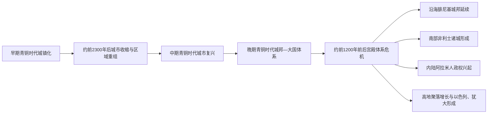

# 迦南与青铜时代黎凡特

## 时间

约前3500—前1200年；其城邦传统、人口与文化延续至铁器时代初期。

## 范围与概念

“黎凡特”是对东地中海东岸及其内陆走廊的现代区域称呼；“迦南”在古代文献中的范围随时代和书写者而变化，大致涉及今以色列、巴勒斯坦、黎巴嫩、约旦西部及叙利亚南部。迦南不是一个统一王国，也不是自始至终边界固定、成员完全一致的民族国家，而是由语言和物质文化相近、政治上彼此独立的城邦、村落与游牧群体构成的区域。

青铜时代黎凡特位于埃及、安纳托利亚、两河流域、爱琴海和阿拉伯内陆之间。沿海港口、南北陆路与横贯约旦河谷的支线，使它既能从跨区域交换中获利，也长期承受埃及、米坦尼和赫梯等强权的争夺。后来的[腓尼基城邦](/%E4%BA%BA%E6%96%87%E7%A7%91%E5%AD%A6/%E5%8E%86%E5%8F%B2/%E8%A5%BF%E4%BA%9A/%E9%BB%8E%E5%87%A1%E7%89%B9/%E8%85%93%E5%B0%BC%E5%9F%BA%E5%9F%8E%E9%82%A6.md)、非利士诸城、阿拉米人政权以及[以色列王国与犹大王国](/%E4%BA%BA%E6%96%87%E7%A7%91%E5%AD%A6/%E5%8E%86%E5%8F%B2/%E8%A5%BF%E4%BA%9A/%E9%BB%8E%E5%87%A1%E7%89%B9/%E4%BB%A5%E8%89%B2%E5%88%97%E7%8E%8B%E5%9B%BD%E4%B8%8E%E7%8A%B9%E5%A4%A7%E7%8E%8B%E5%9B%BD.md)，都在这一地区体系解体和重组后形成。

## 历史分期

| 阶段 | 约略时间 | 政治与社会特征 | 代表性变化 |
|---|---|---|---|
| 早期青铜时代 | 约前3500—前2000年 | 城镇化加速，出现设防城市、公共建筑和区域交换网络 | 杰里科、米吉多等聚落扩展；城市与乡村腹地形成较稳定关系 |
| 早期青铜时代末期转型 | 约前2300—前2000年 | 多地城市收缩或废弃，人口布局改变 | 气候波动、贸易变化、地方冲突和社会重组可能共同作用，不能归结为一次单一入侵 |
| 中期青铜时代 | 约前2000—前1550年 | 城市复兴，城墙、土垒与宫殿体系发展；区域王权更成熟 | 哈措尔、比布鲁斯等成为重要中心；黎凡特与埃及中王国及第二中间期联系加深 |
| 晚期青铜时代 | 约前1550—前1200年 | 城邦君主在大国体系中以附庸、盟友或缓冲政权身份生存 | 埃及在南黎凡特占优势；北部处于埃及、米坦尼和赫梯竞争地带；阿马尔奈书信反映城邦外交 |
| 青铜时代崩溃与铁器时代转型 | 约前1200—前1000年 | 宫殿网络瓦解，大国控制减弱，人口与聚落格局重组 | 乌加里特毁灭，埃及逐步退出，沿海和高地出现新的政治共同体 |

## 演进主线

## 分阶段发展

### 早期青铜时代：城市化与区域网络形成

农业定居并非到青铜时代才开始，但在约前4千纪末至前3千纪，许多聚落规模扩大，出现城墙、城门、仓储和公共建筑。城市依靠周边村落提供谷物、橄榄、葡萄和牲畜，也通过山地、河谷与海岸路线取得金属、木材和奢侈品。沿海的比布鲁斯很早便以黎巴嫩山地木材与埃及建立密切交换；南部和内陆城市则控制道路、泉水或农业盆地。

这些城市通常不是中央帝国的地方分区，而是各有统治集团的小型政治体。城镇化并不均衡：平原、沿海和交通节点较容易形成大型聚落，山地和半干旱边缘则保留村落、季节性放牧和流动生活。约前2300年后，一些城市衰落或废弃，但不同地区的变化并不同步。考古解释包括气候压力、贸易网络收缩、地方战争、政治权力失灵以及人口转向较分散的生计方式，现阶段不宜以“某一民族突然摧毁全部城市”概括。

### 中期青铜时代：城邦复兴与防御体系

约前2千纪初，城市生活重新扩展。许多中心修筑宽大的土垒、城墙和城门，宫殿与神庙成为征税、储存、祭祀和外交的核心。哈措尔控制北部内陆交通，比布鲁斯连接海运与黎巴嫩山地，米吉多扼守耶斯列谷通道；耶路撒冷等山地城邦的规模较小，但具有地区政治和宗教意义。

这一时期的统治者通过亲族、军事随从和宫廷官员控制有限领土，并以婚姻、贡礼和贸易维持跨城关系。来自叙利亚和两河流域的语言、艺术与行政传统继续传入。埃及三角洲的西亚游民和定居人口增多，后来形成的喜克索斯政权与黎凡特有密切联系，但“喜克索斯”并不等同于全部迦南人，也不能把复杂的人口流动视为一次整齐划一的民族迁徙。

### 晚期青铜时代：埃及支配与国际政治

埃及新王国建立后向东北扩张。图特摩斯三世在约前1457年的米吉多战役击败城邦联盟，此后南黎凡特多数城邦向埃及纳贡、提供军需或接受监督。埃及通过驻军、行政中心、王室使者和地方附庸君主维持控制，却通常没有取消城邦王室；地方君主仍管理日常税收、司法、劳役和邻城冲突。

前14世纪的阿马尔奈书信保存了大量以阿卡德语书写的外交通信。耶路撒冷、示剑、比布鲁斯等地的统治者向埃及法老申诉邻邦侵攻、请求弓箭手、指控对手结盟，并反复表明忠诚。这些书信显示，所谓“埃及帝国统治”并非无缝的直接行政，而是依赖地方王侯竞争和有限军事干预的层级体系。

北黎凡特的处境更复杂。米坦尼、埃及和赫梯先后争夺叙利亚城邦；乌加里特等港口在强权间调整依附关系。约前1274年的卡迭石战役及其后的埃及—赫梯和约，没有让整个黎凡特永久统一，却在一段时期内稳定了两大帝国的势力边界。乌加里特以王室宫殿、港口和多语书记传统参与跨地中海贸易，是晚期青铜时代“国际体系”的典型节点。

## 统治与社会结构

| 层级或群体 | 主要角色 | 说明 |
|---|---|---|
| 城邦君主 | 外交、战争、征贡、土地与宫廷管理 | 权力通常限于城市及其农业腹地；王位可由王族继承，也会受政变和大国干预影响 |
| 宫廷与书记 | 记录贡赋、土地、通信和条约 | 晚期青铜时代外交多使用阿卡德语楔形文字；地方行政也使用其他文字和语言 |
| 神庙与祭司 | 祭祀、储藏、土地经营及王权合法化 | 宫殿与神庙既合作也可能竞争资源，不同城邦的组织方式并不完全一致 |
| 自由农民、牧民与工匠 | 农业、畜牧、陶器、纺织和金属加工 | 承担贡赋、劳役或兵役；旱作、园艺与季节性放牧构成互补生计 |
| 商人和航海者 | 远距离交换、运输与信用关系 | 沿海城市尤其依赖海运；王室贸易与私人交易并存 |
| 依附人口与奴隶 | 宫廷、家庭、农业或手工业劳动 | 来源包括债务、战争俘虏和人口买卖，法律身份与生活处境并不相同 |
| 边缘与流动群体 | 雇佣兵、牧民、逃亡者或武装团体 | 文献中的“哈比鲁”多是社会身份而非单一民族；“沙苏”是埃及人对若干游牧群体的称呼，均不能直接等同于后来的以色列人 |

## 语言、宗教与文化

迦南地区使用多种西北闪米特语方言，晚期逐渐显现后来腓尼基语、希伯来语等语言的共同背景。乌加里特语与迦南语关系密切但不是同一种语言；乌加里特的字母楔形文字也不同于后来由腓尼基字母传播的线性字母。阿卡德语是大国外交和跨地域书记教育的重要共同语，此外还能见到胡里安语、埃及语等。

宗教以城市、王室和家庭祭祀共同构成。埃尔、巴力、亚舍拉、阿纳特、阿斯塔蒂等神祇在不同地点以不同组合受到崇拜。乌加里特文献为理解北部黎凡特神话和祭仪提供丰富材料，但不能机械地视为所有迦南城邦完全相同的“统一教典”。政治秩序、季节降雨、土地丰产和战争胜负常通过神祇与王权关系来解释；地方圣所、祖先祭祀和家庭宗教则未必完全受宫廷控制。

## 经济与跨区域交换

黎凡特本地生产谷物、葡萄酒、橄榄油、陶器、纺织品和畜产品；黎巴嫩山地的木材尤其受埃及和其他缺乏优质木料的地区重视。铜大量来自塞浦路斯等地，制作青铜所需的锡则经更长的贸易链输入。埃及黄金、象牙和玻璃制品，爱琴海陶器，两河及叙利亚内陆的奢侈品与技术，通过宫廷贡礼、商人航运和陆路驮运进入本区。

贸易繁荣并不意味着普遍富裕。宫廷和商人精英控制高价值交换，普通村落更容易受到歉收、征税、劳役和战乱冲击。晚期青铜时代各宫殿体系彼此依赖，既能提高专业化程度，也使航路中断、强权战争或连续歉收更容易产生连锁危机。

## 重要事件

| 时间 | 事件 | 过程与结果 |
|---|---|---|
| 约前3500年以后 | 早期城市化扩展 | 多处聚落形成设防城市和区域中心，城市—乡村关系及远距离交换增强 |
| 约前2300—前2000年 | 早期城市体系收缩 | 若干城市衰退，人口与生计方式重组；成因具有地区差异，不是一次同步灭亡 |
| 约前2000—前1550年 | 中期城市复兴 | 大型土垒、城门、宫殿和更成熟的城邦王权出现，黎凡特与埃及和叙利亚联系加深 |
| 约前1457年 | 米吉多战役 | 图特摩斯三世击败城邦联盟，埃及对南黎凡特的支配得到巩固 |
| 前14世纪 | 阿马尔奈通信 | 地方君主与埃及王廷通信，揭示贡赋、邻城战争、忠诚宣誓和军事求援 |
| 约前1274年 | 卡迭石战役 | 埃及与赫梯争夺叙利亚控制权；其后通过条约与势力均衡暂时稳定北部格局 |
| 约前1200年前后 | 青铜时代体系危机 | 乌加里特等中心毁灭或废弃，埃及控制收缩，贸易和宫廷行政网络断裂 |
| 前12—前10世纪 | 铁器时代政治重组 | 沿海、南部平原、内陆和高地分别形成新的城邦、族群认同与国家形态 |

## 鼎盛条件

- **交通区位**：海岸航路、耶斯列谷、约旦河谷及叙利亚—埃及陆路交会，使城市能够控制转运和军队通道。
- **城市与腹地互补**：宫廷和港口组织高价值贸易，周边村落提供粮食、油、酒和劳动力。
- **大国秩序的保护**：埃及或赫梯的宗主权虽然带来贡赋负担，也在部分时期限制全面兼并，为地方王室保留活动空间。
- **书记与外交技术**：多语书记、礼物交换和婚姻外交帮助小国嵌入跨区域体系。
- **生产专业化**：木材、纺织、染料、金属加工、陶器与航海服务支撑城市精英和远距离交换。

## 衰落与转型原因

青铜时代末期的崩溃不是“海上民族突然摧毁全部文明”的单因事件，而是持续数十年的系统性危机。

| 因素类型 | 具体表现 | 作用方式 |
|---|---|---|
| 结构脆弱性 | 宫廷集中控制仓储、贸易与专业生产 | 核心机构一旦失灵，依附其生存的工匠、军队和商路便同时受损 |
| 环境与粮食压力 | 部分地区可能经历连续干旱、歉收或人口压力 | 削弱征税与供养军队的能力，并加剧迁徙和内部冲突 |
| 大国收缩 | 赫梯帝国崩溃，埃及逐渐退出亚洲据点 | 地方城邦失去宗主保护、市场和外交仲裁 |
| 战争与人口流动 | 港口遇袭、城市战争、流民和新群体进入 | 破坏海陆运输，但不同遗址的毁灭时间和原因并不相同 |
| 内部社会冲突 | 贡赋、债务、劳役与精英竞争 | 可能放大王权失灵，促成人口离开宫殿控制区 |
| 直接触发 | 乌加里特等宫殿中心遭毁、贸易节点中断 | 区域网络失去关键枢纽，危机产生连锁反应 |

“崩溃”主要指宫殿外交和大国附庸体系的终结，并不表示人口或所有文化传统消失。许多村落继续存在，陶器、宗教和语言也有明显延续；变化最深的是政治组织、聚落分布和跨区域网络。沿海北部城市在较小规模上恢复并发展为腓尼基城邦，南部沿海出现具有爱琴海联系又迅速本地化的非利士文化，高地聚落数量增加并逐步形成新的共同体。阿拉米人及其他群体也在内陆建立政权。

## 关键辨析

- **迦南人不是一个统一国家的国民**：它是外部和内部文献中随语境变化的区域与文化称呼。
- **城邦附庸不等于埃及直接省制**：多数地方王侯仍处理日常统治，埃及通过贡赋、使者、驻军和军事威慑保持宗主权。
- **哈比鲁不是明确的民族名称**：它往往指脱离既有政治秩序的依附者、雇佣兵或武装流动群体。
- **乌加里特文化不能代表全部迦南**：其文献极重要，但北部港口的语言、王权和国际联系具有自身特点。
- **铁器时代新政权兼有延续与迁入因素**：考古材料显示本地人口和传统大量延续，也存在新的物质文化、人口流动和身份建构。

## 演变关系

- 上级总览：[黎凡特](/%E4%BA%BA%E6%96%87%E7%A7%91%E5%AD%A6/%E5%8E%86%E5%8F%B2/%E8%A5%BF%E4%BA%9A/%E9%BB%8E%E5%87%A1%E7%89%B9/README.md)。
- 外部强权背景：[新王国时期](/%E4%BA%BA%E6%96%87%E7%A7%91%E5%AD%A6/%E5%8E%86%E5%8F%B2/%E5%8C%97%E9%9D%9E/%E5%9F%83%E5%8F%8A/%E5%8F%A4%E5%9F%83%E5%8F%8A/%E6%96%B0%E7%8E%8B%E5%9B%BD%E6%97%B6%E6%9C%9F.md)、[赫梯帝国](/%E4%BA%BA%E6%96%87%E7%A7%91%E5%AD%A6/%E5%8E%86%E5%8F%B2/%E8%A5%BF%E4%BA%9A/%E5%9C%9F%E8%80%B3%E5%85%B6/%E5%AE%89%E7%BA%B3%E6%89%98%E5%88%A9%E4%BA%9A%E5%8F%A4%E4%BB%A3%E6%96%87%E6%98%8E/%E8%B5%AB%E6%A2%AF%E5%B8%9D%E5%9B%BD.md)。
- 主要后续节点：[腓尼基城邦](/%E4%BA%BA%E6%96%87%E7%A7%91%E5%AD%A6/%E5%8E%86%E5%8F%B2/%E8%A5%BF%E4%BA%9A/%E9%BB%8E%E5%87%A1%E7%89%B9/%E8%85%93%E5%B0%BC%E5%9F%BA%E5%9F%8E%E9%82%A6.md)、[以色列王国与犹大王国](/%E4%BA%BA%E6%96%87%E7%A7%91%E5%AD%A6/%E5%8E%86%E5%8F%B2/%E8%A5%BF%E4%BA%9A/%E9%BB%8E%E5%87%A1%E7%89%B9/%E4%BB%A5%E8%89%B2%E5%88%97%E7%8E%8B%E5%9B%BD%E4%B8%8E%E7%8A%B9%E5%A4%A7%E7%8E%8B%E5%9B%BD.md)、[亚述、巴比伦与波斯统治下的黎凡特](/%E4%BA%BA%E6%96%87%E7%A7%91%E5%AD%A6/%E5%8E%86%E5%8F%B2/%E8%A5%BF%E4%BA%9A/%E9%BB%8E%E5%87%A1%E7%89%B9/%E4%BA%9A%E8%BF%B0%E3%80%81%E5%B7%B4%E6%AF%94%E4%BC%A6%E4%B8%8E%E6%B3%A2%E6%96%AF%E7%BB%9F%E6%B2%BB%E4%B8%8B%E7%9A%84%E9%BB%8E%E5%87%A1%E7%89%B9.md)。
