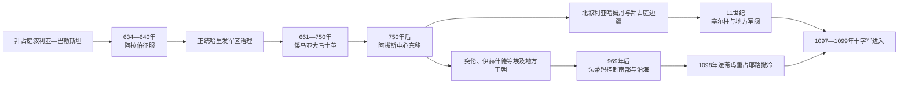

# 阿拉伯征服与伊斯兰化时期的黎凡特

## 时间

约634—1099年；政治征服集中在7世纪，阿拉伯化与伊斯兰化则延续数百年。

## 概括

7世纪阿拉伯穆斯林军队击败拜占庭，把叙利亚—巴勒斯坦纳入哈里发国家。新统治者沿用许多晚期罗马税务、城市和文书人员，又以军区、部落军、总督和条约重组地区。661年穆阿维叶建立倭马亚王朝，大马士革成为横跨三洲帝国的首都；阿卜杜勒—马利克和瓦利德一世时期，阿拉伯语行政、统一钱币、圆顶清真寺和大马士革大清真寺把黎凡特置于伊斯兰政治象征中心。

750年阿拔斯革命把核心东移伊拉克。黎凡特仍是圣地、港口、农业与边疆重镇，却频繁由阿拔斯总督、埃及地方王朝、法蒂玛、哈姆丹、拜占庭和塞尔柱力量分区控制。阿拉伯化不等于所有居民来自阿拉伯半岛，伊斯兰化也不是征服后立即完成；基督徒、犹太人、撒马利亚人和不同穆斯林群体在法律不平等、财政激励、婚姻、城市文化与地方冲突中长期共存。11世纪末的政治碎片化为十字军提供机会，但十字军东征还需从拜占庭求援、教廷动员和西欧政治理解，不能只归因于本地“混乱”。

## 演变图

## 征服背景与过程

拜占庭与萨珊在602—628年的战争耗尽军队和财政，叙利亚、巴勒斯坦刚从波斯占领中恢复。阿拉伯半岛在穆罕默德领导下形成新的政治—宗教共同体；其去世后，阿布·伯克尔和欧麦尔把部落军从半岛内战转向伊拉克与叙利亚。征服军并非单一部落，由不同阿拉伯集团和指挥官组成，既有中央目标，也有战利、土地和部落地位竞争。

634年阿季纳代因等战斗打开巴勒斯坦内陆，635年大马士革首次失守。636年雅尔穆克战役击败拜占庭主力，使哈里发军可以分区接管叙利亚。耶路撒冷约637 / 638年投降，凯撒利亚约640年前后陷落；北部沿海与山地的接管稍慢，拜占庭海军仍能袭扰港口。

城市结局不同。部分守军战败后撤，部分主教、官员或地方精英通过条约换取生命、财产、教堂和纳税安排。后世“欧麦尔盟约”的具体文本多经长期形成，不能把某一晚期版本直接当作638年的逐字文件；但保护宗教社群、缴税和政治从属的基本框架确实逐步制度化。

征服成功的条件包括拜占庭战后疲惫、哈里发军机动和多路协同、沙漠补给能力、部分城市选择谈判，以及帝国不能同时保卫漫长边界。不能把胜利归结为当地基督徒普遍“欢迎”，不同社群的选择随战场与地方利益而异。

## 军区、总督与地方行政

正统哈里发把沙姆划为若干军区（jund），兼具军饷登记、征税、驻防和司法功能。常见军区包括大马士革、霍姆斯、约旦和巴勒斯坦，后增设钦奈斯林。边界和首府会变化，军区不是现代民族省份。

| 层级 | 机构 / 人员 | 主要职能 |
|---|---|---|
| 哈里发 | 麦地那，后大马士革、巴格达或开罗的最高统治者 | 任命总督、决定军费、税制、铸币和对外战争 |
| 沙姆总督 / 王族 | 管辖一个或多个军区 | 协调军队、部落、税收和城市精英；倭马亚时期常由王族担任 |
| 军区长官 | 驻军、军饷名册和地方司法 | 维持军队并征集土地税、人口税和物资 |
| 法官与宗教学者 | 卡迪、清真寺教师和法学网络 | 处理穆斯林婚姻、财产、刑事与公共规范；法学在数世纪中发展 |
| 地方文书与税务人员 | 早期包括希腊语、叙利亚语、科普特语和阿拉伯语官员 | 延续账册、土地丈量和收税，8世纪前后阿拉伯语地位上升 |
| 城市、村社与宗教首领 | 主教、修院、犹太会众长老、乡村头人和地主 | 管理社群内部事务、分摊税额、调解地方冲突 |

征服初期并未把全部土地分给军人。许多土地仍由原地主、教会、村社或国家税籍管理，军队主要通过税收和军饷名册获得收入。阿拉伯部落在城市周边、边疆和农村定居，同原有阿拉米语、希腊语等人口逐渐融合。

## 正统哈里发与早期权力斗争

穆阿维叶长期任叙利亚总督，以大马士革为基地建立部落联盟、舰队和行政网络。第三任哈里发奥斯曼遇刺后，穆阿维叶同阿里争夺领导权；657年隋芬战役发生在幼发拉底附近，仲裁和内战分裂穆斯林共同体。661年阿里遇刺后，穆阿维叶成为哈里发，叙利亚军队成为倭马亚国家核心。

这段权力斗争影响后来的逊尼、什叶与哈瓦利吉传统，但当时阵营首先也是家族、地区和政治联盟。黎凡特并非只是中央命令的被动对象，大马士革军、也门与盖斯部落集团及王族婚姻共同决定王朝稳定。

## 倭马亚时期：黎凡特成为帝国中心

### 王朝建立与部落联盟

穆阿维叶一世以协商、任命、军饷和叙利亚部落联盟巩固王朝。其指定儿子叶齐德继位，引发第二次内战。683年叶齐德死后，叙利亚部落在贾比亚会议支持马尔万一世；684年马尔吉—拉希特战役确立马尔万家和卡勒比等联盟优势，也把盖斯—也门竞争带入帝国军政。

阿卜杜勒—马利克击败伊本·祖拜尔，重新统一哈里发国。他逐步以阿拉伯语替代部分希腊语行政，发行带伊斯兰铭文的钱币，强化税务和驿传。改革是多年过程，地方书记与旧制度仍参与运作。

### 耶路撒冷与大马士革建设

691 / 692年圆顶清真寺在耶路撒冷圣殿山建成，以建筑、铭文和朝圣把城市纳入伊斯兰圣史。其用途不仅是“替代麦加朝觐”，学界对政治和礼仪功能有不同解释。阿克萨清真寺建筑群在倭马亚时期继续发展。

瓦利德一世时期，大马士革大清真寺在原罗马—基督教圣地空间上建设。征收、交换与共同使用的具体过程有不同史源，结果是城市中心出现王朝纪念建筑。倭马亚宫殿、浴场、道路和农业庄园分布于约旦河谷、巴勒斯坦及叙利亚沙漠，显示王族把行政、休闲、牧地和部落政治结合。

### 社会与经济

港口为对拜占庭海战和地中海贸易服务，内陆城市连接伊拉克、阿拉伯与埃及。纸草、钱币和铭文显示希腊语、阿拉伯语并用，8世纪阿拉伯语在行政和公共铭刻中占主导。城市基督徒工匠、官员和学者继续参与国家与经济；皈依伊斯兰的本地人及非阿拉伯穆斯林逐渐增加，挑战早期军饷和部落等级。

倭马亚后期的王位短促、部落战争、财政压力、边疆失败与阿拔斯宣传共同削弱王朝。747年起叙利亚发生地震和政治动荡，750年阿拔斯军在大扎卜河击败马尔万二世。倭马亚家族被清洗，叙利亚军队特权下降。

## 阿拔斯统治与地方化

阿拔斯把首都移至伊拉克，税收、军队与宫廷重心离开大马士革。黎凡特多次出现亲倭马亚起义、部落冲突和反税运动。阿拔斯以总督轮换、驻军和镇压维持控制，却没有完全取消军区、城市和宗教网络。

8—9世纪，拉姆拉继续作为巴勒斯坦行政中心，提比里亚、耶路撒冷、阿卡、推罗、大马士革和安提阿保持商业或宗教地位。纸张传播、阿拉伯语学术和哈迪斯—法学网络发展。基督教修院、叙利亚语文学、犹太巴勒斯坦学院和跨地中海商人也延续活动。

阿拔斯核心政治逐步军事化，突厥军队与地方财政承包加强。868年艾哈迈德·伊本·突伦在埃及建立事实独立政权，878年前后控制巴勒斯坦与叙利亚大部；905年阿拔斯恢复，935年又由伊赫什德家族取得埃及和南黎凡特。地区从“一个总督区”转为埃及、伊拉克、北叙利亚与拜占庭边疆多中心竞争。

## 10—11世纪的分区竞争

### 北叙利亚、哈姆丹与拜占庭

哈姆丹王赛义夫·道莱自944年以阿勒颇为中心，同拜占庭长期战争并赞助阿拉伯文学。其政权依靠部落、军队和城市税收，继承和财政基础不稳。969年拜占庭重新夺取安提阿并控制北部沿海及边区，形成基督教帝国统治与穆斯林阿勒颇政权并存的边疆。

### 法蒂玛征服

969年法蒂玛征服埃及，随后向巴勒斯坦与叙利亚扩张。其伊斯玛仪派哈里发通过开罗宫廷、柏柏尔、突厥、黑人军团与地方盟友治理，南部黎凡特多次在法蒂玛、卡尔马特、贝都因和大马士革势力间易手。法蒂玛并非始终稳定控制整个叙利亚。

哈里发哈基姆1009年命令毁坏圣墓教堂等基督教设施，是宗教政策剧烈转折；其前后政策也包括保护、任用和限制的变化。后续法蒂玛同拜占庭协议允许教堂于11世纪中叶重建。一次迫害不能代表全期，却对跨地中海记忆产生长期影响。

德鲁兹宗教运动在哈基姆时期的伊斯玛仪思想和传教网络中形成，后来在黎巴嫩山、叙利亚南部等地建立社群。其教义和封闭社群边界经过历史发展，不能简单等同一般什叶派分支或某一民族。

### 塞尔柱与政治碎片化

11世纪后期，塞尔柱突厥及其将领进入叙利亚。1070年代耶路撒冷和大马士革相继脱离法蒂玛，地方统治者、阿尔图格家族、塞尔柱诸王与阿勒颇政权彼此竞争。法蒂玛仍控制埃及和部分沿海，并在1098年从突厥守军手中重占耶路撒冷。

此时拜占庭、亚美尼亚政权、安提阿、塞尔柱诸支、阿勒颇和大马士革并无统一指挥。1097年进入安纳托利亚和叙利亚的十字军利用分裂，但也面对长期围城、饥荒和地方联盟变化。1099年十字军从法蒂玛守军手中夺取耶路撒冷，因此“十字军只同塞尔柱争圣城”的说法不准确。

## 阿拉伯化与伊斯兰化的机制

### 语言变化

阿拉伯语成为军队、行政、法学、商业和精英流动的高地位语言。阿卜杜勒—马利克改革加速官方阿拉伯化，基督徒和犹太人也逐步使用阿拉伯语，形成阿拉伯语基督教神学、犹太—阿拉伯文献和日常双语。叙利亚语、希腊语、希伯来语与撒马利亚阿拉米语并未立即消失，礼仪语言尤其持久。

阿拉伯化主要是语言和公共文化变化，不等于所有阿拉伯语使用者都出自半岛移民，也不等于皈依伊斯兰。

### 宗教转变

非穆斯林社群通常作为受保护者缴纳人头税，土地则负担不同形式的地税；具体税法随时期、土地身份和地方行政变化。穆斯林享有政治与部分财政优势，皈依可受信仰、婚姻、城市机会、免税期待、庇护和社会流动影响。早期国家有时担心皈依减少税收，说明制度并非始终积极强迫集体改宗。

基督徒可能到中世纪早期仍占许多地区人口重要部分。伊斯兰化速度在城市、山地、边疆和乡村不同；撒马利亚社群在战争、税压和皈依中显著缩小，犹太社群则在耶路撒冷、提比里亚、拉姆拉等地同巴比伦、埃及中心联系。不存在一个可适用于整个黎凡特的“征服当年多数改宗”时点。

## 统治者与世系导航

本页横跨多个帝国与地方王朝，不把所有哈里发和埃及统治者重复抄入区域页。完整顺序见：

- [伊斯兰兴起与正统哈里发时期](/%E4%BA%BA%E6%96%87%E7%A7%91%E5%AD%A6/%E5%8E%86%E5%8F%B2/%E8%A5%BF%E4%BA%9A/_%E9%80%9A%E5%8F%B2/%E9%98%BF%E6%8B%89%E4%BC%AF%E5%B8%9D%E5%9B%BD/%E4%BC%8A%E6%96%AF%E5%85%B0%E5%85%B4%E8%B5%B7%E4%B8%8E%E6%AD%A3%E7%BB%9F%E5%93%88%E9%87%8C%E5%8F%91%E6%97%B6%E6%9C%9F.md)；
- [倭马亚王朝](/%E4%BA%BA%E6%96%87%E7%A7%91%E5%AD%A6/%E5%8E%86%E5%8F%B2/%E8%A5%BF%E4%BA%9A/_%E9%80%9A%E5%8F%B2/%E9%98%BF%E6%8B%89%E4%BC%AF%E5%B8%9D%E5%9B%BD/%E5%80%AD%E9%A9%AC%E4%BA%9A%E7%8E%8B%E6%9C%9D.md)；
- [阿拔斯王朝](/%E4%BA%BA%E6%96%87%E7%A7%91%E5%AD%A6/%E5%8E%86%E5%8F%B2/%E8%A5%BF%E4%BA%9A/_%E9%80%9A%E5%8F%B2/%E9%98%BF%E6%8B%89%E4%BC%AF%E5%B8%9D%E5%9B%BD/%E9%98%BF%E6%8B%94%E6%96%AF%E7%8E%8B%E6%9C%9D.md)及[阿拔斯哈里发世系表](/%E4%BA%BA%E6%96%87%E7%A7%91%E5%AD%A6/%E5%8E%86%E5%8F%B2/%E8%A5%BF%E4%BA%9A/_%E9%80%9A%E5%8F%B2/%E9%98%BF%E6%8B%89%E4%BC%AF%E5%B8%9D%E5%9B%BD/%E9%98%BF%E6%8B%94%E6%96%AF%E5%93%88%E9%87%8C%E5%8F%91%E4%B8%96%E7%B3%BB%E8%A1%A8.md)；
- [法蒂玛王朝统治下的埃及](/%E4%BA%BA%E6%96%87%E7%A7%91%E5%AD%A6/%E5%8E%86%E5%8F%B2/%E5%8C%97%E9%9D%9E/%E5%9F%83%E5%8F%8A/%E6%B3%95%E8%92%82%E7%8E%9B%E7%8E%8B%E6%9C%9D%E7%BB%9F%E6%B2%BB%E4%B8%8B%E7%9A%84%E5%9F%83%E5%8F%8A.md)。

以下表格只说明黎凡特的实际控制序列，不把名义哈里发与地面统治混为一人。

| 地区与阶段 | 名义最高权威 | 实际统治层 | 说明 |
|---|---|---|---|
| 634—661年 | 正统哈里发 | 沙姆总督与军区长官 | 穆阿维叶在奥斯曼时期已形成强大叙利亚基地。 |
| 661—750年 | 倭马亚哈里发 | 大马士革王朝、王族总督和叙利亚军 | 黎凡特是帝国核心。 |
| 750—878年 | 阿拔斯哈里发 | 轮换总督、驻军、地方精英 | 中心东移，叙利亚政治地位下降。 |
| 878—905年 | 名义上仍承认阿拔斯 | 埃及突伦王朝控制南部及叙利亚大部 | 依靠埃及财政建立地方帝国。 |
| 905—935年 | 阿拔斯哈里发 | 阿拔斯总督恢复 | 控制短暂且受军阀化影响。 |
| 935—969年 | 名义上承认阿拔斯 | 埃及伊赫什德王朝控制南部 | 北叙利亚另有哈姆丹等势力。 |
| 944—1003年左右 | 阿拔斯名义权威 | 阿勒颇哈姆丹王朝及后继者 | 与拜占庭争夺北叙利亚。 |
| 969年后 | 法蒂玛哈里发 | 埃及军团、总督与地方盟友 | 主要控制巴勒斯坦、沿海和大马士革，范围反复。 |
| 969—1084年左右 | 拜占庭皇帝 | 安提阿军政长官和边防军 | 北部安提阿及周边重归拜占庭。 |
| 1070年代—1098年 | 阿拔斯名义权威与塞尔柱苏丹 | 塞尔柱诸王、阿尔图格与地方埃米尔 | 大马士革、阿勒颇、耶路撒冷并非一体。 |
| 1098—1099年耶路撒冷 | 法蒂玛哈里发 | 法蒂玛总督 | 重占不足一年即面对十字军围城。 |

## 重要事件

| 时间 | 事件 | 结果 |
|---|---|---|
| 634—636年 | 阿季纳代因、大马士革与雅尔穆克战事 | 拜占庭主力失败，叙利亚内陆转入哈里发控制。 |
| 637 / 638年 | 耶路撒冷投降 | 基督教圣城纳入伊斯兰统治，社群以条约与税法重组。 |
| 640年前后 | 凯撒利亚失守 | 拜占庭在巴勒斯坦主要据点终结。 |
| 661年 | 穆阿维叶建立倭马亚王朝 | 大马士革成为帝国首都。 |
| 684年 | 马尔吉—拉希特战役 | 马尔万家恢复叙利亚王朝核心，部落阵营冲突长期化。 |
| 691 / 692年 | 圆顶清真寺建成 | 耶路撒冷的伊斯兰圣地地位与王朝象征加强。 |
| 7世纪末—8世纪初 | 行政与钱币阿拉伯化 | 阿拉伯语和伊斯兰铭文成为公共统治语言。 |
| 705—715年 | 大马士革大清真寺建设 | 王朝首都出现标志性宗教—政治建筑。 |
| 749年 | 大地震 | 巴勒斯坦、约旦和叙利亚多城受损，叠加王朝危机。 |
| 750年 | 阿拔斯革命 | 政治中心移往伊拉克，叙利亚军与倭马亚精英失势。 |
| 878年前后 | 突伦王朝取得叙利亚—巴勒斯坦 | 埃及地方王朝开始反复控制南黎凡特。 |
| 944年 | 哈姆丹王朝以阿勒颇为中心 | 北叙利亚成为拜占庭—穆斯林边疆。 |
| 969年 | 法蒂玛征服埃及并进入黎凡特；拜占庭取安提阿 | 南北分区竞争加深。 |
| 1009年 | 圣墓教堂被毁 | 哈基姆宗教政策造成严重破坏，后获准重建。 |
| 1070年代 | 塞尔柱势力进入叙利亚与巴勒斯坦 | 法蒂玛控制收缩，地方埃米尔并立。 |
| 1098年 | 法蒂玛重占耶路撒冷 | 从突厥守军手中夺城，旋即面对十字军。 |
| 1099年 | 十字军攻陷耶路撒冷 | 大量穆斯林和犹太居民被杀，拉丁国家建立。 |

## 兴盛、地方化与阶段终结原因

| 阶段 | 兴盛条件 | 结构性压力 | 直接转折 |
|---|---|---|---|
| 倭马亚 | 大马士革首都、叙利亚军、部落联盟、行政与海陆交通 | 继承危机、部落对立、财政和边疆压力、非阿拉伯穆斯林不满 | 阿拔斯革命与750年军事失败 |
| 阿拔斯直辖 | 伊拉克财政、总督和跨帝国商业学术网络 | 中心远离、军队私属化、地方税收被强人控制 | 突伦、伊赫什德等地方王朝取得事实统治 |
| 法蒂玛与北方诸国竞争 | 埃及财政、开罗宫廷、港口与地方盟友 | 军团派系、贝都因与卡尔马特袭击、北叙利亚多中心 | 塞尔柱进入、地方军阀化和十字军东征 |
| 全期社会转型 | 阿拉伯语行政、城市网络、宗教和婚姻流动 | 税法不平等、宗派竞争、战争和灾害 | 并无单一“伊斯兰化完成”事件，变化延续到后世 |

## 演变关系

- 前置节点：[拜占庭与早期基督教黎凡特](/%E4%BA%BA%E6%96%87%E7%A7%91%E5%AD%A6/%E5%8E%86%E5%8F%B2/%E8%A5%BF%E4%BA%9A/%E9%BB%8E%E5%87%A1%E7%89%B9/%E6%8B%9C%E5%8D%A0%E5%BA%AD%E4%B8%8E%E6%97%A9%E6%9C%9F%E5%9F%BA%E7%9D%A3%E6%95%99%E9%BB%8E%E5%87%A1%E7%89%B9.md)。
- 后续节点：[十字军国家与阿尤布、马穆鲁克时期](/%E4%BA%BA%E6%96%87%E7%A7%91%E5%AD%A6/%E5%8E%86%E5%8F%B2/%E8%A5%BF%E4%BA%9A/%E9%BB%8E%E5%87%A1%E7%89%B9/%E5%8D%81%E5%AD%97%E5%86%9B%E5%9B%BD%E5%AE%B6%E4%B8%8E%E9%98%BF%E5%B0%A4%E5%B8%83%E3%80%81%E9%A9%AC%E7%A9%86%E9%B2%81%E5%85%8B%E6%97%B6%E6%9C%9F.md)。
- 叙利亚地区细化：[古代叙利亚与伊斯兰时代](/%E4%BA%BA%E6%96%87%E7%A7%91%E5%AD%A6/%E5%8E%86%E5%8F%B2/%E8%A5%BF%E4%BA%9A/%E9%BB%8E%E5%87%A1%E7%89%B9/%E5%8F%99%E5%88%A9%E4%BA%9A/%E5%8F%A4%E4%BB%A3%E5%8F%99%E5%88%A9%E4%BA%9A%E4%B8%8E%E4%BC%8A%E6%96%AF%E5%85%B0%E6%97%B6%E4%BB%A3.md)。
- 巴勒斯坦地区细化：[古代至奥斯曼时期的巴勒斯坦](/%E4%BA%BA%E6%96%87%E7%A7%91%E5%AD%A6/%E5%8E%86%E5%8F%B2/%E8%A5%BF%E4%BA%9A/%E9%BB%8E%E5%87%A1%E7%89%B9/%E5%B7%B4%E5%8B%92%E6%96%AF%E5%9D%A6/%E5%8F%A4%E4%BB%A3%E8%87%B3%E5%A5%A5%E6%96%AF%E6%9B%BC%E6%97%B6%E6%9C%9F%E7%9A%84%E5%B7%B4%E5%8B%92%E6%96%AF%E5%9D%A6.md)。
- 上级入口：[黎凡特](/%E4%BA%BA%E6%96%87%E7%A7%91%E5%AD%A6/%E5%8E%86%E5%8F%B2/%E8%A5%BF%E4%BA%9A/%E9%BB%8E%E5%87%A1%E7%89%B9/README.md)。
