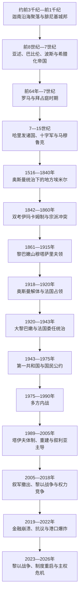

# 黎巴嫩

## 概括

黎巴嫩位于地中海东岸，沿海平原、黎巴嫩山、贝卡谷地和前黎巴嫩山脉构成狭长而差异显著的地理空间。古代比布鲁斯、西顿、推罗等城邦是腓尼基海上网络的重要节点；此后本地区先后处在亚述、巴比伦、波斯、希腊化王国、罗马—拜占庭政权、伊斯兰哈里发诸国、十字军、马穆鲁克与奥斯曼帝国的统治之下。现代黎巴嫩继承了这片区域的部分历史遗产，但不能把古代腓尼基城邦直接视为现代民族国家。

黎巴嫩山长期形成马龙派、德鲁兹派及其他社群交错分布的政治社会，沿海城市和贝卡谷地又有逊尼派、什叶派、希腊正教等群体。奥斯曼晚期的宗派冲突、欧洲干预与自治制度，是现代宗派政治的重要前史。法国于1920年把黎巴嫩山同贝鲁特、的黎波里、赛达、提尔和贝卡等地合并为“大黎巴嫩”，奠定现代边界；1943年独立和“国民公约”确立由马龙派总统、逊尼派总理和什叶派议长等职位构成的协商制度。

这一安排为多元社群提供代表，却没有消除人口、地区与资源分配矛盾。巴以冲突外溢、巴勒斯坦武装存在、叙利亚和以色列介入及民兵竞争共同促成1975—1990年内战。1989年《塔伊夫协议》重配权力并结束主要战事，但宗派精英网络、真主党武装和外部影响延续。2019年后金融体系崩溃，2020年贝鲁特港爆炸暴露治理失灵；2023—2026年的黎以战争再度把国家主权、停火、撤军与国家垄断武器推到政治中心。

## 演变图

## 历史主线

### 沿海城邦与帝国通道

古代“腓尼基”主要指共享语言、宗教和航海文化的沿海城邦群，并非统一王国。各城邦依靠木材、紫色染料、手工业和海上贸易兴盛，又因处在埃及、两河和地中海世界之间，反复向区域帝国称臣或被直接统治。罗马时期城市化、道路和贝鲁特法学传统发展；基督教社群在晚期古代形成。7世纪后阿拉伯语和伊斯兰制度逐渐成为主要公共文化框架，山区则为不同宗教社群提供迁入和自治空间。

### 山地政治与奥斯曼制度

1516年奥斯曼征服黎凡特后，今日黎巴嫩并非统一行政单位。马安家族和希哈布家族等地方统治者以包税、联盟和武力在山地扩大权势，法赫尔丁二世和巴希尔二世尤其重要。19世纪中央集权、埃及占领、丝绸商品化、欧洲领事竞争和社群政治化改变旧秩序。1840年代双考伊玛卡姆制未能稳定混居区，1860年德鲁兹—马龙派战争及大马士革屠杀促成欧洲干预；1861年建立由非本地天主教奥斯曼总督治理的穆塔萨里夫领。

### 大黎巴嫩、委任统治与独立

第一次世界大战期间，封锁、征粮、通货膨胀、蝗灾与行政失能共同造成黎巴嫩山大饥荒。奥斯曼帝国战败后，法国占领本区，并于1920年宣布大黎巴嫩。新边界扩大经济腹地，也把宗教构成不同的沿海和内陆地区纳入山地政治中心。1926年共和国宪法建立议会制度，但法国高级专员保留最终权力。1943年黎巴嫩领导人以不寻求西方保护和不推动并入叙利亚的双重妥协形成“国民公约”；法国拘捕领导人引发危机后承认独立，军队于1946年撤离。

### 内战、塔伊夫体制与战后国家

独立早期的商业繁荣同地区不平等、宗派配额和薄弱国家能力并存。1948年巴勒斯坦难民进入、1969年《开罗协议》及1970年代巴解组织重心转入黎巴嫩，使阿以冲突与国内改革争议交织。1975年内战爆发后，宗派民兵、左翼组织、巴勒斯坦派别、叙利亚和以色列不断改变联盟。1989年塔伊夫协议把议席调整为基督徒与穆斯林各半，加强内阁和总理权力，并要求解除民兵武装；1990年主要战事结束，真主党则以对以抵抗为由保留武装。

战后重建恢复基础设施，却依赖债务、固定汇率、银行存款和房地产。叙利亚主导政治安全秩序直至2005年哈里里遇刺后撤军。2006年黎以战争、2008年国内武装冲突、叙利亚内战外溢和多次总统空缺显示塔伊夫体制的脆弱性。2019年金融危机和全国抗议、2020年港口爆炸进一步削弱国家。2025年约瑟夫·奥恩当选总统、纳瓦夫·萨拉姆组阁，结束权力真空；2026年新一轮战争中政府宣布真主党军事活动违法，但截至2026年7月，停火、以军撤离、解除非国家武装和国家完整控制仍未完成。

## 时期导航

| 顺序 | 笔记 | 时间 | 简要概括 |
|---:|---|---|---|
| 1 | [腓尼基、山地社群与奥斯曼黎巴嫩](/%E4%BA%BA%E6%96%87%E7%A7%91%E5%AD%A6/%E5%8E%86%E5%8F%B2/%E8%A5%BF%E4%BA%9A/%E9%BB%8E%E5%87%A1%E7%89%B9/%E9%BB%8E%E5%B7%B4%E5%AB%A9/%E8%85%93%E5%B0%BC%E5%9F%BA%E3%80%81%E5%B1%B1%E5%9C%B0%E7%A4%BE%E7%BE%A4%E4%B8%8E%E5%A5%A5%E6%96%AF%E6%9B%BC%E9%BB%8E%E5%B7%B4%E5%AB%A9.md) | 约前3千纪—1918年 | 从沿海城邦、帝国统治到山地埃米尔、自治省和一战饥荒。 |
| 2 | [法国委任统治与黎巴嫩共和国](/%E4%BA%BA%E6%96%87%E7%A7%91%E5%AD%A6/%E5%8E%86%E5%8F%B2/%E8%A5%BF%E4%BA%9A/%E9%BB%8E%E5%87%A1%E7%89%B9/%E9%BB%8E%E5%B7%B4%E5%AB%A9/%E6%B3%95%E5%9B%BD%E5%A7%94%E4%BB%BB%E7%BB%9F%E6%B2%BB%E4%B8%8E%E9%BB%8E%E5%B7%B4%E5%AB%A9%E5%85%B1%E5%92%8C%E5%9B%BD.md) | 1918—1975年 | 大黎巴嫩划界、委任统治、独立、国民公约和内战前的国家危机。 |
| 3 | [内战、塔伊夫体制与当代黎巴嫩](/%E4%BA%BA%E6%96%87%E7%A7%91%E5%AD%A6/%E5%8E%86%E5%8F%B2/%E8%A5%BF%E4%BA%9A/%E9%BB%8E%E5%87%A1%E7%89%B9/%E9%BB%8E%E5%B7%B4%E5%AB%A9/%E5%86%85%E6%88%98%E3%80%81%E5%A1%94%E4%BC%8A%E5%A4%AB%E4%BD%93%E5%88%B6%E4%B8%8E%E5%BD%93%E4%BB%A3%E9%BB%8E%E5%B7%B4%E5%AB%A9.md) | 1975年至今 | 内战、外国干预、塔伊夫制度、重建、金融崩溃及2023—2026年战争。 |
| 4 | [黎巴嫩山统治者、总督与共和国领导人表](/%E4%BA%BA%E6%96%87%E7%A7%91%E5%AD%A6/%E5%8E%86%E5%8F%B2/%E8%A5%BF%E4%BA%9A/%E9%BB%8E%E5%87%A1%E7%89%B9/%E9%BB%8E%E5%B7%B4%E5%AB%A9/%E9%BB%8E%E5%B7%B4%E5%AB%A9%E5%B1%B1%E7%BB%9F%E6%B2%BB%E8%80%85%E3%80%81%E6%80%BB%E7%9D%A3%E4%B8%8E%E5%85%B1%E5%92%8C%E5%9B%BD%E9%A2%86%E5%AF%BC%E4%BA%BA%E8%A1%A8.md) | 1516年至今 | 马安和希哈布统治者、穆塔萨里夫、委任统治长官、总统与总理完整表。 |

## 重要转折与时间节点

| 时间 | 转折 | 历史意义 |
|---|---|---|
| 约前1200—前539年 | 腓尼基城邦和海上网络兴盛 | 沿海城市成为地中海贸易、殖民与字母传播的重要节点。 |
| 前64年 | 罗马吞并叙利亚地区 | 今日黎巴嫩进入长时段罗马—拜占庭政治文化圈。 |
| 7世纪 | 阿拉伯—伊斯兰征服 | 阿拉伯语与伊斯兰制度逐渐成为区域主要公共框架。 |
| 1516年 | 奥斯曼征服黎凡特 | 开启四百年奥斯曼统治，山地由地方家族和帝国官僚共同治理。 |
| 1860—1861年 | 宗派战争与穆塔萨里夫领建立 | 欧洲干预下形成特殊山地自治和制度化宗派代表。 |
| 1915—1918年 | 黎巴嫩山大饥荒 | 战争封锁、征粮与经济崩溃造成重大人口损失。 |
| 1920年 | 大黎巴嫩建立 | 现代疆界核心形成，同时带来国家认同与宗派平衡的新问题。 |
| 1943—1946年 | 独立与法军撤离 | 国民公约成为不成文权力分享基础。 |
| 1958年 | 首次共和国危机 | 国内联盟、泛阿拉伯主义和冷战外部力量交织。 |
| 1975年 | 内战爆发 | 国家解体为多方武装和外国干预的战场。 |
| 1982年 | 以色列入侵并围困贝鲁特 | 巴解组织主力撤出，真主党兴起的条件进一步形成。 |
| 1989—1990年 | 塔伊夫协议与内战终结 | 重配宗派权力，建立第二共和国和叙利亚主导的战后秩序。 |
| 2000年 | 以色列撤出南部大部分地区 | 南黎巴嫩军瓦解，但舍巴农场和真主党武装问题延续。 |
| 2005年 | 哈里里遇刺与叙军撤出 | 战后政治联盟重组，叙利亚直接军事控制终结。 |
| 2006年 | 真主党—以色列战争 | 第1701号决议建立新的南部安全框架，但武装双轨未解决。 |
| 2019—2020年 | 抗议、金融崩溃和港口爆炸 | 经济社会契约与国家治理同时陷入系统性危机。 |
| 2024年 | 黎以边境冲突升级为大规模战争 | 真主党领导层和南部安全格局受到重大冲击。 |
| 2025年 | 新总统和新政府就任 | 结束长期总统空缺，恢复改革和国家武器垄断议程。 |
| 2026年 | 真主党再次对以攻击、政府宣布其军事活动违法 | 国家主权立场出现重大转折，战争与解除武装问题仍未解决。 |

## 理解黎巴嫩史的关键区别

- **腓尼基不等于现代黎巴嫩**：腓尼基是古代沿海城邦文化网络，疆域、人口和国家结构均不同于现代共和国。
- **黎巴嫩山不等于大黎巴嫩**：1861年的自治省主要覆盖山地；1920年国家加入沿海城市、北部、南部和贝卡谷地，人口与经济结构随之改变。
- **宗派不是固定政治阵营**：同一宗派内部存在竞争，不同宗派政党也会组成跨社群联盟；阶级、地区、家族和外部支持同样重要。
- **塔伊夫并未取消宗派制度**：协议重新平衡权力并提出逐步取消政治宗派主义，但议席、职位和政治动员仍深受宗派配额影响。
- **国家与武装组织并存**：真主党既是合法政党和社会组织，又长期保有独立军事体系；这一双重性质是战后主权争议的核心。
- **经济崩溃不是单一事件**：公共债务、固定汇率、银行资产负债、资本外流、政治否决和地区冲突共同造成2019年后的危机。

## 区域关系

- 直接上级：[黎凡特](/%E4%BA%BA%E6%96%87%E7%A7%91%E5%AD%A6/%E5%8E%86%E5%8F%B2/%E8%A5%BF%E4%BA%9A/%E9%BB%8E%E5%87%A1%E7%89%B9/README.md)；宏观区域：[西亚](/%E4%BA%BA%E6%96%87%E7%A7%91%E5%AD%A6/%E5%8E%86%E5%8F%B2/%E8%A5%BF%E4%BA%9A/README.md)；全库入口：[历史](/%E4%BA%BA%E6%96%87%E7%A7%91%E5%AD%A6/%E5%8E%86%E5%8F%B2/README.md)。
- 跨国共享综述：[现代黎巴嫩](/%E4%BA%BA%E6%96%87%E7%A7%91%E5%AD%A6/%E5%8E%86%E5%8F%B2/%E8%A5%BF%E4%BA%9A/%E9%BB%8E%E5%87%A1%E7%89%B9/%E7%8E%B0%E4%BB%A3%E9%BB%8E%E5%B7%B4%E5%AB%A9.md)与[英法委任统治时期](/%E4%BA%BA%E6%96%87%E7%A7%91%E5%AD%A6/%E5%8E%86%E5%8F%B2/%E8%A5%BF%E4%BA%9A/%E9%BB%8E%E5%87%A1%E7%89%B9/%E8%8B%B1%E6%B3%95%E5%A7%94%E4%BB%BB%E7%BB%9F%E6%B2%BB%E6%97%B6%E6%9C%9F.md)。
- 相邻国家与冲突主线：[叙利亚](/%E4%BA%BA%E6%96%87%E7%A7%91%E5%AD%A6/%E5%8E%86%E5%8F%B2/%E8%A5%BF%E4%BA%9A/%E9%BB%8E%E5%87%A1%E7%89%B9/%E5%8F%99%E5%88%A9%E4%BA%9A/README.md)、[以色列](/%E4%BA%BA%E6%96%87%E7%A7%91%E5%AD%A6/%E5%8E%86%E5%8F%B2/%E8%A5%BF%E4%BA%9A/%E9%BB%8E%E5%87%A1%E7%89%B9/%E4%BB%A5%E8%89%B2%E5%88%97/README.md)与[巴勒斯坦](/%E4%BA%BA%E6%96%87%E7%A7%91%E5%AD%A6/%E5%8E%86%E5%8F%B2/%E8%A5%BF%E4%BA%9A/%E9%BB%8E%E5%87%A1%E7%89%B9/%E5%B7%B4%E5%8B%92%E6%96%AF%E5%9D%A6/README.md)。
