# 内战、塔伊夫体制与当代黎巴嫩

## 时间

1975年至今（当代部分核验截至2026年7月13日）

## 概括

1975—1990年的黎巴嫩内战不是一场固定阵营之间的单线宗派战争，而是国家权力分配失衡、地区发展差距、巴勒斯坦武装存在、宗派政党军事化与外部干预相互叠加的多方冲突。各民兵的盟友和敌人随阶段变化，叙利亚与以色列先后直接出兵，贝鲁特及全国多次出现分区统治、围城、屠杀与大规模人口迁移。

1989年《塔伊夫协议》通过调整基督徒与穆斯林的政治代表比例、把行政权重心由总统移向内阁，并规定民兵解除武装，为1990年结束主要战事提供了制度框架。但战后体制没有消除宗派配额和战时精英网络；真主党以“对以抵抗”为由保留武装，叙利亚则在2005年前长期主导黎巴嫩安全与政治秩序。重建恢复了贝鲁特的商业和基础设施，也以举债、房地产开发和银行资本流入为支柱，逐渐积累财政、货币和社会分配风险。

2019年后，债务、银行和汇率体系相继崩溃，2020年贝鲁特港爆炸进一步暴露国家失能。2023年10月后黎以边境战事升级，2024年发展为大规模战争；2025年新总统和新政府结束长期权力真空并推动国家垄断武器。2026年3月真主党再次越境攻击后，政府宣布其军事与安全活动违法，但以色列扩大军事行动，停火、撤军、解除武装和国家主权的安排至2026年7月仍未完全落实。

## 内战的形成背景

| 因素 | 具体机制 |
|---|---|
| 宗派制度失衡 | 议席和高级职位长期以1932年人口普查及1943年政治妥协为基础。人口结构和城市化发生变化后，许多穆斯林政党要求扩大代表权，既得利益集团则担心失去保障。 |
| 社会与地区差距 | 贝鲁特商业繁荣未能消除南部、贝卡谷地和城市贫困区的发展差距；国家公共服务薄弱，宗派组织更容易以学校、医疗和就业网络吸纳支持者。 |
| 巴勒斯坦武装问题 | 1948年后难民长期居住于黎巴嫩；1969年《开罗协议》扩大巴勒斯坦组织在营地和南部的活动空间，1970—1971年约旦驱逐巴解组织后，其领导与武装重心转至黎巴嫩。 |
| 国家安全能力不足 | 军队和行政机关受宗派平衡牵制，难以统一控制武器、边境和难民营；政党和家族陆续建立民兵。 |
| 阿以冲突外溢 | 巴勒斯坦武装从黎南部袭击以色列，以色列实施报复和占领；叙利亚、伊朗、美国、法国及阿拉伯国家也以不同方式介入。 |
| 直接触发 | 1975年4月13日贝鲁特郊区艾因鲁马内发生教堂外枪击和长枪党民兵伏击巴勒斯坦人乘坐的巴士，既有冲突由局部暴力迅速转为全国战争。 |

## 内战的主要阶段

| 阶段 | 过程与转折 |
|---|---|
| 1975—1976年：国家解体 | 长枪党等基督教民兵同黎巴嫩民族运动、巴勒斯坦武装及其盟友交战。贝鲁特形成东西分区，1976年泰勒扎塔尔难民营围困与屠杀成为战争早期惨剧。叙利亚先限制巴勒斯坦—左翼联盟取得决定性优势，随后以阿拉伯威慑部队名义长期驻军。 |
| 1977—1981年：联盟重组 | 黎巴嫩民族运动领导人卡迈勒·琼卜拉特遇刺；叙利亚与部分基督教民兵由合作转为冲突。以色列支持南黎巴嫩地方武装，1978年发动“利塔尼行动”，联合国安理会第425号决议要求撤军，并建立联合国驻黎巴嫩临时部队。 |
| 1982—1984年：以色列入侵与贝鲁特危机 | 1982年以色列发动“加利利和平行动”，进抵并围困西贝鲁特。国际斡旋后巴解组织主力撤往突尼斯等地。总统当选人巴希尔·杰马耶勒遇刺后，以军进入西贝鲁特；同以色列结盟的黎巴嫩民兵在萨布拉和夏蒂拉难民营实施屠杀。1983年美、法驻军遭袭，黎以“5月17日协议”因国内反对和叙利亚压力未能生效，跨国部队于1984年撤离。 |
| 1984—1988年：民兵割据深化 | 阿迈勒运动与巴勒斯坦派别爆发“难民营战争”；真主党在伊朗支持、以色列占领和什叶派社会动员背景下成长。基督教阵营内部、德鲁兹与其他民兵之间也发生冲突，中央政府名义权威进一步收缩。 |
| 1988—1990年：双政府与战争终结 | 阿明·杰马耶勒任期结束前任命米歇尔·奥恩领导军政府，西贝鲁特的塞利姆·胡斯政府拒绝承认，出现两个政府。奥恩先发动针对叙军的“解放战争”，后同黎巴嫩力量爆发“消灭战争”。1989年议员在沙特塔伊夫达成协议；1990年10月叙军击败奥恩阵营，国家重新统一，主要内战阶段结束。 |

## 主要力量与外部干预

| 力量 | 战争中的角色 |
|---|---|
| 黎巴嫩阵线及其民兵 | 以长枪党、黎巴嫩力量等基督教政治和军事组织为核心，主张维持既有国家权力格局；内部也发生兼并与冲突。 |
| 黎巴嫩民族运动及盟友 | 由卡迈勒·琼卜拉特领导的左翼、泛阿拉伯主义和穆斯林政党联盟，要求政治改革，并同巴解组织合作；1977年后逐步瓦解重组。 |
| 巴勒斯坦解放组织及其他派别 | 在难民营和南部建立武装、行政与社会网络；既参与黎巴嫩内战，也把黎南部作为对以斗争基地，1982年主力撤出后影响下降。 |
| 阿迈勒运动与真主党 | 均扎根于什叶派社会。阿迈勒较早成为主要民兵和政治力量；真主党在1980年代形成，并把反对以色列占领、伊斯兰主义和伊朗支持结合起来。 |
| 叙利亚 | 1976年大规模出兵，先后同不同黎巴嫩阵营合作或交战；1990年后以驻军、情报与政治安排控制战后秩序。 |
| 以色列及南黎巴嫩军 | 1978年和1982年直接入侵，此后在南部维持“安全区”并支持南黎巴嫩军，直到2000年撤出大部分黎巴嫩领土。 |
| 美国、法国与阿拉伯国家 | 参与撤离巴解组织、部署跨国部队、停火和政治斡旋；沙特在塔伊夫谈判中发挥关键作用。 |

## 塔伊夫协议与第二共和国

1989年10月达成的《民族和解文件》没有废除宗派制度，而是在旧制度内重新平衡权力：

| 制度领域 | 调整 |
|---|---|
| 议会 | 议席由基督徒与穆斯林约6:5改为1:1，后来扩为128席，各64席；教派内部仍按配额分配。 |
| 总统 | 仍由马龙派基督徒担任，但任命总理、解散议会和主持行政等权力受到更严格程序约束。 |
| 总理与内阁 | 逊尼派总理和内阁的集体行政权加强；政府须取得议会信任，重大决策原则上由内阁集体作出。 |
| 议会议长 | 仍由什叶派担任，任期由一年延长为与议会任期相同，政治分量上升。 |
| 军队与民兵 | 协议要求国家恢复主权、统一军队并解除民兵武装。多数民兵转为政党或被吸收，但真主党以抵抗以色列占领为理由保留武装，成为战后体制的核心例外。 |
| 叙黎关系 | 文件确认两国“特殊关系”并要求分阶段重新部署叙军，却未规定明确撤军期限，实际形成长达十五年的叙利亚主导秩序。 |
| 长期改革 | 协议把取消政治宗派主义列为目标，并设想成立全国委员会代表宗派利益；相关安排至今未完整实施。 |

塔伊夫体制终结了全面内战，却把政治稳定建立在宗派领袖相互否决、外部保护人和资源分配妥协之上。总统、总理、议长常被称为“三驾马车”，但重要决策需要跨宗派联盟，职位空缺和看守政府因而屡次出现。

## 战后重建与叙利亚主导（1990—2005年）

- **国家重建**：军队逐步重新部署，民兵重武器大体移交；1991年大赦使多数战时领导人免受追责，并让他们转入议会和政府。战争记忆未获系统司法处理。
- **经济模式**：拉菲克·哈里里多次出任总理，推动贝鲁特中央区和基础设施重建。以固定汇率、高利率、侨汇、资本流入和公共借贷支撑的模式恢复消费和服务业，却扩大公共债务、地区差距和政商网络。
- **叙利亚控制**：叙军、情报系统及其黎巴嫩盟友影响总统选举、议会联盟和安全政策。1992年举行战后首次议会选举，但部分基督教政党抵制。
- **南部冲突**：真主党持续袭击以色列及南黎巴嫩军。2000年以军从“安全区”撤离，南黎巴嫩军瓦解；舍巴农场归属争议使真主党继续以“领土未完全解放”为武装理由。
- **主导秩序瓦解**：2004年联合国安理会第1559号决议要求外国军队撤离并解除民兵武装；叙利亚推动延长总统埃米尔·拉胡德任期，加剧反对。2005年2月14日哈里里遇刺后，跨宗派示威和国际压力促使叙军于4月撤出，国内形成相互竞争的“三月十四日”与“三月八日”联盟。

## 叙军撤出后的权力竞争（2005—2018年）

### 2006年黎以战争

2006年7月，真主党越境袭击以军并俘获士兵，以色列随即对黎巴嫩发动大规模空袭和地面行动。战事造成严重平民伤亡、基础设施破坏和人口流离失所。联合国安理会第1701号决议促成停火，扩大联合国部队并要求黎军部署利塔尼河以南，同时重申该区域不得存在国家以外的武装。真主党虽受损但未被解除武装，战后在国内政治中的威慑力反而更加突出。

### 2008年危机与多次权力真空

2008年政府试图处理真主党独立通信网络并撤换机场安全负责人，真主党及盟友在贝鲁特以武力夺取要地。卡塔尔斡旋达成《多哈协议》，米歇尔·苏莱曼当选总统，并形成给予反对派关键否决能力的政府安排。此后组阁、选举法和总统人选屡受联盟对立拖延；2014—2016年总统职位空缺两年多，最终由米歇尔·奥恩当选，萨阿德·哈里里组阁。

### 叙利亚内战外溢

2011年后，大量叙利亚难民进入黎巴嫩，公共服务、就业和住房承受压力。真主党公开派兵支持叙利亚政府，逊尼派激进组织一度在边境活动，黎军则在阿尔萨勒等地作战。各党以“避免内战重演”为共同底线，但对叙利亚战争、伊朗影响和真主党武装的分歧更加尖锐。

## 金融崩溃、抗议与港口爆炸（2019—2022年）

2019年10月，拟议中的网络通话收费成为长期不满的触发点，全国出现跨宗派示威。抗议者以“他们全都意味着全都”为口号，把腐败、公共服务失败和宗派精英共同列为对象，萨阿德·哈里里政府辞职。

长期固定汇率和吸收美元存款的模式随后失去资金来源。银行限制取款，黎巴嫩镑急剧贬值，工资和储蓄缩水；政府于2020年3月首次停止偿还欧洲债券。银行损失如何分担、资本管制、国际援助条件和政治责任长期未能达成一致，社会贫困与移民上升。

2020年8月4日，储存在贝鲁特港仓库的大量硝酸铵爆炸，造成两百余人死亡、数千人受伤和大片城区受损。危险物资多年无人妥善处置，显示港口、安全、司法和政治体系的多重失灵。调查受到诉讼、豁免和政治阻挠，爆炸责任至今未获完整追究。

2022年10月，黎巴嫩与以色列在美国斡旋下划定海上边界，为海上资源勘探提供框架；同月米歇尔·奥恩任期届满后，议会长期无法选出继任者，再次出现总统空缺和看守政府。

## 2023—2026年的战争与国家主权危机

### 从边境交火到2024年大规模战争

2023年10月8日起，真主党以支援加沙为名从黎南部攻击以色列，以军持续炮击和空袭。双方最初把行动大致限制于边境区域，但交火范围、武器强度和遇袭地点不断扩大，南北两侧居民大批撤离。

2024年9月起冲突急剧升级。真主党通信系统遭破坏，多名指挥官被杀；9月27日，长期领导人哈桑·纳斯鲁拉在以军空袭中死亡。以色列随后在黎南部展开地面行动并广泛轰炸。11月27日停火安排以安理会第1701号决议为基础，要求以军撤出、黎军进驻南部，并使真主党武装撤离利塔尼河以南。战事显著减弱，但以军保留若干据点，空袭和相互指控没有停止。

### 2025年制度重启

2025年1月9日，议会选举黎军前司令约瑟夫·奥恩为总统，结束自2022年延续的总统空缺。2月8日，纳瓦夫·萨拉姆政府成立。新领导层把司法、银行重组、战后重建、执行第1701号决议和恢复国家对武器的垄断列为重点。2025年8月，政府进一步要求军方制定把全国武器置于国家控制之下的计划；真主党及其盟友反对在以军尚未完全撤离和安全保证不足时解除武装。

### 2026年再次升级

2026年3月2日，在地区战争扩大的背景下，真主党未经黎巴嫩政府授权向以色列发射火箭弹和无人机。政府宣布真主党的军事与安全活动违法，要求一切战争与和平决定和武器由国家掌握。这一决定标志着战后历届政府对非国家武装最明确的公开否定之一，但国家是否有能力执行仍取决于军队能力、国内政治共识、以军撤离及外部支持。

以色列随后扩大空袭和地面军事行动，造成新的伤亡、基础设施损失与大规模流离失所。3月9日，议会在战事和人口迁移条件下把原定2026年5月举行的选举推迟至2028年5月。4月达成的新停火使部分战线降温，其后又出现违反停火、补充安排和撤军—解除武装谈判。到2026年7月13日，全面和平、以军完全撤离、真主党解除武装和国家在南部的完整控制均未最终实现。

## 当代统治与实际权力结构

| 层次 | 截至2026年7月的主体 | 权力与限制 |
|---|---|---|
| 总统 | 约瑟夫·奥恩 | 马龙派总统、国家元首和武装部队最高统帅；2025年1月就任，倡导国家垄断武器，但行政权须通过内阁和议会运作。 |
| 总理与内阁 | 纳瓦夫·萨拉姆及其政府 | 逊尼派总理主持政府，负责改革、重建和停火执行；受宗派平衡、议会支持、财政能力及安全局势制约。 |
| 议会与议长 | 128席议会；议长纳比·贝里 | 议席按基督徒与穆斯林各64席分配。贝里自1992年起长期任议长，也是阿迈勒运动领导人和关键协调者。 |
| 国家安全机关 | 黎巴嫩武装部队、内部安全部队等 | 是法定国家武装，承担南部部署、边境和国内秩序任务；资源、装备和政治授权不足限制其全面接管能力。 |
| 真主党 | 政党、议会力量与独立武装网络 | 具有社会服务、政治代表和军事能力；2024年受到重创，2026年其军事活动被政府宣布违法，但武器、组织和部分社会基础仍未消失。 |
| 宗派政党和家族网络 | 阿迈勒、黎巴嫩力量、自由爱国运动、进步社会党等 | 通过议会、地方网络、公共职位和联盟谈判影响组阁及政策；联盟并非固定按宗派划分。 |
| 外部力量 | 以色列、叙利亚、伊朗、海湾国家、美国、法国及联合国等 | 军事压力、援助、制裁、调停与代理关系持续塑造黎巴嫩的安全和经济选择。 |

历任总统、总理、山地埃米尔和奥斯曼自治省总督详见[黎巴嫩山统治者、总督与共和国领导人表](/%E4%BA%BA%E6%96%87%E7%A7%91%E5%AD%A6/%E5%8E%86%E5%8F%B2/%E8%A5%BF%E4%BA%9A/%E9%BB%8E%E5%87%A1%E7%89%B9/%E9%BB%8E%E5%B7%B4%E5%AB%A9/%E9%BB%8E%E5%B7%B4%E5%AB%A9%E5%B1%B1%E7%BB%9F%E6%B2%BB%E8%80%85%E3%80%81%E6%80%BB%E7%9D%A3%E4%B8%8E%E5%85%B1%E5%92%8C%E5%9B%BD%E9%A2%86%E5%AF%BC%E4%BA%BA%E8%A1%A8.md)。

## 重要事件

| 时间 | 事件 | 结果与长期影响 |
|---|---|---|
| 1975年4月 | 艾因鲁马内冲突 | 长期政治与武装矛盾转为全国内战。 |
| 1976年 | 叙利亚军队大规模进入 | 阻止一方迅速取胜，也开启长期叙利亚军事和政治控制。 |
| 1978年 | 以色列“利塔尼行动” | 联合国第425号决议和驻黎临时部队形成，南部仍长期处于冲突。 |
| 1982年 | 以色列入侵、围困贝鲁特，巴解组织撤离 | 巴勒斯坦武装中心外移；萨布拉和夏蒂拉屠杀加深创伤。 |
| 1983—1984年 | “5月17日协议”失败，跨国部队撤离 | 中央政府权威再度崩解，叙利亚及本地民兵影响上升。 |
| 1989—1990年 | 塔伊夫协议与内战终结 | 建立第二共和国制度，但保留宗派配额并形成叙利亚主导的战后秩序。 |
| 2000年 | 以色列撤出南部大部分地区 | 南黎巴嫩军瓦解；真主党以舍巴农场等争议继续保留武装。 |
| 2005年 | 哈里里遇刺、雪松革命、叙军撤出 | 结束叙军驻扎，国内政治分化为相互竞争联盟。 |
| 2006年 | 真主党—以色列战争 | 第1701号决议重塑南部安全框架，但没有解除真主党武装。 |
| 2008年 | 贝鲁特武装冲突与多哈协议 | 显示非国家武装对国内权力平衡的决定性影响。 |
| 2011年后 | 叙利亚内战外溢 | 难民、边境战事和真主党参战改变黎巴嫩社会与地区关系。 |
| 2019年 | “十月革命”与金融危机 | 跨宗派抗议挑战整个精英体系，银行与货币秩序开始崩溃。 |
| 2020年3月、8月 | 主权债务违约；贝鲁特港爆炸 | 经济与治理危机全面显现，司法问责长期受阻。 |
| 2022年10月 | 海上边界协议；总统职位再度空缺 | 海上争端部分制度化解决，但国家权力真空延续。 |
| 2023—2024年 | 黎以边境战事升级为大规模战争 | 真主党领导层和军事体系受重创，南部与全国遭受严重破坏。 |
| 2025年1—2月 | 约瑟夫·奥恩当选、萨拉姆政府成立 | 结束总统空缺，国家改革和武器垄断议题重新进入执行阶段。 |
| 2026年3月 | 真主党再次对以攻击，政府宣布其军事活动违法 | 国家与非国家武装关系发生重大政治转折，但引发新一轮战争。 |
| 2026年3—7月 | 选举延期、停火与撤军—解除武装谈判 | 暂时控制部分战事，最终安全秩序仍未建立。 |

## 危机延续的原因

### 结构因素

- 宗派配额既防止单一社群垄断，也使职位分配、预算和改革容易被否决。
- 战时领导人及其家族、政党和商业网络在战后继续掌握国家资源，公共服务常由党派渠道替代。
- 依赖进口、侨汇、金融和公共借贷的经济缺少生产基础，固定汇率掩盖了银行与财政损失。
- 内战问责、港口爆炸调查和金融损失分担均长期受政治干预，削弱司法和公众信任。
- 国家军队是跨宗派机构，但长期缺乏足以独立处理边境战争和非国家重武装的资源。

### 外部压力

- 巴以冲突、叙利亚战争和伊朗—以色列对抗不断越过黎巴嫩边界。
- 各国内派别依赖不同外部支持者，使国内妥协与地区博弈相互牵连。
- 以色列占领、空袭和安全要求同真主党的“抵抗”叙事彼此强化，撤军与解除武装形成先后次序困局。
- 国际援助通常要求金融、司法和行政改革，但既有利益集团会阻挡可能分摊损失的措施。

### 直接触发因素

1975年的巴士事件、2005年哈里里遇刺、2006年越境俘兵、2019年税费方案、2020年港口爆炸、2023年加沙战争外溢和2026年真主党未经授权发动攻击，都是把长期积累矛盾推向新阶段的直接触发点。它们不能单独解释危机，却决定了冲突爆发的时机和形式。

## 演变关系

```mermaid
flowchart LR
    A["战前第一共和国<br/>宗派失衡与巴解组织武装存在"]
    B["1975—1990年<br/>多方内战"]
    C["1989年<br/>塔伊夫协议"]
    D["1990—2005年<br/>战后重建与叙利亚主导"]
    E["2005年<br/>叙军撤出与联盟竞争"]
    F["2006—2018年<br/>黎以战争、权力真空与叙战外溢"]
    G["2019—2022年<br/>金融崩溃、抗议与港口爆炸"]
    H["2023—2024年<br/>边境战事与大规模战争"]
    I["2025年<br/>总统和政府重建"]
    J["2026年<br/>国家垄断武器与新一轮战争"]
    K["截至2026年7月<br/>停火与主权安排仍未完成"]

    A --> B
    B --> C
    C --> D
    D --> E
    E --> F
    F --> G
    G --> H
    H --> I
    I --> J
    J --> K
```

- 前一阶段：[法国委任统治与黎巴嫩共和国](/%E4%BA%BA%E6%96%87%E7%A7%91%E5%AD%A6/%E5%8E%86%E5%8F%B2/%E8%A5%BF%E4%BA%9A/%E9%BB%8E%E5%87%A1%E7%89%B9/%E9%BB%8E%E5%B7%B4%E5%AB%A9/%E6%B3%95%E5%9B%BD%E5%A7%94%E4%BB%BB%E7%BB%9F%E6%B2%BB%E4%B8%8E%E9%BB%8E%E5%B7%B4%E5%AB%A9%E5%85%B1%E5%92%8C%E5%9B%BD.md)。
- 上级入口：[黎巴嫩](/%E4%BA%BA%E6%96%87%E7%A7%91%E5%AD%A6/%E5%8E%86%E5%8F%B2/%E8%A5%BF%E4%BA%9A/%E9%BB%8E%E5%87%A1%E7%89%B9/%E9%BB%8E%E5%B7%B4%E5%AB%A9/README.md)。
- 跨黎凡特综述：[现代黎巴嫩](/%E4%BA%BA%E6%96%87%E7%A7%91%E5%AD%A6/%E5%8E%86%E5%8F%B2/%E8%A5%BF%E4%BA%9A/%E9%BB%8E%E5%87%A1%E7%89%B9/%E7%8E%B0%E4%BB%A3%E9%BB%8E%E5%B7%B4%E5%AB%A9.md)。
- 叙利亚主线：[叙利亚](/%E4%BA%BA%E6%96%87%E7%A7%91%E5%AD%A6/%E5%8E%86%E5%8F%B2/%E8%A5%BF%E4%BA%9A/%E9%BB%8E%E5%87%A1%E7%89%B9/%E5%8F%99%E5%88%A9%E4%BA%9A/README.md)。
- 以色列与巴勒斯坦主线：[现代以色列与巴勒斯坦](/%E4%BA%BA%E6%96%87%E7%A7%91%E5%AD%A6/%E5%8E%86%E5%8F%B2/%E8%A5%BF%E4%BA%9A/%E9%BB%8E%E5%87%A1%E7%89%B9/%E7%8E%B0%E4%BB%A3%E4%BB%A5%E8%89%B2%E5%88%97%E4%B8%8E%E5%B7%B4%E5%8B%92%E6%96%AF%E5%9D%A6.md)。
