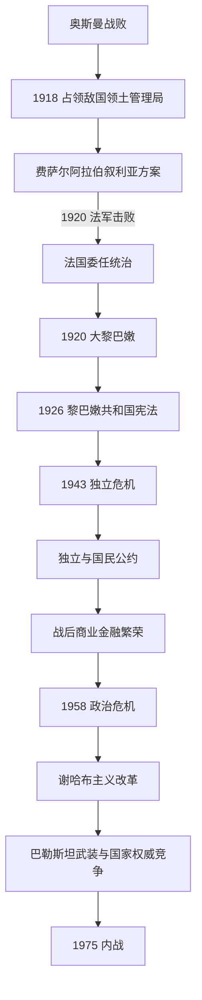

# 法国委任统治与黎巴嫩共和国

## 时间

1918—1975年

## 概括

现代黎巴嫩不是奥斯曼黎巴嫩山的简单改名。第一次世界大战后，法国在1920年把黎巴嫩山穆塔萨里夫领同贝鲁特、的黎波里、阿卡尔、贝卡、西顿、推罗和南部地区合并为“大黎巴嫩”。扩张获得港口、粮田和更完整经济空间，也使逊尼派、什叶派和希腊正教等人口比重显著增加。许多马龙派精英把新国家视为受法国保护的历史家园，不少穆斯林精英最初更支持同叙利亚的政治联系，国家边界因而从一开始就需要协商合法性。

1926年宪法建立共和国、总统和议会，法国最高专员仍控制外交、军队、财政监督和制度暂停权。1943年比沙拉·胡里与里亚德·苏勒赫以“国民公约”协调国家方向：基督教精英不再寻求西方保护下的分离，穆斯林精英接受独立黎巴嫩而非立即并入叙利亚；高级职位按宗派惯例分配。公约从未成为一份单独签署的宪法文本，却长期决定总统、总理和议会议长的社群身份。

独立后的贝鲁特以自由贸易、银行、教育、出版和地区中介服务繁荣。增长分布不均，山地和南部的贫困、国家公共服务不足、人口结构变化及1948年后巴勒斯坦难民问题不断冲击1932年人口普查基础上的政治配额。1958年危机暂由福阿德·谢哈布改革和国际调停缓解；1969年以后巴勒斯坦武装自治、阿以冲突、黎巴嫩党派民兵和外部支持网络使国家武力日益分裂，1975年最终进入全面内战。

## 演变图

## 1918—1920年：帝国真空与划界

1918年奥斯曼军撤退后，英法军事占领体系接管黎凡特。费萨尔及阿拉伯民族主义者在大马士革试图建立统一阿拉伯叙利亚，贝鲁特和部分穆斯林领袖倾向加入；黎巴嫩山行政委员会和马龙派宗主教胡韦伊克则向巴黎要求在法国保护下扩大黎巴嫩边界。

1920年4月圣雷莫会议把叙利亚—黎巴嫩委任权交给法国。7月法军在迈萨隆击败费萨尔政权。9月1日最高专员古罗宣布“大黎巴嫩”，把原山地自治区域同港口、沿海平原和贝卡合并。现代疆域的核心由此形成，但边界不是对一个既存民族国家的简单确认，而是法国战略、马龙派诉求、经济可行性和帝国分割共同结果。

## 委任统治结构

| 层级 | 机构 | 实际权力 |
|---|---|---|
| 法国最高专员 | 驻贝鲁特，统辖叙利亚、黎巴嫩等委任实体 | 可发布法令、否决或暂停宪法、控制外交与军队，是最终权力中心。 |
| 黎巴嫩总统 | 1926年后由议会选出或在宪制中断时由法国指定 | 领导本地行政，但任免和政策受最高专员制约。 |
| 总理与部长会议 | 负责日常治理 | 逐渐形成按社群协商组阁的惯例。 |
| 议会 | 宗派和地区代表 | 可立法、选总统和审预算，但多次被法国暂停。 |
| 法属黎凡特军队与安全机关 | 法国军官及本地部队 | 维持秩序、控制边境；独立前不受黎巴嫩政府完整指挥。 |

最高专员、委任总统和政府首脑完整序列见[黎巴嫩山统治者、总督与共和国领导人表](/%E4%BA%BA%E6%96%87%E7%A7%91%E5%AD%A6/%E5%8E%86%E5%8F%B2/%E8%A5%BF%E4%BA%9A/%E9%BB%8E%E5%87%A1%E7%89%B9/%E9%BB%8E%E5%B7%B4%E5%AB%A9/%E9%BB%8E%E5%B7%B4%E5%AB%A9%E5%B1%B1%E7%BB%9F%E6%B2%BB%E8%80%85%E3%80%81%E6%80%BB%E7%9D%A3%E4%B8%8E%E5%85%B1%E5%92%8C%E5%9B%BD%E9%A2%86%E5%AF%BC%E4%BA%BA%E8%A1%A8.md)。

## 1926年共和国与宗派配额

1926年宪法采用议会共和国形式，规定总统、总理、部长会议和两院议会，后来改为一院制。第95条把宗派代表描述为临时、公平措施，但没有设定明确终止办法。1932年人口普查显示基督徒略占多数，1943年后议席以基督徒对穆斯林6:5分配；政治惯例把马龙派总统、逊尼派总理、什叶派议长、希腊正教副议长等职务固定下来。

这套制度的优势是让多个社群精英都能否决排斥自身的安排，并以联合内阁降低多数垄断风险；弱点是人口、地区和社会阶级利益必须先通过宗派领袖表达，选举和公务职位容易变成庇护资源，且没有定期人口普查来调整代表性。

1936年法国同黎巴嫩谈判独立条约，黎巴嫩议会批准，法国议会却未正式批准。此后法国在欧洲战争前继续掌握军政权力。1940年维希法国接管，1941年英军和自由法国发动叙利亚—黎巴嫩战役；自由法国宣布承认独立原则，却迟迟不愿移交全部实际权限。

## 1943年独立过程

1. **选举与修宪**：1943年议会选出比沙拉·胡里为总统，里亚德·苏勒赫组阁。议会删除宪法中法国委任统治痕迹，宣示完整主权。
2. **法国逮捕领导人**：11月11日自由法国总代表让·埃勒逮捕总统、总理和多名部长，把他们关押在拉沙亚堡，并以埃米尔·埃德建立替代行政。
3. **国内抵抗与国际压力**：未被捕部长在贝沙蒙组成政府，罢工和示威扩展；英国、阿拉伯国家和其他盟国向法国施压。
4. **11月22日获释**：法国释放领导人并恢复政府，后来被定为独立日。1944年政府逐步接管行政，1945年黎巴嫩加入联合国和阿拉伯联盟。
5. **撤军完成**：法国最后部队1946年撤离，独立才在军事层面完成。

独立既来自黎巴嫩跨社群精英妥协和大众动员，也得益于法国战时虚弱、英国压力和新的国际秩序；不能只归功于某一宗派或一次宣言。

## 国民公约与第一共和国

国民公约没有固定书面文本，其核心是双向克制：马龙派领导层承认黎巴嫩具有阿拉伯面向、不依靠法国长期保护；逊尼派领导层承认独立黎巴嫩、不追求立即并入叙利亚。公约以1932年人口普查和6:5议席比为背景，由宗派精英协商国家重大事项。

总统在宪法上有任命总理、主持内阁和发布法令等强权，总理需要总统和议会支持，议长则通过议会议程发挥作用。制度没有自动的多数派—反对派轮替，跨宗派“名单”和领袖交易比全国性政党纪律更重要。

## 经济繁荣与不均衡

1940—1960年代，贝鲁特利用外汇自由、银行保密、港口、航空、大学和新闻出版成为地区服务中心。阿拉伯资本、石油收入和侨汇流入，旅游和建筑兴盛。国家采取相对自由放任政策，私人学校、医院和宗教慈善承担大量服务。

增长没有同步覆盖阿卡尔、贝卡、南部和城市贫民区。地主和商业金融精英获益较多，什叶派农民及城市新移民尤其感到政治代表和公共投资不足。农村人口进入贝鲁特郊区，传统领袖通过就业、执照和福利维持支持。现代化因此增强国家收入，也扩大对宗派庇护的依赖。

## 重要政治阶段

### 1952年“白色革命”

比沙拉·胡里1949年通过修宪延任，反对派指控家族主义和腐败。1952年跨宗派反对联盟以罢市和政治压力迫其辞职，军方在福阿德·谢哈布领导下保持相对中立并组织过渡。卡米勒·夏蒙当选，显示精英协商仍能在不大规模内战下更替总统。

### 1958年危机

夏蒙靠近美国“艾森豪威尔主义”，未同埃及—叙利亚的阿拉伯联合共和国断绝对立；反对派又担心他修宪延任。1958年内战式冲突在贝鲁特、的黎波里和山地扩展。伊拉克革命后，夏蒙请求美国出兵，美海军陆战队登陆。美国、埃及和本地精英最终接受陆军司令福阿德·谢哈布为共识总统，危机没有演变为全面地区战争。

### 谢哈布主义改革

福阿德·谢哈布和继任时期建立中央文官委员会、社会发展与统计机构，加强军队和第二局情报体系，向外围地区修路、建校和提供公共服务。改革试图用国家能力减轻宗派庇护，却受到传统领袖反抗，安全机关扩张也引发监控和选举干预批评。1961年叙利亚社会民族党政变失败后，情报国家色彩更强。

### 巴勒斯坦武装问题

1948年战争后大量巴勒斯坦难民进入黎巴嫩，公民权、就业和营地管理长期受限制。1967年战争和巴勒斯坦民族运动武装化后，营地与南部跨境行动增多。1969年在埃及斡旋下签署《开罗协议》，黎巴嫩承认巴勒斯坦人在营地内一定自治和从南部开展武装行动的空间，国家对武力的统一控制被制度性削弱。

1970年约旦“黑色九月”后，巴解组织领导和武装重心转入黎巴嫩。以色列为报复跨境袭击打击南部和贝鲁特，南部居民大量迁移；黎巴嫩军队与巴解组织也在1973年直接交战。支持巴勒斯坦事业、保护国家主权和不同社群安全三者越来越难兼容。

## 走向内战的结构因素

- **代表失衡**：政治仍以1932年人口普查和6:5比例运作，穆斯林尤其什叶派人口和城市化上升后，制度调整不足。
- **社会不均**：港口金融繁荣同南部、贝卡和城市贫民区的公共服务短缺并存；穆萨·萨德尔1974年组织“被剥夺者运动”，把什叶派社会动员转为全国力量。
- **武力多元**：巴解组织、基督教政党民兵、左翼—民族主义团体、社群自卫组织和国家军队同时武装，冲突一旦发生便难由警察控制。
- **地区战争**：以色列—巴勒斯坦冲突、叙利亚战略、冷战和阿拉伯国家资助把本地联盟连接到外部军队与军火。
- **制度僵局**：总统、总理和议会依赖全套精英妥协；当各方对国家身份、巴解组织和改革均无共同底线时，宪制没有有效仲裁机制。
- **直接触发**：1975年4月13日艾因鲁马内公交车枪击造成巴勒斯坦人死亡，报复迅速扩展。事件是引爆点，不是战争的唯一原因。

## 重要事件

| 时间 | 事件 | 结果与影响 |
|---|---|---|
| 1920年9月1日 | 宣布大黎巴嫩 | 现代疆域核心形成，经济空间和社群构成同时改变。 |
| 1926年 | 颁布宪法 | 建立共和国和宗派代表框架，法国保留最终权力。 |
| 1932年 | 人口普查 | 后来6:5议席比例的重要依据，此后未再举行同类全面宗派普查。 |
| 1943年11月 | 独立危机 | 法国逮捕领导人失败，11月22日成为独立日。 |
| 1946年 | 法军撤离 | 军事占领正式结束。 |
| 1948年 | 第一次阿以战争及难民进入 | 巴勒斯坦营地和公民权问题成为长期国家议题。 |
| 1952年 | 胡里辞职 | 以政治罢工完成首次总统更替。 |
| 1958年 | 国内冲突与美军登陆 | 谢哈布共识和国家建设改革开始。 |
| 1969年 | 《开罗协议》 | 巴勒斯坦武装获有限自治，国家武力垄断进一步削弱。 |
| 1970—1973年 | 巴解组织重心转移及军队冲突 | 南部跨境战争和国内军事化加深。 |
| 1975年4月 | 艾因鲁马内枪击 | 累积危机转为全面内战。 |

## 演变关系

- 前一阶段：[腓尼基、山地社群与奥斯曼黎巴嫩](/%E4%BA%BA%E6%96%87%E7%A7%91%E5%AD%A6/%E5%8E%86%E5%8F%B2/%E8%A5%BF%E4%BA%9A/%E9%BB%8E%E5%87%A1%E7%89%B9/%E9%BB%8E%E5%B7%B4%E5%AB%A9/%E8%85%93%E5%B0%BC%E5%9F%BA%E3%80%81%E5%B1%B1%E5%9C%B0%E7%A4%BE%E7%BE%A4%E4%B8%8E%E5%A5%A5%E6%96%AF%E6%9B%BC%E9%BB%8E%E5%B7%B4%E5%AB%A9.md)。
- 委任统治跨区域背景见[英法委任统治时期](/%E4%BA%BA%E6%96%87%E7%A7%91%E5%AD%A6/%E5%8E%86%E5%8F%B2/%E8%A5%BF%E4%BA%9A/%E9%BB%8E%E5%87%A1%E7%89%B9/%E8%8B%B1%E6%B3%95%E5%A7%94%E4%BB%BB%E7%BB%9F%E6%B2%BB%E6%97%B6%E6%9C%9F.md)。
- 巴勒斯坦难民与武装主线见[巴勒斯坦](/%E4%BA%BA%E6%96%87%E7%A7%91%E5%AD%A6/%E5%8E%86%E5%8F%B2/%E8%A5%BF%E4%BA%9A/%E9%BB%8E%E5%87%A1%E7%89%B9/%E5%B7%B4%E5%8B%92%E6%96%AF%E5%9D%A6/README.md)。
- 后续进入[内战、塔伊夫体制与当代黎巴嫩](/%E4%BA%BA%E6%96%87%E7%A7%91%E5%AD%A6/%E5%8E%86%E5%8F%B2/%E8%A5%BF%E4%BA%9A/%E9%BB%8E%E5%87%A1%E7%89%B9/%E9%BB%8E%E5%B7%B4%E5%AB%A9/%E5%86%85%E6%88%98%E3%80%81%E5%A1%94%E4%BC%8A%E5%A4%AB%E4%BD%93%E5%88%B6%E4%B8%8E%E5%BD%93%E4%BB%A3%E9%BB%8E%E5%B7%B4%E5%AB%A9.md)。
- 上级入口：[黎巴嫩](/%E4%BA%BA%E6%96%87%E7%A7%91%E5%AD%A6/%E5%8E%86%E5%8F%B2/%E8%A5%BF%E4%BA%9A/%E9%BB%8E%E5%87%A1%E7%89%B9/%E9%BB%8E%E5%B7%B4%E5%AB%A9/README.md)。
