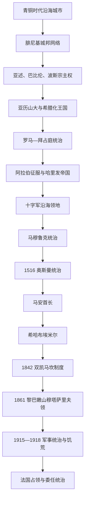

# 腓尼基、山地社群与奥斯曼黎巴嫩

## 时间

约前3千纪—1918年

## 概括

今黎巴嫩的长时段前史由两种空间共同构成：地中海沿岸的港口城邦，以及黎巴嫩山、贝卡谷地和南部丘陵的农业—山地社会。比布鲁斯、西顿、推罗等腓尼基城市从未组成现代意义的统一国家，它们依靠木材、紫色染料、金属转运和航海技术建立跨地中海网络，并在埃及、亚述、巴比伦、波斯等强权之间纳贡和竞争。把腓尼基直接称为“古代黎巴嫩民族国家”会抹去城邦差异和现代边界形成得很晚这一事实。

罗马和拜占庭以道路、城市、军团殖民地与教区整合沿海和内陆。阿拉伯征服后，阿拉伯语和伊斯兰制度逐渐占主导，但马龙派、希腊正教、后来的德鲁兹和什叶派等社群在山地形成不同聚居网络。十字军、马穆鲁克和奥斯曼的更替没有创造一个固定的“黎巴嫩省”，而是把今天的国土分属的黎波里、西顿、贝鲁特、大马士革等行政和税区。

奥斯曼时期马安与希哈布首长以税收承包和地方联盟扩张，不是全黎巴嫩的主权王朝。丝绸经济、马龙派农民南迁、德鲁兹领主权力、欧洲领事与教会网络共同改变山地社会。1842年后的双凯马坎制度和1861年穆塔萨里夫领把宗派代表写入行政，既结束部分武装冲突，也为现代宗派政治提供制度先例。第一次世界大战中的封锁、征粮、蝗灾和奥斯曼军事统治最终摧毁这套秩序。

## 演变图

## 古代沿海城邦

| 阶段 | 主要中心 | 统治和经济机制 | 重要变化 |
|---|---|---|---|
| 青铜时代 | 比布鲁斯、贝鲁特、西顿、推罗前身 | 宫廷、神庙、木材和海运贸易 | 比布鲁斯同埃及王朝长期交换雪松、纸草与奢侈品；城市各自为政。 |
| 铁器时代腓尼基 | 推罗、西顿、比布鲁斯、阿尔瓦德等 | 城邦国王、商人寡头、神庙与海外据点 | 字母文字、造船、染料和殖民网络扩展；迦太基等海外城市发展出独立政治。 |
| 亚述—巴比伦宗主权 | 沿海诸城 | 纳贡、提供舰船，部分保留王室 | 反叛常遭围城、迁徙或提高贡赋；推罗海岛位置增强防御。 |
| 波斯时期 | 西顿、推罗等 | 腓尼基舰队服务阿契美尼德，地方王室继续 | 西顿约前351年反波斯失败并遭破坏。 |
| 希腊化时期 | 推罗、西顿、贝鲁特 | 马其顿王朝驻军、希腊城市制度与本地宗教并存 | 前332年亚历山大修筑堤道攻陷推罗，结束其海岛优势。 |
| 罗马—拜占庭时期 | 贝里图斯、赫利奥波利斯、推罗 | 行省、自治城市、军团殖民地、主教区 | 贝鲁特法学院闻名，巴勒贝克神庙群扩建；基督教化后主教区成为组织网络。 |

## 中世纪帝国与社群形成

7世纪30年代阿拉伯军队夺取叙利亚和沿海城市。倭马亚王朝重建港口和舰队，并迁入军民防守拜占庭海袭；阿拔斯时期中央重心东移，地方总督和沿海防线更替。法蒂玛、塞尔柱及其地方势力先后争夺黎凡特。阿拉伯语逐渐成为行政和公共语言，但宗教、村落与山区差异延续。

马龙派教会在北部山地和卡迪沙谷扩展；德鲁兹信仰于11世纪从伊斯玛仪派环境中形成，在舒夫、瓦迪泰姆等地扎根；十二伊玛目什叶派社群在贾巴勒阿米勒和贝卡部分地区延续；逊尼派人口主要集中港口和平原城市，希腊正教、希腊天主教、亚美尼亚等社群也构成商业和城市网络。今日各社群没有一条单一、封闭的起源线，迁徙、改宗、婚姻和经济分工都很重要。

1099年以后，今黎巴嫩北部主要进入的黎波里伯国，贝鲁特、西顿、推罗属于耶路撒冷王国的领主体系。沿海城堡和意大利商人特权恢复地中海贸易，山地却常由本地首长、教会和不同穆斯林政权控制。马穆鲁克在1289年夺取的黎波里、1291年攻下阿卡后清除多数十字军据点，并迁移或削弱部分沿海聚落以防再登陆。

## 奥斯曼统治结构

1516年奥斯曼击败马穆鲁克后，今天黎巴嫩的地区分属大马士革、的黎波里和后来设立的西顿等行省。帝国不承认一个同现代国界重合的“黎巴嫩国家”。地方治理由行省总督、法官、驻军、宗教机构和税收承包者共同承担。

- **税收承包**：马安、希哈布、哈富什、赛法等家族竞逐若干税区，须向行省总督和中央缴款；任命可以按年确认，也会因欠税、叛乱或政治交易被撤换。
- **山地联盟**：埃米尔依靠德鲁兹穆卡塔吉领主、马龙派管家和村社武装，不拥有现代官僚国家的直接统治能力。
- **丝绸经济**：17—19世纪欧洲需求推动桑蚕、丝绸和贝鲁特港发展。马龙派农民、商人和修会经济实力上升，德鲁兹军事—土地领主仍掌大量政治权力，形成不均衡依存。
- **外部保护**：法国偏向马龙派及天主教网络，英国同德鲁兹精英建立关系，俄国支持希腊正教；领事保护既扩大教育和贸易，也使地方冲突国际化。

马安、希哈布的完整掌权段及后来的总督序列见[黎巴嫩山统治者、总督与共和国领导人表](/%E4%BA%BA%E6%96%87%E7%A7%91%E5%AD%A6/%E5%8E%86%E5%8F%B2/%E8%A5%BF%E4%BA%9A/%E9%BB%8E%E5%87%A1%E7%89%B9/%E9%BB%8E%E5%B7%B4%E5%AB%A9/%E9%BB%8E%E5%B7%B4%E5%AB%A9%E5%B1%B1%E7%BB%9F%E6%B2%BB%E8%80%85%E3%80%81%E6%80%BB%E7%9D%A3%E4%B8%8E%E5%85%B1%E5%92%8C%E5%9B%BD%E9%A2%86%E5%AF%BC%E4%BA%BA%E8%A1%A8.md)。

## 地方首长的兴衰

### 法赫尔丁二世

法赫尔丁二世从舒夫税收承包者扩张到西顿、贝鲁特、萨法德和贝卡部分地区。他以按时缴税、地方军队、同托斯卡纳和欧洲商人的关系及丝绸收入构建实力；1613年奥斯曼远征迫其流亡，1618年获准返回。此后他再度扩张并加强城堡、港口和农业，触发中央对地方坐大的警惕。1633年奥斯曼大军击败其部属并将他俘获，1635年处死。其失败的直接原因是税区扩张和军事自主越过中央可接受界限，而不是一个现代“黎巴嫩独立运动”被镇压。

### 希哈布家族

1697年艾哈迈德·马安无嗣，德鲁兹首领选出其希哈布亲族。1711年艾因达拉战役使卡伊西联盟击败亚马尼联盟，胜方重分土地和税区，部分失败家族迁往豪兰。18世纪中后期阿卡总督频繁通过收买、撤换和分割税区控制希哈布继承，因而出现大量共治和复位。

巴希尔二世从1789年起逐步削弱德鲁兹和马龙派传统领主，建立更直接的宫廷财政。他镇压1820—1821年跨社群抗税运动，1825年除掉巴希尔·琼布拉特后权力达到顶峰。1831—1840年他支持穆罕默德·阿里和易卜拉欣帕夏占领叙利亚；埃及的征兵、缴械和高税激起反抗。1840年英国、奥斯曼及盟军迫使埃及撤退，巴希尔二世失去外援并流亡。巴希尔三世无法恢复旧联盟，1842年埃米尔制被废。

## 19世纪制度转换

### 双凯马坎与社会冲突

奥斯曼先试图直接任命奥马尔帕夏，后在列强压力下把黎巴嫩山划为北部基督徒凯马坎和南部德鲁兹凯马坎。混居地区究竟归谁、领主和农民谁代表社群，始终没有解决。1845年冲突后，谢基布·埃芬迪规章为各区设宗派委员会，把身份配额制度化。

1858年凯斯鲁万马龙派农民在坦尤斯·沙欣领导下反抗哈津领主，土地与阶级冲突迅速带上宗派动员色彩。1860年德鲁兹—马龙派战争从山地扩展，大量村庄被毁，随后大马士革基督徒也遭屠杀。奥斯曼军队处置失当、地方精英煽动和列强竞争共同放大暴力，不能用“古老宗教仇恨”单因解释。

### 穆塔萨里夫领

1861年奥斯曼同欧洲列强制定规章：由非本地奥斯曼基督徒总督直接向中央负责，十二人行政委员会分配给马龙派、德鲁兹、希腊正教、希腊天主教、逊尼派和什叶派。1864年修订后基督徒与穆斯林席位为7:5。当地宪兵、较稳定税制、道路和学校促进相对和平与丝绸出口。

这一制度的范围不包括贝鲁特、的黎波里、西顿和大部分贝卡，因此不能直接等同现代黎巴嫩。它的稳定依赖欧洲—奥斯曼协调、丝绸收入和大规模海外移民缓解人口压力；当世界大战打破国际保证和贸易时，脆弱性迅速暴露。

## 第一次世界大战与大饥荒

1915年杰马勒帕夏取消特殊自治，军队接管山地，逮捕和处决被指控参与阿拉伯民族主义活动的人士。协约国海上封锁、奥斯曼对粮食运输的控制和征用、投机囤积、1915年蝗灾以及从谷物区切断供给共同造成1915—1918年大饥荒。死亡数字存在估计差异，但山地人口损失极为严重，伴随疾病、卖地、移民和家庭结构崩溃。

1918年奥斯曼战败，阿拉伯军和英法部队先后进入贝鲁特。穆塔萨里夫领没有恢复；山地精英关于扩大边界的诉求、费萨尔的阿拉伯叙利亚方案和法国的委任计划转而竞争现代国家形态。

## 重要事件

| 时间 | 事件 | 结果与长期影响 |
|---|---|---|
| 前332年 | 亚历山大围攻推罗 | 修堤攻陷海岛城，希腊化统治开始。 |
| 前64年 | 罗马控制叙利亚 | 沿海城市与贝卡纳入统一行省、道路和法律网络。 |
| 7世纪30年代 | 阿拉伯征服 | 政治中心和公共语言逐步阿拉伯化，宗教多元延续。 |
| 1289—1291年 | 马穆鲁克清除十字军沿海据点 | 的黎波里、推罗等回到穆斯林王朝统治。 |
| 1516年 | 奥斯曼征服 | 地区进入多行省、税收承包和地方首长体系。 |
| 1633—1635年 | 法赫尔丁二世被俘处死 | 马安扩张受挫，显示地方自主仍受帝国任免约束。 |
| 1711年 | 艾因达拉战役 | 德鲁兹派系重组和人口迁移，希哈布统治巩固。 |
| 1820—1821年 | 平民抗税运动 | 村社代表挑战埃米尔和领主财政权。 |
| 1840—1842年 | 埃及撤退、希哈布灭亡 | 奥斯曼废除埃米尔制，转向宗派分区行政。 |
| 1858—1860年 | 农民起义与宗派战争 | 阶级、土地、社群和列强竞争汇合，造成大规模暴力。 |
| 1861年 | 建立穆塔萨里夫领 | 列强监督的宗派代表制和有限自治形成。 |
| 1915—1918年 | 取消自治与大饥荒 | 山地社会遭重创，奥斯曼秩序随战争终结。 |

## 兴衰分析

- **沿海城邦的崛起**依靠雪松、港口、航海和跨区域中介贸易；衰落常由大国海陆军优势、贡赋压力和贸易中心转移造成，而不是“腓尼基人突然消失”。
- **山地首长的力量**来自税收承包、武装领主、丝绸和跨社群合作；其弱点是任命合法性掌握在奥斯曼及行省总督手中，继承经常被外力操纵。
- **宗派制度化**并非仅由神学差异产生。人口迁徙、土地权利、丝绸财富、领主—农民冲突和欧洲保护共同把社群身份变成政治代表单位。
- **穆塔萨里夫领的稳定**依靠国际保证和出口经济；大战同时摧毁外交、运输与粮食供应，直接导致制度和社会危机。

## 演变关系

- 腓尼基跨国主线见[腓尼基城邦](/%E4%BA%BA%E6%96%87%E7%A7%91%E5%AD%A6/%E5%8E%86%E5%8F%B2/%E8%A5%BF%E4%BA%9A/%E9%BB%8E%E5%87%A1%E7%89%B9/%E8%85%93%E5%B0%BC%E5%9F%BA%E5%9F%8E%E9%82%A6.md)。
- 阿拉伯征服见[阿拉伯征服与伊斯兰化时期的黎凡特](/%E4%BA%BA%E6%96%87%E7%A7%91%E5%AD%A6/%E5%8E%86%E5%8F%B2/%E8%A5%BF%E4%BA%9A/%E9%BB%8E%E5%87%A1%E7%89%B9/%E9%98%BF%E6%8B%89%E4%BC%AF%E5%BE%81%E6%9C%8D%E4%B8%8E%E4%BC%8A%E6%96%AF%E5%85%B0%E5%8C%96%E6%97%B6%E6%9C%9F%E7%9A%84%E9%BB%8E%E5%87%A1%E7%89%B9.md)。
- 十字军—马穆鲁克阶段见[十字军国家与阿尤布、马穆鲁克时期](/%E4%BA%BA%E6%96%87%E7%A7%91%E5%AD%A6/%E5%8E%86%E5%8F%B2/%E8%A5%BF%E4%BA%9A/%E9%BB%8E%E5%87%A1%E7%89%B9/%E5%8D%81%E5%AD%97%E5%86%9B%E5%9B%BD%E5%AE%B6%E4%B8%8E%E9%98%BF%E5%B0%A4%E5%B8%83%E3%80%81%E9%A9%AC%E7%A9%86%E9%B2%81%E5%85%8B%E6%97%B6%E6%9C%9F.md)。
- 后续进入[法国委任统治与黎巴嫩共和国](/%E4%BA%BA%E6%96%87%E7%A7%91%E5%AD%A6/%E5%8E%86%E5%8F%B2/%E8%A5%BF%E4%BA%9A/%E9%BB%8E%E5%87%A1%E7%89%B9/%E9%BB%8E%E5%B7%B4%E5%AB%A9/%E6%B3%95%E5%9B%BD%E5%A7%94%E4%BB%BB%E7%BB%9F%E6%B2%BB%E4%B8%8E%E9%BB%8E%E5%B7%B4%E5%AB%A9%E5%85%B1%E5%92%8C%E5%9B%BD.md)。
- 上级入口：[黎巴嫩](/%E4%BA%BA%E6%96%87%E7%A7%91%E5%AD%A6/%E5%8E%86%E5%8F%B2/%E8%A5%BF%E4%BA%9A/%E9%BB%8E%E5%87%A1%E7%89%B9/%E9%BB%8E%E5%B7%B4%E5%AB%A9/README.md)。
