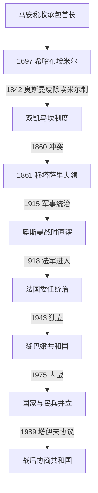

# 黎巴嫩山统治者、总督与共和国领导人表

## 时间

1516年至今（当代资料核验截至2026年7月13日）

## 概括

本表区分五种不能混同的权力：奥斯曼主权下的山地税收承包首长、列强监督下的黎巴嫩山穆塔萨里夫、法国统治全黎凡特的最高专员、黎巴嫩共和国总统和政府首脑。马安、希哈布埃米尔并非现代黎巴嫩疆域内的独立国王；法国最高专员也不是由黎巴嫩人选出的国家元首。

古代推罗、西顿、比布鲁斯各有王统，但材料分散且属于不同城邦，不能拼成一条“黎巴嫩国王世系”；相关节点见[腓尼基、山地社群与奥斯曼黎巴嫩](/%E4%BA%BA%E6%96%87%E7%A7%91%E5%AD%A6/%E5%8E%86%E5%8F%B2/%E8%A5%BF%E4%BA%9A/%E9%BB%8E%E5%87%A1%E7%89%B9/%E9%BB%8E%E5%B7%B4%E5%AB%A9/%E8%85%93%E5%B0%BC%E5%9F%BA%E3%80%81%E5%B1%B1%E5%9C%B0%E7%A4%BE%E7%BE%A4%E4%B8%8E%E5%A5%A5%E6%96%AF%E6%9B%BC%E9%BB%8E%E5%B7%B4%E5%AB%A9.md)。

## 马安家族主要山地首长

早期马安谱系混合后世家族传统和奥斯曼档案，不能给出无争议的连续“君主表”。下表从16世纪奥斯曼材料较清楚的税收承包首长列起。

| 顺序 | 首长 | 掌权时间 | 继承关系 | 关键事件与备注 |
|---:|---|---|---|---|
| 1 | 法赫尔丁一世·马安 | 约1516—1544年 | 马安家族首长 | 获任舒夫税收承包者，曾兼管西顿—贝鲁特和萨法德部分地区；不是全黎巴嫩主权君主。 |
| 2 | 库尔库马兹·马安 | 1544—1585年 | 法赫尔丁一世之子 | 在奥斯曼清剿中逃亡并死去，家族势力一度受挫。 |
| 3 | **法赫尔丁二世·马安** | 1591—1613年、1618—1633年 | 库尔库马兹之子 | 扩张西顿、贝鲁特、萨法德等税区，发展丝绸与欧洲贸易；1613—1618年流亡托斯卡纳。1633年被俘，1635年在伊斯坦布尔处死。 |
| — | 尤努斯·马安与阿里·马安 | 1613—1618年 | 法赫尔丁二世之弟及之子 | 在其流亡期间分别维持舒夫税区和家族军政，不构成公认的独立埃米尔继承段。 |
| 4 | 穆勒希姆·马安 | 1635—1658年 | 法赫尔丁二世之侄 | 获奥斯曼确认管理舒夫及邻近若干区，恢复家族税收承包网络。 |
| 5 | 艾哈迈德·马安 | 1658—1697年 | 法赫尔丁二世之孙 | 利用帝国战争扩大自主，死后无男性继承人；德鲁兹首领会议选择希哈布亲族接替。 |

## 希哈布埃米尔完整掌权段

“埃米尔”是奥斯曼地方首长和税收承包者头衔。地区总督可以任免、分割或转售税区，因此复位、共治和短暂替代是制度本身的一部分。

| 掌权段 | 埃米尔 | 时间 | 与前任关系 | 备注 |
|---:|---|---|---|---|
| 1 | 巴希尔一世 | 1697—1705年 | 马安家族姻亲 | 为年幼海达尔摄政并实际居首。 |
| 2 | 海达尔 | 1705—1732年 | 马安女系后裔 | 1711年艾因达拉战役后卡伊西派获胜，重分山地税区。 |
| 3 | 穆勒希姆 | 1732—1753年 | 海达尔长子 | 扩大贝鲁特税区；因病被弟弟迫退。 |
| 4 | 曼苏尔与艾哈迈德 | 1753—1760年 | 穆勒希姆之弟 | 共治，后因争权分裂。 |
| 5 | 卡西姆 | 1760年前后 | 穆勒希姆之子 | 由西顿总督短暂任命，旋即被叔父取代。 |
| 6 | 曼苏尔 | 1760—1770年 | 复位 | 单独掌权，因同地方强人结盟而被山地首领迫退。 |
| 7 | 优素福 | 1770—1778年 | 穆勒希姆之子 | 在阿卡、西顿总督与德鲁兹派系间周旋。 |
| 8 | 赛义德·艾哈迈德与埃芬迪 | 1778年前后 | 优素福之兄弟 | 获阿卡总督支持短暂取得舒夫税区。 |
| 9 | 优素福 | 1778—1789年 | 复位 | 第二次掌权，持续受艾哈迈德·杰扎尔帕夏财政与军事控制。 |
| 10 | **巴希尔二世** | 1789—1794年 | 海达尔旁支后裔 | 第一次掌权，逐步集中权力。 |
| 11 | 侯赛因与萨阿德丁 | 1794—1795年 | 优素福年幼诸子 | 马龙派管家吉尔吉斯·巴兹掌实权。 |
| 12 | 巴希尔二世 | 1795—1799年 | 复位 | 第二次掌权。 |
| 13 | 侯赛因与萨阿德丁 | 1799—1800年 | 再度被立 | 第二次共治。 |
| 14 | 巴希尔二世 | 1800—1819年 | 再次复位 | 第三次掌权；削弱传统领主。 |
| 15 | 哈桑与萨勒曼 | 1819—1820年 | 希哈布拉沙亚支系 | 在巴希尔二世暂时失势时被立。 |
| 16 | 巴希尔二世 | 1820—1821年 | 复位 | 第四次掌权，面对1820—1821年平民抗税运动。 |
| 17 | 哈桑与萨勒曼 | 1821年 | 再次被立 | 第二次短暂共治。 |
| 18 | 阿巴斯 | 1821—1822年 | 海达尔旁支 | 短暂掌权。 |
| 19 | 巴希尔二世 | 1822—1840年 | 第五次复位 | 借阿卡总督和穆罕默德·阿里埃及势力中央集权；1840年埃及撤退后向英国投降并流亡。 |
| 20 | 巴希尔三世 | 1840—1842年 | 卡西姆之子 | 无法调和德鲁兹、马龙派首领与平民力量；1842年奥斯曼废除埃米尔制。 |

## 黎巴嫩山穆塔萨里夫

1861年规章要求总督为非本地奥斯曼基督徒，由苏丹任命并获欧洲列强认可；十二人行政委员会按宗派分配席位。1915年战争状态下这一特殊制度被杰马勒帕夏取消。

| 顺序 | 穆塔萨里夫 | 任期 | 宗教 / 背景 | 关键事项 |
|---:|---|---|---|---|
| 1 | 达乌德帕夏（加拉贝德·达乌迪安） | 1861—1868年 | 亚美尼亚天主教；伊斯坦布尔官员 | 建立新行政、宪兵和道路，面对优素福·卡拉姆反对。 |
| 2 | 弗兰科帕夏（纳斯里·库萨） | 1868—1873年 | 麦基特希腊天主教；阿勒颇人 | 扩充学校和农业项目，任内去世。 |
| 3 | 吕斯泰姆帕夏 | 1873—1883年 | 拉丁天主教；意大利裔归化奥斯曼人 | 强调中央权威，同神职人员和地方委员会冲突。 |
| 4 | 瓦萨帕夏 | 1883—1892年 | 阿尔巴尼亚天主教 | 改善行政与道路，后期任用亲属引发腐败批评。 |
| 5 | 纳乌姆帕夏 | 1892—1902年 | 麦基特希腊天主教；阿勒颇人 | 整顿财政与官员，大规模修路，海外移民加速。 |
| 6 | 穆扎法尔帕夏 | 1902—1907年 | 拉丁天主教；波兰裔 | 增税和任用争议削弱行政委员会信任。 |
| 7 | 优素福帕夏·弗兰科 | 1907—1912年 | 麦基特希腊天主教；第二任之子 | 干预司法和媒体，引发反对。 |
| 8 | 奥汉内斯帕夏·库尤姆吉安 | 1912—1915年 | 亚美尼亚天主教 | 改革委员会选举；第一次世界大战中制度被军事统治取代。 |

1915—1918年阿里·穆尼夫贝伊、伊斯梅尔贝伊和穆姆塔兹贝伊等由奥斯曼第四军体系直接任命，不再属于1861年规章认可的穆塔萨里夫。

## 法国在黎凡特的最高行政首脑

最高专员驻贝鲁特并统辖法属叙利亚、黎巴嫩及其他黎凡特实体；其权力高于黎巴嫩总统和议会。1941年以后自由法国代表改称总代表。

| 顺序 | 最高专员 / 总代表 | 任期 | 黎巴嫩相关事项 |
|---:|---|---|---|
| 1 | **亨利·古罗** | 1919—1922年 | 1920年击败费萨尔政权并宣布建立“大黎巴嫩”。 |
| — | 罗贝尔·德凯 | 1922—1923年 | 代理。 |
| 2 | 马克西姆·魏刚 | 1923—1924年 | 委任统治正式生效后的行政整合。 |
| 3 | 莫里斯·萨拉伊 | 1924—1925年 | 强硬世俗共和派，任内叙利亚大起义扩展。 |
| 4 | 亨利·德茹弗内尔 | 1925—1926年 | 推动地方宪制安排，黎巴嫩1926年立宪。 |
| 5 | 奥古斯特·蓬索 | 1926—1933年 | 监督共和国制度和边界内的财政、外交与军权。 |
| 6 | 达米安·德马泰尔 | 1933—1939年 | 维持法国最终控制，处理1936年条约与议会问题。 |
| 7 | 加布里埃尔·皮奥 | 1939—1940年 | 第二次世界大战初期。 |
| 8 | 亨利·登茨 | 1940—1941年 | 维希法国最高专员；1941年英军与自由法国占领后离任。 |
| 9 | 乔治·卡特鲁 | 1941—1943年 | 自由法国总代表，宣布承认独立原则但保留实权。 |
| 10 | 让·埃勒 | 1943年 | 下令逮捕黎巴嫩领导人，引发独立危机，随后被撤换。 |
| 11 | 伊夫·沙泰尼奥 | 1943—1946年 | 负责独立后的法军撤离过渡；1946年最后部队撤走。 |

## 黎巴嫩总统

总统由议会选举，1943年以后依国民公约惯例由马龙派担任。总统空缺时，宪法权限由部长会议集体行使，并不产生一位自动继任的“代理总统”。

### 委任统治时期总统

| 顺序 | 总统 | 任期 | 身份与备注 |
|---:|---|---|---|
| 1 | 夏尔·德巴斯 | 1926年9月1日—1934年1月2日 | 首任总统；法国仍握最终权力。 |
| 2 | 哈比卜帕夏·萨阿德 | 1934年1月2日—1936年1月20日 | 最初代理，后继续任总统。 |
| 3 | 埃米尔·埃德 | 1936年1月20日—1941年4月4日 | 法国民族集团领袖；战时被维希当局撤换。 |
| — | 皮埃尔—乔治·阿拉博斯 | 1941年4月4—9日 | 法国官员代理。 |
| 4 | 阿尔弗雷德·纳卡什 | 1941年4月9日—1943年3月18日 | 先由维希任命，后在自由法国时期续任。 |
| — | 阿尤布·塔贝特 | 1943年3月18日—7月21日 | 代理；选举法引发宗派席位争议。 |
| — | 彼得罗·特拉德 | 1943年7月22日—9月21日 | 代理，组织议会选举。 |

### 独立共和国总统

| 顺序 | 总统 | 任期 | 关键事件与权力中断 |
|---:|---|---|---|
| 1 | **比沙拉·胡里** | 1943年9月21日—1952年9月18日 | 同里亚德·苏勒赫形成国民公约；1943年11月被法国拘押期间，法国短暂指定埃米尔·埃德，但胡里获释复职。因延任、腐败和反对运动辞职。 |
| 2 | 卡米勒·夏蒙 | 1952年9月23日—1958年9月22日 | 亲西方外交和延任疑虑触发1958年危机。 |
| 3 | **福阿德·谢哈布** | 1958年9月23日—1964年9月22日 | 扩展文官机构、规划和安全体系，形成“谢哈布主义”。 |
| 4 | 夏尔·赫卢 | 1964年9月23日—1970年9月22日 | 1969年《开罗协议》承认巴勒斯坦武装有限活动空间。 |
| 5 | 苏莱曼·弗朗吉亚 | 1970年9月23日—1976年9月22日 | 国家安全机构派系化，1975年内战爆发。 |
| 6 | 埃利亚斯·萨尔基斯 | 1976年9月23日—1982年9月22日 | 内战、叙利亚驻军和两次以色列入侵时期，总统权力受武装分割限制。 |
| — | 巴希尔·杰马耶勒 | 1982年8月23日当选、9月14日遇刺 | 总统当选人，尚未就职即被刺杀；不构成完整任期。 |
| 7 | 阿明·杰马耶勒 | 1982年9月23日—1988年9月22日 | 1983年对以协议未获国内执行；任满前无法选出继任者。 |
| — | 总统空缺与两政府并立 | 1988年9月23日—1989年11月5日 | 萨利姆·胡斯文官政府与米歇尔·奥恩军政府均主张合法性，后者同时行使部分总统权能。 |
| 8 | 勒内·穆阿瓦德 | 1989年11月5—22日 | 塔伊夫协议后当选，17天后遇刺。 |
| 9 | 埃利亚斯·赫拉维 | 1989年11月24日—1998年11月23日 | 执行塔伊夫制度，叙利亚影响下重建中央机构；任期经修宪延长。 |
| 10 | 埃米尔·拉胡德 | 1998年11月24日—2007年11月23日 | 军方出身；2004年在叙利亚压力下延任，2005年后同政府对立。 |
| — | 总统空缺 | 2007年11月24日—2008年5月25日 | 部长会议集体行使职权，直至《多哈协议》后选举。 |
| 11 | 米歇尔·苏莱曼 | 2008年5月25日—2014年5月24日 | 军方共识候选人；叙利亚战争外溢。 |
| — | 总统空缺 | 2014年5月25日—2016年10月31日 | 议会多次因无共识或无人数而无法选举。 |
| 12 | 米歇尔·奥恩 | 2016年10月31日—2022年10月31日 | 2019年金融崩溃、抗议和2020年港口爆炸时期。 |
| — | 总统空缺 | 2022年11月1日—2025年1月9日 | 纳吉布·米卡提看守内阁承担有限总统职权。 |
| 13 | **约瑟夫·奥恩** | 2025年1月9日至今 | 前陆军司令；打破逾两年空缺。截至2026年7月13日仍在任。 |

官方常把约瑟夫·奥恩称为第十四任总统，计数中通常包含未就职即遇刺的巴希尔·杰马耶勒；本表按实际就职任期编号，并另列总统当选人，所以数字少一位。

## 委任统治时期政府首脑

| 任职段 | 政府首脑 | 任期 | 备注 |
|---:|---|---|---|
| 1 | 奥古斯特·阿迪卜帕夏 | 1926年5月31日—1927年5月5日 | 首任。 |
| 2 | 比沙拉·胡里 | 1927年5月5日—1928年8月10日 | 第一次。 |
| 3 | 哈比卜帕夏·萨阿德 | 1928年8月10日—1929年5月9日 | 后任总统。 |
| 4 | 比沙拉·胡里 | 1929年5月9日—10月11日 | 第二次。 |
| 5 | 埃米尔·埃德 | 1929年10月11日—1930年3月25日 | 后任总统。 |
| 6 | 奥古斯特·阿迪卜帕夏 | 1930年3月25日—1932年3月9日 | 第二次。 |
| 7 | 夏尔·德巴斯 | 1932年3月9日—1934年1月29日 | 总统兼任政府首脑。 |
| 8 | 阿卜杜拉·贝胡姆 | 1934年1月29日—1936年1月30日；1939年9月21日—1941年4月4日 | 两次。 |
| 9 | 阿尤布·塔贝特 | 1936年1月30日—1937年1月5日；1943年3月22日—7月21日 | 两次。 |
| 10 | 海尔丁·阿赫达布 | 1937年1月5日—1938年3月18日 | 连续主持多届短内阁。 |
| 11 | 哈立德·希哈布 | 1938年3月18日—10月24日 | 第一次。 |
| 12 | 阿卜杜拉·雅菲 | 1938年10月24日—1939年9月21日 | 独立后多次再任。 |
| 13 | 阿尔弗雷德·纳卡什 | 1941年4月7日—11月26日 | 同期兼国家元首。 |
| 14 | 艾哈迈德·达乌克 | 1941年12月1日—1942年7月26日 | 第一次。 |
| 15 | 萨米·苏勒赫 | 1942年7月26日—1943年3月22日 | 后在独立共和国多次组阁。 |
| 16 | 彼得罗·特拉德 | 1943年8月1日—9月25日 | 同期代理总统。 |

## 独立共和国政府首脑

1943年以后总理依国民公约惯例由逊尼派担任。为便于连续核对，同一人物的多次任期合并在一行；每一段均按实际开始—结束时间列出。

| 首次顺序 | 政府首脑 | 全部任期 | 关键说明 |
|---:|---|---|---|
| 1 | **里亚德·苏勒赫** | 1943.09.25—1945.01.10；1946.12.14—1951.02.14 | 国民公约和独立建制核心人物。 |
| 2 | 阿卜杜勒·哈米德·卡拉米 | 1945.01.10—08.20 | 的黎波里领袖。 |
| 3 | 萨米·苏勒赫 | 1945.08.23—1946.05.22；1952.02.11—09.09；1954.09.16—1955.09.19；1956.11.18—1958.09.20 | 多次组阁，最后一段卷入1958年危机。 |
| 4 | 萨阿迪·蒙拉 | 1946.05.22—12.14 | 短期内阁。 |
| 5 | 侯赛因·欧韦尼 | 1951.02.14—04.07；1964.02.20—1965.07.25 | 两次。 |
| 6 | 阿卜杜拉·雅菲 | 1951.04.07—1952.02.11；1953.08.16—1954.09.16；1956.03.20—11.18；1966.04.09—12.02；1968.02.08—1969.01.15 | 五段任期。 |
| 7 | 纳齐姆·阿卡里 | 1952.09.10—09.14 | 四日过渡。 |
| 8 | 萨伊卜·萨拉姆 | 1952.09.14—09.18；1953.05.01—08.16；1960.08.02—1961.10.31；1970.10.13—1973.04.25 | 四段任期。 |
| — | 福阿德·谢哈布 | 1952.09.18—10.01 | 陆军司令主持过渡政府，后任总统。 |
| 9 | 哈立德·希哈布 | 1952.10.01—1953.05.01 | 第二次担任政府首脑。 |
| — | 哈利勒·希布里 | 1958.09.20—09.24 | 代理。 |
| 10 | **拉希德·卡拉米** | 1955.09.19—1956.03.20；1958.09.24—1960.05.14；1961.10.31—1964.02.20；1965.07.25—1966.04.09；1966.12.07—1968.02.08；1969.01.15—1970.10.13；1975.07.01—1976.12.08；1984.04.30—1987.06.01 | 八段任期；1987年遇刺。 |
| 11 | 艾哈迈德·达乌克 | 1960.05.14—08.01 | 第二次。 |
| 12 | 阿明·哈菲兹 | 1973.04.25—06.21 | 短期。 |
| 13 | 塔基丁·苏勒赫 | 1973.06.21—1974.10.31；1980.07.20—10.25 | 两次，第二次未能有效组阁。 |
| 14 | 拉希德·苏勒赫 | 1974.10.31—1975.05.24；1992.05.16—10.31 | 跨内战前后两次任职。 |
| 15 | 努尔丁·里法伊 | 1975.05.24—05.27 | 军人内阁仅三日。 |
| 16 | 萨利姆·胡斯 | 1976.12.08—1980.07.20；1987.06.02—1990.12.24；1998.12.04—2000.10.26 | 第二段在1988年后同奥恩军政府并立。 |
| 17 | 沙菲克·瓦赞 | 1980.10.25—1984.04.30 | 1982年以色列入侵时期。 |
| — | 米歇尔·奥恩 | 1988.09.22—1990.10.13 | 马龙派军政府首脑，合法性与胡斯政府并立；未遵循总理由逊尼派担任的惯例。 |
| 18 | 奥马尔·卡拉米 | 1990.12.24—1992.05.16；2004.10.26—2005.04.19 | 两次。 |
| 19 | **拉菲克·哈里里** | 1992.10.31—1998.12.04；2000.10.26—2004.10.26 | 战后重建核心；2005年遇刺。 |
| 20 | 纳吉布·米卡提 | 2005.04.19—07.19；2011.06.13—2014.02.15；2021.09.10—2025.02.08 | 三次，最后一段长期为看守政府。 |
| 21 | 福阿德·西尼乌拉 | 2005.07.19—2009.11.09 | 2006年战争和2008年危机时期。 |
| 22 | 萨阿德·哈里里 | 2009.11.09—2011.06.13；2016.12.18—2020.01.21 | 第二段在2019年抗议中辞职。 |
| 23 | 塔马姆·萨拉姆 | 2014.02.15—2016.12.18 | 总统长期空缺时内阁集体行使相关职权。 |
| 24 | 哈桑·迪亚卜 | 2020.01.21—2021.09.10 | 贝鲁特港爆炸后辞职并看守。 |
| 25 | **纳瓦夫·萨拉姆** | 2025.02.08日至今 | 2025年组建24人政府；截至2026年7月13日仍任总理。 |

## 当前权力结构

| 职位 | 人物 | 截止时间 | 制度意义 |
|---|---|---|---|
| 总统 | 约瑟夫·奥恩 | 2025年1月9日至今 | 马龙派惯例职位；国家元首、任命总理并参与组阁，塔伊夫后行政权主要由部长会议行使。 |
| 总理 | 纳瓦夫·萨拉姆 | 2025年2月8日至今 | 逊尼派惯例职位；主持政府。 |
| 议会议长 | 纳比·贝里 | 1992年至今 | 什叶派惯例职位；长期掌握议程、立法和精英谈判杠杆。 |
| 部长会议 | 24人内阁 | 2025年2月起 | 基督徒与穆斯林总体对等，并按更多具体教派和政治联盟协商。 |
| 黎巴嫩武装部队 | 国家军队 | — | 法定全国武装力量，但长期未垄断全部武力。 |
| 真主党 | 政党与非国家武装 | — | 参加议会和政府，同时保持独立军事体系；2025—2026年政府推进武器国家化，其执行引发尖锐冲突。 |

## 演变关系

- 奥斯曼前史见[腓尼基、山地社群与奥斯曼黎巴嫩](/%E4%BA%BA%E6%96%87%E7%A7%91%E5%AD%A6/%E5%8E%86%E5%8F%B2/%E8%A5%BF%E4%BA%9A/%E9%BB%8E%E5%87%A1%E7%89%B9/%E9%BB%8E%E5%B7%B4%E5%AB%A9/%E8%85%93%E5%B0%BC%E5%9F%BA%E3%80%81%E5%B1%B1%E5%9C%B0%E7%A4%BE%E7%BE%A4%E4%B8%8E%E5%A5%A5%E6%96%AF%E6%9B%BC%E9%BB%8E%E5%B7%B4%E5%AB%A9.md)。
- 委任、独立和战前共和国见[法国委任统治与黎巴嫩共和国](/%E4%BA%BA%E6%96%87%E7%A7%91%E5%AD%A6/%E5%8E%86%E5%8F%B2/%E8%A5%BF%E4%BA%9A/%E9%BB%8E%E5%87%A1%E7%89%B9/%E9%BB%8E%E5%B7%B4%E5%AB%A9/%E6%B3%95%E5%9B%BD%E5%A7%94%E4%BB%BB%E7%BB%9F%E6%B2%BB%E4%B8%8E%E9%BB%8E%E5%B7%B4%E5%AB%A9%E5%85%B1%E5%92%8C%E5%9B%BD.md)。
- 内战、塔伊夫和当代危机见[内战、塔伊夫体制与当代黎巴嫩](/%E4%BA%BA%E6%96%87%E7%A7%91%E5%AD%A6/%E5%8E%86%E5%8F%B2/%E8%A5%BF%E4%BA%9A/%E9%BB%8E%E5%87%A1%E7%89%B9/%E9%BB%8E%E5%B7%B4%E5%AB%A9/%E5%86%85%E6%88%98%E3%80%81%E5%A1%94%E4%BC%8A%E5%A4%AB%E4%BD%93%E5%88%B6%E4%B8%8E%E5%BD%93%E4%BB%A3%E9%BB%8E%E5%B7%B4%E5%AB%A9.md)。
- 上级入口：[黎巴嫩](/%E4%BA%BA%E6%96%87%E7%A7%91%E5%AD%A6/%E5%8E%86%E5%8F%B2/%E8%A5%BF%E4%BA%9A/%E9%BB%8E%E5%87%A1%E7%89%B9/%E9%BB%8E%E5%B7%B4%E5%AB%A9/README.md)。
