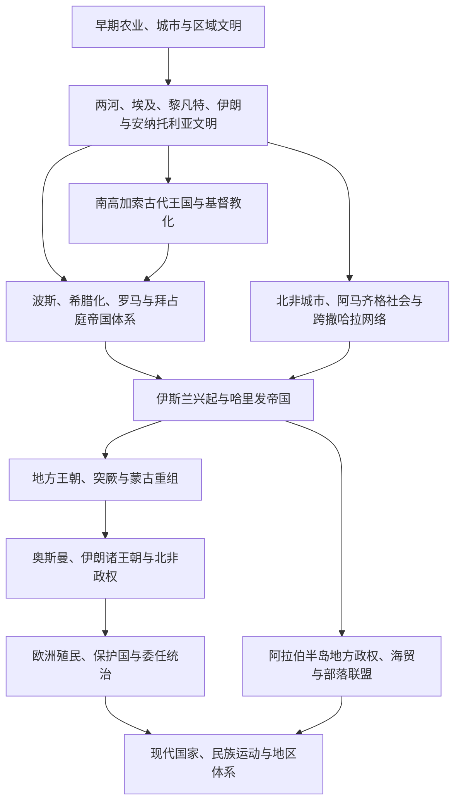

# 西亚与北非

## 范围与组织原则

西亚与北非连接东地中海、两河流域、伊朗高原、阿拉伯半岛、南高加索、尼罗河谷、马格里布与撒哈拉。这里既是城市文明、帝国治理、犹太教、基督教和伊斯兰教的重要发源地，也是近代殖民扩张、民族国家形成、能源政治和跨区域冲突长期交汇的空间。

本目录采用“区域主线 + 国家通史 + 跨区域专题”的结构：

- 古代史优先按文明区整理，避免用现代国界切碎两河、黎凡特、尼罗河和马格里布历史。
- 中古与近世史通过阿拉伯哈里发、伊朗诸王朝、十字军、马穆鲁克和奥斯曼等跨区域主线衔接。
- 近现代史再按国家或政治实体整理，并保留殖民边界、委任统治、难民与跨境社群等共同背景。
- 南高加索和塞浦路斯纳入西亚比较框架；伊朗按广义西亚历史传统维护。阿富汗另见中亚与南亚目录，不在此重复。

## 总体演进图

## 区域与文明入口

| 入口 | 核心范围 | 使用方式 |
|---|---|---|
| [西亚与北非通史](/%E4%BA%BA%E6%96%87%E7%A7%91%E5%AD%A6/%E5%8E%86%E5%8F%B2/%E8%A5%BF%E4%BA%9A%E4%B8%8E%E5%8C%97%E9%9D%9E/_%E9%80%9A%E5%8F%B2/README.md) | 跨现代国界的帝国、殖民重组、能源与地区体系 | 先理解共同框架，再进入国家笔记 |
| [两河流域文明](/%E4%BA%BA%E6%96%87%E7%A7%91%E5%AD%A6/%E5%8E%86%E5%8F%B2/%E8%A5%BF%E4%BA%9A%E4%B8%8E%E5%8C%97%E9%9D%9E/%E4%B8%A4%E6%B2%B3%E6%B5%81%E5%9F%9F/README.md) | 苏美尔、阿卡德、巴比伦、亚述及后续帝国统治 | 古代伊拉克与邻近地区的文明主线 |
| [黎凡特](/%E4%BA%BA%E6%96%87%E7%A7%91%E5%AD%A6/%E5%8E%86%E5%8F%B2/%E8%A5%BF%E4%BA%9A%E4%B8%8E%E5%8C%97%E9%9D%9E/%E9%BB%8E%E5%87%A1%E7%89%B9/README.md) | 迦南、腓尼基、以色列 / 犹大、叙利亚—巴勒斯坦与东地中海 | 古代阶段按区域阅读，近现代再分国 |
| [阿拉伯半岛](/%E4%BA%BA%E6%96%87%E7%A7%91%E5%AD%A6/%E5%8E%86%E5%8F%B2/%E8%A5%BF%E4%BA%9A%E4%B8%8E%E5%8C%97%E9%9D%9E/%E9%98%BF%E6%8B%89%E4%BC%AF%E5%8D%8A%E5%B2%9B/README.md) | 半岛南北古代社会、伊斯兰兴起、海湾与现代国家形成 | 衔接半岛七国 |
| [南高加索](/%E4%BA%BA%E6%96%87%E7%A7%91%E5%AD%A6/%E5%8E%86%E5%8F%B2/%E8%A5%BF%E4%BA%9A%E4%B8%8E%E5%8C%97%E9%9D%9E/%E5%8D%97%E9%AB%98%E5%8A%A0%E7%B4%A2/README.md) | 亚美尼亚、阿塞拜疆、格鲁吉亚及帝国边疆 | 比较黑海—里海之间的历史 |
| [北非](/%E4%BA%BA%E6%96%87%E7%A7%91%E5%AD%A6/%E5%8E%86%E5%8F%B2/%E8%A5%BF%E4%BA%9A%E4%B8%8E%E5%8C%97%E9%9D%9E/%E5%8C%97%E9%9D%9E/README.md) | 埃及以西马格里布、苏丹北部、撒哈拉与地中海联系 | 衔接北非国家与西撒哈拉专题 |

## 国家与政治实体导航

### 西亚核心与东地中海

| 国家或政治实体 | 入口 | 主线 |
|---|---|---|
| 土耳其 | [土耳其](/%E4%BA%BA%E6%96%87%E7%A7%91%E5%AD%A6/%E5%8E%86%E5%8F%B2/%E8%A5%BF%E4%BA%9A%E4%B8%8E%E5%8C%97%E9%9D%9E/%E5%9C%9F%E8%80%B3%E5%85%B6/README.md) | 安纳托利亚古代文明、突厥化、奥斯曼帝国与共和国 |
| 伊朗 | [伊朗](/%E4%BA%BA%E6%96%87%E7%A7%91%E5%AD%A6/%E5%8E%86%E5%8F%B2/%E8%A5%BF%E4%BA%9A%E4%B8%8E%E5%8C%97%E9%9D%9E/%E4%BC%8A%E6%9C%97/README.md) | 伊朗高原、波斯帝国传统、什叶派国家与现代伊朗 |
| 伊拉克 | [伊拉克](/%E4%BA%BA%E6%96%87%E7%A7%91%E5%AD%A6/%E5%8E%86%E5%8F%B2/%E8%A5%BF%E4%BA%9A%E4%B8%8E%E5%8C%97%E9%9D%9E/%E4%BC%8A%E6%8B%89%E5%85%8B/README.md) | 两河文明、奥斯曼与委任统治、王国、共和国与战后重建 |
| 叙利亚 | [叙利亚](/%E4%BA%BA%E6%96%87%E7%A7%91%E5%AD%A6/%E5%8E%86%E5%8F%B2/%E8%A5%BF%E4%BA%9A%E4%B8%8E%E5%8C%97%E9%9D%9E/%E5%8F%99%E5%88%A9%E4%BA%9A/README.md) | 古代叙利亚、伊斯兰时代、法国委任统治、复兴党与内战 |
| 黎巴嫩 | [黎巴嫩](/%E4%BA%BA%E6%96%87%E7%A7%91%E5%AD%A6/%E5%8E%86%E5%8F%B2/%E8%A5%BF%E4%BA%9A%E4%B8%8E%E5%8C%97%E9%9D%9E/%E9%BB%8E%E5%B7%B4%E5%AB%A9/README.md) | 腓尼基沿海、山地社群、委任统治、宗派体制与内战 |
| 约旦 | [约旦](/%E4%BA%BA%E6%96%87%E7%A7%91%E5%AD%A6/%E5%8E%86%E5%8F%B2/%E8%A5%BF%E4%BA%9A%E4%B8%8E%E5%8C%97%E9%9D%9E/%E7%BA%A6%E6%97%A6/README.md) | 外约旦古代社会、纳巴泰、酋长国与哈希姆王国 |
| 以色列 | [以色列](/%E4%BA%BA%E6%96%87%E7%A7%91%E5%AD%A6/%E5%8E%86%E5%8F%B2/%E8%A5%BF%E4%BA%9A%E4%B8%8E%E5%8C%97%E9%9D%9E/%E4%BB%A5%E8%89%B2%E5%88%97/README.md) | 犹太历史传统、锡安主义、委任统治、建国与国家发展 |
| 巴勒斯坦 | [巴勒斯坦](/%E4%BA%BA%E6%96%87%E7%A7%91%E5%AD%A6/%E5%8E%86%E5%8F%B2/%E8%A5%BF%E4%BA%9A%E4%B8%8E%E5%8C%97%E9%9D%9E/%E5%B7%B4%E5%8B%92%E6%96%AF%E5%9D%A6/README.md) | 地区历史、民族运动、1948年浩劫、占领与自治治理 |
| 塞浦路斯 | [塞浦路斯](/%E4%BA%BA%E6%96%87%E7%A7%91%E5%AD%A6/%E5%8E%86%E5%8F%B2/%E8%A5%BF%E4%BA%9A%E4%B8%8E%E5%8C%97%E9%9D%9E/%E5%A1%9E%E6%B5%A6%E8%B7%AF%E6%96%AF/README.md) | 东地中海古代王国、帝国统治、殖民统治与岛屿分治 |

### 南高加索

| 国家 | 入口 | 主线 |
|---|---|---|
| 亚美尼亚 | [亚美尼亚](/%E4%BA%BA%E6%96%87%E7%A7%91%E5%AD%A6/%E5%8E%86%E5%8F%B2/%E8%A5%BF%E4%BA%9A%E4%B8%8E%E5%8C%97%E9%9D%9E/%E4%BA%9A%E7%BE%8E%E5%B0%BC%E4%BA%9A/README.md) | 古代王国、基督教传统、中世纪离散、俄国与苏联时期 |
| 阿塞拜疆 | [阿塞拜疆](/%E4%BA%BA%E6%96%87%E7%A7%91%E5%AD%A6/%E5%8E%86%E5%8F%B2/%E8%A5%BF%E4%BA%9A%E4%B8%8E%E5%8C%97%E9%9D%9E/%E9%98%BF%E5%A1%9E%E6%8B%9C%E7%96%86/README.md) | 高加索阿尔巴尼亚、伊朗—伊斯兰统治、汗国、石油与现代国家 |
| 格鲁吉亚 | [格鲁吉亚](/%E4%BA%BA%E6%96%87%E7%A7%91%E5%AD%A6/%E5%8E%86%E5%8F%B2/%E8%A5%BF%E4%BA%9A%E4%B8%8E%E5%8C%97%E9%9D%9E/%E6%A0%BC%E9%B2%81%E5%90%89%E4%BA%9A/README.md) | 科尔基斯与伊比利亚、统一王国、帝国竞争与现代国家 |

### 阿拉伯半岛

| 国家 | 入口 | 主线 |
|---|---|---|
| 沙特阿拉伯 | [沙特阿拉伯](/%E4%BA%BA%E6%96%87%E7%A7%91%E5%AD%A6/%E5%8E%86%E5%8F%B2/%E8%A5%BF%E4%BA%9A%E4%B8%8E%E5%8C%97%E9%9D%9E/%E9%98%BF%E6%8B%89%E4%BC%AF%E5%8D%8A%E5%B2%9B/%E6%B2%99%E7%89%B9%E9%98%BF%E6%8B%89%E4%BC%AF/README.md) | 伊斯兰起源、沙特诸国、半岛统一与石油国家 |
| 也门 | [也门](/%E4%BA%BA%E6%96%87%E7%A7%91%E5%AD%A6/%E5%8E%86%E5%8F%B2/%E8%A5%BF%E4%BA%9A%E4%B8%8E%E5%8C%97%E9%9D%9E/%E9%98%BF%E6%8B%89%E4%BC%AF%E5%8D%8A%E5%B2%9B/%E4%B9%9F%E9%97%A8/README.md) | 古代南阿拉伯、伊玛目国与殖民分治、统一和内战 |
| 阿曼 | [阿曼](/%E4%BA%BA%E6%96%87%E7%A7%91%E5%AD%A6/%E5%8E%86%E5%8F%B2/%E8%A5%BF%E4%BA%9A%E4%B8%8E%E5%8C%97%E9%9D%9E/%E9%98%BF%E6%8B%89%E4%BC%AF%E5%8D%8A%E5%B2%9B/%E9%98%BF%E6%9B%BC/README.md) | 马干、伊巴德派、印度洋海上帝国与现代苏丹国 |
| 阿联酋 | [阿联酋](/%E4%BA%BA%E6%96%87%E7%A7%91%E5%AD%A6/%E5%8E%86%E5%8F%B2/%E8%A5%BF%E4%BA%9A%E4%B8%8E%E5%8C%97%E9%9D%9E/%E9%98%BF%E6%8B%89%E4%BC%AF%E5%8D%8A%E5%B2%9B/%E9%98%BF%E8%81%94%E9%85%8B/README.md) | 海湾航海社会、特鲁西尔诸酋长国与联邦形成 |
| 卡塔尔 | [卡塔尔](/%E4%BA%BA%E6%96%87%E7%A7%91%E5%AD%A6/%E5%8E%86%E5%8F%B2/%E8%A5%BF%E4%BA%9A%E4%B8%8E%E5%8C%97%E9%9D%9E/%E9%98%BF%E6%8B%89%E4%BC%AF%E5%8D%8A%E5%B2%9B/%E5%8D%A1%E5%A1%94%E5%B0%94/README.md) | 海湾贸易、萨尼家族、保护关系与天然气国家 |
| 巴林 | [巴林](/%E4%BA%BA%E6%96%87%E7%A7%91%E5%AD%A6/%E5%8E%86%E5%8F%B2/%E8%A5%BF%E4%BA%9A%E4%B8%8E%E5%8C%97%E9%9D%9E/%E9%98%BF%E6%8B%89%E4%BC%AF%E5%8D%8A%E5%B2%9B/%E5%B7%B4%E6%9E%97/README.md) | 迪尔蒙、珍珠贸易、哈利法家族与现代王国 |
| 科威特 | [科威特](/%E4%BA%BA%E6%96%87%E7%A7%91%E5%AD%A6/%E5%8E%86%E5%8F%B2/%E8%A5%BF%E4%BA%9A%E4%B8%8E%E5%8C%97%E9%9D%9E/%E9%98%BF%E6%8B%89%E4%BC%AF%E5%8D%8A%E5%B2%9B/%E7%A7%91%E5%A8%81%E7%89%B9/README.md) | 港口贸易、萨巴赫家族、石油国家、海湾战争与议会政治 |

### 北非与尼罗河中游

| 国家或地区 | 入口 | 主线 |
|---|---|---|
| 埃及 | [埃及](/%E4%BA%BA%E6%96%87%E7%A7%91%E5%AD%A6/%E5%8E%86%E5%8F%B2/%E8%A5%BF%E4%BA%9A%E4%B8%8E%E5%8C%97%E9%9D%9E/%E5%9F%83%E5%8F%8A/README.md) | 古埃及、希腊化与罗马、伊斯兰诸政权、近代王朝和共和国 |
| 利比亚 | [利比亚](/%E4%BA%BA%E6%96%87%E7%A7%91%E5%AD%A6/%E5%8E%86%E5%8F%B2/%E8%A5%BF%E4%BA%9A%E4%B8%8E%E5%8C%97%E9%9D%9E/%E5%8C%97%E9%9D%9E/%E5%88%A9%E6%AF%94%E4%BA%9A/README.md) | 昔兰尼加、的黎波里塔尼亚、意大利殖民与当代转型 |
| 突尼斯 | [突尼斯](/%E4%BA%BA%E6%96%87%E7%A7%91%E5%AD%A6/%E5%8E%86%E5%8F%B2/%E8%A5%BF%E4%BA%9A%E4%B8%8E%E5%8C%97%E9%9D%9E/%E5%8C%97%E9%9D%9E/%E7%AA%81%E5%B0%BC%E6%96%AF/README.md) | 迦太基、伊弗里基亚、奥斯曼统治、保护国与共和国 |
| 阿尔及利亚 | [阿尔及利亚](/%E4%BA%BA%E6%96%87%E7%A7%91%E5%AD%A6/%E5%8E%86%E5%8F%B2/%E8%A5%BF%E4%BA%9A%E4%B8%8E%E5%8C%97%E9%9D%9E/%E5%8C%97%E9%9D%9E/%E9%98%BF%E5%B0%94%E5%8F%8A%E5%88%A9%E4%BA%9A/README.md) | 努米底亚、奥斯曼摄政、法国殖民与独立战争 |
| 摩洛哥 | [摩洛哥](/%E4%BA%BA%E6%96%87%E7%A7%91%E5%AD%A6/%E5%8E%86%E5%8F%B2/%E8%A5%BF%E4%BA%9A%E4%B8%8E%E5%8C%97%E9%9D%9E/%E5%8C%97%E9%9D%9E/%E6%91%A9%E6%B4%9B%E5%93%A5/README.md) | 马格里布王朝、阿拉维王朝、保护国与现代君主制 |
| 苏丹 | [苏丹](/%E4%BA%BA%E6%96%87%E7%A7%91%E5%AD%A6/%E5%8E%86%E5%8F%B2/%E8%A5%BF%E4%BA%9A%E4%B8%8E%E5%8C%97%E9%9D%9E/%E5%8C%97%E9%9D%9E/%E8%8B%8F%E4%B8%B9/README.md) | 努比亚与库施、伊斯兰化、马赫迪国家、共管与独立 |
| 西撒哈拉 | [西撒哈拉地区](/%E4%BA%BA%E6%96%87%E7%A7%91%E5%AD%A6/%E5%8E%86%E5%8F%B2/%E8%A5%BF%E4%BA%9A%E4%B8%8E%E5%8C%97%E9%9D%9E/%E5%8C%97%E9%9D%9E/%E8%A5%BF%E6%92%92%E5%93%88%E6%8B%89/README.md) | 撒哈拉威社会、西班牙殖民、冲突与未决政治地位 |

## 跨区域通史主线

| 主题 | 入口 | 关键意义 |
|---|---|---|
| 迦太基 | [迦太基](/%E4%BA%BA%E6%96%87%E7%A7%91%E5%AD%A6/%E5%8E%86%E5%8F%B2/%E8%A5%BF%E4%BA%9A%E4%B8%8E%E5%8C%97%E9%9D%9E/_%E9%80%9A%E5%8F%B2/%E8%BF%A6%E5%A4%AA%E5%9F%BA/README.md) | 连接腓尼基、北非与西地中海 |
| 阿拉伯帝国 | [阿拉伯帝国](/%E4%BA%BA%E6%96%87%E7%A7%91%E5%AD%A6/%E5%8E%86%E5%8F%B2/%E8%A5%BF%E4%BA%9A%E4%B8%8E%E5%8C%97%E9%9D%9E/_%E9%80%9A%E5%8F%B2/%E9%98%BF%E6%8B%89%E4%BC%AF%E5%B8%9D%E5%9B%BD/README.md) | 连接伊斯兰兴起、征服、哈里发制度与区域伊斯兰化 |
| 奥斯曼解体与殖民重组 | [奥斯曼解体、殖民委任统治与现代国家](/%E4%BA%BA%E6%96%87%E7%A7%91%E5%AD%A6/%E5%8E%86%E5%8F%B2/%E8%A5%BF%E4%BA%9A%E4%B8%8E%E5%8C%97%E9%9D%9E/_%E9%80%9A%E5%8F%B2/%E5%A5%A5%E6%96%AF%E6%9B%BC%E8%A7%A3%E4%BD%93%E3%80%81%E6%AE%96%E6%B0%91%E5%A7%94%E4%BB%BB%E7%BB%9F%E6%B2%BB%E4%B8%8E%E7%8E%B0%E4%BB%A3%E5%9B%BD%E5%AE%B6.md) | 理解现代边界、委任统治和民族国家形成 |
| 石油与地区体系 | [石油、冷战与地区体系](/%E4%BA%BA%E6%96%87%E7%A7%91%E5%AD%A6/%E5%8E%86%E5%8F%B2/%E8%A5%BF%E4%BA%9A%E4%B8%8E%E5%8C%97%E9%9D%9E/_%E9%80%9A%E5%8F%B2/%E7%9F%B3%E6%B2%B9%E3%80%81%E5%86%B7%E6%88%98%E4%B8%8E%E5%9C%B0%E5%8C%BA%E4%BD%93%E7%B3%BB.md) | 理解能源国家、外部力量、地区组织与战争 |
| 跨国民族与边疆 | [库尔德地区与库尔德民族运动](/%E4%BA%BA%E6%96%87%E7%A7%91%E5%AD%A6/%E5%8E%86%E5%8F%B2/%E8%A5%BF%E4%BA%9A%E4%B8%8E%E5%8C%97%E9%9D%9E/_%E9%80%9A%E5%8F%B2/%E5%BA%93%E5%B0%94%E5%BE%B7%E5%9C%B0%E5%8C%BA%E4%B8%8E%E5%BA%93%E5%B0%94%E5%BE%B7%E6%B0%91%E6%97%8F%E8%BF%90%E5%8A%A8.md) | 比较土耳其、伊拉克、伊朗和叙利亚境内的不同历史路径 |

## 关键辨析

- “西亚”“中东”“近东”“西亚与北非”范围并不完全相同。本目录采用便于历史比较的广义范围，不把任何单一统计分区当作唯一标准。
- “阿拉伯世界”是语言—文化和政治概念，不等于西亚与北非全部范围；土耳其、伊朗、以色列和南高加索具有不同语言与历史传统。
- 古代文明区域通常跨越现代边界；现代国家目录中的古代阶段应概括本地背景并链接区域主线，不重复整套帝国史。
- 西撒哈拉作为地位未决的争议地区单列，笔记区分历史地理、殖民过程、实际控制与国际法主张，不预设主权结论。
- 毛里塔尼亚主线见[西非历史中的毛里塔尼亚](/%E4%BA%BA%E6%96%87%E7%A7%91%E5%AD%A6/%E5%8E%86%E5%8F%B2/%E9%9D%9E%E6%B4%B2/%E8%A5%BF%E9%9D%9E/%E6%AF%9B%E9%87%8C%E5%A1%94%E5%B0%BC%E4%BA%9A/README.md)；南苏丹主线见[东非历史中的南苏丹](/%E4%BA%BA%E6%96%87%E7%A7%91%E5%AD%A6/%E5%8E%86%E5%8F%B2/%E9%9D%9E%E6%B4%B2/%E4%B8%9C%E9%9D%9E/%E5%8D%97%E8%8B%8F%E4%B8%B9/README.md)，此处通过苏丹与撒哈拉专题互引。

## 相邻区域

- [欧洲历史](/%E4%BA%BA%E6%96%87%E7%A7%91%E5%AD%A6/%E5%8E%86%E5%8F%B2/%E6%AC%A7%E6%B4%B2/README.md)：地中海、拜占庭、十字军、殖民扩张与奥斯曼—欧洲关系。
- [中亚历史](/%E4%BA%BA%E6%96%87%E7%A7%91%E5%AD%A6/%E5%8E%86%E5%8F%B2/%E4%B8%AD%E4%BA%9A/README.md)：伊朗世界、突厥与蒙古迁徙、丝绸之路及阿富汗交叉。
- [南亚历史](/%E4%BA%BA%E6%96%87%E7%A7%91%E5%AD%A6/%E5%8E%86%E5%8F%B2/%E5%8D%97%E4%BA%9A/README.md)：印度洋贸易、波斯文化圈与南亚穆斯林政权。
- [非洲历史](/%E4%BA%BA%E6%96%87%E7%A7%91%E5%AD%A6/%E5%8E%86%E5%8F%B2/%E9%9D%9E%E6%B4%B2/README.md)：撒哈拉、萨赫勒、红海、尼罗河与非洲之角。
