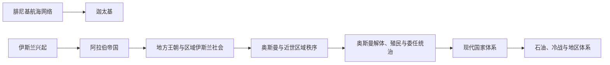

# 西亚与北非通史

## 概括

本目录放置跨现代国家、跨民族和跨地区的历史主题。具体文明与国家细节仍在各自目录维护；这里负责说明共同的扩张、传播、殖民重组和现代地区体系。

## 主题关系图

## 主题导航

| 主题 | 时间 | 入口 | 说明 |
|---|---|---|---|
| 迦太基 | 传统前814年-前146年 | [迦太基](/%E4%BA%BA%E6%96%87%E7%A7%91%E5%AD%A6/%E5%8E%86%E5%8F%B2/%E8%A5%BF%E4%BA%9A%E4%B8%8E%E5%8C%97%E9%9D%9E/_%E9%80%9A%E5%8F%B2/%E8%BF%A6%E5%A4%AA%E5%9F%BA/README.md) | 腓尼基殖民城市发展为西地中海强权，并与罗马争夺海上秩序。 |
| 阿拉伯帝国 | 7世纪-13世纪 | [阿拉伯帝国](/%E4%BA%BA%E6%96%87%E7%A7%91%E5%AD%A6/%E5%8E%86%E5%8F%B2/%E8%A5%BF%E4%BA%9A%E4%B8%8E%E5%8C%97%E9%9D%9E/_%E9%80%9A%E5%8F%B2/%E9%98%BF%E6%8B%89%E4%BC%AF%E5%B8%9D%E5%9B%BD/README.md) | 伊斯兰兴起、正统哈里发、倭马亚、阿拔斯及帝国分裂。 |
| 奥斯曼解体、殖民委任统治与现代国家 | 19世纪-20世纪中叶 | [进入专题](/%E4%BA%BA%E6%96%87%E7%A7%91%E5%AD%A6/%E5%8E%86%E5%8F%B2/%E8%A5%BF%E4%BA%9A%E4%B8%8E%E5%8C%97%E9%9D%9E/_%E9%80%9A%E5%8F%B2/%E5%A5%A5%E6%96%AF%E6%9B%BC%E8%A7%A3%E4%BD%93%E3%80%81%E6%AE%96%E6%B0%91%E5%A7%94%E4%BB%BB%E7%BB%9F%E6%B2%BB%E4%B8%8E%E7%8E%B0%E4%BB%A3%E5%9B%BD%E5%AE%B6.md) | 帝国改革与解体、欧洲殖民、委任统治、边界划分和国家形成。 |
| 石油、冷战与地区体系 | 19世纪末至今 | [进入专题](/%E4%BA%BA%E6%96%87%E7%A7%91%E5%AD%A6/%E5%8E%86%E5%8F%B2/%E8%A5%BF%E4%BA%9A%E4%B8%8E%E5%8C%97%E9%9D%9E/_%E9%80%9A%E5%8F%B2/%E7%9F%B3%E6%B2%B9%E3%80%81%E5%86%B7%E6%88%98%E4%B8%8E%E5%9C%B0%E5%8C%BA%E4%BD%93%E7%B3%BB.md) | 能源开发、国家财政、外部力量、地区组织与战争。 |
| 库尔德地区与库尔德民族运动 | 中世纪至今 | [进入专题](/%E4%BA%BA%E6%96%87%E7%A7%91%E5%AD%A6/%E5%8E%86%E5%8F%B2/%E8%A5%BF%E4%BA%9A%E4%B8%8E%E5%8C%97%E9%9D%9E/_%E9%80%9A%E5%8F%B2/%E5%BA%93%E5%B0%94%E5%BE%B7%E5%9C%B0%E5%8C%BA%E4%B8%8E%E5%BA%93%E5%B0%94%E5%BE%B7%E6%B0%91%E6%97%8F%E8%BF%90%E5%8A%A8.md) | 跨越土耳其、伊拉克、伊朗和叙利亚的边疆社会、民族政治与自治运动。 |

## 使用方式

- 古代两河主线见[两河流域文明](/%E4%BA%BA%E6%96%87%E7%A7%91%E5%AD%A6/%E5%8E%86%E5%8F%B2/%E8%A5%BF%E4%BA%9A%E4%B8%8E%E5%8C%97%E9%9D%9E/%E4%B8%A4%E6%B2%B3%E6%B5%81%E5%9F%9F/README.md)，古埃及主线见[埃及](/%E4%BA%BA%E6%96%87%E7%A7%91%E5%AD%A6/%E5%8E%86%E5%8F%B2/%E8%A5%BF%E4%BA%9A%E4%B8%8E%E5%8C%97%E9%9D%9E/%E5%9F%83%E5%8F%8A/README.md)。
- 东地中海跨国历史见[黎凡特](/%E4%BA%BA%E6%96%87%E7%A7%91%E5%AD%A6/%E5%8E%86%E5%8F%B2/%E8%A5%BF%E4%BA%9A%E4%B8%8E%E5%8C%97%E9%9D%9E/%E9%BB%8E%E5%87%A1%E7%89%B9/README.md)，马格里布和撒哈拉比较见[北非](/%E4%BA%BA%E6%96%87%E7%A7%91%E5%AD%A6/%E5%8E%86%E5%8F%B2/%E8%A5%BF%E4%BA%9A%E4%B8%8E%E5%8C%97%E9%9D%9E/%E5%8C%97%E9%9D%9E/README.md)。
- 伊斯兰帝国的扩张不等于各地社会立即同质化；语言、教派、法学、行政和地方权力均经历长期转化。
- 近现代国家边界并非简单由单一密约或会议决定，而是战争、殖民行政、地方政治、民族运动和国际谈判共同作用的结果。

## 上级

- [西亚与北非](/%E4%BA%BA%E6%96%87%E7%A7%91%E5%AD%A6/%E5%8E%86%E5%8F%B2/%E8%A5%BF%E4%BA%9A%E4%B8%8E%E5%8C%97%E9%9D%9E/README.md)
