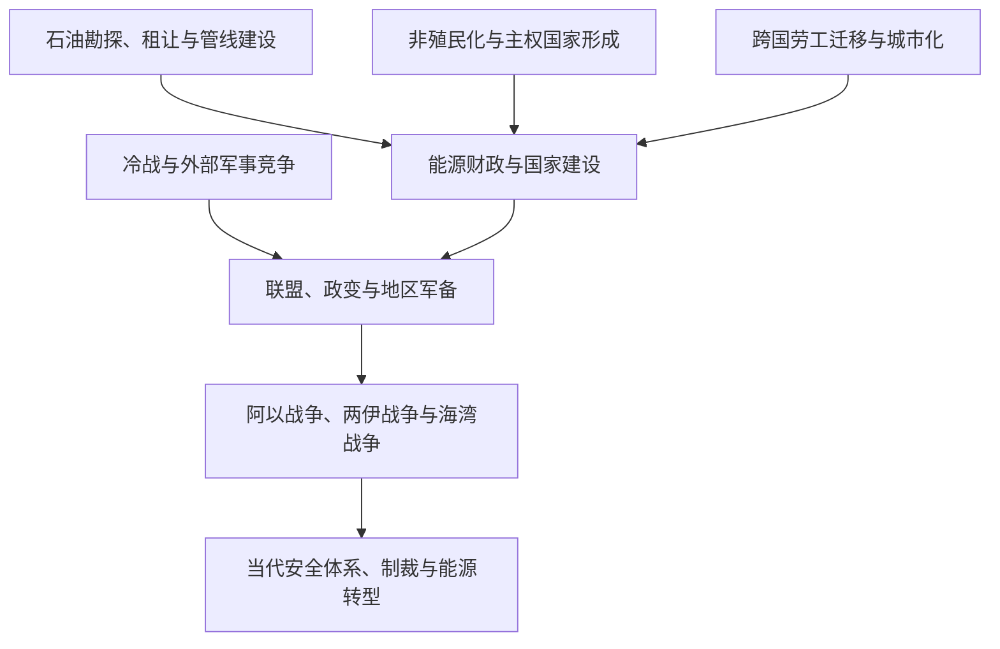

# 石油、冷战与地区体系

## 时间

19世纪末至今

## 概括

石油和天然气改变了西亚与北非的财政、基础设施、劳动力流动和国际战略地位，但能源并不能单独解释地区历史。帝国遗产、国家制度、社会联盟、民族与宗教政治、冷战阵营竞争、阿以冲突、伊朗革命和海湾战争共同塑造现代地区体系。

## 演变关系

## 结构性主题

| 主题 | 说明 |
|---|---|
| 能源租让与主权 | 早期开发常由外国公司通过租让控制；生产国随后通过税收谈判、国有化和产油国合作扩大收益 |
| 国家建设 | 能源收入支持基础设施、福利、军队和行政体系，但不同国家的制度与社会结果差异很大 |
| 冷战竞争 | 美国、苏联及欧洲国家通过军援、联盟、政变介入和外交支持影响地区格局 |
| 阿以冲突 | 1948年后多次战争、占领、难民问题与和平进程持续影响地区联盟 |
| 革命与共和主义 | 阿拉伯民族主义、军事政变、伊朗革命及伊斯兰政治挑战旧王朝和殖民秩序 |
| 海湾安全 | 1979年后两伊战争、1990—1991年海湾战争、2003年伊拉克战争重塑军事部署与国家关系 |
| 人口与劳工流动 | 海湾城市化吸引大量跨国劳工；战争与政治危机又造成大规模流离失所 |
| 后石油转型 | 产油国推动产业多元化与能源转型，但财政、就业和社会契约仍深受油气影响 |

## 重要转折

- 1908年波斯发现大型商业油田，此后伊拉克、阿拉伯半岛和北非陆续发展石油产业。
- 1948年以色列建国及第一次中东战争使阿以冲突成为地区体系核心议题之一。
- 1950—1970年代的政变、革命、国有化和阿拉伯民族主义重组共和国与君主国关系。
- 1960年石油输出国组织成立，生产国协调能力逐步增强。
- 1973年战争与石油禁运显示能源和国际政治的紧密联系。
- 1979年伊朗革命、埃以和约和苏联进入阿富汗构成地区秩序的多重转折。
- 1980—1988年两伊战争、1990—1991年海湾战争和2003年伊拉克战争持续改变海湾安全结构。
- 2011年起的抗议、内战与政治转型揭示经济、社会和制度因素不能被能源叙事取代。

## 相关笔记

- 制度形成背景：[奥斯曼解体、殖民委任统治与现代国家](/%E4%BA%BA%E6%96%87%E7%A7%91%E5%AD%A6/%E5%8E%86%E5%8F%B2/%E8%A5%BF%E4%BA%9A%E4%B8%8E%E5%8C%97%E9%9D%9E/_%E9%80%9A%E5%8F%B2/%E5%A5%A5%E6%96%AF%E6%9B%BC%E8%A7%A3%E4%BD%93%E3%80%81%E6%AE%96%E6%B0%91%E5%A7%94%E4%BB%BB%E7%BB%9F%E6%B2%BB%E4%B8%8E%E7%8E%B0%E4%BB%A3%E5%9B%BD%E5%AE%B6.md)
- 能源国家比较：[阿拉伯半岛](/%E4%BA%BA%E6%96%87%E7%A7%91%E5%AD%A6/%E5%8E%86%E5%8F%B2/%E8%A5%BF%E4%BA%9A%E4%B8%8E%E5%8C%97%E9%9D%9E/%E9%98%BF%E6%8B%89%E4%BC%AF%E5%8D%8A%E5%B2%9B/README.md)、[伊朗](/%E4%BA%BA%E6%96%87%E7%A7%91%E5%AD%A6/%E5%8E%86%E5%8F%B2/%E8%A5%BF%E4%BA%9A%E4%B8%8E%E5%8C%97%E9%9D%9E/%E4%BC%8A%E6%9C%97/README.md)、[伊拉克](/%E4%BA%BA%E6%96%87%E7%A7%91%E5%AD%A6/%E5%8E%86%E5%8F%B2/%E8%A5%BF%E4%BA%9A%E4%B8%8E%E5%8C%97%E9%9D%9E/%E4%BC%8A%E6%8B%89%E5%85%8B/README.md)、[利比亚](/%E4%BA%BA%E6%96%87%E7%A7%91%E5%AD%A6/%E5%8E%86%E5%8F%B2/%E8%A5%BF%E4%BA%9A%E4%B8%8E%E5%8C%97%E9%9D%9E/%E5%8C%97%E9%9D%9E/%E5%88%A9%E6%AF%94%E4%BA%9A/README.md)
- 冲突与国家形成：[以色列](/%E4%BA%BA%E6%96%87%E7%A7%91%E5%AD%A6/%E5%8E%86%E5%8F%B2/%E8%A5%BF%E4%BA%9A%E4%B8%8E%E5%8C%97%E9%9D%9E/%E4%BB%A5%E8%89%B2%E5%88%97/README.md)、[巴勒斯坦](/%E4%BA%BA%E6%96%87%E7%A7%91%E5%AD%A6/%E5%8E%86%E5%8F%B2/%E8%A5%BF%E4%BA%9A%E4%B8%8E%E5%8C%97%E9%9D%9E/%E5%B7%B4%E5%8B%92%E6%96%AF%E5%9D%A6/README.md)
