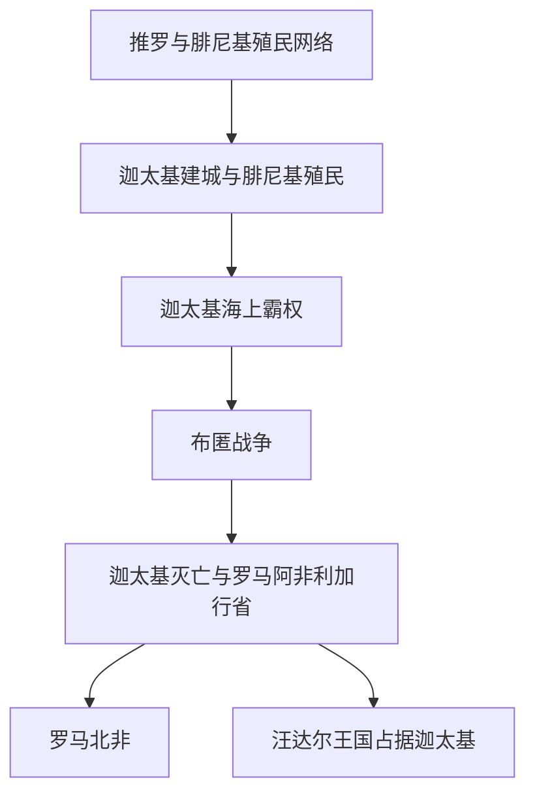

# 迦太基

## 概括

迦太基是腓尼基人在北非建立的殖民城市，后来发展为以今突尼斯一带为核心的西地中海海上强权。它连接黎凡特腓尼基传统、北非腹地、西西里、撒丁、伊比利亚和罗马共和国扩张，是理解古典地中海霸权转换的关键节点。

本目录把迦太基作为“西亚与北非”下的跨区域通史主题维护：主线放在北非与西地中海，黎凡特目录保留其腓尼基源头，欧洲与古罗马目录保留布匿战争和伊比利亚、西西里等区域影响。

## 名称辨析

| 名称 | 含义 | 说明 |
|---|---|---|
| 迦太基 | 北非城市与后来形成的国家 / 海上霸权 | 核心位于今突尼斯附近，政治重心在北非。 |
| 布匿 | 罗马人对腓尼基 / 迦太基人的称呼传统 | “布匿战争”即罗马与迦太基之间的三次大战。 |
| 腓尼基 | 东地中海黎凡特沿海城邦传统 | 迦太基源于腓尼基殖民，但后来成为独立的西地中海强权。 |

## 演变图

## 按时间排序的时期导航

| 顺序 | 阶段 | 时间 | 入口 | 简要概括 |
|---:|---|---|---|---|
| 1 | 迦太基建城与腓尼基殖民 | 传统前814年起 | [迦太基建城与腓尼基殖民](/%E4%BA%BA%E6%96%87%E7%A7%91%E5%AD%A6/%E5%8E%86%E5%8F%B2/%E8%A5%BF%E4%BA%9A%E4%B8%8E%E5%8C%97%E9%9D%9E/_%E9%80%9A%E5%8F%B2/%E8%BF%A6%E5%A4%AA%E5%9F%BA/%E8%BF%A6%E5%A4%AA%E5%9F%BA%E5%BB%BA%E5%9F%8E%E4%B8%8E%E8%85%93%E5%B0%BC%E5%9F%BA%E6%AE%96%E6%B0%91.md) | 推罗等腓尼基城邦向西地中海扩展，在北非建立贸易殖民据点。 |
| 2 | 迦太基海上霸权 | 约前6世纪-前3世纪 | [迦太基海上霸权](/%E4%BA%BA%E6%96%87%E7%A7%91%E5%AD%A6/%E5%8E%86%E5%8F%B2/%E8%A5%BF%E4%BA%9A%E4%B8%8E%E5%8C%97%E9%9D%9E/_%E9%80%9A%E5%8F%B2/%E8%BF%A6%E5%A4%AA%E5%9F%BA/%E8%BF%A6%E5%A4%AA%E5%9F%BA%E6%B5%B7%E4%B8%8A%E9%9C%B8%E6%9D%83.md) | 迦太基在西地中海建立商业、海军、殖民和同盟网络，与希腊城邦竞争。 |
| 3 | 布匿战争 | 前264年-前146年 | [布匿战争](/%E4%BA%BA%E6%96%87%E7%A7%91%E5%AD%A6/%E5%8E%86%E5%8F%B2/%E8%A5%BF%E4%BA%9A%E4%B8%8E%E5%8C%97%E9%9D%9E/_%E9%80%9A%E5%8F%B2/%E8%BF%A6%E5%A4%AA%E5%9F%BA/%E5%B8%83%E5%8C%BF%E6%88%98%E4%BA%89.md) | 迦太基与罗马三次争霸，第二次布匿战争中汉尼拔入侵意大利，最终罗马胜出。 |
| 4 | 迦太基灭亡与罗马阿非利加行省 | 前146年以后 | [迦太基灭亡与罗马阿非利加行省](/%E4%BA%BA%E6%96%87%E7%A7%91%E5%AD%A6/%E5%8E%86%E5%8F%B2/%E8%A5%BF%E4%BA%9A%E4%B8%8E%E5%8C%97%E9%9D%9E/_%E9%80%9A%E5%8F%B2/%E8%BF%A6%E5%A4%AA%E5%9F%BA/%E8%BF%A6%E5%A4%AA%E5%9F%BA%E7%81%AD%E4%BA%A1%E4%B8%8E%E7%BD%97%E9%A9%AC%E9%98%BF%E9%9D%9E%E5%88%A9%E5%8A%A0%E8%A1%8C%E7%9C%81.md) | 第三次布匿战争后迦太基被毁，北非核心区被纳入罗马行省体系。 |

## 重要转折与时间节点

| 时间 | 事件 | 意义 |
|---|---|---|
| 传统前814年 | 迦太基建城 | 标志腓尼基西地中海殖民网络的重要据点形成。 |
| 前6世纪后 | 迦太基逐渐成为西地中海腓尼基殖民网络中心 | 从殖民城市转为区域强权。 |
| 前264-前241年 | 第一次布匿战争 | 罗马获得西西里，迦太基失去重要岛屿据点。 |
| 前218-前201年 | 第二次布匿战争 | 汉尼拔入侵意大利，但罗马最终在扎马会战获胜。 |
| 前149-前146年 | 第三次布匿战争 | 迦太基灭亡，罗马控制北非核心区。 |

## 结构建议

- 迦太基本体、政治结构、海上霸权和布匿战争放在本目录维护。
- 腓尼基起源放在[腓尼基城邦](/%E4%BA%BA%E6%96%87%E7%A7%91%E5%AD%A6/%E5%8E%86%E5%8F%B2/%E8%A5%BF%E4%BA%9A%E4%B8%8E%E5%8C%97%E9%9D%9E/%E9%BB%8E%E5%87%A1%E7%89%B9/%E8%85%93%E5%B0%BC%E5%9F%BA%E5%9F%8E%E9%82%A6.md)中作为前置背景。
- 罗马视角下的共和国扩张放在[罗马共和国扩张期](/%E4%BA%BA%E6%96%87%E7%A7%91%E5%AD%A6/%E5%8E%86%E5%8F%B2/%E6%AC%A7%E6%B4%B2/_%E9%80%9A%E5%8F%B2/%E5%8F%A4%E7%BD%97%E9%A9%AC/%E7%BD%97%E9%A9%AC%E5%85%B1%E5%92%8C%E5%9B%BD%E6%89%A9%E5%BC%A0%E6%9C%9F.md)中维护。
- 伊比利亚、西西里、撒丁等区域只保留当地影响，不重复维护完整迦太基史。

## 相关笔记

- 上级通史：[西亚与北非通史](/%E4%BA%BA%E6%96%87%E7%A7%91%E5%AD%A6/%E5%8E%86%E5%8F%B2/%E8%A5%BF%E4%BA%9A%E4%B8%8E%E5%8C%97%E9%9D%9E/_%E9%80%9A%E5%8F%B2/README.md)。
- 上级区域：[西亚与北非](/%E4%BA%BA%E6%96%87%E7%A7%91%E5%AD%A6/%E5%8E%86%E5%8F%B2/%E8%A5%BF%E4%BA%9A%E4%B8%8E%E5%8C%97%E9%9D%9E/README.md)。
- 源头背景：[腓尼基城邦](/%E4%BA%BA%E6%96%87%E7%A7%91%E5%AD%A6/%E5%8E%86%E5%8F%B2/%E8%A5%BF%E4%BA%9A%E4%B8%8E%E5%8C%97%E9%9D%9E/%E9%BB%8E%E5%87%A1%E7%89%B9/%E8%85%93%E5%B0%BC%E5%9F%BA%E5%9F%8E%E9%82%A6.md)。
- 罗马对手视角：[古罗马](/%E4%BA%BA%E6%96%87%E7%A7%91%E5%AD%A6/%E5%8E%86%E5%8F%B2/%E6%AC%A7%E6%B4%B2/_%E9%80%9A%E5%8F%B2/%E5%8F%A4%E7%BD%97%E9%A9%AC/README.md)、[罗马共和国扩张期](/%E4%BA%BA%E6%96%87%E7%A7%91%E5%AD%A6/%E5%8E%86%E5%8F%B2/%E6%AC%A7%E6%B4%B2/_%E9%80%9A%E5%8F%B2/%E5%8F%A4%E7%BD%97%E9%A9%AC/%E7%BD%97%E9%A9%AC%E5%85%B1%E5%92%8C%E5%9B%BD%E6%89%A9%E5%BC%A0%E6%9C%9F.md)。
- 伊比利亚侧面：[腓尼基、希腊与迦太基殖民](/%E4%BA%BA%E6%96%87%E7%A7%91%E5%AD%A6/%E5%8E%86%E5%8F%B2/%E6%AC%A7%E6%B4%B2/%E4%BC%8A%E6%AF%94%E5%88%A9%E4%BA%9A%E5%8D%8A%E5%B2%9B/%E8%85%93%E5%B0%BC%E5%9F%BA%E3%80%81%E5%B8%8C%E8%85%8A%E4%B8%8E%E8%BF%A6%E5%A4%AA%E5%9F%BA%E6%AE%96%E6%B0%91.md)。
