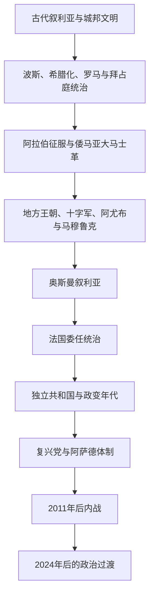

# 叙利亚

## 概括

叙利亚位于东地中海沿岸与西亚内陆的交汇处，历史地理上的“叙利亚”或“大叙利亚”常超出现代叙利亚共和国边界。埃卜拉、乌加里特和阿拉米城邦，希腊化与罗马城市，倭马亚首都大马士革，以及奥斯曼行省和法国委任统治，都在这一空间留下多层制度与文化传统。

现代叙利亚于1946年摆脱法国统治。独立后经历政变、阿拉伯民族主义和与埃及短暂合并；复兴党1963年掌权，阿萨德家族自1970年至2024年主导国家。2011年抗议演变为多方内战和国际化冲突，造成大规模死亡、流离失所与基础设施破坏。2024年12月阿萨德政权垮台后，叙利亚进入尚未完成的政治过渡，国家统一、包容治理、地方武装整合和重建仍是核心议题。

## 演变图

## 历史主线

叙利亚史有三项持续主题：大马士革、阿勒颇等城市连接地中海与内陆商路；中央帝国与山地、草原、边疆社群长期互动；现代国界与政权结构在奥斯曼解体、法国委任统治和阿拉伯民族主义竞争中形成。近现代史尤其需要区分国家政权、反对派组织、库尔德主导的自治力量、地方武装以及外部国家的不同角色。

## 时期导航

| 顺序 | 阶段 | 时间 | 简要概括 |
|---:|---|---|---|
| 1 | [古代叙利亚与伊斯兰时代](/%E4%BA%BA%E6%96%87%E7%A7%91%E5%AD%A6/%E5%8E%86%E5%8F%B2/%E8%A5%BF%E4%BA%9A%E4%B8%8E%E5%8C%97%E9%9D%9E/%E5%8F%99%E5%88%A9%E4%BA%9A/%E5%8F%A4%E4%BB%A3%E5%8F%99%E5%88%A9%E4%BA%9A%E4%B8%8E%E4%BC%8A%E6%96%AF%E5%85%B0%E6%97%B6%E4%BB%A3.md) | 约前3千纪—1516年 | 从古代城邦、罗马—拜占庭到倭马亚大马士革、十字军和马穆鲁克时期。 |
| 2 | [奥斯曼叙利亚与法国委任统治](/%E4%BA%BA%E6%96%87%E7%A7%91%E5%AD%A6/%E5%8E%86%E5%8F%B2/%E8%A5%BF%E4%BA%9A%E4%B8%8E%E5%8C%97%E9%9D%9E/%E5%8F%99%E5%88%A9%E4%BA%9A/%E5%A5%A5%E6%96%AF%E6%9B%BC%E5%8F%99%E5%88%A9%E4%BA%9A%E4%B8%8E%E6%B3%95%E5%9B%BD%E5%A7%94%E4%BB%BB%E7%BB%9F%E6%B2%BB.md) | 1516—1946年 | 奥斯曼行省重组、一战后短暂阿拉伯政府和法国委任统治塑造现代边界。 |
| 3 | [独立、复兴党统治、内战与政治过渡](/%E4%BA%BA%E6%96%87%E7%A7%91%E5%AD%A6/%E5%8E%86%E5%8F%B2/%E8%A5%BF%E4%BA%9A%E4%B8%8E%E5%8C%97%E9%9D%9E/%E5%8F%99%E5%88%A9%E4%BA%9A/%E7%8B%AC%E7%AB%8B%E3%80%81%E5%A4%8D%E5%85%B4%E5%85%9A%E7%BB%9F%E6%B2%BB%E3%80%81%E5%86%85%E6%88%98%E4%B8%8E%E6%94%BF%E6%B2%BB%E8%BF%87%E6%B8%A1.md) | 1946年至今 | 独立共和国、复兴党与阿萨德体制、2011年后内战和2024年后的过渡。 |

## 重要转折与时间节点

| 时间 | 事件 | 意义 |
|---|---|---|
| 前64年 | 罗马建立叙利亚行省 | 安条克等城市成为罗马东部的重要中心。 |
| 661年 | 倭马亚王朝以大马士革为首都 | 叙利亚成为早期伊斯兰帝国政治核心。 |
| 1516年 | 奥斯曼征服叙利亚 | 地区进入延续四个世纪的奥斯曼统治。 |
| 1920年 | 法军结束大马士革的阿拉伯王国 | 法国委任统治和分区治理确立。 |
| 1946年 | 最后一批法国军队撤离 | 叙利亚实现独立。 |
| 1958—1961年 | 与埃及组成阿拉伯联合共和国 | 泛阿拉伯统一理想与国家制度矛盾集中显现。 |
| 1963年 | 复兴党政变 | 党国与军队主导的政治秩序形成。 |
| 1970年 | 哈菲兹·阿萨德掌权 | 阿萨德体制开始长期统治。 |
| 2011年 | 抗议与武装冲突扩展 | 叙利亚进入长期、多方参与的内战。 |
| 2024年12月 | 阿萨德政权垮台 | 延续数十年的统治终结，政治过渡开启。 |

## 区域关系

- 上级区域：[西亚与北非](/%E4%BA%BA%E6%96%87%E7%A7%91%E5%AD%A6/%E5%8E%86%E5%8F%B2/%E8%A5%BF%E4%BA%9A%E4%B8%8E%E5%8C%97%E9%9D%9E/README.md)。
- 古代及跨国区域背景见[黎凡特](/%E4%BA%BA%E6%96%87%E7%A7%91%E5%AD%A6/%E5%8E%86%E5%8F%B2/%E8%A5%BF%E4%BA%9A%E4%B8%8E%E5%8C%97%E9%9D%9E/%E9%BB%8E%E5%87%A1%E7%89%B9/README.md)。
- 早期伊斯兰与倭马亚主线见[阿拉伯帝国](/%E4%BA%BA%E6%96%87%E7%A7%91%E5%AD%A6/%E5%8E%86%E5%8F%B2/%E8%A5%BF%E4%BA%9A%E4%B8%8E%E5%8C%97%E9%9D%9E/_%E9%80%9A%E5%8F%B2/%E9%98%BF%E6%8B%89%E4%BC%AF%E5%B8%9D%E5%9B%BD/README.md)。
- 奥斯曼整体主线见[奥斯曼帝国](/%E4%BA%BA%E6%96%87%E7%A7%91%E5%AD%A6/%E5%8E%86%E5%8F%B2/%E8%A5%BF%E4%BA%9A%E4%B8%8E%E5%8C%97%E9%9D%9E/%E5%9C%9F%E8%80%B3%E5%85%B6/%E5%A5%A5%E6%96%AF%E6%9B%BC%E5%B8%9D%E5%9B%BD/README.md)。
- 委任统治的黎凡特共同背景见[英法委任统治时期](/%E4%BA%BA%E6%96%87%E7%A7%91%E5%AD%A6/%E5%8E%86%E5%8F%B2/%E8%A5%BF%E4%BA%9A%E4%B8%8E%E5%8C%97%E9%9D%9E/%E9%BB%8E%E5%87%A1%E7%89%B9/%E8%8B%B1%E6%B3%95%E5%A7%94%E4%BB%BB%E7%BB%9F%E6%B2%BB%E6%97%B6%E6%9C%9F.md)。
