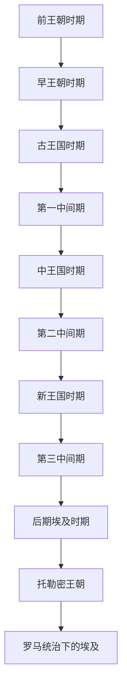

# 古埃及

## 时间

约前3100年-前30年。若从尼罗河流域新石器文化和前王朝聚落算起，可上溯至约前6000年左右。

## 概括

古埃及是以尼罗河流域为核心形成的古代文明。其政治传统以法老王权、神庙经济、官僚行政、农业灌溉和对上下埃及统一的象征秩序为核心，并长期影响地中海、西亚、努比亚和后来的埃及身份认同。

## 历史主线

## 时期导航

| 顺序 | 名称 | 时间 | 简要概括 |
|---|---|---|---|
| 1 | [前王朝时期](/%E4%BA%BA%E6%96%87%E7%A7%91%E5%AD%A6/%E5%8E%86%E5%8F%B2/%E8%A5%BF%E4%BA%9A%E4%B8%8E%E5%8C%97%E9%9D%9E/%E5%9F%83%E5%8F%8A/%E5%8F%A4%E5%9F%83%E5%8F%8A/%E5%89%8D%E7%8E%8B%E6%9C%9D%E6%97%B6%E6%9C%9F.md) | 约前6000-前3100 | 尼罗河聚落、地方文化和上下埃及政治整合逐渐形成。 |
| 2 | [早王朝时期](/%E4%BA%BA%E6%96%87%E7%A7%91%E5%AD%A6/%E5%8E%86%E5%8F%B2/%E8%A5%BF%E4%BA%9A%E4%B8%8E%E5%8C%97%E9%9D%9E/%E5%9F%83%E5%8F%8A/%E5%8F%A4%E5%9F%83%E5%8F%8A/%E6%97%A9%E7%8E%8B%E6%9C%9D%E6%97%B6%E6%9C%9F.md) | 约前3100-前2686 | 上下埃及统一，孟菲斯政治中心和早期王权制度成型。 |
| 3 | [古王国时期](/%E4%BA%BA%E6%96%87%E7%A7%91%E5%AD%A6/%E5%8E%86%E5%8F%B2/%E8%A5%BF%E4%BA%9A%E4%B8%8E%E5%8C%97%E9%9D%9E/%E5%9F%83%E5%8F%8A/%E5%8F%A4%E5%9F%83%E5%8F%8A/%E5%8F%A4%E7%8E%8B%E5%9B%BD%E6%97%B6%E6%9C%9F.md) | 约前2686-前2181 | 金字塔时代，中央集权和法老神圣王权达到高峰。 |
| 4 | [第一中间期](/%E4%BA%BA%E6%96%87%E7%A7%91%E5%AD%A6/%E5%8E%86%E5%8F%B2/%E8%A5%BF%E4%BA%9A%E4%B8%8E%E5%8C%97%E9%9D%9E/%E5%9F%83%E5%8F%8A/%E5%8F%A4%E5%9F%83%E5%8F%8A/%E7%AC%AC%E4%B8%80%E4%B8%AD%E9%97%B4%E6%9C%9F.md) | 约前2181-前2055 | 中央权力衰落，地方势力割据，底比斯与赫拉克利奥波利斯竞争。 |
| 5 | [中王国时期](/%E4%BA%BA%E6%96%87%E7%A7%91%E5%AD%A6/%E5%8E%86%E5%8F%B2/%E8%A5%BF%E4%BA%9A%E4%B8%8E%E5%8C%97%E9%9D%9E/%E5%9F%83%E5%8F%8A/%E5%8F%A4%E5%9F%83%E5%8F%8A/%E4%B8%AD%E7%8E%8B%E5%9B%BD%E6%97%B6%E6%9C%9F.md) | 约前2055-前1650 | 国家重新统一，行政与文学发展，向努比亚和西亚扩展影响。 |
| 6 | [第二中间期](/%E4%BA%BA%E6%96%87%E7%A7%91%E5%AD%A6/%E5%8E%86%E5%8F%B2/%E8%A5%BF%E4%BA%9A%E4%B8%8E%E5%8C%97%E9%9D%9E/%E5%9F%83%E5%8F%8A/%E5%8F%A4%E5%9F%83%E5%8F%8A/%E7%AC%AC%E4%BA%8C%E4%B8%AD%E9%97%B4%E6%9C%9F.md) | 约前1650-前1550 | 希克索斯等外来政权控制三角洲，底比斯政权最终重新统一。 |
| 7 | [新王国时期](/%E4%BA%BA%E6%96%87%E7%A7%91%E5%AD%A6/%E5%8E%86%E5%8F%B2/%E8%A5%BF%E4%BA%9A%E4%B8%8E%E5%8C%97%E9%9D%9E/%E5%9F%83%E5%8F%8A/%E5%8F%A4%E5%9F%83%E5%8F%8A/%E6%96%B0%E7%8E%8B%E5%9B%BD%E6%97%B6%E6%9C%9F.md) | 约前1550-前1069 | 埃及帝国时代，图特摩斯三世、阿蒙霍特普三世、阿肯那顿、拉美西斯二世等活跃。 |
| 8 | [第三中间期](/%E4%BA%BA%E6%96%87%E7%A7%91%E5%AD%A6/%E5%8E%86%E5%8F%B2/%E8%A5%BF%E4%BA%9A%E4%B8%8E%E5%8C%97%E9%9D%9E/%E5%9F%83%E5%8F%8A/%E5%8F%A4%E5%9F%83%E5%8F%8A/%E7%AC%AC%E4%B8%89%E4%B8%AD%E9%97%B4%E6%9C%9F.md) | 约前1069-前664 | 王权分裂，利比亚和努比亚势力介入埃及政治。 |
| 9 | [后期埃及时期](/%E4%BA%BA%E6%96%87%E7%A7%91%E5%AD%A6/%E5%8E%86%E5%8F%B2/%E8%A5%BF%E4%BA%9A%E4%B8%8E%E5%8C%97%E9%9D%9E/%E5%9F%83%E5%8F%8A/%E5%8F%A4%E5%9F%83%E5%8F%8A/%E5%90%8E%E6%9C%9F%E5%9F%83%E5%8F%8A%E6%97%B6%E6%9C%9F.md) | 前664-前332 | 赛斯复兴、波斯统治和本土王朝复辟交替出现。 |
| 10 | [托勒密王朝](/%E4%BA%BA%E6%96%87%E7%A7%91%E5%AD%A6/%E5%8E%86%E5%8F%B2/%E8%A5%BF%E4%BA%9A%E4%B8%8E%E5%8C%97%E9%9D%9E/%E5%9F%83%E5%8F%8A/%E5%8F%A4%E5%9F%83%E5%8F%8A/%E6%89%98%E5%8B%92%E5%AF%86%E7%8E%8B%E6%9C%9D.md) | 前305-前30 | 希腊化王朝统治埃及，亚历山大里亚成为学术和贸易中心。 |
| 11 | [罗马统治下的埃及](/%E4%BA%BA%E6%96%87%E7%A7%91%E5%AD%A6/%E5%8E%86%E5%8F%B2/%E8%A5%BF%E4%BA%9A%E4%B8%8E%E5%8C%97%E9%9D%9E/%E5%9F%83%E5%8F%8A/%E7%BD%97%E9%A9%AC%E7%BB%9F%E6%B2%BB%E4%B8%8B%E7%9A%84%E5%9F%83%E5%8F%8A.md) | 前30-395 | 托勒密王朝结束后，埃及成为罗马帝国行省。 |

## 说明

- 古埃及不是单一连续强盛王朝，而是多次统一、分裂、外来统治和地方复兴交替的长时段文明。
- 法老王权既是政治制度，也是宗教和宇宙秩序的象征；神庙、祭司、书记官和地方长官在实际治理中非常重要。
- 尼罗河周期性泛滥支持农业剩余，是埃及国家形成、赋税征收和大型工程的基础。
- 圣书体、金字塔、木乃伊、神庙建筑和冥界观念是古埃及辨识度最高的文化特征，但不应把古埃及简化为墓葬文明。

## 演变关系

- 前接尼罗河流域史前文化和前王朝聚落。
- 后接[罗马统治下的埃及](/%E4%BA%BA%E6%96%87%E7%A7%91%E5%AD%A6/%E5%8E%86%E5%8F%B2/%E8%A5%BF%E4%BA%9A%E4%B8%8E%E5%8C%97%E9%9D%9E/%E5%9F%83%E5%8F%8A/%E7%BD%97%E9%A9%AC%E7%BB%9F%E6%B2%BB%E4%B8%8B%E7%9A%84%E5%9F%83%E5%8F%8A.md)。
- 与西亚方向的亚述、波斯、希腊化世界长期互动；与南方努比亚既有冲突也有王朝继承关系。
