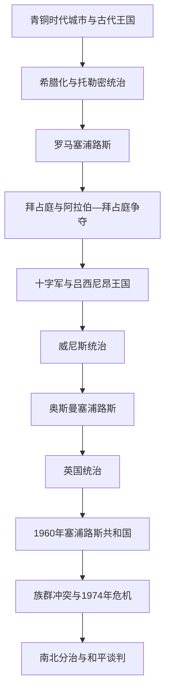

# 塞浦路斯

## 概括

塞浦路斯位于东地中海，靠近安纳托利亚、黎凡特和埃及。联合国地理统计把它列入西亚，但其现代政治、制度和身份也同欧洲高度相连，因此本目录将其作为西亚—欧洲交叉国家维护。岛上铜资源、港口和海上位置使其先后进入爱琴海、腓尼基、波斯、希腊化、罗马、拜占庭、十字军、威尼斯、奥斯曼和英国体系。

1960年塞浦路斯共和国独立，希腊族与土耳其族共享权力的宪制很快失灵。1963年后族群冲突和分区加深，1974年希腊军政府支持的政变及随后土耳其军事行动造成岛屿事实分治和双方人口大规模迁移。今天国际承认的塞浦路斯共和国实际控制南部，北部由仅获土耳其承认的“北塞浦路斯土耳其共和国”事实治理，双方之间由联合国缓冲区分隔。

## 演变图

## 历史主线

塞浦路斯历史的核心是岛内社群与外部海上强权的互动。现代问题不能简单解释为自古不变的希腊族—土耳其族对立；两种现代民族主义、英国殖民制度、希腊与土耳其母国政治以及冷战安全结构共同塑造了分治。

## 时期导航

| 顺序 | 阶段 | 时间 | 简要概括 |
|---:|---|---|---|
| 1 | [古代王国、罗马与拜占庭塞浦路斯](/%E4%BA%BA%E6%96%87%E7%A7%91%E5%AD%A6/%E5%8E%86%E5%8F%B2/%E8%A5%BF%E4%BA%9A%E4%B8%8E%E5%8C%97%E9%9D%9E/%E5%A1%9E%E6%B5%A6%E8%B7%AF%E6%96%AF/%E5%8F%A4%E4%BB%A3%E7%8E%8B%E5%9B%BD%E3%80%81%E7%BD%97%E9%A9%AC%E4%B8%8E%E6%8B%9C%E5%8D%A0%E5%BA%AD%E5%A1%9E%E6%B5%A6%E8%B7%AF%E6%96%AF.md) | 约前2千纪—1191年 | 古代城市王国、希腊与腓尼基文化、罗马行省及拜占庭岛屿。 |
| 2 | [十字军、威尼斯、奥斯曼与英国统治](/%E4%BA%BA%E6%96%87%E7%A7%91%E5%AD%A6/%E5%8E%86%E5%8F%B2/%E8%A5%BF%E4%BA%9A%E4%B8%8E%E5%8C%97%E9%9D%9E/%E5%A1%9E%E6%B5%A6%E8%B7%AF%E6%96%AF/%E5%8D%81%E5%AD%97%E5%86%9B%E3%80%81%E5%A8%81%E5%B0%BC%E6%96%AF%E3%80%81%E5%A5%A5%E6%96%AF%E6%9B%BC%E4%B8%8E%E8%8B%B1%E5%9B%BD%E7%BB%9F%E6%B2%BB.md) | 1191—1960年 | 吕西尼昂王国、威尼斯海防、奥斯曼统治和英国殖民时期。 |
| 3 | [独立、族群冲突与岛屿分治](/%E4%BA%BA%E6%96%87%E7%A7%91%E5%AD%A6/%E5%8E%86%E5%8F%B2/%E8%A5%BF%E4%BA%9A%E4%B8%8E%E5%8C%97%E9%9D%9E/%E5%A1%9E%E6%B5%A6%E8%B7%AF%E6%96%AF/%E7%8B%AC%E7%AB%8B%E3%80%81%E6%97%8F%E7%BE%A4%E5%86%B2%E7%AA%81%E4%B8%8E%E5%B2%9B%E5%B1%BF%E5%88%86%E6%B2%BB.md) | 1960年至今 | 权力分享失败、联合国介入、1974年危机及长期南北分治。 |

## 重要转折与时间节点

| 时间 | 事件 | 意义 |
|---|---|---|
| 前2千纪后期 | 爱琴海希腊语人口和文化在岛上扩展 | 希腊语传统成为塞浦路斯历史重要层次。 |
| 前58年 | 罗马吞并塞浦路斯 | 岛屿进入罗马行省体系。 |
| 1191年 | 英格兰国王理查一世占领塞浦路斯 | 拜占庭传统统治终结，拉丁王国时期开始。 |
| 1489年 | 威尼斯直接统治 | 塞浦路斯成为威尼斯东地中海防线。 |
| 1571年 | 奥斯曼征服完成 | 土耳其语穆斯林社群逐步形成。 |
| 1878年 | 英国开始管理塞浦路斯 | 岛屿进入英国殖民体系，奥斯曼名义主权暂时保留。 |
| 1960年 | 塞浦路斯共和国独立 | 建立希腊族、土耳其族权力分享制度。 |
| 1963—1964年 | 宪政危机与族群暴力 | 土耳其族退出或被排除出中央机构，联合国维和部队进驻。 |
| 1974年 | 政变与土耳其军事行动 | 岛屿形成延续至今的事实分治。 |
| 1983年 | 北部宣布建立“北塞浦路斯土耳其共和国” | 该实体仅获土耳其承认。 |
| 2004年 | 塞浦路斯共和国加入欧盟 | 欧盟法律在共和国无法有效控制的北部暂停适用。 |

## 关键辨析

- “塞浦路斯共和国”在国际上代表全岛，但政府无法有效控制北部。
- “北塞浦路斯土耳其共和国”是北部事实政治实体，仅受土耳其承认。
- “希腊族塞浦路斯人”和“土耳其族塞浦路斯人”是岛内社群，不等同于希腊或土耳其本国公民。
- 1974年事件分别被称为“土耳其入侵”或“和平行动 / 干预”，名称具有立场差异；本目录明确记录政变、军事行动、占领 / 控制和人口迁移等可核实过程。
- 英国至今保留阿克罗蒂里和泽凯利亚两个主权基地区。

## 区域关系

- 上级区域：[西亚与北非](/%E4%BA%BA%E6%96%87%E7%A7%91%E5%AD%A6/%E5%8E%86%E5%8F%B2/%E8%A5%BF%E4%BA%9A%E4%B8%8E%E5%8C%97%E9%9D%9E/README.md)。
- 安纳托利亚和现代土耳其见[土耳其](/%E4%BA%BA%E6%96%87%E7%A7%91%E5%AD%A6/%E5%8E%86%E5%8F%B2/%E8%A5%BF%E4%BA%9A%E4%B8%8E%E5%8C%97%E9%9D%9E/%E5%9C%9F%E8%80%B3%E5%85%B6/README.md)。
- 古典希腊背景见[古希腊](/%E4%BA%BA%E6%96%87%E7%A7%91%E5%AD%A6/%E5%8E%86%E5%8F%B2/%E6%AC%A7%E6%B4%B2/_%E9%80%9A%E5%8F%B2/%E5%8F%A4%E5%B8%8C%E8%85%8A/README.md)。
- 拜占庭背景见[东罗马帝国与拜占庭帝国](/%E4%BA%BA%E6%96%87%E7%A7%91%E5%AD%A6/%E5%8E%86%E5%8F%B2/%E6%AC%A7%E6%B4%B2/_%E9%80%9A%E5%8F%B2/%E5%8F%A4%E7%BD%97%E9%A9%AC/%E4%B8%9C%E7%BD%97%E9%A9%AC%E5%B8%9D%E5%9B%BD%E4%B8%8E%E6%8B%9C%E5%8D%A0%E5%BA%AD%E5%B8%9D%E5%9B%BD.md)。
