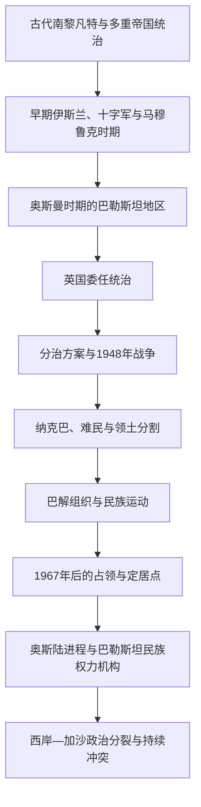

# 巴勒斯坦

## 概括

“巴勒斯坦”在历史上既是地理名称，也曾用于罗马—拜占庭行政区、早期伊斯兰军区、奥斯曼末期地区称呼和英国委任统治地；现代则还指巴勒斯坦人民、巴勒斯坦民族运动和巴勒斯坦国。不同语境不能混为一谈，更不能把古代所有居民直接等同于现代民族。

现代巴勒斯坦史形成于奥斯曼末期、英国委任统治、阿拉伯与犹太民族运动竞争以及1948年战争。战争中数十万巴勒斯坦人逃离或被驱逐，社会称其为“纳克巴（浩劫）”。1967年以色列占领西岸、东耶路撒冷和加沙；巴解组织领导民族运动，1988年宣布巴勒斯坦国，1990年代《奥斯陆协议》建立有限自治。巴勒斯坦国获联合国非会员观察员国地位并得到许多国家承认，但仍未对其主张的西岸、东耶路撒冷和加沙实现完整有效主权。

## 演变图

## 历史主线

巴勒斯坦史需要同时观察本地城镇、村庄、农业、宗教圣地和家族社会，跨区域帝国与移民网络，以及现代民族主义和国际政治。它同以色列史高度交叉，但巴勒斯坦人的社会史、难民经验、民族组织和国家建设应作为独立主线书写。

## 时期导航

| 顺序 | 阶段 | 时间 | 简要概括 |
|---:|---|---|---|
| 1 | [古代至奥斯曼时期的巴勒斯坦](/%E4%BA%BA%E6%96%87%E7%A7%91%E5%AD%A6/%E5%8E%86%E5%8F%B2/%E8%A5%BF%E4%BA%9A%E4%B8%8E%E5%8C%97%E9%9D%9E/%E5%B7%B4%E5%8B%92%E6%96%AF%E5%9D%A6/%E5%8F%A4%E4%BB%A3%E8%87%B3%E5%A5%A5%E6%96%AF%E6%9B%BC%E6%97%B6%E6%9C%9F%E7%9A%84%E5%B7%B4%E5%8B%92%E6%96%AF%E5%9D%A6.md) | 约前3千纪—1917年 | 南黎凡特古代社会、罗马和伊斯兰时期以及奥斯曼统治构成区域前史。 |
| 2 | [英国委任统治、分治与1948年战争](/%E4%BA%BA%E6%96%87%E7%A7%91%E5%AD%A6/%E5%8E%86%E5%8F%B2/%E8%A5%BF%E4%BA%9A%E4%B8%8E%E5%8C%97%E9%9D%9E/%E5%B7%B4%E5%8B%92%E6%96%AF%E5%9D%A6/%E8%8B%B1%E5%9B%BD%E5%A7%94%E4%BB%BB%E7%BB%9F%E6%B2%BB%E3%80%81%E5%88%86%E6%B2%BB%E4%B8%8E1948%E5%B9%B4%E6%88%98%E4%BA%89.md) | 1917—1949年 | 英国政策、阿拉伯与犹太民族运动、联合国分治、战争与纳克巴。 |
| 3 | [巴勒斯坦民族运动、占领与自治治理](/%E4%BA%BA%E6%96%87%E7%A7%91%E5%AD%A6/%E5%8E%86%E5%8F%B2/%E8%A5%BF%E4%BA%9A%E4%B8%8E%E5%8C%97%E9%9D%9E/%E5%B7%B4%E5%8B%92%E6%96%AF%E5%9D%A6/%E5%B7%B4%E5%8B%92%E6%96%AF%E5%9D%A6%E6%B0%91%E6%97%8F%E8%BF%90%E5%8A%A8%E3%80%81%E5%8D%A0%E9%A2%86%E4%B8%8E%E8%87%AA%E6%B2%BB%E6%B2%BB%E7%90%86.md) | 1949年至今 | 难民政治、巴解组织、1967年占领、起义、奥斯陆自治及西岸—加沙分裂。 |

## 重要转折与时间节点

| 时间 | 事件 | 意义 |
|---|---|---|
| 1517年 | 奥斯曼征服黎凡特 | 巴勒斯坦地区进入延续四个世纪的奥斯曼统治。 |
| 1917年 | 英军占领耶路撒冷及《贝尔福宣言》 | 英国统治与犹太民族家园政策改变地区政治。 |
| 1922年 | 国际联盟批准巴勒斯坦委任统治 | 英国责任和相互冲突的民族政治诉求制度化。 |
| 1936—1939年 | 巴勒斯坦阿拉伯人大起义 | 反英、反大规模犹太移民和争取民族独立的运动达到高峰。 |
| 1947年 | 联合国大会通过第181号决议 | 建议建立阿拉伯国、犹太国及国际化耶路撒冷。 |
| 1948年 | 战争与纳克巴 | 巴勒斯坦社会大规模瓦解，难民问题形成；拟议中的阿拉伯国未建立。 |
| 1964年 | 巴勒斯坦解放组织成立 | 民族运动获得跨国政治组织中心。 |
| 1967年 | 以色列占领西岸、东耶路撒冷和加沙 | 占领、定居点和军事治理成为现代主线。 |
| 1987年 | 第一次巴勒斯坦大起义 | 被占领土内部群众动员推动政治转折。 |
| 1988年 | 巴勒斯坦国宣布成立 | 巴勒斯坦建国主张正式制度化。 |
| 1993年 | 《奥斯陆协议》签署 | 巴解组织与以色列相互承认，有限自治安排启动。 |
| 2012年 | 联合国大会给予巴勒斯坦非会员观察员国地位 | 巴勒斯坦的国际国家地位进一步提升。 |
| 2023年10月以后 | 哈马斯等武装组织袭击以色列，以色列在加沙发动大规模军事行动 | 大量平民伤亡、破坏、流离失所与严重人道危机再次改变政治环境。 |

## 关键辨析

- 古代“非利士人”、罗马行省名称和现代巴勒斯坦阿拉伯人不能直接等同。
- 1948年后，西岸由约旦控制、加沙由埃及管理；1967年后两地被以色列占领。
- 联合国通常把西岸（包括东耶路撒冷）和加沙称为“被占领巴勒斯坦领土”；具体控制方式随地区和时期不同。
- 巴勒斯坦民族权力机构不是拥有完整主权的中央政府，其权限受《奥斯陆协议》、领土分区、以色列控制和巴勒斯坦内部政治分裂限制。
- 以色列国家与犹太社会的独立主线见[以色列](/%E4%BA%BA%E6%96%87%E7%A7%91%E5%AD%A6/%E5%8E%86%E5%8F%B2/%E8%A5%BF%E4%BA%9A%E4%B8%8E%E5%8C%97%E9%9D%9E/%E4%BB%A5%E8%89%B2%E5%88%97/README.md)。

## 区域关系

- 上级区域：[西亚与北非](/%E4%BA%BA%E6%96%87%E7%A7%91%E5%AD%A6/%E5%8E%86%E5%8F%B2/%E8%A5%BF%E4%BA%9A%E4%B8%8E%E5%8C%97%E9%9D%9E/README.md)。
- 跨国区域背景见[黎凡特](/%E4%BA%BA%E6%96%87%E7%A7%91%E5%AD%A6/%E5%8E%86%E5%8F%B2/%E8%A5%BF%E4%BA%9A%E4%B8%8E%E5%8C%97%E9%9D%9E/%E9%BB%8E%E5%87%A1%E7%89%B9/README.md)。
- 共享现代综述见[现代以色列与巴勒斯坦](/%E4%BA%BA%E6%96%87%E7%A7%91%E5%AD%A6/%E5%8E%86%E5%8F%B2/%E8%A5%BF%E4%BA%9A%E4%B8%8E%E5%8C%97%E9%9D%9E/%E9%BB%8E%E5%87%A1%E7%89%B9/%E7%8E%B0%E4%BB%A3%E4%BB%A5%E8%89%B2%E5%88%97%E4%B8%8E%E5%B7%B4%E5%8B%92%E6%96%AF%E5%9D%A6.md)。
