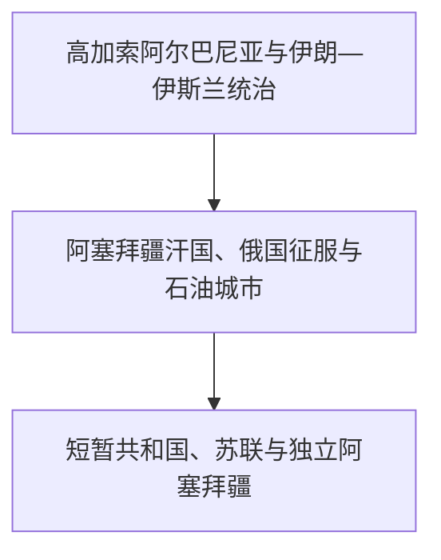

# 阿塞拜疆

## 历史主线

阿塞拜疆历史连接东高加索、里海、西北伊朗和突厥—伊斯兰世界。古代高加索阿尔巴尼亚、阿特罗帕特尼及伊朗帝国构成区域背景；中世纪伊斯兰化与突厥语传播逐步塑造新的社会文化；近世汗国处于伊朗、奥斯曼和俄罗斯竞争中，19世纪俄国统治与巴库石油工业推动现代城市和民族政治形成。

## 演变图

## 按时间排序的时期导航

| 顺序 | 阶段 | 时间 | 入口 | 简要概括 |
|---:|---|---|---|---|
| 1 | 高加索阿尔巴尼亚与伊朗—伊斯兰统治 | 古代-18世纪初 | [高加索阿尔巴尼亚与伊朗—伊斯兰统治](/%E4%BA%BA%E6%96%87%E7%A7%91%E5%AD%A6/%E5%8E%86%E5%8F%B2/%E8%A5%BF%E4%BA%9A%E4%B8%8E%E5%8C%97%E9%9D%9E/%E9%98%BF%E5%A1%9E%E6%8B%9C%E7%96%86/%E9%AB%98%E5%8A%A0%E7%B4%A2%E9%98%BF%E5%B0%94%E5%B7%B4%E5%B0%BC%E4%BA%9A%E4%B8%8E%E4%BC%8A%E6%9C%97%E2%80%94%E4%BC%8A%E6%96%AF%E5%85%B0%E7%BB%9F%E6%B2%BB.md) | 东高加索古代政体、伊朗帝国、阿拉伯征服、希尔万沙王朝和突厥语传播共同构成现代国家以前的区域史。 |
| 2 | 阿塞拜疆汗国、俄国征服与石油城市 | 18世纪-1917年 | [阿塞拜疆汗国、俄国征服与石油城市](/%E4%BA%BA%E6%96%87%E7%A7%91%E5%AD%A6/%E5%8E%86%E5%8F%B2/%E8%A5%BF%E4%BA%9A%E4%B8%8E%E5%8C%97%E9%9D%9E/%E9%98%BF%E5%A1%9E%E6%8B%9C%E7%96%86/%E6%B1%97%E5%9B%BD%E3%80%81%E4%BF%84%E5%9B%BD%E5%BE%81%E6%9C%8D%E4%B8%8E%E7%9F%B3%E6%B2%B9%E5%9F%8E%E5%B8%82.md) | 地方汗国在伊朗与俄国竞争中被吞并，巴库石油经济和新式知识阶层兴起。 |
| 3 | 短暂共和国、苏联与独立阿塞拜疆 | 1918年至今 | [短暂共和国、苏联与独立阿塞拜疆](/%E4%BA%BA%E6%96%87%E7%A7%91%E5%AD%A6/%E5%8E%86%E5%8F%B2/%E8%A5%BF%E4%BA%9A%E4%B8%8E%E5%8C%97%E9%9D%9E/%E9%98%BF%E5%A1%9E%E6%8B%9C%E7%96%86/%E7%9F%AD%E6%9A%82%E5%85%B1%E5%92%8C%E5%9B%BD%E3%80%81%E8%8B%8F%E8%81%94%E4%B8%8E%E7%8B%AC%E7%AB%8B%E9%98%BF%E5%A1%9E%E6%8B%9C%E7%96%86.md) | 1918年共和国、苏维埃时期和1991年独立构成现代国家主线，纳戈尔诺—卡拉巴赫冲突深刻影响国家发展。 |

## 重要转折与时间节点

| 时间 | 转折 |
|---|---|
| 7世纪 | 阿拉伯征服推动东高加索伊斯兰化。 |
| 11世纪以后 | 突厥语族群与王朝影响增强，语言格局长期转化。 |
| 1813年与1828年 | 俄伊条约确认俄罗斯控制阿拉斯河以北多数汗国。 |
| 19世纪后期 | 巴库成为世界重要石油工业中心。 |
| 1918年 | 阿塞拜疆民主共和国成立。 |
| 1920年 | 红军进入巴库，阿塞拜疆苏维埃化。 |
| 1991年 | 阿塞拜疆恢复独立。 |
| 2020年与2023年 | 战争和军事行动改变纳戈尔诺—卡拉巴赫控制格局。 |

## 阅读提示

- 古代地名和政体范围不等同于现代国界，民族形成也不是从单一古代王国直线延续。
- 帝国统治、教会或伊斯兰制度、地方贵族、城市贸易和山地社群需要放在同一框架中理解。
- 现代冲突应分别说明苏联行政边界、人口变化、战争过程、实际控制和国际承认。

## 上级与相关区域

- [南高加索](/%E4%BA%BA%E6%96%87%E7%A7%91%E5%AD%A6/%E5%8E%86%E5%8F%B2/%E8%A5%BF%E4%BA%9A%E4%B8%8E%E5%8C%97%E9%9D%9E/%E5%8D%97%E9%AB%98%E5%8A%A0%E7%B4%A2/README.md)
- [西亚与北非](/%E4%BA%BA%E6%96%87%E7%A7%91%E5%AD%A6/%E5%8E%86%E5%8F%B2/%E8%A5%BF%E4%BA%9A%E4%B8%8E%E5%8C%97%E9%9D%9E/README.md)
